# WSN 拓扑控制

拓扑控制作为 WSN 的关键支撑技术，直接决定了网络的能耗效率、连通性、覆盖质量等核心性能，是**延长网络生命周期**的核心手段。

## 拓扑结构和拓扑控制

WSN 的拓扑结构由**活动节点集合**和**直接通信的活动链路**共同决定，用拓扑图*G*=(*V*,*E*)表示：

- *V*：网络中所有节点的集合（包括传感器节点、骨干节点、Sink 节点等）；
- *E*：边的集合，若两个节点*v*1和*v*2之间能**直接通信**，则(*v*1,*v*2)∈*E*。

拓扑控制的核心思路是：**通过 “合理取舍” 节点和链路，构建优化的拓扑结构**

从而解决**节点密集部署、能量有限、资源受限**，原始的密集拓扑会带来三大核心问题：媒体访问冲突，路由效率低下，能量浪费严重

拓扑控制没有明确的对应层次，部署于**媒体访问控制层（MAC）和网络层（ROUTING）之间**：

- 从 MAC 层获取邻居节点消息，用于维护拓扑；
- 为网络层路由提供连通的网络结构，是路由协议的基础。

拓扑控制的核心目标是：

- 首要目标：**延长网络生命周期**（WSN 节点能量不可更换，这是最核心的诉求）；
- 约束条件：保证一定的 “连通质量”（节点间能通过多跳或直接通信可达）和 “覆盖质量”（监测区域无盲区）；
- 兼顾性能：降低通信干扰、减少网络延迟、实现负载均衡、简化算法复杂度、保证可扩展性。

## WSN拓扑结构

WSN（无线传感器网络）的拓扑结构是网络功能实现的基础框架，核心按 “节点功能分工” 和 “结构层次” 分为**平面网络结构**和**层次网络结构**两大类

总的来说，两类拓扑结构的本质区别的是**节点是否有功能差异**：

- 平面网络：所有节点 “身份平等、功能一致”，无主次之分；
- 层次网络：节点 “身份有别、功能分工”，分为核心节点和普通节点，形成上下层级。

1. 平面网络结构（Flat Networks）

   - 平面网络的核心是 “所有节点完全对等”，节点的地位对等，同时功能一致，协议相同

   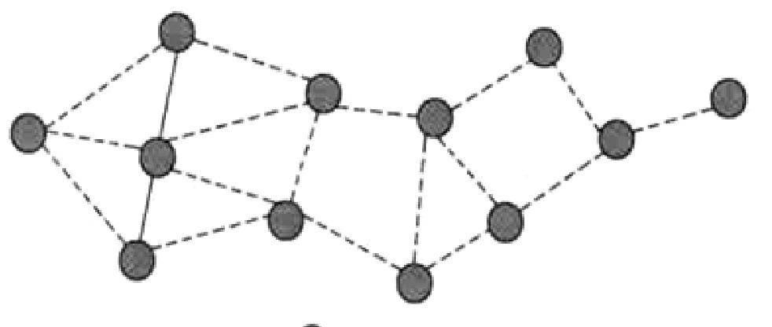

   - 控制策略：功率控制

     > - 平面网络中所有节点功能一致，无法通过 “分工” 减少能耗，因此控制策略聚焦于 “优化链路”—— 通过**功率控制**调整邻居节点集合，即节点根据实际需求**动态调整发射功率**
     > - 优化拓扑结构让拓扑稀疏，通过降低功率，只保留与近距离、必要节点的通信链路

2. 层次网络结构（Hierarchical Networks）

   - 层次网络也称 “分级网络”，核心是 “节点功能差异化”，分为两大节点类型，形成 “上层骨干网 + 下层普通节点” 的层级：

     - 骨干节点：成本高但是具有完整功能：路由转发、网络管理、数据汇聚（收集普通节点数据并处理）、簇间通信
     - 一般传感器节点：仅数据采集（如温度、湿度监测），无路由、管理功能，同时相互不通信

     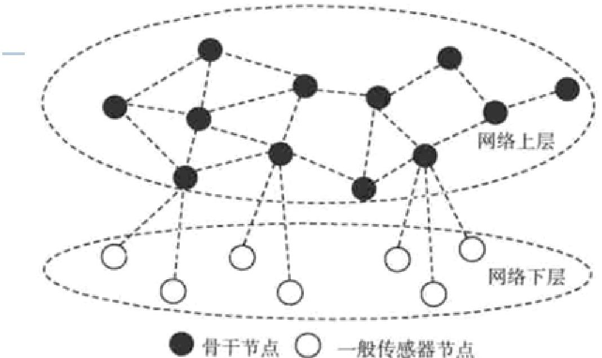

     对于骨干节点构成的网络上层而言，各个节点之间是对等结构，类似平面网络

     而普通节点之间**不直接通信**，所有数据都要通过骨干节点转发，构成网络下层。

   - 两大控制形式：骨干网与分簇（Clustering）

     > - 骨干网（Backbone）：从所有节点中筛选出一部分 “控制节点”，形成 “控制集（Dominating Set）”，即骨干网；
     > - 簇状网（Clustering）：将网络划分为多个 “簇（Cluster）”，每个簇由 1 个 “簇头”（骨干节点）和多个 “簇内普通节点” 组成；

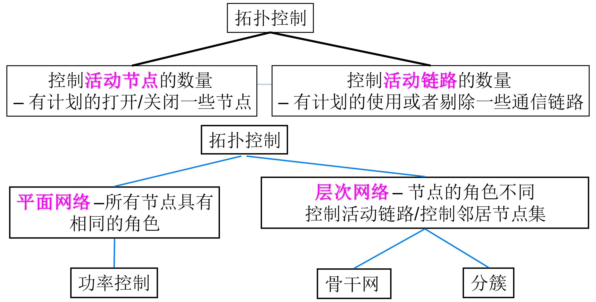

### 簇状网（Clustering）

簇状网（Clustering）是无线传感器网络（WSN）层次型拓扑结构的核心实现形式，核心逻辑是**通过 “分簇分组” 实现节点功能分工**，从而降低能耗、优化数据传输效率

簇状网的本质是把整个网络 “划分为多个独立小组（簇，Cluster）”，每个小组实行 “**组长（簇头）+ 组员（普通节点）**” 的管理模式

- **全员分簇**：网络中所有节点都必须被划分到某个簇中，无 “无归属” 节点（保证网络全覆盖）；
- **簇头唯一**：每个簇有且仅有一个 “簇头（Cluster Head）”，是簇内的核心节点（负责管理和数据处理）；
- **直接通信**：簇内所有普通节点都必须是其簇头的 “直接邻居”—— 即**普通节点与簇头之间能直接通信**，无需其他节点转发（减少数据上传的延迟和能耗）；
- 归属唯一：每个普通**节点仅属于一个簇**（避免数据重复上传和管理混乱）；
  - 例外：簇间桥梁节点（极少数节点，用于连接不同簇，实现簇间数据互通）可跨簇归属；
- **簇头独立**：不同簇的簇头之间彼此独立，不直接通信（簇间数据需通过骨干网或桥梁节点转发，避免簇头负载过重）；
- **簇头构成控制集**：所有簇头组成的集合（簇头集合 C）是网络的 “控制集”—— 意味着每个普通节点都被至少一个簇头覆盖（能直接通信），且簇头能控制簇内节点的通信行为。

---

## WSN拓扑控制

拓扑控制算法的评价准则，是判断算法 “好不好用”“适不适合实际场景” 的核心标准

1. 连通性（Connectivity）

   - 连通性是拓扑控制的**最基础要求**，指算法优化后的拓扑结构中，**任意两个活动节点之间都能通过直接或多跳链路实现通信**（即网络没有被 “分割” 成孤立的区域）。
   - 这保证了网络的“连通性寿命”，即WSN 网络生存期

2. 扩展因子（Stretch Factor）

   - 衡量剔除连接对于任意节点之间路径的影响

   - 跳扩展因子（Hop Stretch Factor）

     - 衡量 “路径跳数的增长比例”，公式为：

       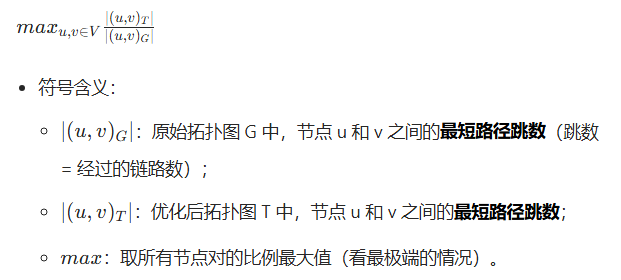

   - 能量扩展因子（Energy Stretch Factor）

     - 衡量 “路径能耗的增长比例”，公式为：

       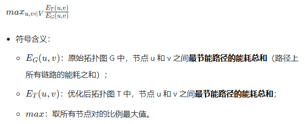

       必须避免 “为了简化而简化”—— 不能为了减少链路 / 节点，而让节点间的通信路径变得 “又长又费电”，要在 “简化拓扑” 和 “路径质量” 之间找平衡。

3. 吞吐量（Throughput）

   - 吞吐量指优化后的拓扑结构**单位时间内能够传输的数据总量**，要求与原始网络的吞吐量相近

4. 鲁棒性（Robustness）

   - 当网络拓扑发生变化时（如节点失效、链路中断、新节点加入），算法的**调整开销最小**，能快速恢复网络功能。

5. 算法总开销（Algorithm Overhead）

   - 算法总开销指算法运行过程中消耗的**资源成本**小，比如计算量和通信控制信息的开销

   

### 平面网络拓扑控制：功率控制

平面网络中，所有节点功能对等、无主次之分，功率控制是其核心拓扑控制策略 —— 本质是 “动态调功率、保连通、省能耗”

功率控制（也称功率分配问题）的核心逻辑的是：

- 节点不始终用最大功率通信，而是**根据实际需求动态调整发射功率**；
- 在保证网络所有节点连通的前提下，让整个网络的能耗最小，从而延长网络生存时间；

节点调整发射功率的依据是 “距离与接收功率的关系”：

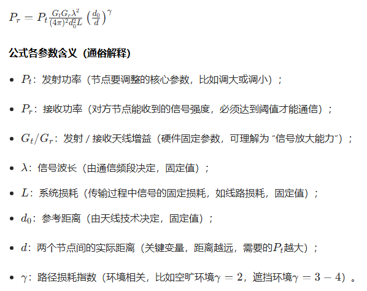

#### 集中式功率控制算法

最基础的功率控制算法，核心是 “用最小的总功率让网络连通”，适合节点数量少、距离已知的场景。

算法前提：通信代价已知，独立设置通信功率

贪婪算法：“从小到大连分支，直到全网连通”：其实类似于并查集，同时在合并时确定两个节点的通信距离

分为两个阶段：构建连通网络、优化节点功率

1. 构建连通网络

> - 初始状态：所有节点发射功率为 0，每个节点是一个独立的连通分支（比如 3 个节点 A、B、C，初始分支是 {A}、{B}、{C}）；
>
> - 步骤 1：将所有节点对按距离从小到大**排序**；
>
> - 步骤 2：依次处理排序后的节点对，若两个节点属于不同连通分支，则将它们的发射功率设为两点间距离（保证能直接通信），并合并两个分支；
>
> - 步骤 3：重复步骤 2，直到所有节点合并为一个连通分支（网络连通）；同时各个节点的功率取其中最大值
>
> - 步骤 4（优化）：在保证连通的前提下，进一步降低单个节点的功率，即第二个阶段：优化节点功率
>
>   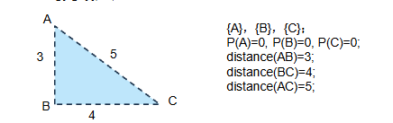

2. 优化节点功率

   > **在保证网络 k - 连通（课件中 k=1，即普通连通）的前提下，降低单个节点的功率**，核心是 “剔除冗余功率”。
   >
   > 1. 收集每个节点的关联链路：对每个节点 *u*，收集所有包含 *u* 的节点对（即 *u* 的邻居链路），并按距离**从大到小排序**（优先处理远距离链路）。
   >
   > 2. 二分法降低功率：对每个节点 *u*，尝试降低其功率（从当前值开始），若降低后网络仍连通，则保留新功率；否则停止。
   >
   > 3. 移除冗余链路：优化后，节点 A 和 B 的功率仅为 1，无法维持 (A,B) 链路（距离 2），因此**移除 A-B 链路**，网络仍通过 C-D 保持连通。
   >
   >    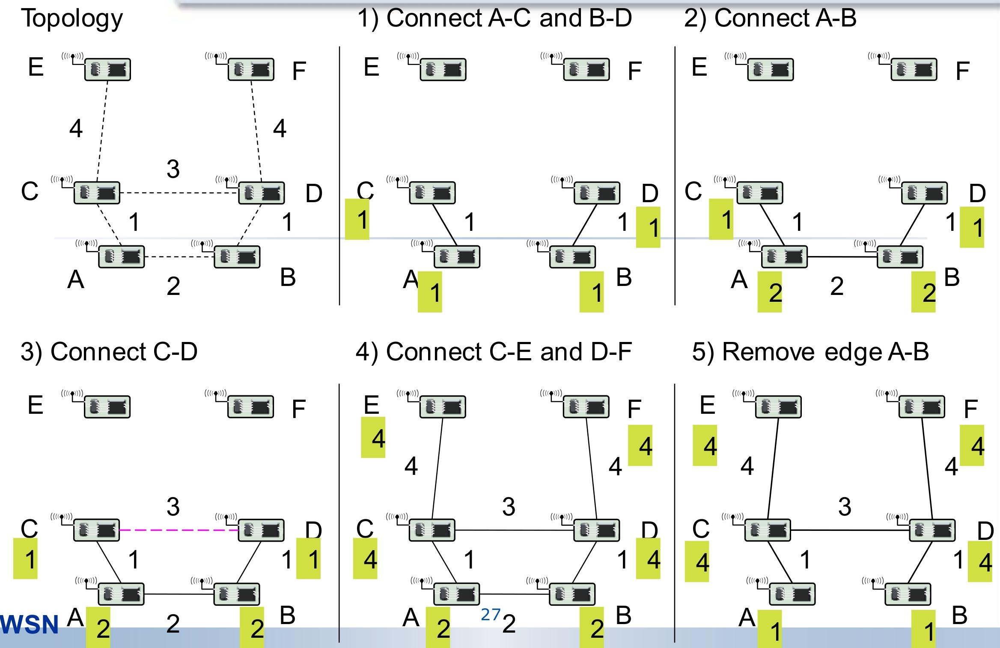

---

#### 局部最小生成树算法（LMST）

“用局部信息构造最小生成树，以最小功率维持连通”

前提：所有节点已知自身的**ID**和**地理位置信息**

目标：连通且能耗小，双向链路，依赖一跳邻居，低节点度

LMST 分为**信息采集、拓扑构造、确定发射功率**三个步骤，完全由节点独立执行（分布式）：

1. 信息采集（Information Exchange）

   - 每个节点以**最大发射功率**周期性广播`Hello消息`，消息包含自身的 ID 和位置信息；
   - 节点收集所有 “一跳邻居”（能收到其`Hello`的节点）的信息，构造自己的**本地拓扑视图**（仅包含自身及一跳邻居的连接关系）。

2. 拓扑构造（Local MST Construction）

   - **边权确定**：以 “节点间欧氏距离的*r*次方（*r*≥2）” 作为边的权重（权重越大，代表通信功耗越高）；

     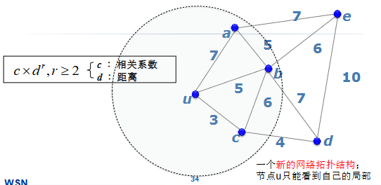

   - **构造局部 MST**：每个节点使用**Prim 算法**（最小生成树算法），在自己的本地拓扑视图中独立构造 “局部最小生成树”；

     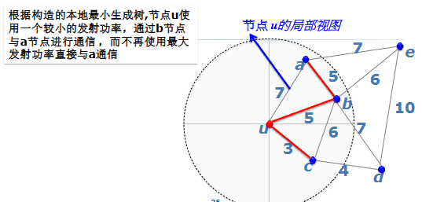

3. 确定发射功率（Power Adjustment）

   - 通过`Hello消息`的接收信号功率，结合**自由空间传播模型**计算与邻居通信所需的最小发射功率

     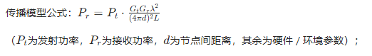

   - 节点将发射功率设置为 “维持局部 MST 连通所需的最小功率”，而非最大发射功率。

     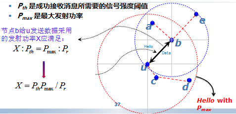

#### 基于邻近图的 WSN 拓扑控制

**从 “全连通图” 中按规则筛选必要链路，构建更稀疏但仍保持连通的拓扑**

首先所有节点以**最大功率发射**时，形成的 “全连通拓扑图” 为 *G*=(*V*,*E*)：

- *V*：网络中所有节点的集合（顶点集）；
- *E*：所有节点间 “可直接通信” 的链路集合（边集），边 (*u*,*v*) 表示节点 *u* 和 *v* 能直接通信。

而邻近图从全连通图 *G* 中**筛选出部分链路**得到的子图 *G*0=(*V*,*E*0)，核心规则是：对任意节点 *v*∈*V*，给定 “邻居判别规则 *q*”，仅保留 *E* 中满足 *q* 的边 (*u*,*v*) 作为 *E*0 的元素。

经典的邻近图模型

- MST（最小生成树）
- RNG（相对邻域图）： *u*,*v* 之间的 “圆区域” 内无其他节点
- GG（加比图）：对边 (*u*,*v*)，若以 *uv* 为直径的圆内无其他节点，则保留 (*u*,*v*)。
- YG（Yao图）：将节点 *v* 的通信区域划分为 *k* 个等角扇区，每个扇区内仅保留距离 *v* 最近的节点对应的边。

#### 基于节点度的 WSN 功率控制

**节点度**是指 “距离该节点一跳的邻居节点总数”（即能直接与该节点通信的相邻节点数量）。

控制的思想：给定节点度的**上限和下限**，节点通过**周期性动态调整发射功率**，使自身的邻居数落在该区间内：

- 邻居数＜下限：增大发射功率（扩大通信范围，增加邻居）；
- 邻居数＞上限：减小发射功率（缩小通信范围，减少邻居）；
- 邻居数在区间内：保持功率不变。

典型算法：本地平均算法 Local Mean Algorithm, LMA和本地邻居平均算法 Local Mean of Neighbors algorithm, LMN

1. 本地平均算法LMA

适用于**无全局位置信息、需动态维持连通性**的平面网络

LMA 以 “固定周期” 重复执行以下步骤，每个周期内完成 “邻居统计 - 功率调整” 的闭环

| 步骤                      | 操作细节                                                     | 核心目的                                                     |
| ------------------------- | ------------------------------------------------------------ | ------------------------------------------------------------ |
| 1. 广播 LifeMsg           | 所有节点以**当前发射功率**定期广播`LifeMsg`消息，消息仅包含自身 ID（无额外冗余信息，降低通信开销） | 让邻居节点感知自身存在，为后续邻居统计提供依据               |
| 2. 应答 LifeAckMsg        | 若节点收到其他节点的`LifeMsg`，立即回复`LifeAckMsg`应答消息，消息中必须包含 “发送`LifeMsg`的节点 ID” | 告知发送方 “我已感知到你，你是我的邻居”，帮助发送方统计邻居数 |
| 3. 统计邻居数（NodeResp） | 节点在**下一次广播`LifeMsg`前**，汇总收到的所有`LifeAckMsg`，统计不同 ID 的数量，即为当前邻居数`NodeResp`（每个 ID 仅计数 1 次，避免重复统计） | 获得自身当前的节点度，作为功率调整的判断依据                 |
| 4. 动态调整发射功率       | 根据`NodeResp`与预设 “邻居数上下限” 的关系调整功率：① `NodeResp < 下限`：增大发射功率（扩大通信范围，增加邻居，避免网络断连）；② `NodeResp > 上限`：减小发射功率（缩小通信范围，减少冗余邻居，降低干扰与能耗）；③ `NodeResp`在区间内：保持功率不变；④ 约束：调整后的功率不得超过硬件的 “最大发射功率上限” 和 “最小发射功率下限” | 使节点度稳定在合理区间，平衡连通性与能耗                     |

对于 LMN而言

与 LMN 同属 “基于节点度的功率控制算法”，流程高度相似，核心差异仅在于**邻居数（NodeResp）的计算策略**

一是`LifeAckMsg`内容还包括自己的邻居节点数；二是NodeResp 计算方式为收集所有邻居的 “邻居数”，取平均值作为自身的`NodeResp`（即 “邻居的平均邻居数”）

LMA 的关键参数是 “**邻居数上下限**”，其设置可参考 F.Xue 和 P.R.Kumar 在 2004 年提出的 “网络连通性临界值”（即 “Magic Number”），该结论基于**网络对称**（节点通信半径相同、均匀部署）的前提：节点数为`n`

- 如果邻居节点数小于0.074 log n，则网络趋近非连通
- 如果邻居节点数大于5.1774 log n，则网络趋近连通

### 分簇式层次型网络的拓扑结构控制

#### LEACH（Low Energy Adaptive Clustering Hierarchy，低功耗自适应聚类层次算法）

通过动态分簇与簇头轮换，平衡节点能耗、延长网络寿命。

前提：所有传感器节点均可直接与 Sink 节点（数据汇聚中心）通信；节点密集部署；节点初始能量相同，且有限

为了延长整个网络的生命周期以及平衡各节点能耗，LEACH通过**定期更换簇头节点**，让所有节点公平承担高负载任务（簇头的数据汇聚、融合与转发），避免固定簇头快速耗尽能量。

LEACH 以 “周期” 为单位周期性执行，每个周期包含[1/*p*]轮（*p*为簇头百分比），每轮完成一次 “**分簇 - 数据传输**” 的闭环，且每个节点在一个周期内最多担任一次簇头，保证负载均衡。

- 簇建立阶段：动态选举簇头、形成簇结构、分配通信资源，为数据传输做准备；
- 数据通信阶段：簇内节点上传数据、簇头融合处理、转发至 Sink 节点，完成核心通信任务。

> [!tip]
>
> **簇头选举（LEACH 核心）**
>
> 关键参数：
>
> - 簇头百分比*p*：预设的每轮簇头占总节点数的比例（如 5%~10%），决定簇的数量与规模；
> - 选举周期：[1/*p*]轮，确保每个节点在一个周期内均有机会成为簇头；
> - 当前轮数*r*：标识当前处于哪个选举轮次；
> - 未当选节点集合*Gr*：当前轮次中从未担任过簇头的节点集合（保证轮任公平性）；
> - 阈值*T*(*n*)：节点成为簇头的判定标准，仅节点随机生成的 0~1 之间的数**小于*T*(*n*)**时，可当选簇头。
>
> 其中阈值的计算：
>
> 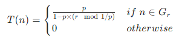
>
> - 若节点`n`属于未当选集合*Gr*：*T*(*n*)随轮次动态调整，轮次越靠后，未当选节点的*T*(*n*)越大，当选概率越高，保证公平性；
> - 若节点*n*已在本周期内当选过簇头：*T*(*n*)=0，无法再次当选，避免重复负载。

完整的流程：

1. 簇建立阶段（分簇与资源分配）
   - 簇头判定：每个节点根据自身是否属于*Gr*，**计算阈值*T*(*n*)**，随机生成 0~1 的数，小于阈值则确定为簇头；
   - 簇头公告：簇头节点向周围邻居广播 “簇头公告消息”，告知自身身份；
   - 簇加入：非簇头节点根据接收的公告消息信号强弱，选择信号最强的簇头加入，并向该簇头发送 “加入请求”；
   - 时间片分配：簇头节点采用 TDMA（时分多址）方式，为簇内每个节点分配专属通信时间片，避免簇内数据传输冲突。
2. 数据通信阶段（数据传输与融合）
   1. 簇内数据上传：簇内节点在各自分配的时间片内，将采集到的感知数据（如温度、湿度）发送给簇头；
   2. 数据融合：簇头接收所有簇内节点的数据后，进行融合处理（去除冗余信息、提取有效数据），减少传输数据量；
   3. 数据转发：簇头将融合后的结果一次性转发给 Sink 节点，完成本轮数据传输。

---

#### GAF 算法（Geographical Adaptive Fidelity）

GAF 是一种基于节点地理位置的 WSN 分簇拓扑控制算法，核心创新是 “虚拟单元格划分 + 节点休眠机制”，通过精准筛选活动节点（簇头），最大化降低网络能耗

前提：节点位置，检测区域位置，节点通信半径相同，网络密集

GAF 的核心是 “空间复用 + 休眠节能”，通过两步实现：

1. 按地理位置划分 “**虚拟单元格**”：将整个监测区域分割为大小均匀的正方形单元格，确保相邻单元格内的节点可直接通信（避免簇间断连）；
2. 单元格内动态选举簇头：**每个单元格仅保留 1 个活动簇头节点**，负责数据采集与转发，其余节点进入低功耗睡眠状态；
3. 周期性轮换：簇头定期更换，避免单个节点持续高负载，平衡能耗。

整个过程分为两步：划分虚拟单元格、选举簇头

1. 虚拟单元格划分（确定分簇边界）

   - 相邻单元格的对角节点距离最大，需保证该距离≤*R*，化简后得到边长约束：`r <= R / √5`，确保任意两个相邻单元格内的节点能直接通信
   - 节点信息广播：所有节点广播包含自身 ID 和位置（POS）的消息，让其他节点知晓其地理位置；
   - 单元格归属：节点根据自身位置和单元格边界，确定自己所属的单元格

2. 簇头选举与状态管理（动态维护活动节点）

   - 节点分为三种状态：初始态（启动后的发现态），活动态（工作），睡眠态（节能）

     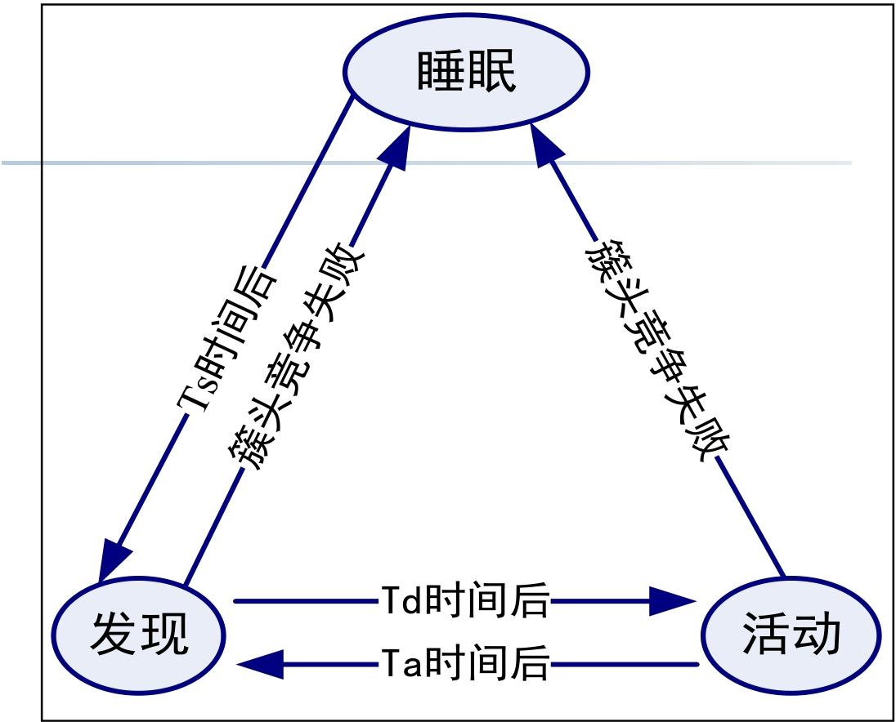

   - 节点周期性唤醒：睡眠状态的节点按固定周期（如 Ta 时间）唤醒，进入 “发现态”；

   - 单元格内信息交换：唤醒后的节点与同单元格内其他节点交换信息（如剩余能量、当前状态）；

   - 簇头竞争：根据预设规则（如剩余能量最高、位置最接近单元格中心）选举簇头；

     - 竞争成功则成为簇头进入活动态，反之进入睡眠态

GAF 算法的核心价值是 “**用地理位置实现精准分簇，用休眠机制最大化节能**”，适合节点密集、部署环境平坦、对能耗要求高的 WSN 场景（如农田环境监测、室内传感网络）。

其局限性主要集中在定位依赖和实际环境适应性，后续改进可结合链路质量检测（解决非直视问题）、动态调整单元格大小（适配节点密度）等策略

---

#### TopDisc 算法（拓扑发现算法）

**从单个监视节点视角，以低通信负载构建整个网络的拓扑结构**，适用于网络管理场景。结合 “分簇机制” 与 “高效应答策略”，在密集部署网络中快速完成拓扑发现，同时降低能量消耗。

TopDisc 算法的核心逻辑是 “请求发送 - 请求传播 - 应答反馈”，三步闭环完成拓扑构建

| 步骤                | 操作主体             | 核心动作                                                     | 目标                       |
| ------------------- | -------------------- | ------------------------------------------------------------ | -------------------------- |
| 1. 发送拓扑发现请求 | 监视节点（发起节点） | 向网络广播 “拓扑发现请求（TDR）” 消息，启动拓扑发现流程      | 触发全网拓扑信息采集       |
| 2. 传播请求         | 全网活动节点         | 收到 TDR 消息的节点，按规则转发该请求，确保所有活动节点均能接收 | 覆盖全网，不遗漏节点       |
| 3. 应答操作         | 全网活动节点         | 接收 TDR 的节点将自身拓扑信息（如邻居、状态）返回给监视节点，完成信息反馈 | 让监视节点收集完整拓扑数据 |

其中应答方式也有三种：直接应答（转发）、聚集应答（整合）和簇应答(簇头代表)

1. 直接应答（适用于小规模网络）

   - 每个节点直接向请求来源节点回复应答消息，中间节点负责转发。

2. 聚集应答（适用于中等规模网络）

   - 中间节点（如潜在簇头）侦听子节点的 TDR 传播，将子节点的应答信息与自身信息 “聚合” 后，统一反馈给上一级节点。

     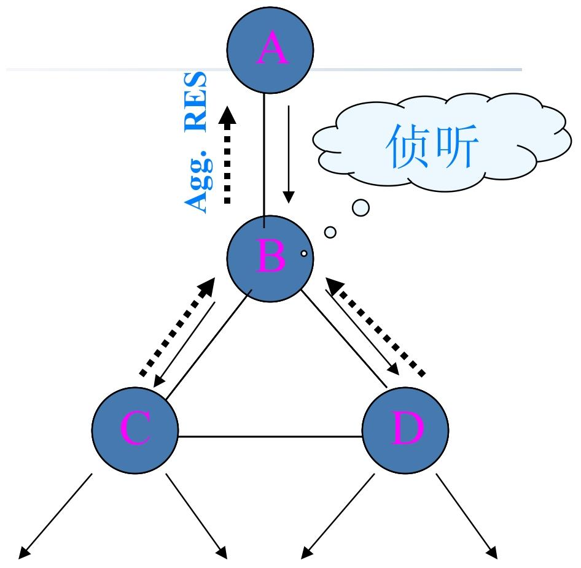

3. 簇应答（适用于分簇网络）

   - 仅簇头节点回复应答，簇内普通节点无需单独应答，由簇头代表簇反馈信息。

     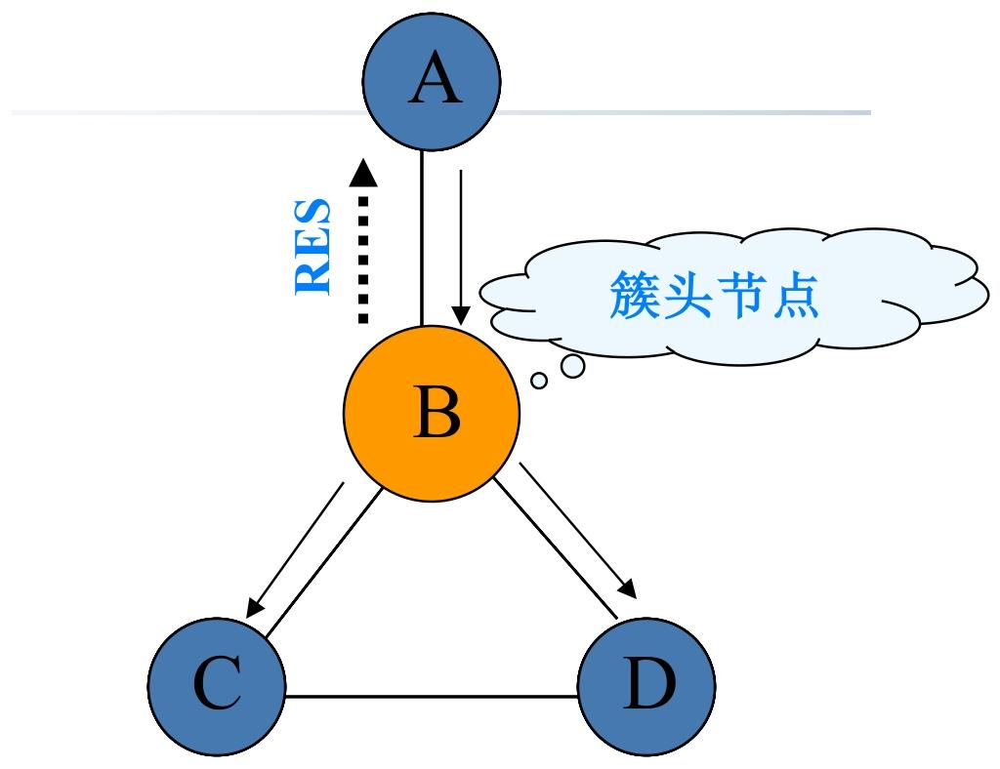

> [!note]
>
> **构建簇的3色算法**：TopDisc 通过 “3 色算法” 在请求传播过程中动态形成分簇，为聚集应答、簇应答提供基础，核心是通过 “着色” 区分节点角色（簇头 / 普通节点）
>
> 首先进行节点颜色（白黑灰）的定义：
>
> - 白色：未收到 TDR 消息，未被发现的节点；
> - 黑色：簇头节点（核心节点，负责聚合信息、转发消息）；
> - 灰色：被簇头覆盖的普通节点（非簇头，仅转发消息、反馈自身信息给簇头）。
>
> 着色核心思想
>
> - **转发延迟与距离成反比**：节点收到 TDR 后，等待一段时间再转发，距离发送方越近，等待时间越长；反之则越短。
> - 避免近距离节点重复成为簇头，保证簇头分布均匀。
>
> 具体过程：
>
> 1. 初始节点（监视节点）标记为 “黑色”，广播 TDR 消息；
> 2. 白色节点收到**黑色节点**的 TDR：直接标记为 “灰色”，**等待一段时间**后转发 TDR；
> 3. 白色节点收到灰色节点的 TDR：先等待一段时间；
>    - 若等待期间收到黑色节点的 TDR：标记为 “灰色”，转发 TDR；
>    - 若等待超时未收到黑色节点的 TDR：标记为 “黑色”（成为新簇头），转发 TDR；
> 4. 节点一旦标记为黑色或灰色，不再处理其他节点的 TDR 消息（避免重复着色）。
>
> 最后节点都有自己的邻居信息
>
> - 灰色节点：知晓自身邻居信息、对应的簇头节点（邻居黑节点）、转发 TDR 给自己的簇头（父 - 黑色节点）；
> - 黑色节点：知晓给自己转发 TDR 的灰色节点，可通过该节点转发数据或聚合信息。
>
> **响应聚合流程**：
>
> - 黑色节点（簇头）标记后，启动 “拓扑请求响应” 定时器；
> - 定时器期间，簇头收集所有子节点（灰色节点）的响应信息；定时器超时后，簇头将子节点信息与自身邻居信息聚合，形成完整簇信息，发送给对应的父 - 黑色节点或监视节点；
>   - 其中定时器设置：**距离监视节点越远**的黑色节点，定时器值越小；反之则越大。
> - 灰色节点仅转发簇头的聚合信息，不单独处理。

##### 4 色分簇算法（新增暗灰）

**更精准地控制簇头分布、避免簇头密集 / 覆盖盲区**

简单来说，暗灰节点就是三色分簇算法中**白色节点收到灰色节点的 TDR中等待过程的状态**，根据等待期间的事件判断最后的颜色

暗灰 ：已被发现（收到 TDR），但未被黑色节点直接覆盖（与黑色节点 2 跳距离）的过渡节点，介于白色和灰色之间

其中暗灰的行为：广播 TDR、启动等待定时器，根据定时器结果转换状态（收到黑色TDR->灰色，超时->黑色）

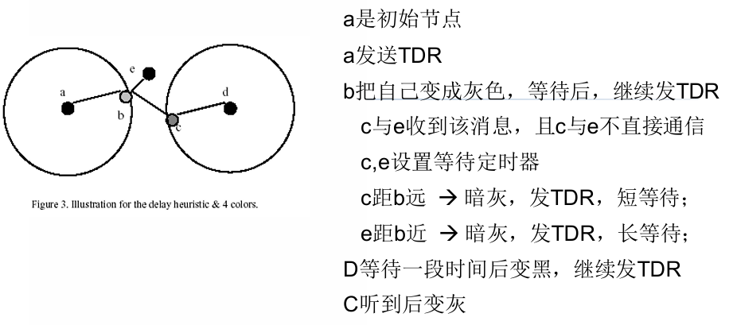