# WSN 通信标准

为什么 WSN 需要标准化？

- **成本优化**：标准化让硬件研发、软件适配无需重复造轮子，可实现大规模部署，通过规模效应降低产品成本
- **互联互通**：不同厂商的设备遵循统一标准，才能打破兼容性壁垒
- **市场扩张**：统一标准降低了行业准入门槛，吸引更多企业参与生态建设

WSN 通信标准并非单一体系，而是根据应用场景分为消费领域和工业领域两大分支()

1. 消费领域无线标准集群

   消费领域的核心需求是低成本、低功耗、易部署，主要覆盖家庭自动化、智能穿戴、小家电等场景，主流标准包括：

   - **ZigBee**：由 CSA 连接标准联盟（原 ZigBee 联盟）主导，2002 年成立，2022 年联盟升级后推出 ZigBee 3.0
   - **其他补充标准**：Z-WAVE 专注智能家居设备互联，WiFi 侧重高速数据传输（但功耗较高），LoRa 适合长距离低功耗场景，THREAD 主打智能家居互联互通，Bluetooth 则兼顾短距离数据传输与设备配对，这些标准与 ZigBee 形成互补，覆盖不同消费场景需求。

2. 工业领域无线国际标准

   工业场景对可靠性、安全性、抗干扰能力要求极高，主要服务于过程测量和控制，三大核心国际标准如下：

| 标准         | 制定主体                                      | 获批时间                                     | 核心支持厂商                     | 标准号                                 | 核心特点                                                  |
| ------------ | --------------------------------------------- | -------------------------------------------- | -------------------------------- | -------------------------------------- | --------------------------------------------------------- |
| WirelessHART | HART 通讯基金会                               | 2007 年发布，2010 年 IEC 批准                | 艾默生、ABB、E+H、倍加福、西门子 | IEC 62591                              | 基于 HART 协议扩展，支持工业级可靠通信                    |
| ISA100.11a   | 国际自动化学会（ISA）                         | 2005 年启动，2014 年 IEC 批准                | 霍尼韦尔、横河、埃克森美孚、GE   | IEC 62734                              | 专为工业自动化设计，支持复杂拓扑                          |
| WIA          | 中国国家标准化管理委员会 / 中科院沈阳自动化所 | WIA-PA（2011 年）、WIA-FA（2014 年）IEC 批准 | 中国工业无线联盟支持             | WIA-PA（IEC62601）、WIA-FA（IEC62948） | 中国自主研发，WIA-FA 是首个面向工厂高速自动控制的无线标准 |

这三大标准的底层均基于 **IEEE 802.15.4**

### 工业领域无线国际标准

工业场景对可靠性、安全性、抗干扰能力要求极高，主要服务于过程测量和控制，三大核心国际标准如下：

| 标准         | 制定主体                                      | 获批时间                                     | 核心支持厂商                     | 标准号                                 | 核心特点                                                  |
| ------------ | --------------------------------------------- | -------------------------------------------- | -------------------------------- | -------------------------------------- | --------------------------------------------------------- |
| WirelessHART | HART 通讯基金会                               | 2007 年发布，2010 年 IEC 批准                | 艾默生、ABB、E+H、倍加福、西门子 | IEC 62591                              | 基于 HART 协议扩展，支持工业级可靠通信                    |
| ISA100.11a   | 国际自动化学会（ISA）                         | 2005 年启动，2014 年 IEC 批准                | 霍尼韦尔、横河、埃克森美孚、GE   | IEC 62734                              | 专为工业自动化设计，支持复杂拓扑                          |
| WIA          | 中国国家标准化管理委员会 / 中科院沈阳自动化所 | WIA-PA（2011 年）、WIA-FA（2014 年）IEC 批准 | 中国工业无线联盟支持             | WIA-PA（IEC62601）、WIA-FA（IEC62948） | 中国自主研发，WIA-FA 是首个面向工厂高速自动控制的无线标准 |

这三大标准的底层均基于 IEEE 802.15.4

## 无线个域网（WPAN）

无线个域网（Wireless Personal Area Network，WPAN）是面向个人操作空间的短距离无线通信网络，其核心价值在于实现个人周边设备的无缝互联

个域网（Personal Area Network，PAN）：将个人操作空间（通常以个人为中心，半径 10 米左右）内的各类设备（如手机、电脑、打印机、传感器等）相互连接形成的小型计算机网络。

而无线个域网（Wireless Personal Area Network，WPAN）则采用无线通信技术替代有线连接的 PAN，是 PAN 的无线化形态。

- 典型技术：IrDA（红外数据传输）、Wireless USB、Bluetooth（蓝牙）、ZigBee 等，均是 WPAN 的主流实现技术。

## IEEE 802.15.4

在 IEEE 802.15 系列标准中，**IEEE 802.15.4（LR-WPAN）** 是无线传感器网络（WSN）的核心基础，也是 WPAN 低功耗、低成本场景的标杆技术

###  IEEE 802.15.4 的核心特性

作为低速率 WPAN 的标准，IEEE 802.15.4 完美匹配 “海量部署、长期运行” 的需求，关键特性包括：

- **传输速率**：根据载波频率不同，支持 250kb/s（2.4GHz 频段）、40kb/s（915MHz 频段）、20kb/s（868MHz 频段），兼顾传输效率与功耗控制；
- **拓扑结构**：支持**星型和点到点**两种基础拓扑，可扩展为簇树、Mesh 等复杂结构
- **地址机制**：支持 16 位短地址（适配小型网络）和 64 位长地址（适配海量设备网络），灵活满足不同场景需求；
- **信道访问**：采用 CSMA-CA（载波监听多路访问 / 冲突避免）机制
- **可靠性保障**：支持 ACK（确认）机制，数据发送后需接收方回应确认帧，确保数据不丢失；

容易安装、可靠传输、短距离通信、极低功耗（保障设备长期使用电池供电）、协议简单灵活（降低设备成本）。

> [!tip]
>
> **IEEE 802.15.4 与 ZigBee** 的关系
>
>  “底层基础” 与 “上层完整解决方案” 的关系：
>
> - **IEEE 802.15.4**：仅定义了 PHY 层（物理层）和 MAC 层（媒体访问控制层）的规范，解决 “如何传输数据” 的底层通信问题；
> - **ZigBee**：由 ZigBee 联盟在 IEEE 802.15.4 的基础上，补充定义了网络层、应用层及安全服务层，形成完整的协议栈，解决 “如何组网”“如何实现设备互联”“如何保障数据安全” 的上层应用问题。
>
> 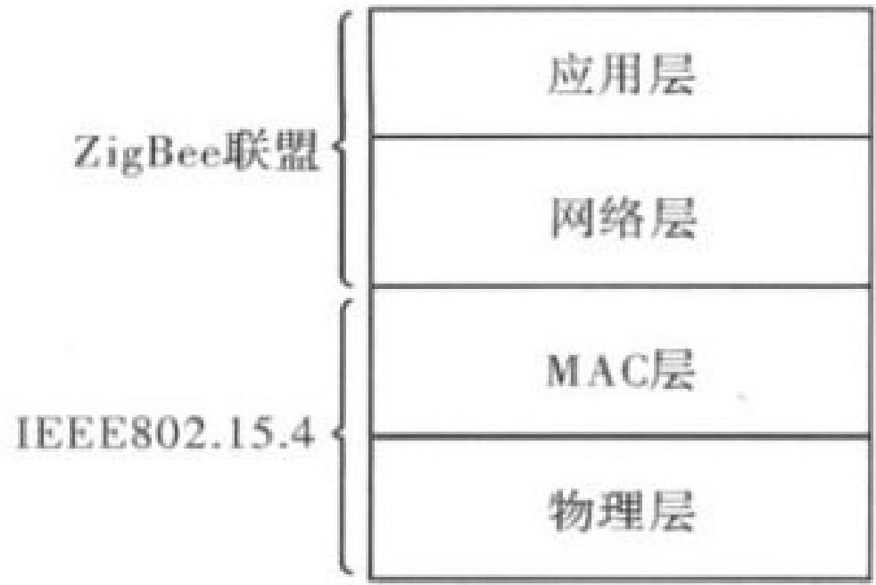

---

### 网络组成及拓扑结构

IEEE 802.15.4 是无线传感器网络（WSN）的核心底层标准，其**网络组成**（设备类型 + 角色）和**拓扑结构**是构建可靠通信的基础

一个 IEEE 802.15.4 标准网络，是指在**个人操作空间（POS，通常以核心设备为中心，半径 10 米左右）** 内，所有设备使用**相同无线信道**，并遵循 IEEE 802.15.4 协议进行通信的设备集合。

通信前提：所有设备共用一个PANID，且在同一信道上收发数据，才能互联互通。

PANID是同一PAN中所有节点共享的**16位标识符**，如0x1234

#### 网络组成：两类设备 + 三种角色

IEEE 802.15.4 网络的核心是 “设备”，设备分为 “功能类型” 和 “逻辑角色”—— 前者是硬件能力的划分，后者是网络中的职责分工

两类设备：按 “通信能力” 划分（硬件层面）

能和谁通信、能承担什么职责：

| 设备类型     | 英文缩写 | 核心通信能力                                                 | 典型应用                                                     |
| ------------ | -------- | ------------------------------------------------------------ | ------------------------------------------------------------ |
| 全功能设备   | FFD      | 可与任何类型设备通信（既能和其他 FFD 通信，也能和 RFD 通信） | 网络协调器、路由器（需要复杂通信和转发功能），或者终端       |
| 精简功能设备 | RFD      | 只能与 FFD 通信（不能直接和其他 RFD 通信）                   | 终端，普通传感器（温湿度、门窗传感器）、简单执行器（如小型指示灯） |

三种角色：按 “网络职责” 划分（逻辑层面）

在实际网络中，设备会根据 “能力” 承担不同 “职责”，形成三种核心角色 ——**所有角色都由 FFD 或 RFD 承担，且有明确的对应关系**：

1. PAN 网络协调器（PAN Coordinator）：PAN主控设备，网络中有且只有一个，负责创建网络同时决定网络标识（PANID)
2. 路由器（Router）：分组转发功能，用于辅助网络协调器，可以与周围设备同步
3. 终端（End-Device)：也称简单设备。负责简单的收/发，不能进行分组转发

网络的 “核心控制节点”（协调器、路由器）必须是 FFD，“普通感知节点”（终端）可以是 RFD（低成本、低功耗）或 FFD（高灵活度）。

#### 网络拓扑结构

1. **星形拓扑**（Star Topology）：“中心集权式” 连接

   - **PAN 网络协调器**（全网唯一的 “中心节点”）；其中协调器需要竞争确定，同时会过期

   - 所有终端（End-Device，不管是 FFD 还是 RFD）都**只和协调器直接通信**，终端之间不能直接连接（哪怕都是 FFD，也必须通过协调器转发数据）；

   - 星形拓扑中通常不需要路由器

   - 协调器需要持续供电（要一直工作，管理网络），终端可电池供电（低功耗，按需收发数据）。

     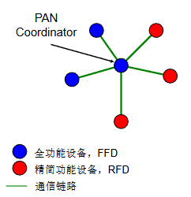

2. **点到点拓扑**（Peer-Peer Topology）：“分布式” 连接

   - **PAN 网络协调器**（负责创建网络、分配 PANID）+ **路由器**（负责转发数据）；

   - 设备之间可直接通信（前提是在通信范围内），支持 “多跳传输”（终端→路由器→协调器，或终端→路由器→其他终端）；

   - 其中路由器是 “中转站”，支持多跳传输，覆盖广

     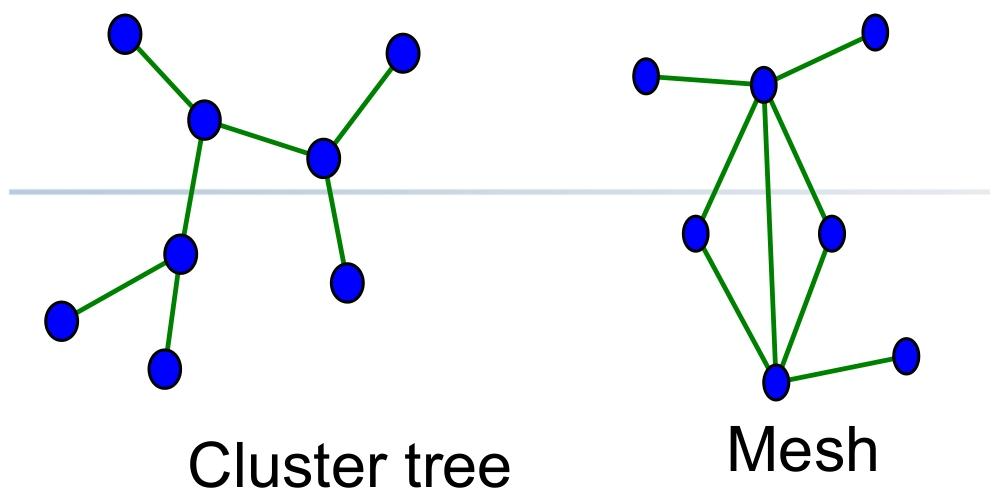

   > [!tip]
   >
   > 对于点到点拓扑的拓展：簇树网络
   >
   > 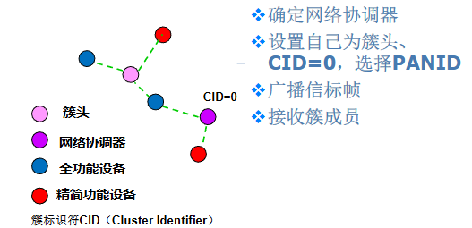

   

### IEEE 802.15.4物理层规范

物理层定义了三个载波频段用于收发数据

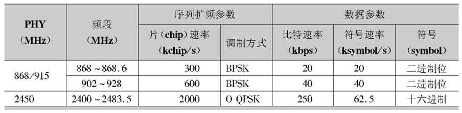

2.4GHz 频段因 “全球通用 + 传输速率高”，是 WSN 最主流的选择

同时物理层定义了**三个免授权 ISM（工业、科学、医疗）频段**，ISM 频段无需申请频谱授权，是 WSN 大规模部署的基础

| 频段范围 | 信道数量 | 信道编号 |                       中心频率计算公式                       |         信道间隔         |          核心应用地区          |
| :------: | :------: | :------: | :----------------------------------------------------------: | :----------------------: | :----------------------------: |
|  868MHz  |   1 个   |   k=0    |                    fc=868.3MHz（固定值）                     | -（仅 1 个信道，无间隔） |              欧洲              |
|  915MHz  |  10 个   |  k=1~10  | fc=906 + 2×(k-1) MHz（例：k=1 时 fc=906MHz，k=10 时 fc=924MHz） |           2MHz           |           北美、南美           |
|  2.4GHz  |  16 个   | k=11~26  | fc=2405 + 5×(k-11) MHz（例：k=11 时 fc=2405MHz，k=26 时 fc=2480MHz） |           5MHz           | 全球通用（中国、欧洲、北美等） |

物理层帧格式：信号的 “包装结构” 与 “传输顺序”

物理层帧（PHY 帧）是数据在无线信道中传输的 “最小单元”，其结构设计需兼顾 “同步可靠性” 与 “传输效率”，IEEE 802.15.4 定义的帧结构分为**同步头（SHR）**、**帧长度字段（PHR）**、**物理层负载（PSDU）** 三部分，总长度可变（最大由 PSDU 长度决定）。

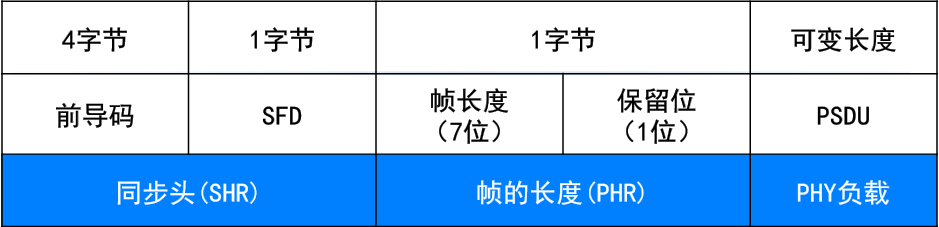

其中字段顺序：前导码 → SFD → PHR → PSDU（左边字段优先发送）；

对于字段中的多字节数据，优先发送**最低有效字节（LSB）**，而有效字节中又优先发送**最低有效位（LSB）**

物理层的核心功能是 “实现射频信号的收发管理”，并通过标准化的服务接口（SAP）为 MAC 子层提供数据传输与管理服务，具体功能可分为**数据服务**、**管理服务**两大类，均通过 **“原语（Primitive）**” 实现上下层交互。

1. 物理层需完成从 “收发器启停” 到 “数据收发” 的全流程控制，比如射频收发器的激活和关闭，信道能量检测，空闲信道评估，信道频率选择，数据包的收发，以及链路质量的指示

2. 数据服务通过**物理层数据服务访问点（PD-SAP）** 实现，核心是 “可靠传输 PSDU”

   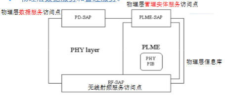

---

### IEEE 802.15.4 MAC 规范

IEEE 802.15.4 的 MAC 子层是无线传感器网络（WSN）通信的 “核心调度层”，承上启下连接物理层（PHY）与上层协议，通过**信道访问管理、帧结构设计、功能流程实现**三大核心模块，解决 “如何有序使用无线信道”“如何可靠传输数据”“如何管理网络设备” 三大关键问题

MAC子层使用物理层提供的服务实现设备之间数据帧的传输。提供MAC层数据服务和管理服务｡

比如：CSMA-CA访问信道；协调器的工作，PAN网络，间接传输实现，保障时隙，安全机制

MAC 子层的信道访问方式与 “是否使用信标帧” 强绑定，分为两种工作模式：

|               工作模式               |                      核心特征                      |                         信道访问机制                         |                           适用场景                           |
| :----------------------------------: | :------------------------------------------------: | :----------------------------------------------------------: | :----------------------------------------------------------: |
|    信标使能模式（Beacon-enabled）    | 协调器**定期广播信标帧**，以 “超帧” 为单位管理时间 | 竞争接入（CAP 阶段，Slotted CSMA-CA）+ 免竞争接入（CFP 阶段，GTS） | 对时延、同步有要求的场景（如工业设备控制、智能家居实时响应） |
| 无信标使能模式（Non Beacon-enabled） |   协调器**不广播信标帧**，仅在设备请求时单播信标   |               仅竞争接入（Unslotted CSMA-CA）                | 设备分散、对同步无要求的场景（如环境监测传感器、低频次数据上报） |

> [!tip]
>
> 超帧（Superframe Structure）
>
> 超帧把时间划分为固定周期，让所有设备按统一节奏通信，核心解决 “同步” 和 “信道有序使用” 两大问题。
>
> 超帧分为 “活跃期” 和 “非活跃期”，活跃期又细分为三个部分
>
> **活跃期（Active Period）**：设备正常通信，不可休眠
>
> - 信标周期（Beacon Period）：协调器发送信标帧，告知设备超帧参数、GTS 分配、待发数据等信息。
> - 竞争访问时段（CAP）：设备用 Slotted CSMA-CA 机制竞争信道，普通数据传输（如传感器上报温湿度）都在这一阶段进行。
> - 无竞争时段（CFP）：包含多个 GTS，每个 GTS 分配给特定设备，设备无需竞争，直接使用专属时隙通信。
>
> 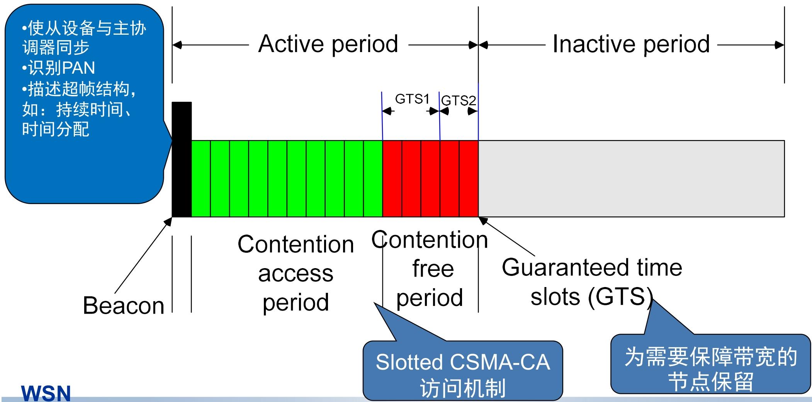

MAC 子层帧是无线传感器网络（WSN）数据传输的 “基本包装单元”，都遵循 “帧头（MHR）+ 帧负载（MAC Payload）+ 帧尾（MFR）” 的三段式结构，各字段分工明确，总长度≤127 字节

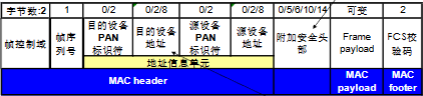

其中帧控制域确定帧的类型为信标帧、数据帧、命令帧、确认帧

1. 信标帧（Beacon Frame）：网络的 “同步与管理信号塔”

   信标帧是 “信标使能模式” 的核心，由协调器（或 Ad Hoc 网络的节点）定期发送，相当于网络的 “定时广播通知”

   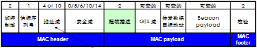

   - 其中超帧描述字段规定超帧的各个时段的划分，GTS域则将无竞争时段划分为多个GTS给具体设备

2. 数据帧（Data Frame）：有效数据的 “传输载体”

   数据帧是 WSN 中传递 “实际业务数据” 的主力，如温湿度传感器的采集值、智能灯的控制指令。

   - MAC帧： MAC服务数据单元+MHR头信息+MFR尾信息

3. 确认帧/应答帧（ACK Frame）：数据接收的 “确认信号”

   确认帧是 “极简帧”，仅用于告知发送方 “数据已正确接收”，无地址单元和负载，是可靠性传输的关键。

   - 设备收到目的地址为自身的数据帧或者命令帧，并且帧的确认请求位置一则回应确认帧

4. 命令帧（Command Frame）：网络管理的 “控制指令”

   命令帧是 “网络管理员”，用于**组建PAN，设备入网、时隙申请、冲突处理**等管理操作，共定义 9 种核心类型（源自 IEEE 802.15.4-2006 标准）。

   

IEEE 802.15.4 MAC 层是无线传感器网络（WSN）通信的 “核心执行层”，通过**PAN 网络管理、设备交互控制、数据传输保障、资源调度、安全防护**五大模块，结合标准化原语（数据服务 / 管理服务），实现从 “网络创建” 到 “稳定通信” 的全流程功能。

其中数据服务为MCPS，而管理服务为MLME

#### PAN 的建立与维护：

PAN（个人区域网）是 LR-WPAN 的基础网络单元，MAC 层通过 “扫描 - 建网 - 冲突处理” 三步，实现网络的创建与长期维护，核心是保障网络标识（PANID）的唯一性和信道的可用性。

1. 设备角色判定和扫描

   - 根据是否为协调器选择不同的扫描方式

     > **ED 信道扫描（仅 FFD）**：像 “听声辨位”，检测每个信道的信号能量峰值，排除信号干扰大的信道，筛选出 “干净” 的通信通道。
     >
     > **主动信道扫描（仅 FFD）**：像 “主动问路”，设备主动发送 “信标请求帧”，周边有网络的协调器会回复信标帧，设备就能收集到这些网络的 PANID、信道等信息，避免建网时 PANID 重复。
     >
     > **被动信道扫描（FFD/RFD 均可）**：像 “守株待兔”，设备不主动发请求，只被动侦听周边协调器的信标帧，适合低功耗场景（减少主动发送的能耗）。
     >
     > **孤立信道扫描（所有设备）**：像 “迷路后找组织”，设备和协调器失同步（比如没收到信标帧）后，用这种扫描重新寻找协调器，恢复网络连接。

2. 网络创建（仅协调器执行）

   - 潜在协调器通过扫描确认 “空闲信道 + 唯一 PANID” 后，以 “PAN 协调器” 身份启动网络：
     1. 选择 16 位唯一 PANID（如 0x1234），定义网络基础参数（如信道号、超帧周期）；
     2. 定期发送信标帧（信标使能模式），或等待设备请求（无信标模式），宣告网络存在。

3. PANID 冲突处理

   - 网络运行中若出现 “同一区域存在相同 PANID” 的冲突(协调器收到 “相同 PANID 的信标帧”，或设备上报 “PANID 冲突通知”（命令帧 0x05）)
   - 进行冲突调整
     - 协调器：重新执行主动扫描，选择新的无冲突 PANID；
     - 全网通知：协调器广播 “协调器重置消息”，告知所有设备更新 PANID；
     - 设备响应：所有设备接收消息后，重设本地网络参数（PANID、信道），重新同步。

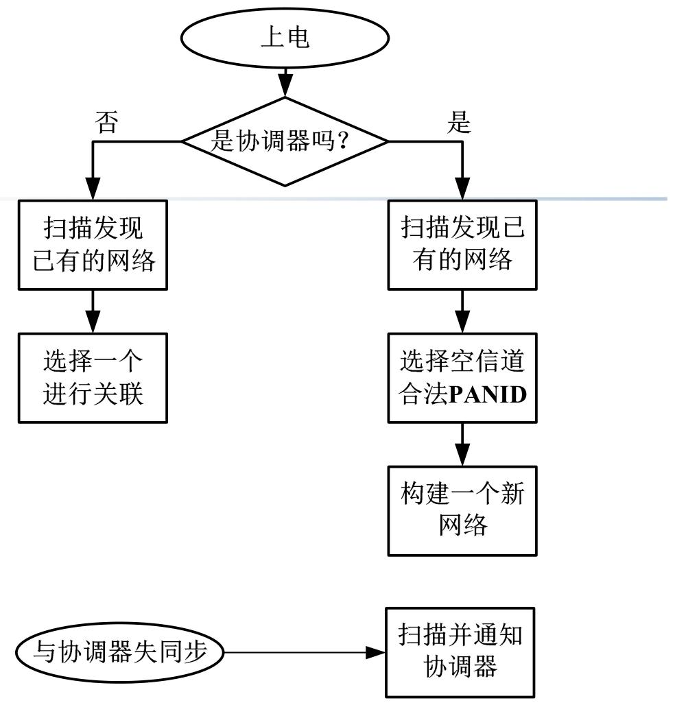

#### 关联请求与取消：设备的 “入网” 与 “退网” 管理

关联是设备加入网络的 “准入流程”，取消关联是设备脱离网络的 “注销流程”，核心是通过标准化命令帧与原语，实现设备与协调器的双向身份认证与权限管理。

1. 关联请求：新设备（如温湿度传感器）首次接入网络，或设备失同步后重新入网。

   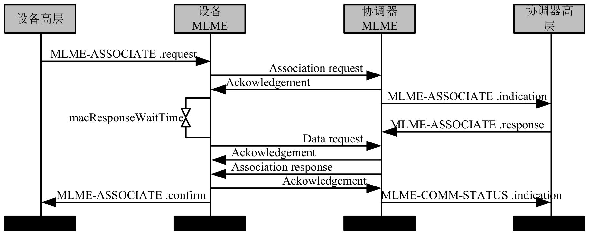

2. 关联取消（设备退网）：主动注销与被动清理

   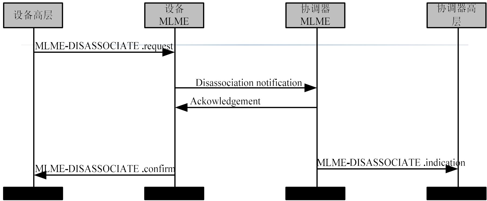

#### 与协调器的同步：设备的 “时间校准” 保障

同步是设备间有序通信的前提，MAC 层根据 “信标使能 / 无信标使能” 两种模式，采用不同的同步机制，核心是让所有设备的通信节奏与协调器保持一致。

1. 信标使能模式下，协调器定期发送信标帧（超帧的 “起始信号”），设备通过信标帧校准本地时钟
2. 无信标模式下协调器不广播信标帧，设备通过 “主动询问” 实现同步

#### GTS 的分配与管理：关键设备的 “专属通信时段”

GTS 由协调器集中管理，设备只能向协调器请求分配或释放；

仅信标使能模式支持 GTS，专属时段位于超帧的 “无竞争时段（CFP）”，最多支持 7 个 GTS。

关键原语

- “MLME-GTS.request”：设备向自身 MAC 层发起 GTS 申请（或释放请求），携带时隙长度、传输方向（上行 / 下行）等参数；
- “MLME-GTS.confirm”：MAC 层向设备高层回复请求结果（分配成功 / 失败、释放成功）；
- “MLME-GTS.indication”：协调器收到设备的 GTS 请求后，通知自身高层，由高层决策是否分配资源。

GTS分配过程

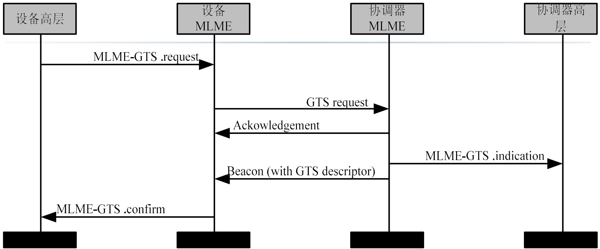

GTS释放过程

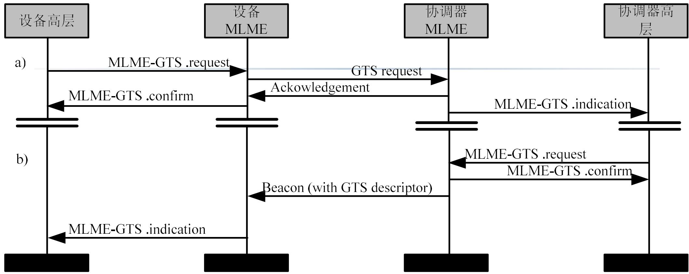
