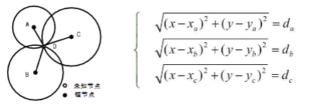
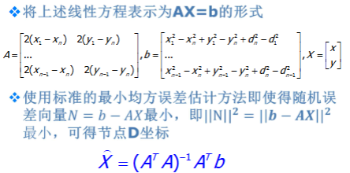
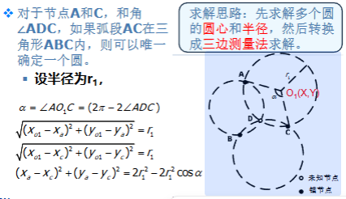
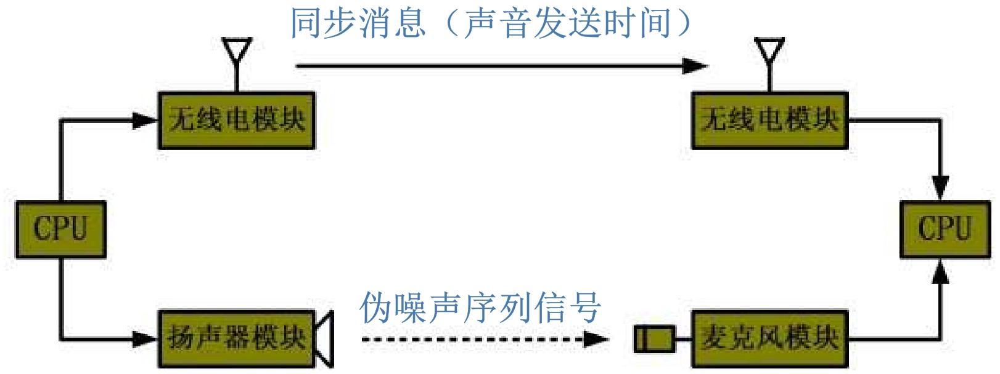
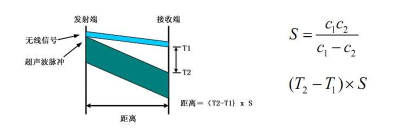
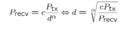
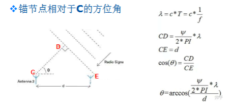
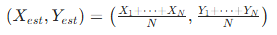
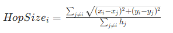

# WSN 定位技术

传感器采集的数据只有附加时空信息，才能明确事件发生的位置、协助路由优化和网络管理。

## 定位

定位本质是 "确定位置"，包含两种维度：

- 物理位置：观测对象在特定坐标系下的具体数值（如经纬度、直角坐标）；
- 符号位置：观测对象所在范围的符号表示（如 "501 房间"）。

而从应用意义来看，定位又分为两类：导航和跟踪，区别在于知道谁的位置

- 导航：确定**自己**在系统中的位置；
- 跟踪：确定**目标**在系统中的位置。

全球导航卫星系统（GNSS，如北斗、GPS）虽成熟，但在 WSN 场景中存在明显局限：成本大功耗高，同时环境受限，仅适用于无遮挡的室外环境

WSN 需要专门的节点定位机制 —— 尤其当节点随机部署时，必须先确定节点位置，才能精准定位其监测的事件。

## 定位技术的关键指标

- 定位精度：位置信息的精确程度，包括**绝对精度（估计位置与实际位置的最大误差）**和**准确率（满足精度要求的结果占比）**。例如 "95% 准确率下实现 20cm 定位精度"：有95%的概率保证估计位置和实际位置的差值不超过20cm
- 覆盖范围：基础设施能覆盖的有效面积，不同技术差异显著

|   技术类型   | 定位精度 | 覆盖范围 |
| :----------: | :------: | :------: |
|    超声波    |  分米级  |  十多米  |
| Wi-Fi / 蓝牙 |   3 米   |  100 米  |
|   GSM 系统   |  100 米  |  公里级  |

- 刷新速度：提供位置信息的频率，如 GPS 每秒刷新 1 次。

WSN 专属指标

- 代价：包括硬件成本（如是否需要特殊传感器）和算法成本（计算复杂度）；
- 锚节点密度：单位空间内锚节点（已知位置的参考节点）数量，直接影响部署成本和网络扩展性；
- 鲁棒性：抵抗环境时变性（如温湿度变化）和节点能量消耗的能力。

所以WSN的定位算法需要满足能量高效，鲁棒性，自组织性以及分布计算的特点

## 计算节点位置的三大基本方法

未知节点通过锚节点信息计算自身位置，核心有三种经典方法，各有适用场景：

### 三边定位法（Trilateration）

已知 3 个锚节点（A、B、C）的坐标，以及未知节点（D）到每个锚节点的距离，通过几何关系求解 D 的坐标。

- 基于圆的交点求解，每个锚节点为圆心、距离为半径画圆，三个圆的交点即为未知节点位置

测量距离存在误差时（实际场景中普遍存在），可能无解或结果偏差，需增加锚节点数量优化。

### 极大似然估计法

而极大似然估计法则是在三边定位法的基础上，当锚节点数量 n≥3 时，利用多个距离测量值构建超定方程组，通过最小均方误差估计降低误差。

将**非线性距离方程转化为线性方程组 AX=b**，通过最小化误差向量 N=b-AX 的二范数，求解未知节点坐标：

其中 A 为系数矩阵（由锚节点坐标构成），b 为常数项向量（由锚节点坐标和距离构成），X 为未知节点坐标向量；

### 三角定位法（Triangulation）

已知 3 个锚节点坐标，以及未知节点相对于每个锚节点的角度（如∠ADC、∠ADB），通过圆的交点求解位置；

其中就是利用三角函数性质将三角转为三边，回到第一个方法三边定位法（Trilateration）

- 先根据锚节点和角度确定多个圆的圆心和半径（例如，锚节点 A、C 与角度∠ADC 可确定一个圆），再转化为三边测量法求解；

## 定位算法

定位的本质是一个未知节点，获得锚节点的信息，进而获得自己的位置

WSN 定位算法可从两个核心维度分类，不同类别对应不同应用场景：

按是否利用通信距离分类

1. 基于通信距离的定位（Range-based）
   - 测量节点间实际距离或方位，再计算位置；
   - 优势：定位精度相对较高；
   - 劣势：对硬件要求高（需测距 / 测角模块）、能量消耗多、易受环境影响（温湿度、障碍）；
   - 主流测量技术：TOA、TDOA、RSSI、AOA（后续详细讲解）。
2. 通信距离无关的定位（Range-free）
   - 无需测量绝对距离或方位，通过节点连通性等信息估算位置；
   - 优势：硬件要求低、能量消耗少、环境适应性强；
   - 劣势：精度相对较低，但能满足多数场景需求；
   - 典型算法：质心算法、DV-Hop 算法（后续详细讲解）。

按定位先后次序分类

- 递增式定位（Incremental）：从信标节点附近的节点开始定位，逐步向外延伸，缺点是误差会累计传播；
- 并发式定位（Concurrent）：所有节点同时计算位置，避免误差累计，效率更高。

### 基于通信距离的定位技术 Range-based Location

这类技术的核心是精准测量节点间距离或方位，四大主流技术各有特点：

#### TOA（Time of Arrival，到达时间）

- 已知信号传播速度（如声波、无线电波），通过**测量信号传播时间计算距离**（距离 = 速度 × 时间）；
- 节点间需**精确时间同步**，否则会引入较大误差；
- 常采用声波与无线电波结合的方式，无线电波用于同步时间，声波用于测量传播时间；
- 优缺点：精度高，但对硬件和功耗要求高，声波传播速度易受大气条件影响

> [!tip]
>
> 在一个TOA测距系统中，假设网络的节点时钟频率是32KHZ，设声音的速度是340m/s。问： 在网络时间完全同步的情况下，测距的精度约为0.01米，即传播速度/频率，或者传播速度*周期

#### TDOA（Time Difference of Arrival，到达时间差）

- 发射节点同时发射两种不同传播速度的信号（如射频信号 + 超声波），接收节点通过两种信号的到达时间差计算距离；
- 数学模型：距离 =(T2-T1)×S，其中 S=（c1×c2）/(c1-c2)，c1、c2 为两种信号的传播速度
- 典型应用：Cricket 系统（麻省理工学院 Oxygen 项目），在大楼每个房间部署锚节点，未知节点通过接收射频 + 超声波信号，选择最近锚节点确定房间位置。

####  RSSI（Received Signal Strength Indicator，接收信号强度指示）

- 基于**信号衰减模型**，通过接收信号强度反推传播距离；

- 数学模型：假设已知路径损失模型和系数，距离公式为：

  

  其中 c 为常数，Ptx 为发射功率，Precv 为接收功率，α 为路径损失系数；

误差大，主要原因包括设备校准偏差、多径衰减（信号经不同路径传播后叠加干扰）；

#### AOA（Angle of Arrival，到达角度）

- 接收节点通过天线阵列或多个超声波接收机，感知发射节点信号的到达方向，计算相对方位后，用**三角测量法**确定位置；
- 通过不同天线接收信号的相位差计算角度

### 无需通信距离的定位技术 Range-free Location

这类算法无需测距，适配低成本、大规模 WSN 场景

利用重叠区域的连通性定位，并且通信距离有限，以及锚节点的周期广播，位置节点接收到广播后近似确定大致范围

#### 质心算法（Centroid Algorithm）

- 将未知节点的位置估算为其接收到信号的锚节点所构成多边形的几何中心；

- 锚节点周期性广播包含**自身 ID 和位置**的信标分组；未知节点接收足够数量（超过阈值 k）的锚节点信号后，计算这些锚节点的质心；

- 若接收到接收 N 个锚节点的信号，未知节点坐标为：

  

实现简单、分布式部署、可扩展性好；但精度依赖锚节点的密度和分布，通信半径也会影响误差。

#### DV-Hop 算法（Distance Vector-Hop，距离向量 - 跳段）

- 针对大规模网络，未知节点无法直接与足够多锚节点通信，**锚节点覆盖范围有限**的场景；

- 核心思想：用 "**跳数 × 平均每跳距离**" 估算锚节点与未知节点的距离，再通过三边法或极大似然估计求解位置；

- 定位过程（四步走）：

  1. 计算最小跳数：锚节点广播跳数初始为 0 的分组，邻居节点记录最小跳数并转发（跳数 + 1），最终所有节点获取到每个锚节点的最小跳数；

  2. 锚节点估算平均每跳距离：锚节点根据**其他锚节点的位置和最小跳数**，计算平均每跳距离：

     

     实例：锚节点 L2 与 L1 距离 40m（跳数 2）、与 L3 距离 75m（跳数 5），则平均每跳距离 =(40+75)/(2+5)≈16.42m；

  3. 未知节点估算跳段距离：接收锚节点广播的平均每跳距离，用 "最小跳数 × 平均每跳距离" 得到与各锚节点的距离；

  4. 计算自身坐标：通过三边法或极大似然估计求解位置；

硬件要求低、实现简单；但用跳段距离代替直线距离，存在一定误差。