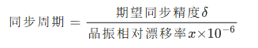
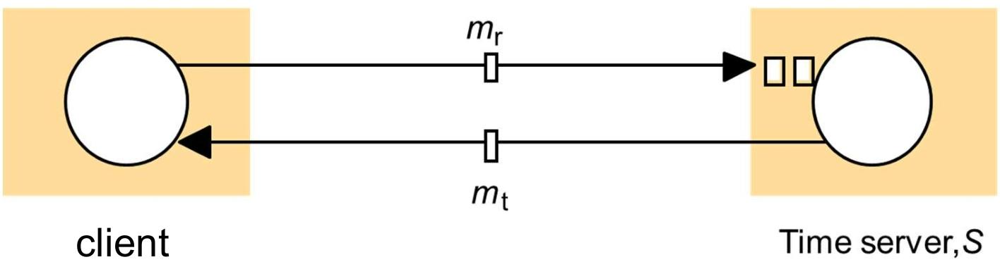
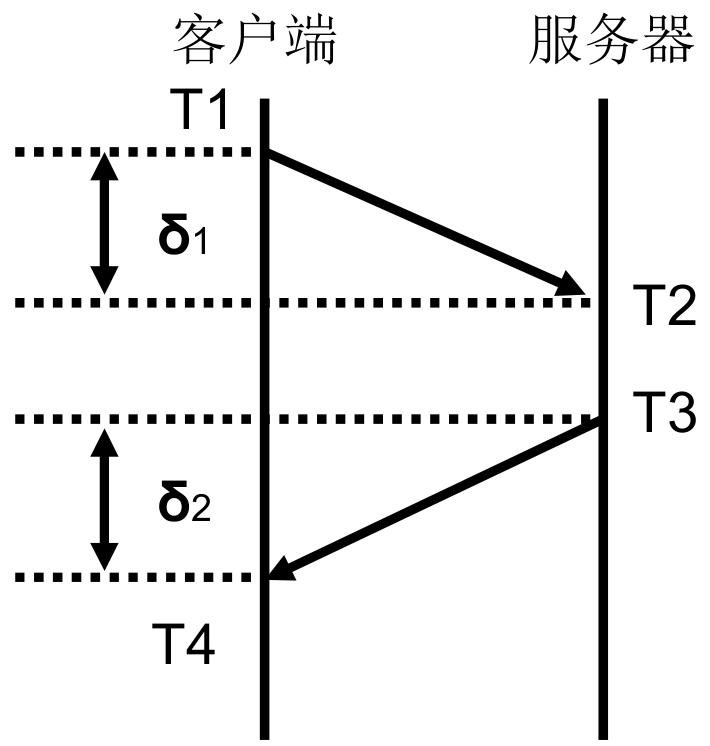
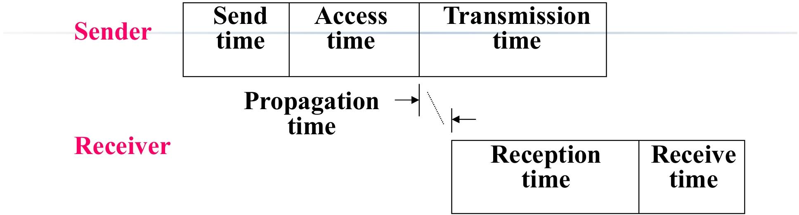
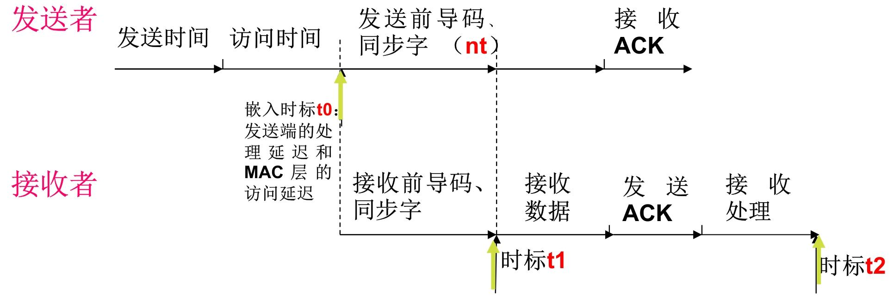
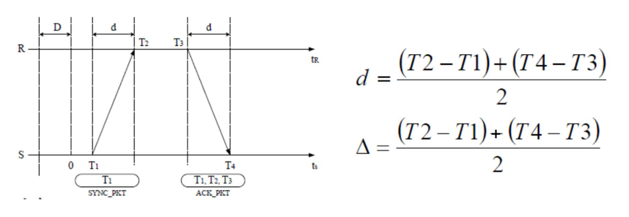
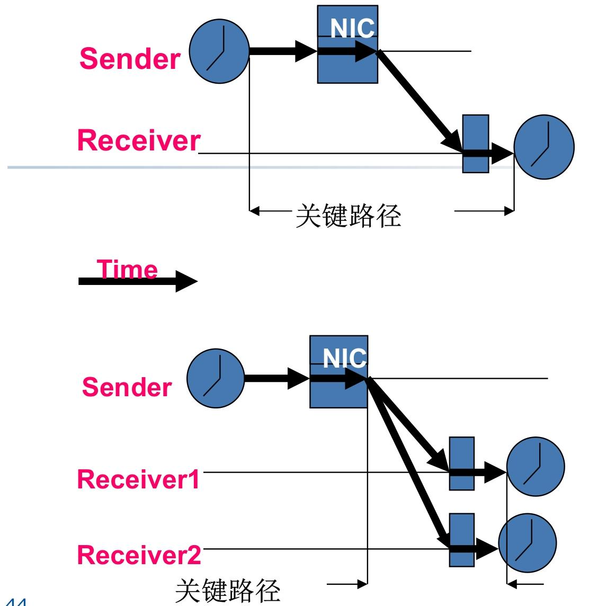
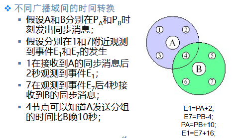

# WSN 时间同步技术

在分布式的 WSN 场景中，时间同步就像是整个网络的 "生物钟"，直接决定了数据采集、定位跟踪、协同工作等核心功能的有效性。

为什么 WSN 必须依赖时间同步机制？这背后是其应用场景和网络特性的必然要求：

1. **低功耗协议的正常运行**：WSN 广泛采用休眠 - 唤醒机制和 TDMA（时分多址）协议，节点必须在统一的时间窗口内唤醒、通信，否则会导致数据丢失或信道冲突。
2. **数据的时间关联性需求**：传感器采集的温湿度、振动等数据，只有附带准确时间戳，才能还原事件发生的先后顺序，比如环境监测中异常数据的时间溯源。
3. **测距定位的精度保障**：很多 WSN 定位技术（如 TOA、TDOA）依赖信号传播时间差计算距离，时间同步精度直接决定定位误差 —— 同步误差 1μs，可能导致 300 米的定位偏差（电磁波传播速度≈3×10⁸m/s）。
4. **多传感器数据融合**：多个节点监测同一事件时，需通过时间同步识别重复数据，提升融合效率，比如目标跟踪中通过多节点时间戳推算目标移动速度和方向。
5. 目标跟踪：估计目标的移动速度和方向

## 时间同步

在 WSN 中，我们需要区分两种关键时间概念：

- 物理时间：客观存在的绝对时间，有明确的时间起点和尺度（如秒）。国际通用标准包括：
  - 国际原子时间（TAI）：以铯原子跃迁周期为基准（1 秒 = 9,192,631,770 次跃迁），是目前最精确的时间标准；
  - 世界协调时间（UTC）：基于 TAI 调整 leap second（闰秒），适配地球自转速度变化，是全球通用的民用时间标准。
- **逻辑时间**：仅关注事件发生的顺序关系，不要求与物理时间一致，适用于只需判断 "谁先谁后" 的场景（如数据上报顺序）。

每个 WSN 节点都有本地计时装置，其核心构成是**振荡器（如石英晶振）+ 计数器**，其中振荡器负责提供稳定频率的信号

- 时钟频率：单位时间内信号周期性变化的次数，直接决定计时精度；
- 时间分辨率：两个计数脉冲之间的间隔，决定了时间测量的最小单位。

所以，节点 i 的本地软件时间可表示为：`Li(t)=S0+(t−ti′)/fi`

S0：初始时间设定值；ti′：节点启动时间；fi：节点时钟频率。

其中时钟偏移（Clock offset）：针对的是节点之间的某一个时刻，两个（节点）的本地时间的差值，或者是节点与参考时间的差值。比如**节点A相对B的时钟偏移是多少**即节点A的时钟比节点B的时钟**快了多少**

节点本地时间天然存在偏差，主要原因有三：

1. 节点随机开启，初始时间不一致（时钟偏移）；
2. 晶振频率存在固有偏差：廉价晶振的实际频率与标称频率差异更大；
3. 晶振频率随环境变化：温度、湿度、电压波动会导致频率漂移（用 **PPM，即百万分之一，衡量漂移率**）。

> [!note]
>
> **PPM 值越小，晶振精度越高**。
>
> 1PPM 的晶振比 10PPM 的计时更准确 —— 因为前者每秒漂移不超过 1 微秒，后者可能漂移 10 微秒。

**同步（Synchronization）**：调整一个或多个节点的本地时钟，使它们达到统一的过程；

**同步精度（Precision）**：节点本地时间与外部标准时间（如 UTC）的最大差值，或节点间本地时间的最大差值；

对于WSN的两类同步目标：

- 外同步：所有节点与**外部参考时钟**（如 UTC）同步，满足`∣Li(t)−t∣<δ`（δ 为允许的最大偏差）；
- 内同步：所有**节点间本地时间**一致，满足`∣Li(t)−Lj(t)∣<δ`。

> [!tip]
>
> 如果两个节点的外同步精度都是 Δ，那么它们的内同步精度最大为 2Δ
>
> 因为两者与 UTC 的偏差都不超过 Δ，相互之间的偏差自然不超过 2Δ。

由于晶振漂移会逐渐破坏同步精度，所以需要**同步周期**（即多久需要重新同步一次）进行调整

举例：若晶振漂移率为 10PPM（x=10），期望同步精度为 1ms（δ=0.001s），则同步周期 = 0.001/(10×10⁻⁶)=100s—— 即每 100 秒需要重新同步一次，否则精度会超标。

## WSN 时间同步的性能评估维度

**同步精度**：节点间或节点与标准时间的偏差大小（核心指标）；

**同步周期**：节点间保持同步的时间长度（越长越好，可减少同步开销）；

**能量消耗**：同步过程中交换的数据分组数、计算量，以及同步间隔（WSN 节点能量有限，这是关键约束）；

**同步范围**：能实现同步的区域覆盖（局部同步或全网同步）；

**可扩展性**：网络规模扩大时，同步精度是否会显著劣化；

**稳定性**：面对网络拓扑动态变化（如节点失效、移动）时，同步精度的稳定性；

**收敛性**：建立同步的时间长短（越短越好，让节点快速投入工作）。

## 时间同步协议

WSN 的时间同步协议主要分为两大类：**基于发送者 - 接收者的同步协议**和**基于接收者 - 接收者的同步协议**。

### 基于发送者接收者的时间同步协议

WSN 的同步协议源于传统网络，但做了针对性优化。传统网络常用 C/S 模式，时间服务器与UTC保持同步。核心有两种消息交换方式：

1. **单向消息交换**：时间服务器**周期性发送带时间戳**的消息，客户端直接用该时间校准本地时钟，从而一个时间同步消息实现客户端和服务端的同步 —— 优点是简单，缺点是忽略传输延迟，仅适用于延迟可忽略的场景；

2. **双向消息交换**：客户端发送同步请求，服务器回应带时间戳的**应答**，通过往返时间估计单程延迟 —— 这是 NTP 协议的核心思想，也是 WSN 很多协议的基础。

   

#### NTP 协议（网络时间协议）

NTP 是 Internet 的标准时间同步协议，采用分层架构：

- 一级服务器：直接与 UTC 时间源（如原子钟、授时卫星）同步；
- 二级服务器：与一级服务器同步；
- 下级服务器：从上级服务器获取时间。

NTP 的核心原理（双向消息交换）：

- 客户端在 T1 时刻发送请求消息；
- 服务器在 T2 时刻接收并记录时间，在 T3 时刻发送应答消息（包含 T2、T3）；
- 客户端在 T4 时刻接收应答消息。

假设往返传输延迟对称（δ1=δ2），则客户端相对服务器的时钟偏移 θ（即客户端快`θ`) 和总延迟 δ 计算如下：

根据`T2 = T1 - θ + δ1`；`T4 = T3 + θ + δ2`；`δ = δ1 + δ2`

可得：`θ=((T1−T2)+(T4−T3))/2`；`δ=(T2−T1)+(T4−T3)`

客户端根据 θ 调整本地时钟 —— 若 θ 为正，说明本地时钟偏快，需减去 θ；若为负，说明偏慢，需加上 |θ|。

#### DMTS（延迟测量时间同步）

基于同步消息在传输路径上的所有延迟估计，采用**单向广播消息**实现同步 —— 解决双向消息交换的不对称问题，且交换消息少、效率高。

首先进行消息传播时延的分解

所以DMTS的工作流程基于传播时延进行

- 时间主节点（leader）广播同步消息，消息中嵌入发送端的处理延迟和 MAC 层访问延迟时标 t0；
- 接收节点记录接收前导码、同步字的时标 t1，以及接收数据完成的时标 t2；
- 接收节点调整本地时钟：`本地时间 = t0 + nτ + (t2 - t1)（nτ 为固定传输延迟）`。

- 同步范围：**单跳广播域内所有节点**（多跳网络需分层实现，同步精度为单跳的 N 倍）；
- 优点：轻量级、能量消耗低、实现简单；
- 缺点：同步精度较低，适用于对精度要求不高的场景。

#### TPSN（传感器网络时间同步协议）

实现**全网范围内的高精度时间同步**，是 WSN 中应用最广泛的协议之一。

- 假设：每个节点有**唯一 ID**，无线链路双向可达；
- 架构：分级层次结构（类似树形结构），**根节点与外部 UTC 同步**（如通过 GPS），作为全网时间基准。

**层次发现阶段**：形成层次形拓扑结构

- 根节点（级别 0）广播 "级别发现" 分组（包含自身 ID 和级别 0）；
- 未分配级别的接收节点将自身级别设为发送节点级别 + 1，延迟随机时间后继续广播该分组；
- 节点级别确定后，忽略其他 "级别发现" 分组，最终形成层次拓扑。

**同步阶段**：进行时间同步

- 根节点广播 "时间同步分组"，启动 1 级节点同步；
- 1 级节点收到分组后，与根节点通过双向消息交换同步（类似 NTP 的双向机制）；
- 2 级节点侦听到 1 级节点的同步消息后，与父节点（1 级节点）双向交换消息同步；
- 依次类推，各级节点逐层同步到根节点。

对于相邻节点的时间同步，采用双向消息交换实现，类似于**NTP 的核心原理**

同步节点 S（父节点）与被同步节点 R（子节点）的交互：

1. S 在 T1 时刻发送 SYNC_PKT（带 T1 时间戳）；
2. R 在 T2 时刻接收，在 T3 时刻发送 ACK_PKT（带 T2、T3 时间戳）；
3. S 在 T4 时刻接收 ACK_PKT。

时间戳记录：在 MAC 层消息开始发送到无线信道的时刻记录（减少协议栈延迟影响，提升精度）。

- 同步精度：高（误差与跳数成正比，但每跳精度可达微秒级）；
- 优点：全网同步、精度高、鲁棒性较强；
- 缺点：需要层次发现和双向消息交换，能量消耗比 DMTS 高；根节点失效会导致全网同步崩溃（无备份机制）

### 接收者 - 接收者同步协议：RBS（参考广播同步）

打破 "发送者 - 接收者" 的传统模式，利用无线信道的**广播特性**—— 由一个节点发送参考广播消息，多个接收节点通过比较各自接收消息的本地时间，实现彼此同步。

发送节点广播参考消息（无需携带时间戳）；

接收节点 1 和接收节点 2 分别记录接收该消息的本地时间 T1 和 T2；

接收节点通过交换各自的接收时间，计算时钟偏移：若 T1 > T2，说明节点 1 的时钟比节点 2 快（T1 - T2），节点 1 需调整时钟减慢，节点 2 需加快。

RBS 巧妙地去除了发送节点引入的误差（发送时间、访问时间）—— 因为所有接收节点共享同一广播消息，这些误差对所有接收节点是相同的，比较时会相互抵消，仅保留接收节点自身的微小差异，同步精度更高。

多跳网络应用

- 非邻居节点（如 A 和 B）通过**中间节点**（如节点 4，处于两个广播域交集）实现同步；
- **中间节点作为时间转换桥梁**，通过记录不同广播域的参考消息接收时间，建立域间时间映射关系。

### 协议对比：DMTS vs TPSN vs RBS

| 协议 |       同步方式        |        同步范围        | 同步精度 | 能量消耗 |        适用场景        |
| :--: | :-------------------: | :--------------------: | :------: | :------: | :--------------------: |
| DMTS |       单向广播        |    单跳（多跳分层）    |    低    |    低    |   低精度、低功耗需求   |
| TPSN |    双向交换 + 分层    |          全网          | 中 - 高  |    中    | 全网同步、中等精度需求 |
| RBS  | 接收者交互 + 广播参考 | 局部（多跳需中间节点） |    高    |    高    |  高精度、局部同步需求  |

## 