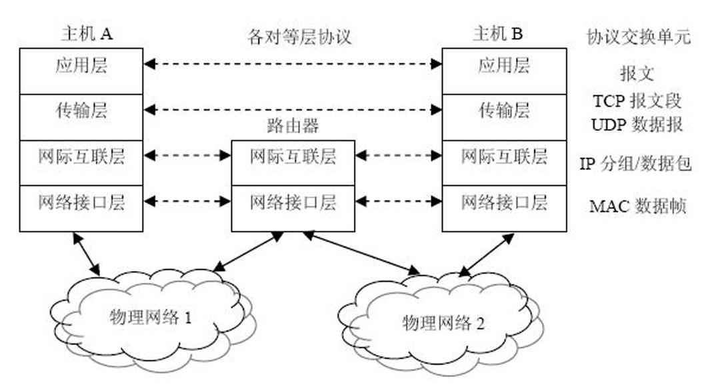

# 从计算机网络到无线网络

## 计算机网络

计算机网络最底层的逻辑可以概括为：**连接终端**以实现**资源共享**。

通过有线/无线介质将终端联结成网络，不同用户资源通过网络实现各种资源(信息/软 件/硬件)共享。

## 核心定义与物理构成

通过通信链路连接分散主机实现互联，通信和共享

**计算机网络的本质定义：** 将地理位置不同的具独立功能的多台主机/外设/其它设备，通过通信线路连接，在网络操作系统、管理软件及通信协议管理协调下，实现资源共享和信息传递的完整系统

接入网络的每台主机本身可独立工作。并且网络还分为资源子网和通信子网

| 构成部分     | 物理隐喻     | 包含内容                                | 主要功能                                             |
| ------------ | ------------ | --------------------------------------- | ---------------------------------------------------- |
| **资源子网** | “工厂与商店” | 主机（边缘/叶节点）、终端、软件、数据库 | 位于网络的**边缘**，负责处理数据，提供具体业务服务。 |
| **通信子网** | “物流与道路” | 网络节点（交换机、路由器）、通信链路    | 位于网络的**核心**，负责数据的传输、转发与存储。     |

**传输介质的多样性：**

- **有线介质：** 双绞线、同轴电缆、光纤、电力线等（追求稳定性）。
- **无线介质：** 微波、红外线、激光、可见光等（追求便捷性）。 介质的多样性直接决定了网络在不同极端环境（如矿山或外太空）下的适应能力。

## 体系化分类

- 按传输技术分类：
  - **点对点式：** 像拉专线，两个节点间独占物理信道。
  - **广播式：** 像开广播，所有主机共享公共信道，一台发送，全网皆可接收。
- **按地理范围分类：**

| 网络分类         | 分布距离   | 跨越地理范围       |
| ---------------- | ---------- | ------------------ |
| **局域网 (LAN)** | ~10m - 2km | 房间、建筑物、校园 |
| **城域网 (MAN)** | ~100km     | 城市               |
| **广域网 (WAN)** | ~1000km    | 国家或省份         |

- *注：**互联网**是全球最大的广域网，它由无数 LAN、MAN、WAN 通过统一的 TCP/IP 协议联结而成。*
- **按拓扑结构分类：** 常见的包括**总线型、星型、环型、树状、网状**。拓扑结构决定了网络系统的“几何排列”，直接影响到系统的可靠性——例如，网状结构虽然成本高，但具备极强的抗毁损能力。

## 协议体系结构：OSI 七层与 TCP/IP 四层的逻辑对撞

网络技术中为**数据交换**而设置的标准、规则和约定的集合称协议

具体某个协议往往关注具体某一层，用于同层实体间通信的相关规则约定的集合。

**协议的三要素：**

1. **语法：** 规定数据与控制信息的“格式”（怎么写）。
2. **语义：** 规定控制信息的“含义”（做什么）。
3. **时序：** 规定收发数据的“同步与排序”（何时做）。

各层相互独立、功能明确。对等实体间逻辑通信

| ISO/OSI 七层模型       | TCP/IP 四层模型 |
| ---------------------- | --------------- |
| 应用层、表示层、会话层 | **应用层**      |
| 传输层                 | **传输层**      |
| 网络层                 | **网际互联层**  |
| 数据链路层、物理层     | **网络接口层**  |

**层间通信的核心概念：**

- **实体 (Entity)：** 每一层执行具体任务的软件或硬件进程。
- **服务访问点 (SAP)：** 就像邮局的窗口，是相邻两层交换信息的逻辑接口。
- **协议数据单元 (PDU)：** 层间交换的数据单位（在不同层分别称为报文、分组、帧等）。

## 无线网络WSN

无线网络在**物理层和 MAC 层（介质访问控制层）**进行了更新以适应复杂且开放的无线环境。

- **协议侧重点：** 鉴于共享访问介质，无线网络重点关注 **MAC 层**（处理共享介质的冲突）和 **物理层**（无线频谱管理）。由于应用层通常直接复用传统协议，只要解决了底层连接的可靠性，各种应用就能无缝运行。

- 冲突处理对比：
  - **有线网络：** 检测到丢包通常判定为**拥塞**，协议会要求“减速”。
  - **无线网络：** 丢包往往是由于**干扰**，协议策略通常是“切换信道”重新发送。
  
- 分类体系：
  - **1. 按“覆盖范围”分类（由小到大）：**
  
    - **无线个域网 (WPAN)**：距离最短，主要用蓝牙等技术连接个人身边的设备（如鼠标、键盘、耳机等）
    - **无线局域网 (WLAN)**：分为依靠固定基站的网络，以及无需基站、设备间自发组网的“自组织网络 (MANET)”。**无线城域网 (WMAN)**：覆盖可达几十公里，传输快且支持移动切换（如 IEEE 802.16）
    - **无线广域网 (WWAN)**：覆盖范围最广，典型代表是我们常用的手机蜂窝网络和卫星通信网络。
  
    **2. 按“应用目的”分类：**
  
    - **互联接入**：主要目的是**“让人上网”**，提供互联网信息服务（例如 WLAN、卫星网络等）。
    - **物联传感**：主要目的是**“让万物相连”**，用于采集环境、物体或人体的物理信息。典型应用包括物联网 (IoT)、无线传感网 (WSN) 以及连接智能穿戴设备的无线体域网 (WBAN) 等。

## 应用

**1. 网络安全 (Network Security)**

**核心目的**：保护网络的硬件、软件和数据免受破坏或泄露，确保系统连续可靠运行，重点关注信息的**机密性、完整性、可用性和可控性**。**挑战**：网络传输安全由于面临的威胁多，技术非常复杂；特别是随着无线网络的快速发展，安全问题更加突出，难以彻底解决。

**2. 数据中心网络 (DCN)**

**核心定位**：是**云计算和云服务的核心基础设施**，承载海量服务器和存储系统。**演进特点**：从传统的“三层树型拓扑”发展为新型的**以交换机为核心或以服务器为核心**的拓扑结构，并且通常需要对传统的 TCP 协议进行专门的改造和定制，以适应大规模数据和组播的需求。

**3. 软件定义网络 (SDN)**

**核心突破**：打破了传统网络硬件（如路由器、交换机）固化带来的管理限制，实现了**控制平面与数据平面的分离**。**优势**：使网络架构变得**可编程**。管理者可以通过软件平台，以控制器为逻辑中心（如典型的 OpenFlow 协议）直接下发流表来灵活管理、调整和升级网络资源。

**4. 网络功能虚拟化 (NFV)**

**核心理念**：将网络功能（如路由、网关等）与专用的底层硬件**解耦**。**优势**：利用标准化的服务器、存储器等通用硬件结合可编程软件，来实现虚拟化的网络功能。这使得网络资源可以被**灵活共享**，从而实现新业务的快速开发、自动部署和弹性伸缩。

**5. 边缘计算 (Edge Computing)**

**核心模式**：作为云计算的延伸，它将计算、存储和应用能力**下沉到了靠近物体或数据源头的“网络边缘”**。**优势**：因为距离数据源更近，它能够提供**更快的响应速度**，极大地满足了各类行业对实时业务处理、智能应用以及安全隐私保护的需求。