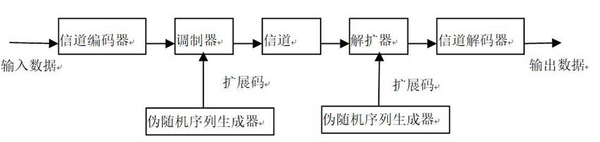
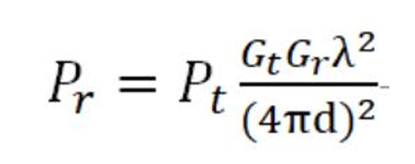

# 无线通信与网络仿真技术基础

## 1. 无线电频谱

由于电磁波在空间传播时存在天然的易干扰性，若缺乏严格的行政管理与技术划分，现代通信将陷入无序的混乱。

因此，频谱管理不仅是技术活，更是全球无线通信赖以生存的前提。

**核心特性评估：**

- **有限性：** 虽然频谱跨度广，但具备优良传播特性的可用频段在物理上是极其有限的。
- **排它性：** 在特定的时间、空间及频域维度内，一旦某个频率被占用，其使用权具有排它性。
- **复用性：** 结合地理隔离、编码技术或极化手段，同一频率可在互不干扰的前提下重复利用。
- **非耗尽性：** 频谱不会因频繁使用而磨损或枯竭，它永远存在于物理空间中。
- **传播性：** 电磁波跨越国界与行政区域，其质量高度依赖自然物理环境（受大气、遮挡等影响）。
- **易干扰性：** 任何电磁辐射都可能成为潜在干扰源，必须通过技术手段实现物理层的正交隔离。

**频谱划分与 ISM 频段：** 国际电信联盟（ITU）将频谱划分为12个频段，现代无线通信的核心活动主要集中在第4至第12频段。

| 序号 | 频段名称     | 频率范围         | 波段名称       |
| ---- | ------------ | ---------------- | -------------- |
| 4    | 甚低频 (VLF) | 3kHz ~ 30kHz     | 甚长波         |
| 5    | 低频 (LF)    | 30kHz ~ 300kHz   | 长波           |
| 6    | 中频 (MF)    | 300kHz ~ 3000kHz | 中波           |
| 7    | 高频 (HF)    | 3MHz ~ 30MHz     | 短波           |
| 8    | 甚高频 (VHF) | 30MHz ~ 300MHz   | 超短波         |
| 9    | 特高频 (UHF) | 300MHz ~ 3GHz    | 分米波（微波） |
| 10   | 超高频 (SHF) | 3GHz ~ 30GHz     | 厘米波（微波） |
| 11   | 极高频 (EHF) | 30GHz ~ 300GHz   | 毫米波（微波） |
| 12   | 至高频       | 300GHz ~ 3000GHz | 丝米波（微波） |

**深度解析 ISM 频段：** ISM（工业、科学、医疗）频段是免许可证的“开放区”。其中，**2.4GHz 频段**因全球通用性而成为 WiFi、蓝牙等技术的主战场。虽然使用免费，但必须遵循发射功率限制（通常小于 1W），且严禁对授权频段产生有害干扰。

**管理机构职能：**

- **FCC（美国联邦通信委员会）：** 管理全美及进出口的无线电、卫星、电缆业务，所有进入美国市场的数字产品均须通过其认可。
- **中国无线电管理局：** 依据《无线电管理条例》执行职能，涵盖频率分配、台站布局规划、移动基站共建共享监管及电磁环境监测。

\--------------------------------------------------------------------------------

## 2. 无线传输介质与空间传播：无线电波

无线电通信的本质，就是利用**“电和磁的相互转化”**作为桥梁，通过**“调制和解调”**技术，让无形的电磁波替我们在空气中传递数据

> 具体定义：自由空间传播的射频频段电磁波，基本原理是导体中**电流强度改变**会产生无线电波。 可通过调制将信息加载于无线电波中。电波通过空间传播到达接收方时，电波引起电磁场变化又会在导体中产生电流。再通过解调将信息提取出来，即实现信息传递

无线传输空间：**地球大气层和外层空间**

无线传输介质，传输介质指数据传输系统中发送方和接收方之间**物理路径**

**1. 传输介质的两大基本分类**

- **导向传输介质（有线通信）**：依赖物理线路引导信号，如双绞线、同轴电缆、光纤和电力线等。
- **非导向传输介质（无线通信）**：利用自由空间传播的射频电磁波（如无线电波）。其本质是通过**调制**将数据加载到电波中发射，接收方再通过**解调**提取出信息。

非导向传输介质，**主要分为微波和红外线**

- **微波通信（300MHz ~ 300GHz）** 微波的波长短、频率高，其最重要的物理特性是**视距直线传播 (LOS)**，遇到障碍物会被阻断或反射。它的损耗随距离的**平方**变化，且在下雨天（特别是高于10GHz频段）衰减会明显增大
  - **视距（LOS）通信与微波特性：** 微波主要依靠直线视距传输。受地球曲率影响，天线的**“高度”**是决定覆盖半径的关键。在工程实践中，将天线建在山顶或高塔上，本质上是为了克服物理屏障，扩展 LOS 范围。
  - 又分为地面微波和卫星微波
  - 微波传输主要损耗源于衰减。
  
- **红外线通信**

  - **特性**：将不可见的红外线集中成窄光束进行发射，传输距离严格限制在视线范围内。
  - **核心优势**：因为光束极窄且不出视线，所以**保密性极强**（极难被截获）；同时它使用的是光波，**几乎免疫任何电磁和人为干扰**。设备通常小巧廉价。
  - **应用建议**：在无法铺设网线，且因为保密需要不敢使用容易暴露的无线电波时，红外线通信是最佳的替代方案。

---

## 路径损耗、衰落与多径效应

电磁波与物理世界的交互（反射、绕射、散射）构成了复杂的信号环境

通信损耗：衰减和衰减失真、自由空间损耗、噪声、大气吸收、多径、折射等。

- **衰减与衰减失真**：信号随距离增加而变弱。麻烦的是，高频信号衰减得比低频快，这就导致接收到的信号不仅弱了，还“变形”（失真）了。通常用放大器或中继器来解决。
- **自由空间损耗**：电波像吹气球一样向外扩散，离得越远，单位面积接收到的能量就越低（随距离平方衰减），这是卫星通信面临的主要损耗。
- **噪声干扰**：*热噪声*：设备温度引起的白噪声，无法消除。*互调噪声*：不同频率信号共享介质产生了新频率，干扰原信号。*串扰噪声*：不同信号路径间融合，相邻双绞线间电子耦合产 生。。*脉冲噪声*：打不规则脉冲或短时噪声尖峰，振幅较高，对数字通信（0和1）破坏极大。
- **大气吸收**：空气中的水蒸气（22GHz附近）和氧气（60GHz附近）会像海绵一样吸收特定频率的电磁波能量。
- **折射**：大气层密度变化会导致电磁波向下弯曲偏离原路线，导致接收端收不到直线波。

衰落：传输介质或路径改变引起接收信号功率随时间变化

**移动环境下的多径传播 (Multipath)**：反射、散射和衍射。

| 现象                   | 触发条件           | 物理表现                                                     |
| ---------------------- | ------------------ | ------------------------------------------------------------ |
| **反射 (Reflection)**  | 障碍物尺寸大于波长 | 波在巨大表面（如地面、墙面）反弹，常伴随 180^\circ 相移。    |
| **绕射 (Diffraction)** | 障碍物边缘尖锐     | 波沿着边缘弯曲，使信号能“绕过”障碍物到达阴影区。             |
| **散射 (Scattering)**  | 障碍物尺寸 < 波长  | 信号打在大量细小障碍物（路灯柱、交通标志、树叶）上，分解为多路弱信号。 |

上述的“多径传播”，接收端会收到同一信号在不同时间到达的多个“副本”。这些副本叠加在一起，会导致信号功率随时间发生剧烈波动，这就是衰落

**衰落分类：**

- **快衰落：** 在波长一半的量级内（空间变化），信号强度发生 20~30dB的急剧波动。
- **慢衰落：** 在长距离移动过程中，由于穿过不同地形，接收信号平均功率产生的缓慢波动。

此外还有**平坦衰落**（信道对所有频率成分损失相同）、**频率选择性衰落**（针对特定频率衰落严重）

环境损耗因素：

- **雨水吸收：** 雨滴直径与高频波长相近时（相干波长），能量被大量吸收。
- **材质阻隔：** 承重墙（混凝土、钢材）是 WiFi 信号的“杀手”；玻璃、木材影响较小。
- **树木衍射：** 茂密叶片缝隙若与波长匹配，会产生类似“小孔成像”的散射作用。

### 三大衰落原理与能量损耗

#### (1) 自由空间路径损耗 (Path Loss) 

信号能量随距离增加呈非线性指数级衰减。

- **公式：** $L = 10 \log_{10} (\frac{4\pi d}{\lambda})^2$。
- **物理含义：** 能量随距离的平方成反比。距离翻倍，强度减至 1/4。*λ*=*c*/*f* ，其中 *c*  为光速，*f*  为频率；同时频率越高（波长越短），损耗越大。频率每增加一倍，损耗同样增加约 6 dB

#### (2) 多径效应 (Multipath Effect)

信号遇到障碍物发生散射/反射，导致多个副本（Copy）在不同时间到达接收端并相互干扰。

- **工程意义：** 提取前 **6 个** 路径信号通常已包含发射能量的 **96%**，足以通过算法还原数字信号。

#### (3) 多普勒效应 (Doppler Effect) 

收发端快速相对运动（如高铁环境）产生频率偏移，对通信数据具有破坏性。

#### (4) 衰落分类辨析（必考概念）：

- **快衰落 vs 慢衰落：** 指信号强度随时间或空间变化的剧烈程度。
- **平坦衰落：** 整个信号频带内衰减一致。
- **频率选择性衰落：** 由多径效应引起，不同频率成分衰减不同。

---

## 调制与扩频技术：信号的“抗干扰包装”

### **调制 (Modulation)** 

基带信号由于包含直流分量且频率较低，无法直接发射。**调制**过程相当于将信息加载到高频载波这辆“快车”上，通过改变其幅度、频率或相位来实现传输。

- 调制指将输入信息变换为适于信道传输形式。
- 信号源信息通常包含直流分量和频率较低频率分量，称为基带信号

而调制过程改变高频载波即信息载体信号的幅度、 相位或频率，使其随基带信号幅度而变化。相反解调过程则将基带信号提取出来，接收方正确处理。

常用调制方式：模拟、数字、脉冲

**调制的核心维度与分类** 对一个波进行改变，只能从它的三个基本维度入手：**振幅 (Amplitude)、频率 (Frequency)、相位 (Phase)**。

**模拟调制**：处理连续信号，如电台的调幅(AM)、调频(FM)、调相(PM)。

**数字调制（键控 SK）**：处理数字信号（0和1），包括振幅键控(ASK)、频移键控(FSK)和相移键控(PSK)

- **相移键控 (PSK)**：尤其是 **BPSK (二相相移键控)**。它利用相位的切换来代表数字，例如用 0° 相位代表 1，180° 相位代表 0。它的抗干扰性强，在衰减信道中效果很好。
- **正交调幅 (QAM)**：这是 WiFi 中极常用的高级技术。它**同时改变载波的幅度和相位**（即星座图的概念），从而在一个周期内传输更多的比特位。它通过两个相位相差 90° 的正交载波（I 和 Q 信号）混合发射，接收端再利用正交特性将其无干扰地分离提取

### **扩频 (Spread Spectrum, SS)** 

**扩频通信 (SS)：** 扩频通过牺牲带宽换取极高的免疫力与安全性。

扩频技术将原本较窄的基带信号频谱强行拓宽，使其占用远高于实际需求的带宽。

三大巨大优势：**对多径失真等噪声具有极强免疫力、能够隐藏和加密信号（接收方必须有对应的扩频码才能解密）、允许多个用户共享同一频带且几乎无干扰**。

**跳频扩频 (FHSS)**：**原理**：发送方根据特定的扩频码序列，让载波的频率在多个信道之间不断高速跳变。**效果**：发送方的广播看似是随机频率，接收方同步跟着跳跃接收。窃听者或干扰源只能捕捉或干扰到某一个瞬间的频带（只能听到杂音），从而实现抗干扰。**蓝牙技术**就是使用的 FHSS。

**直接序列扩频 (DSSS)**：**原理**：使用一个带宽很宽、码率极高的伪随机序列（扩频码），在发送端直接与原始数字信号进行异或（XOR）运算，把信号在频域上直接“变胖”拓宽。**效果**：原始信号的每一位在传输中变成了多个“码片”。接收端用同样的伪随机序列再做一次运算（解扩），就能还原信息。早期的 **WiFi (802.11b)** 就是使用的 DSSS 技术

\--------------------------------------------------------------------------------

## 复用与多址技术：信道的“交通规则”

 “复用”侧重于点对点链路的容量提升，“多址”则侧重于多点间的正交接入。**本质是一样的：都是“信号分割”**

**复用 (Multiplexing)**：强调的是**“两点之间”**。在一条点对点的信道中，同时传输多个互不干扰的信号

**多址 (Multiple Access)**：强调的是**“多点之间”**。覆盖区域内，如何让多个不同地点的用户同时进行多边通信而互不干扰

其本质是为每个信号分配一个独立的物理特征标识（地址）。

| 接入技术 | 核心逻辑 | 资源分割维度                               |
| -------- | -------- | ------------------------------------------ |
| **FDMA** | 频带切分 | 将频率划分为互不重叠的子频带。             |
| **TDMA** | 时隙占用 | 用户按序轮流占用整个频带的时隙。           |
| **CDMA** | 码片分割 | 用户共享频带，通过互相正交的码片序列区分。 |

1. FDMA (频分多址) —— “划分不同的车道”
   - **原理**：将整个宽阔的传输频带，切分成若干个较窄且互不重叠的“子频带”，用户分配一个固定的子频带通信。
   - **特点**：为了防止相邻频带互相干扰（串扰），子频带之间必须留有一定的警戒频带。
2. TDMA (时分多址) —— “排队按时间叫号”
   - **原理**：给定一个频带，把传递的时间切分成许多极短的“时隙（Slot）”。各个用户按照顺序，在属于自己的那个时隙内，以突发脉冲的方式高速发送和接收信号。
   - **特点**：大家都在同一条“宽带”上，但靠着极快的时间差错峰出行。
3. CDMA (码分多址) —— “同声传译，各听各的密码”，也称“扩频多址(SSMA)”
   - **原理**：**直接序列扩频 (DSSS)**的升级应用！发送方用一个带宽极高的伪随机码（扩频码）去调制原始信号。
   - **特点**：在 CDMA 中，不同的用户被分配了**互相正交（互不相关）的码片序列**。这意味着所有人都可以**在同一时间、占用同一频带**大声说话，但因为彼此的“密码本”是正交的，接收方只要用对应的密码本去解扩，就能把目标信号还原，而把其他人的信号当成普通背景白噪声滤掉。
4. SDMA (空分多址)
   - **原理**：利用**空间的物理特征**（如用户所在的不同位置）来区分用户。
   - **特点**：通常配合**定向天线**或窄波束天线，让电磁波只照向特定方向的有限距离。不同方向的波束就可以**重复使用相同的频率**，极大地提高了频谱利用率。

**现代高阶接入方案：**

- **OFDMA：** 在 OFDM 的基础上，允许不同用户共享同一符号内的不同子载波。其核心价值在于获得了**多用户分集增益**，确保每个用户都处于其信道条件较好的子载波上。
- **NOMA（非正交多址）：** 5G 关键技术。它在子信道内（仍基于 OFDM）主动引入干扰，通过功率域复用，接收端利用 **SIC（串行干扰删除）** 接收机按功率大小依次剥离信号。

---

## 天线技术与现代前沿演进

无线通信系统的外界传播介质接口，其参数直接决定了无线网络的边界。一旦逻辑比特流通过复用映射到物理资源，最后一步便是通过天线接口进行电磁转换。

天线的本质是**“转换器”**：发送时把电流变成电磁波，接收时把电磁波变回电流。

**天线关键指标：**

- **增益：** 能量集中的程度，增加增益可扩大特定方向的覆盖范围。
- **方向图：** 天线辐射电磁场在固定距离上随角坐标的分布图形。包含主瓣（覆盖区）与旁瓣（干扰源）。
- **极化：** 电场矢量的指向。若收发天线极化不匹配（如垂直对水平，即正交），能量投影为零，信号将彻底中断。天线可能在非预定极化方向产生辐射，称为**交叉极化 (Cross-polarization)**。所以**接收天线的方向必须与发射波的极性相匹配**。

**弗里斯功率传输方程 (Friis Equation)**：

发射天线功率是Pt，发射天线 增益是Gt，接收天线增益是Gr，工作波长为λ，收发天线之间距离为d，根据弗里斯功率传输方程， 接收天线功率Pr为：

同时为了对抗衰落有三大技术

1. 天线分集 (Diversity) —— “不要把鸡蛋放在一个篮子里”

   **痛点**：多径效应会导致接收点出现“深衰落”（信号全军覆没）。**原理**：利用多根天线，在**空间、时间、频率或极化**等不同的信道上，接收同一个信号的多个独立副本。**效果**：因为不同副本同时发生深衰落的概率极小，接收机把这些副本“合并”起来，就能极大提高接收的灵敏度和可靠性。

2. 波束赋形 (Beamforming) —— “从‘大喇叭广播’到‘精准手电筒’”

   **原理**：利用天线阵列，通过数学算法精确调整各个天线单元发射信号的**幅度和相位**。**效果**：让多根天线发出的电磁波，刚好在目标用户的位置发生**相干叠加（信号增强）**，而在其它干扰方向上相互抵消。这不仅克服了空间损耗，还极大地降低了用户间的干扰。*（注：波束赋形是“智能天线”和 5G 通信的核心底层技术。）*

3. MIMO (多入多出技术) —— “拓宽信息高速公路”

   **原理**：全称 Multiple Input Multiple Output。发射端和接收端**同时使用多根天线**进行通信。**核心价值**：它化敌为友，巧妙地**利用了多径效应**！通过“空间复用”和“空时编码”，不仅能抑制衰落，还能在不增加频谱带宽的情况下，成倍地提高数据传输速率。**演化**：它是从 4G 到 WiFi 6/5G 的绝对核心技术（从单天线演进到了复杂的阵列天线）。

**前沿技术简述：**

- **认知无线电 (CR)：** 寻找**“频谱空洞”**（已分配但暂未使用的频率）。其机制包括“能量检测”与基于地理环境的**“干扰温度检测”**。
- **智能反射表面 (RIS)：** 通过可编程的超材料表面操纵电磁环境，改变波的相位与反射路径。
- **可见光通信 (VLC)：** 使用380-780nm光谱可见光进行短距离无线通信，通过可 调强度可见光源传输数据。

