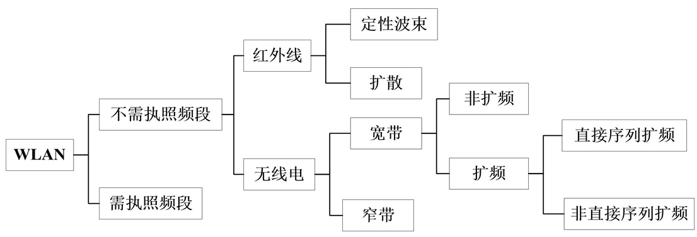
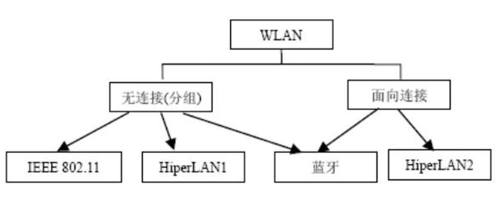
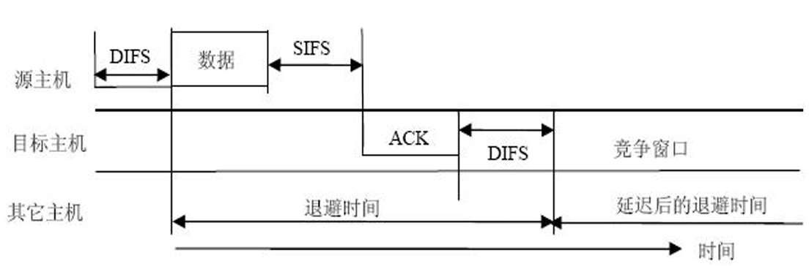

# 无线局域网 (WLAN) 

无线局域网（WLAN）在受限地理区域内实现了高效的无线连接。物理层的不可变性决定了上层协议设计的逻辑边界。

## 无线局域网概述与战略定位

WLAN 的本质是利用无线介质实现终端主机的互联。通常指采用无线传输介质的计算机局域网

它将计算机网络的“资源共享”属性与无线通信的“移动便捷”属性相结合。

**WLAN 的优劣势对比分析：**

| 特性维度           | 表现 (优点/局限性)     | 物理逻辑简析                                     |
| ------------------ | ---------------------- | ------------------------------------------------ |
| **移动性与灵活性** | 极高（摆脱物理束缚）   | 电磁波在自由空间传播，无需布线。                 |
| **可伸缩性**       | 极佳（部署成本低）     | 增加 AP 即可扩展覆盖，无需破坏建筑结构。         |
| **可靠性**         | 较低（易丢包、波动大） | 无线环境开放，受干扰、多径衰落影响严重。         |
| **安全性**         | 脆弱（易被窃听）       | 信号呈球形广播，无精确物理边界。                 |
| **系统容量**       | 受限（带宽共享）       | 信道具有排他性，用户增多导致信噪比与吞吐量下降。 |

无线局域网（WLAN）的两种核心分类方式：**按频段分类**和**按业务类型分类**，以及按网络拓扑和应用要求 

- **按频段（及传输技术）**：**需执照频段 (Licensed)**和**不需执照频段 (Unlicensed)**：即我们前面学过的 **ISM免费频段**（如2.4GHz、5GHz）

  

- 基于网络层和数据链路层的通信逻辑，决定了网络是更适合传“普通数据”还是“音视频流”

  **无连接 / 分组**不需要事先建立端到端的专有连接，数据被切分成一个个“分组（包）”独立发送，尽力而为。

  **面向连接**发送数据前，必须先在收发双方之间建立一条逻辑上的“专有通道”。

  

- 根据网络拓扑和应用要求，分为对等、基础架构、 接入、中继等

- WLAN应用分室内和室外两类；或者三种应用目的： 接入，网络无线互联，定位

## WLAN 组成要素与拓扑架构，核心服务

- **核心组件：** 站 (STA)、无线接入点 (AP)、分布式系统 (DS)、无线介质 (WM)。
- STA即终端，AP则是基站

此外**覆盖区域范围称服务区(SA)**，移动站无线收发信机及地理环境确定的通信覆盖区域称**基本服务区 (BSA)或小区(Cell)，是网络最小单元**。一个BSA 内相互联系、相互通信一组主机组成基本服务集 (BSS)。 

**服务集架构对比：**

| 架构类型             | 定义与逻辑关系                                               |
| -------------------- | ------------------------------------------------------------ |
| **基本服务集 (BSS)** | 网络最小单元，由一个 AP 及其覆盖范围内的 STA 组成，拥有唯一 **BSSID**。 |
| **扩展服务集 (ESS)** | 通过 DS 互连的多个 BSS 组成，逻辑上属于同一个 **ESA**，范围可达数千米。 |

**BSSID 与 SSID**：SSID 是无线网络的逻辑名称，BSSID 用于在底层区分不同的 AP 实体；同一重叠区域内不能出现同名的独立 AP，否则会引发命名冲突导致网络瘫痪。

- 拓扑分类：
  1. **分布对等式拓扑（Ad-Hoc / IBSS）**：典型的“去中心化”，不需要任何 AP 基站，设备与设备之间直接点对点通信
      - **Ad-hoc 自组网：** 去中心化、按需构建。常用于车联网 (V2V) 防碰撞及**无网络环境下的工厂机器人协作**。

  2. 基础架构集中式：以 AP 为中心。所有通信必须由 AP 转接

     - **特点：** 站点通信须经 **源站→AP→目标站** 的两跳过程，增加延迟。
     - **优缺点：** 可管理性与可伸缩性强；但存在单点故障风险（AP 损坏则全网瘫）和两跳时延

**WLAN 的两套核心服务（STA 服务与 DS 服务）**

- **STA 服务（管“进门”与“保密”）**

  **认证 (Authentication)**：因为无线网没有物理网线，所以必须先验证身份才能连接。**保密 (Privacy)**：空气介质谁都能监听，所以强制要求采用 WEP、WPA 等加密机制，防止数据被窃听。**解除认证 (Deauthentication)**：终止连接。

- **DS 服务 / DSS（管“找人”与“漫游”）**

  **关联 (Association)**：一个 STA 接入网络前，必须先“挂靠”到一个特定的 AP 上，DS 根据这个映射表来分发消息。任一瞬间，一个手机只能关联一个 AP。**重新关联 (Reassociation)**：当您拿着手机从一楼走到二楼（跨越不同 AP 的覆盖区）时，触发的“漫游切换”过程。**分布 (Distribution) 与 集成 (Integration)**：负责在庞大的 ESS 内部找人，或者将无线数据转换发送到外网的有线局域网（集成）中。

## IEEE 802.11MAC层

提供可靠数据传输。MAC帧交换协议保障无线 介质上的数据传输可靠性。

共享介质访问的公平控制，通过两种访问机来实现：

- 基本访问机制，即分布式协调功能 (DCF)；
- 集中控制访问机制，即点协调功能 (PCF)。

安全服务具体使用WEP等保护数据传输。

###  DCF（分布式协调）

- DCF是基础协议，核心是**载波监听多路访问/冲突避免** (CSMA/CA)，包括载波检测、帧间间隔和随机退避。
- 自组织网和基础架构网中超帧的竞争期使用，支持异步服务
- 每个节点使用CSMA分布接入算法，各站竞争信道使用。

为避免冲突，MAC子层规定所有站完成发送后必须等待一个短时间(继续监听)才能发送下一帧，该时间称为帧间间隔(InterFrame Space，IFS)。 

DCF有两种工作模式：**CSMA/CA和RTS/CTS**

#### IEEE 802.11：4种IFS

用“等待时间”划分特权 —— 四大帧间间隔：为了避免冲突，系统规定：**信道一旦空闲，谁都不能立刻抢，必须先等一小段时间 (IFS)**。在这个机制里有一个铁律：**等待的时间越短，你的优先级就越高！**

四种 IFS 的时间长度关系为：**SIFS < PIFS < DIFS < EIFS**。

1. **SIFS (短 IFS - 最优先)**：时间最短，特权最高。它专门留给**不能被打断的紧急通信**，比如接收方回复 `ACK 确认帧`、或者 `CTS 清除发送帧`。因为等得极短，别人还没反应过来它就发出去了，成功防止被“插队”。
2. **PIFS (PCF IFS - 次优先)**：等于 SIFS + 1个时隙。这是专门给 AP（路由器）在 PCF（无竞争轮询）模式下使用的。这保证了中心路由器总是比普通手机/电脑能更快抢到信道。
3. **DIFS (DCF IFS - 普通优先级)**：等于 SIFS + 2个时隙。这是普通设备在正常发送**普通数据报文**时，必须熬过的基础等待时间。
4. **EIFS (扩展 IFS - 惩罚期)**：时间最长。如果设备刚才收到了一个**出错的烂帧**，它就会被关“小黑屋”，必须等待最长的 EIFS 时间才能发下一帧。这既是惩罚，也是为了给网络重新同步留出时间。

#### CSMA/CA 工作全流程

普通终端（手机、电脑）在 DCF 模式下发数据的标准流程

1. **听信道 (载波侦听)**：发包前必须先“听”信道是否干净，确认没人说话。通过虚拟载波侦听(VCS)读取别人报头里的“占用时间”字段NAV，而物理载波侦听(PCS) 即检测电磁信号强度
2. **等 DIFS**：信道空闲后，普通数据必须先老老实实等完一个 `DIFS` 的时间
3. **掷骰子 (随机退避)**：等完 DIFS 还不能直接发！为了防止几个人同时等完一起发造成严重撞车，每个人必须在竞争窗口（**CW**min 到 **CW**max）里随机抽一个数字（**退避间隔 BI**）进行倒数。信道空闲就减1，信道被抢就冻结。谁先倒数到 0，谁就发包，同时**一旦开始发送，就必须一口气发完**，中途绝不能被打断
4. **拿回执 (ACK 确认)**：接收方收到数据后，经过极短的 `SIFS` 时间，必须立刻回传一个 `ACK`。因为 SIFS 时间最短，拥有绝对的最高优先级，防止了其他设备在这个间隙插队
5. **撞车惩罚 (CW 加倍)**：如果在规定时间内没收到 ACK，说明在空中撞车了！此时系统会实施惩罚：让该设备的**竞争窗口 (CW) 上限直接翻倍**，然后再重新“掷骰子”。窗口变大，抽到大数字的概率增加，从而强行把大家的发送时间错开，减少再次冲突的概率。

***一听（PCS/VCS） -> 等一等（DIFS） -> 掷骰子（CW中随机抽BI倒数） -> 发数据 -> 等一瞬（SIFS） -> 拿回执（ACK） -> 没回执就惩罚（CW加倍重传）***

#### RTS/CTS（请求发送/清除发送）预约机制

RTS/CTS 就是专为**“运送超大件包裹”**和**“解决隐藏节点问题”**而设计的**VIP专属信道预约服务**。

1. **第一步：RTS（请求发送，Request to Send）**

   **动作**：站 A 在等完 DIFS 且倒数结束后，不直接发真实数据，而是先向站 B 发送一个 RTS 信号，包括持续时间等

2. **第二步：CTS（清除发送，Clear to Send）**

   **动作**：站 B 收到 RTS 后，向**周围所有节点**广播一个 CTS 信号。**全体静音（更新NAV计时器进入静止态）**

3. **第三步：DATA（数据传输）**

   **动作**：A 收到 CTS 后，立刻开始发送真正的长数据报文。由于周围其他站都在“静止态”，所以绝对安全，不会撞车。

4. **第四步：ACK（确认接收）**

   **动作**：B 完整接收数据后，向周围广播 ACK 确认帧

**RTS与CTS的帧结构小**避免大量额外开销

> [!note]
>
> RTS/CTS 的适用场景与“阈值”概念（防坑指南）**是不是所有通信都要用四次握手？**
>
> **绝对不是！** 就像您寄一封普通的信（短报文），直接丢进邮筒（普通 CSMA/CA）就行了，不需要专门雇个保安去前面开路（四次握手），否则开路的成本比送信本身还高。
>
> **RTS 阈值（Threshold）**：在实际的路由器中，会设定一个字节大小的阈值。**只有当要发送的数据包长度大于这个阈值（通常是大文件），或者网络中冲突极其严重（隐藏节点多）时，系统才会启动 RTS/CTS 机制**。如果是短报文，RTS/CTS 带来的额外开销反而会严重拖慢网速。

#### DCF 工作全流程

分布式协调功能 (DCF) 解决了无线信道的排他性访问问题：

1. **物理载波监听 (CCA)：** 侦听电磁场能量，低于阈值（如 -82dBm）则视为空闲。
2. **虚拟载波监听 (NAV)：** 读取报头中的 Duration 字段并更新 NAV 计时器，期间静默。
3. **等待帧间间隔 (IFS)：** 空闲后需等待 **IFS**（如 DIFS/SIFS，不同帧优先级不同）。
4. **随机回退 (Backoff)：** 从竞争窗口 (CW) 抽取随机数，乘以 **Slot Time** 开启倒计时。
5. **计时器冻结 (Freeze)：** 倒计时仅在信道空闲时递减；若被占用，计时器立即冻结，待空闲并过 IFS 后继续。
6. **发送与重传：** 归零时发送。若未收到 ACK（冲突），则将 CW 窗口上限翻倍（CWmin 至 CWmax），重新开始。

> [!tip]
>
> **EDCA（增强型分布式信道访问，Enhanced Distributed Channel Access）** 是 **IEEE 802.11e** 标准中专门为了支持 **QoS（服务质量）** 而对传统 MAC 层协议进行的重要改进
>
> **EDCA 的出现就是为了打破DCF绝对公平，给音视频等对时延敏感的业务赋予“VIP 抢占特权”**
>
> 将数据分为 **4 类优先级：音频（Voice）、视频（Video）、尽力而为（普通数据）、背景流（如后台下载）**。核心规则非常简单：**优先级越高，系统分配给它的等待时延就越小**
>
> 1. 用 AIFS 代替 DIFS (不等长起跑线)
>
>    在 EDCA 中，发包前等待的时间改成了 **AIFS（仲裁帧间间隔，Arbitration IFS）**。**特权体现**：AIFS 的值是根据业务类型动态变化的。**高优先级业务（如实时多媒体）的 AIFS 值非常小，而低优先级业务的 AIFS 值大**
>
> 2. **差异化的竞争窗口 CW (作弊骰子)**
>
>    高优先级业务被分配的**起始竞争窗口（CWmin）和最大竞争窗口（CWmax）都要比普通业务小得多**,。
>
> 

### 点协调功能 (PCF)

 DCF（分布式协调）是“大家凭运气掷骰子抢信道”，那么这里的 PCF 就是**“由 AP 充当交警，大家排队按名字叫号”**

PCF 是一种**集中式协调**的信道接入机制，它的绝对核心是路由器（AP）

1. **建立无争用周期 (CFP)**：AP 中的点协调器会周期性地建立一个“无争用周期 (CFP)”。在这个周期内，大家不需要去竞争抢信道，一切由 AP 说了算。
2. **利用 NAV静默设备**：在 CFP 期间，AP 会向周围所有节点发送信号，强制将所有邻近站点的 **NAV（虚拟载波监听闹钟）**直接设定为 CFP 的最大期望时长。这就等于强制让所有普通设备进入“静默等待”状态。
3. **特权等待时间 (利用 PIFS)**： PCF 机制使用的帧间间隔，**小于**普通设备在 DCF 模式下使用的帧间间隔（即我们上节课学的：**PIFS < DIFS**）。AP 等待的时间更短，所以能抢先截断普通设备的竞争，夺取信道控制权。

在 AP 控制了信道（进入 CFP 时段）之后就可以点名轮询即挨个**轮询**各个站点，询问“你有没有数据要发送？”。

站点只有在被 AP “点到名”的时候，才允许把自己的数据发出去，这就从根本上杜绝了数据在空中撞车的情况。

所以存在一些问题：**死板的等待机制**错过需等待，高延迟，**非常不利于时延敏感类型通信**

## IEEE 802.11 协议标准与演进

- **微波频段背诵区：** **300MHz - 300GHz**。对应分米波、厘米波、毫米波。

- **WiFi 标准演进表：**

  | 标准编号     | 商业名称   | 工作频段            | 最高理论速率 | 🌟 核心新增技术与特点解析                                     |
  | ------------ | ---------- | ------------------- | ------------ | ------------------------------------------------------------ |
  | **802.11**   | -          | 2.4 GHz             | 2 Mbps       | 初代微波和红外线标准，速率极低，奠定基础。                   |
  | **802.11b**  | **WiFi 1** | 2.4 GHz             | 11 Mbps      | 普及的第一代标准，但 MAC 层参数较大（CWmin=31，Slot=20μs），盲等时间长。 |
  | **802.11a**  | **WiFi 2** | 5 GHz               | 54 Mbps      | 转移至无干扰的 5GHz 频段；**MAC层参数优化**（CWmin=15，Slot=9μs），大幅提升发包效率。 |
  | **802.11g**  | **WiFi 3** | 2.4 GHz             | 54 Mbps      | 回归 2.4GHz 频段，引入 **OFDM** 技术，在拥挤频段实现高速率，向下兼容 802.11b。 |
  | **802.11n**  | **WiFi 4** | 2.4 / 5 GHz         | 600 Mbps     | 1. 首次引入 **MIMO (多入多出)**，利用空间分集成倍提速； 2. 引入 **帧聚合 (A-MSDU/A-MPDU)**，减少 ACK 确认帧数量，降低开销。 |
  | **802.11ac** | **WiFi 5** | 5 GHz               | 6.77 Gbps    | 1. **160MHz 超大带宽**（比11n大3倍）； 2. **256-QAM** 调制，每符号传8bit； 3. 引入 **下行 MU-MIMO** 和 **波束赋形 (Beamforming)**，可同时定向服务多个终端。 |
  | **802.11ax** | **WiFi 6** | 2.4 / 5 GHz         | 9.6 Gbps     | 1. 引入蜂窝网的 **OFDMA**，将信道划分为资源单元(RU)，改善密集用户并发体验； 2. **1024-QAM** 调制； 3. **上下行 MU-MIMO**； 4. **BSS颜色机制** 降低同频干扰； 5. **TWT (目标唤醒时间)** 助物联网节能。 |
  | **802.11be** | **WiFi 7** | 2.4 / 5 / **6 GHz** | 30 Gbps+     | 1. 新辟 **6GHz 频段**，最大带宽翻倍至 **320MHz**； 2. **4096-QAM** 调制； 3. **MLO (多链路操作)**，终端可跨频段(如同时连5G+6G)并发收发，极大降时延防冲突； 4. **MRU (多资源单元)** 与前导穿刺机制，提升抗干扰和频谱利用率。 |

  重点了解：

  | 子标准编号      | 专注领域            | 核心功能与应用场景                                           |
  | --------------- | ------------------- | ------------------------------------------------------------ |
  | **802.11e**     | **QoS (服务质量)**  | 引入了 **EDCA 机制** 和 AIFS，为数据流设置优先级，确保音视频多媒体的优先传输。 |
  | **802.11i**     | **安全防护**        | 针对无线网安全漏洞，弥补了 WEP 的不足，提供增强的安全加密机制。 |
  | **802.11p**     | **车联网 (V2X)**    | WAVE 标准，专门用于**车载环境的无线接入**，去除了繁琐的握手认证以满足极低时延要求。 |
  | **802.11s**     | **网状网络 (Mesh)** | 支持无线 Mesh 拓扑，包含拓扑学习、路由转发等，是多 AP 协同覆盖的基础。 |
  | **802.11ad/ay** | **毫米波 (60GHz)**  | 采用 60GHz 高频，速率可达 7Gbps~20Gbps，但绕射能力极差，仅限**单个房间内（5米左右）的高清音视频传输**。 |
  | **802.11ah**    | **物联网 (IoT)**    | 采用 **低于1GHz** 频段，牺牲速率（100kbps）换取 **长达 1km 的穿墙覆盖**，单 AP 支持上千设备，适合智慧城市。 |

> 802.11a 为什么比 802.11b 快？
>
> 从 MAC 层的参数来解释：
>
> - **802.11b 的参数**：起始竞争窗口（CWmin）为 **31**，时隙（Slot Time）为 **20微秒**。
> - **802.11a 的参数**：起始竞争窗口（CWmin）大大缩减为 **15**，时隙（Slot Time）缩减为 **9微秒**。
>
> **结论**：因为 802.11a 抽取的随机数基数更小，且每倒数一步的时间更短，这使得设备发包前的**盲等时间大幅减少，倒数更容易快速归零**，从而发包效率和整体网速远高于 802.11b。