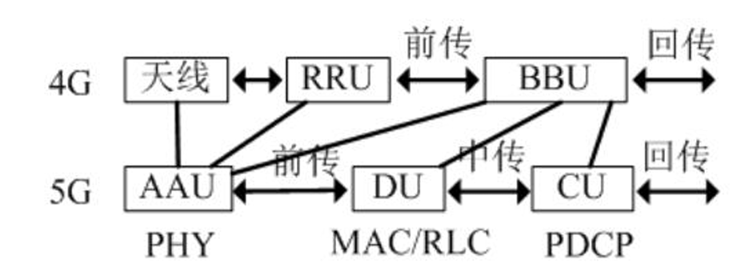
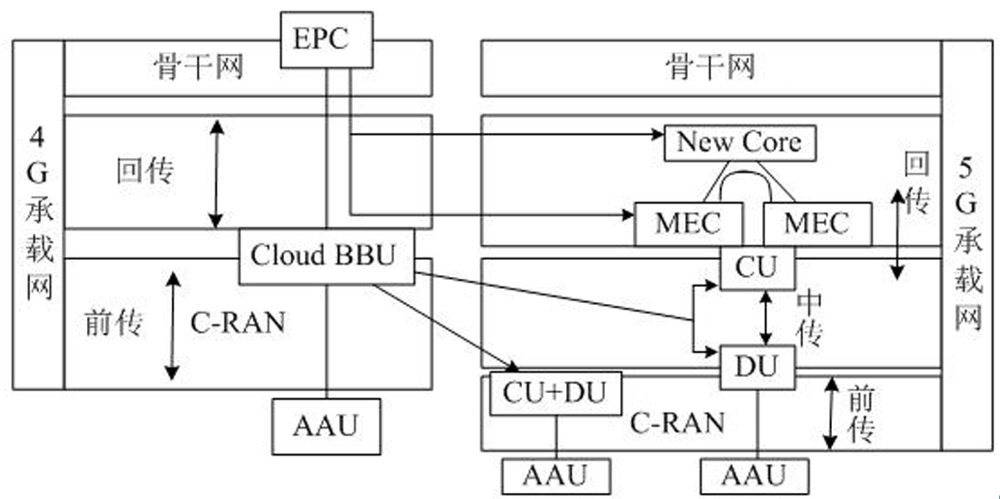

# 无线城域网与蜂窝通信技术

从局域网（LAN）的“短距离通信”跨越到城域与广域（WMAN/WWAN）“超远距离互联”的核心转折点。

本章将探讨无线网络如何通过精密的小区规划、频率复用以及复杂的干扰管理，在几十公里的尺度上支撑起现代数字社会的底座。

**“宽带接入”向“全连接移动通信”的逻辑纵深推进，涵盖以下六大核心板块：**

1. **IEEE 802.16 (WiMax)：** 曾经的“最后一公里”挑战者及其标准的兴衰。
2. **蜂窝移动通信原理：** 支撑千亿级连接的频率复用与物理干扰模型。
3. **2G与3G时代：** 数字化语音向移动多媒体的跨越。
4. **4G/LTE技术：** 移动宽带的全面爆发与技术统一。
5. **5G技术：** 超越连接，重构垂直行业的三大核心应用场景。
6. **6G技术展望：** 空天地海一体化的泛在连接蓝图。

---

### 无线城域网(WMAN)与IEEE 802.16 (WiMax) 标准

**标准对应**：**IEEE 802.16 = WMAN (无线城域网) = WiMAX**

IEEE 802.16（WiMax）设计的初衷是作为xDSL、电缆和光纤的无线替代方案，旨在解决“最后一公里”的宽带接入痛点。

WiMAX 简单粗暴地理解为一个**覆盖范围极大、功率极强的“超级 WiFi”**

#### IEEE 802.16无线工作特性

| 标准        | 覆盖范围 | 工作频率    | 移动性   | 业务定位                           | QoS支持 |
| ----------- | -------- | ----------- | -------- | ---------------------------------- | ------- |
| **802.16a** | 几公里   | 2~11GHz     | 无       | 个人用户游牧式接入                 | 支持    |
| **802.16d** | 几公里   | 211/1166GHz | 无       | 中小企业固定接入                   | 支持    |
| **802.16e** | 几公里   | < 6GHz      | 中低车速 | 个人用户宽带移动接入               | 支持    |
| **802.16m** | 几公里   | < 3.5GHz    | 高速     | 成为4G标准（WirelessMAN-Advanced） | 支持    |

可工作在频分双工或时分双工模式 

规定了两种调制方式：**单载波和OFDM**

#### 传输服务模式：视距(LOS)与非视距(NLOS)

- **非视距服务 (NLOS)：** 利用211GHz较低频段，信号可绕过障碍物，服务半径约610km。
- **视距服务 (LOS)：** 使用高达66GHz频率，通过屋顶天线实现视距连接。其优势在于发射功率极大（可达100千瓦，而WiFi仅100毫瓦）、信号极稳定，服务半径可达50km。

#### 终端接入模式

1. **固定/游牧：** 替代有线宽带。游牧模式下，终端在不同接入点间移动需重新连接。
2. **便携/移动：** 支持步行或60~120km/h的高速移动，其中“移动”模式确保TCP/IP会话在基站切换时不中断。

**标准对应**：**IEEE 802.20 = WWAN (无线广域网移动宽带接入标准)**

尽管技术领先，但WiMax最终被边缘化。从架构层面看，WiMax试图以一种类似“超强WiFi”的分布式形态挑战电信巨头，这严重触及了运营商收取流量费的核心利益。与此同时，3GPP主导的LTE获得了全球电信产业链的支持，且IEEE旗下的另一个广域网标准**IEEE 802.20**也因技术与市场原因在2011年陷入停滞，导致WiMax在5G时代已彻底销声匿迹。

---

### 蜂窝移动通信基础：物理原理与干扰管理

蜂窝系统通过将地理区域分割为“小区（Cell）”，每个小区由一 个小功率发射基站为本小区用户服务，利用**频率复用**解决了无线频谱稀缺的终极考题。

#### 频率复用与覆盖形态

- **区群（Cluster）：** 典型规模为4/7/12小区。相邻小区频率各异，而相距较远的非相邻小区（同频小区）可复用同一频率，极大提升了系统容量。
- **覆盖逻辑：** “带状覆盖”由定向天线构成，适用于铁路/河流；“面状覆盖”使用**全向天线**，理想状态为圆的内接正六边形，解决大面积陆地覆盖。

#### 【必考点】无线干扰的物理原理

无线网络工程的核心是与干扰作斗争。在考试中，你必须能够手写推导以下三种物理现象：

1. **自由空间衰落：** 电磁波在真空中随距离增加产生的能量自然扩散。
2. **阴影衰落：** 由障碍物阻挡导致的信号场强中值起伏（通常遵循对数正态分布）。
3. **多径效应：** 信号经多条反射路径到达接收端，因相位差异产生干涉，导致接收场强随位置剧烈波动的快衰落现象。

\--------------------------------------------------------------------------------

### 2G/3G/4G：移动通信的代际飞跃

#### 2G（数字时代）

1G使用的是纯模拟信号，极其容易被干扰和窃听；而 2G 全面引入了**数字化编码**，这带来了抗干扰能力的质的飞跃

在 2G 时代，世界上存在两大称霸全球的技术阵营

1. **GSM（全球移动通信系统）**

   **全球自动漫游**；**丰富的业务支持**（通话，短信）；**安全与组网**：加入了加密和鉴权功能（通信保密）

2. **窄带 CDMA（CDMA IS95）**

   CDMA 采用学过的**“无线扩频技术（Spread Spectrum）”**；所以**保密性极强、频谱利用率高、容量更大、掉话率更低**，**绿色环保**

#### 3G（数据时代）

3G 首次将**无线通信与互联网多媒体通信**真正结合了起来。具备了处理图像、音视频的能力，志着移动通信正式迈入了**“数据时代上网”**的大门。

1. **WCDMA （宽带CDMA）**

   GSM 网络的平滑升级版；由**中国联通**采用

2. **CDMA2000**

   窄带 CDMA (IS-95) 演进而来，因为可以直接升级，所以建设成本相对低廉；由**中国电信**采用

3. **TD-SCDMA （时分同步CDMA）**

   **中国首次自主制定**的国际移动通信标准；由**中国移动**采用

   **频谱利用率极高（单频段双向通信）**；**灵活支持不对称业务（完美契合互联网）**；**智能天线与联合检测技术**

#### 4G（全IP化高速时代）

 4G 网络最核心的底层架构变化：**全 IP 化网络**：4G 是基于 IP 协议的高速蜂窝移动网，网络结构分为物理网络层、中间环境层和应用网络层，各层接口开放，能提供无缝的高速数据服务

**两大 4G 国际标准**：**LTE-Advanced**：从 3G 演进而来，是现在全球绝对的主流。**WirelessMAN-Advanced (即 802.16m / WiMAX)**

LTE（长期演进）通过FDD（频分双工）与TDD（时分双工）双制式运行。

- **FDD-LTE（频分双工）**：在国际上应用最广泛。它需要两块对称的频谱，一块专门用来上传，一块专门用来下载。
- **TDD-LTE（时分双工，也叫 TD-LTE）**：在**我国占主导地位**。**中国移动**：作为主推者，拿到了大段的 TD-LTE 专属频段。**中国联通 / 中国电信**：采用混合组网，同时支持 TD-LTE 和 FDD-LTE。

*国家给运营商分配的频段是**断续切分组合的**，而不是一整块连续的大频段*

- LTE-Advanced 六大关键增强技术：
  1. **载波聚合 (CA)：** 将多个分散的载波（如5个20MHz）捆绑使用，大幅提升峰值速率。
  2. **高阶MIMO：** 下行支持8x8多天线阵列，通过空分复用成倍提升频谱效率。
  3. **智能中继 (Relay)：** 使用无线回程的微基站，只放大信号不放大干扰，解决覆盖盲区。
  4. **异构网络 (HetNet)：** 宏基站与微/皮/飞基站多层嵌套，提供泛在服务。
  5. **协调多点发送 (CoMP)：** 多基站协作，将小区边缘的干扰转化为有用信号增益。
  6. **干扰管理：** 通过基站与终端协同的动态功率控制，优化系统负载均衡。
- 4G的数据帧结构是网络的“心跳”。无线帧时长**10ms**，包含2个半帧；每半帧含5个子帧；子帧则由0.5ms的时隙组成。

---

### 5G技术：从“连接人”到“连接万物”

**5G NR (新空口)**，由 3GPP 制定（从 Release 15 标准开始），包含 **NSA（非独立组网）**和 **SA（独立组网）**两种模式

#### 三大应用场景与需求指标

1. **eMBB (增强移动宽带)：** 速率提升10倍以上，满足高清视频与AR/VR需求。
2. **mMTC (大规模机器类通信)：** 支持每平方公里100万个连接，支撑智慧城市建设。
3. **uRLLC (超可靠低时延通信)：** 用户面时延低至0.5ms，针对自动驾驶与远程医疗。

#### 组网模式与标准演进

5G定义了两种极其重要的组网模式：

- **NSA (非独立组网)**：过渡方案。利用原有的 4G 核心网来做控制和移动性管理（即“锚点”），再增加 5G 的基站来传输高速数据。这是全球 5G 早期商用的主要模式。
- **SA (独立组网)**：终极形态。使用全新的 5G 核心网和基站，全面支持网络切片和 eMBB/mMTC/uRLLC 三大场景

#### 基站

为了克服 5G 高频段（Sub 6G 和毫米波）穿透力差、覆盖距离短的物理缺陷，形成了按功率和覆盖范围划分的四大基站

- **宏基站 (Macro Cell)**：绝对的主力，安装在室外高大铁塔上，功率在几十瓦级别，负责大片区域的基础覆盖。
- **微基站 (Micro Cell)**：功率几瓦，主要安装在楼宇密集区或街道灯杆上，作为宏基站的深度覆盖补充。
- **皮基站 (Pico Cell)**：功率仅几百毫瓦，极其小巧，专门用于商场、机场等室内公共区域的盲区覆盖和热点容量增强。
- **飞基站 (Femto Cell)**：家用级别，功率和我们家里的 WiFi 路由器相近（几十毫瓦），主要解决家庭或小微企业的死角问题

#### 接入网和核心网架构

**网络切片 (Network Slicing)**：在同一物理网络上，通过参数配置虚拟出多个逻辑网络，分别专门服务于大带宽、低时延或海量连接等不同需求。

##### 5G网络架构：CU/DU/AAU重构

**接入网 (RAN) 的彻底重构**：4G时代的基站是由 BBU（基带处理单元）+ RRU（射频拉远单元）+ 天线组成的。到了5G，为了实现更高的调度效率，接入网被重构拆分为了 **CU（集中单元）、DU（分布单元）和 AAU（有源天线单元）**

- **CU (集中单元)：** 主要负责处理非实时的、高级别的协议数据。，可云化部署在**MEC（移动边缘计算）**平台。
- **DU (分布单元)：** 负责处理对实时性要求极高的底层基带数据。它通常需要尽可能靠近天线。
- **AAU (有源天线单元)：** 射频与天线一体化。即将原来的 RRU（射频模块）和物理天线直接“合体”了，变成了 AAU。

##### **5G 核心网的分裂**

**核心网 (Core) 与边缘计算**：4G的核心网叫做 EPC。在5G中，被拆分成了 **New Core（5G全新核心网）** 和 **MEC（移动边缘计算平台）**。

MEC 的引入极其关键，它把计算能力下沉到了离用户最近的基站端，这是 5G 能够实现 uRLLC（超低时延）的物理保障。

#### 5G 物理架构的承载网（Bearer Network）

5G 为了实现超强性能，把原来的基站拆分成了 **AAU（天线）、DU（分布单元）和 CU（集中单元）**。既然拆开了，就必须要有极高速度的“网线”把它们重新连起来，这就诞生了 5G 承载网的三个关键部分：**前传、中传和回传**

##### 前传 (Fronthaul) —— 连接 AAU 与 DU

1. **光纤直连（土豪方案）**：每个 AAU 和 DU 之间直接拉一根专属光纤。
2. **无源 WDM / 波分复用（省钱但费力方案）**：在两头装上无源的分光模块，让多个信号共用一对光纤。
3. **有源 WDM/OTN（完美均衡方案）**：在基站和机房配置带电的有源 OTN 设备，不仅让多个信号共享光纤，还能进行灵活调度。组网灵活且节约光纤资源。

##### 中传 (Midhaul) 与 回传 (Backhaul)

主要依赖 **分组增强型 OTN**（光传送网）和 **IPRAN**（IP化无线接入网）技术进行混合组网或端到端组网