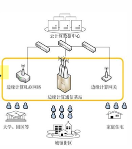

# 智能终端与边缘 计算概述

## 1. 边缘计算技术发展历程

自1946年第一台电子计算机ENIAC问世以来，计算形态为了应对不断增长的业务需求，经历了从“资源共享”到“边缘下沉”的四次重大演进。

| 阶段                     | 演进逻辑                     | 核心内容与原因                                               |
| ------------------------ | ---------------------------- | ------------------------------------------------------------ |
| **共享到独占**           | 大型实验机 ->个人计算机 (PC) | **原因：** 初期成本极高（如170平米大物），仅用于大型科学实验。随着集成电路出现，体积缩小、成本降低，演变为通过独占PC满足个人计算与存储需求。 |
| **本地到云端**           | 存储/运算  -> 信息网络化     | **过程：** Web技术发展使计算机成为通信载体。大量数据由本地迁移至Web服务器，逐步将部分运算也带到服务器，形成**云计算**形态。 |
| **移动云计算到边缘计算** | 端-云二级结构  -> 边缘介入   | **定义：** 终端作为“瘦”客户端，通过无线网络按需获取云资源。**局限性：** 图像传感器数据量巨大导致传输成本高、智能驾驶对高延迟零容忍、客户数据隐私保护需求。 |
| **万物智慧互联**         | 随身携带  -> 智能万物        | **趋势：** 遵循“服务越近越好，代价越小越好”原则，摩尔定律驱动晶体管密度增加，计算能力向智能终端和边缘节点全面渗透。 |

---

## 2. 边缘计算基本概念与演进

### 2.1 核心定义（多视角理解）

目前学术界与产业界对边缘计算（EC）虽无统一表述，但核心思想一致：

- **学术视角（CMU）**：一种新的计算模式，将计算和存储资源（微云、雾计算节点等）部署在**贴近移动终端或传感器网络**的边缘。
- **产业视角（OpenStack）**：强调“跨越传统数据中心”，在网络边缘为开发者提供**云服务和IT环境服务**。

### 2.2 概念演进逻辑

1. **边缘计算 (EC)**：通用基础概念。
2. **移动边缘计算 (Mobile Edge Computing, MEC)**：5G时代初期产物，侧重移动通信网边缘。
3. **多接入边缘计算** (Multi-access Edge Computing, MEC)

**边缘计算、移动边缘计算与多接入边缘计算在概念上没有本质区别，研究目标完全一致**

---

## 3. 边缘计算的核心特点与价值

### 3.1 三大核心特点

- **开放性**：打破网络封闭性，将基础设施、数据与服务转化为开放资源，使服务更贴近实际需求。
- **可扩展性**：支持资源灵活配置，自动实现快速响应，适应服务类型的爆发式增长。
- **协作性**：实现移动通信网与物联网的深度融合，通过协同改善整体网络性能。

### 3.2 四大核心价值

1. **提高响应能力**：通过缩短物理传输距离，缓解核心网络的带宽压力，从而满足各类业务场景极高的实时性需求。
1. **隐私保护与安全**：使数据直接在产生的源头附近进行就近处理，大幅降低了数据在长距离传输过程中的泄露风险。
1. **催生新服务**：为AR/VR、智慧城市、工业自动化等依赖超低延时和大带宽的新兴场景提供了强有力的支撑。
1. **推动5G技术**：边缘计算是支撑**5G网络切片**技术真正落地应用的关键力量。

---

## 4. 边缘计算架构详解（易考点）

### 4.1 三层模型结构

- **设备层（最低层）**：由传感器、执行器、智能终端（手机、眼镜等）组成，负责原始数据采集。同时接收并执行从边缘层传送来的指令
- **边缘层（核心层）**
  - **边缘-设备子层**：负责网络接入、协议转换及初步数据分析。
  - **边缘-云子层**：负责与云端通信，进行资源调度与协同。
- **云层**：负责复杂大数据分析、长期数据存储及全局业务决策。

---

## 5. 云边协同关系分析

**[重点提示]**：边缘计算与云计算是**互补协同**关系，而非替代关系。

- **边缘支撑云**：边缘侧负责高价值数据的采集、过滤和初步处理，减少核心网负担，为云端应用提供精准支撑。
- **云优化边缘**：云端利用大数据分析能力进行模型训练，将**业务规则或模型**下发到边缘侧执行，提升边缘侧的智能化水平。
- **总结**：“云-边”协同构建了**混合架构**，实现了实时处理与深度决策的完美结合。

---

## 6. 虚拟化技术与应用部署

虚拟化的主要应用目标是实现**信息基础设施资源的虚拟化**

### 6.1 基础设施虚拟化

- **服务器虚拟化**：将一台物理服务器虚拟成多台独立的**逻辑服务器**。
- **存储虚拟化**：为物理存储提供抽象逻辑视图，实现统一的逻辑访问。
- **网络虚拟化**：在共享的物理网络上创建逻辑上相互隔离的虚拟网络

### 6.3 边缘硬件载体

- **边缘网关：** ，核心任务是**网络接入**和**协议转换**（把底层各类传感器不同格式的数据“翻译”成统一的语言），并配合其他设备工作。
- **边缘服务器：** 进行核心计算，为了在环境复杂、资源受限的边缘现场高效干活，它特别依赖**轻量级虚拟化技术**
- **边缘一体机：**把计算、存储、网络等全塞进一个机柜里。它最大的优势就是**免建专业机房、即插即用、方便集中运维**。