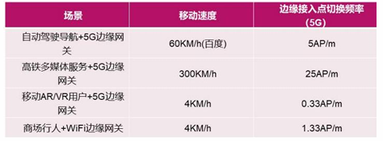
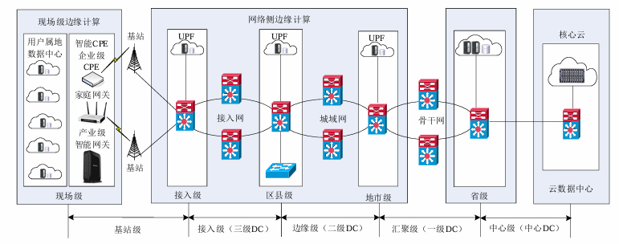
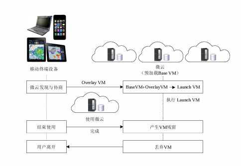
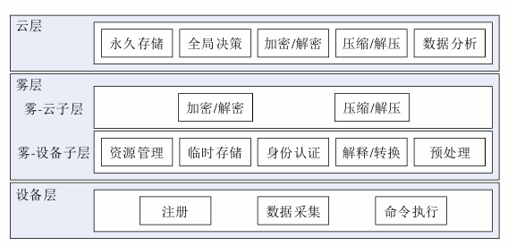
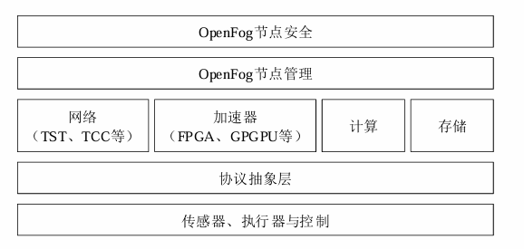
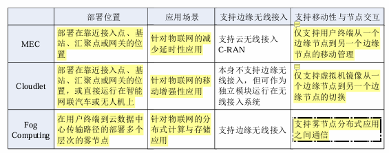

# 移动通信技术与 智能终端的融合

## 1. 5G边缘计算的核心定义与能力基石

IMT-2020（5G）推进组将5G定义为**“标志性能力指标”与“一组关键技术”**的有机结合体。这种定义彻底改变了移动网络的边界：它不再仅仅提供“连接”，而是通过**超密集组网（UDN）**等底层技术的变革，为边缘计算（MEC）提供了物理落地的土壤。

### 5G定义的关键技术要素

根据技术规范，5G的能力由以下两大维度支撑：

- **标志性能力指标：** 明确定义为**Gbps级（每秒千兆比特量级）****100Mbps**的可保障体验速率。
- 四大关键技术：
  - **大规模天线阵列（Massive MIMO）：** 显著提升频谱效率与覆盖深度。
  - **超密集组网（UDN）：** 通过极高密度的基站部署，支撑海量连接，也是MEC分布式的物理前提。
  - **全频谱接入：** 统筹高低频段资源，扩大单用户可用带宽。
  - **新型多址：** 提升系统容量，优化海量终端的并发连接效率。

---

## 2. 5G关键指标的感性认知与场景边界

将ITU（国际电联）定义的抽象指标转化为业务场景中的“感性认知”，是架构设计的核心。这种转化能帮助我们直观评估5G对特定行业（如自动驾驶或远程医疗）的战略支撑能力。

### 5G关键指标转化矩阵

下表将技术参数与实际业务体验关联，强调了延时、速率及**流量密度**对业务容量的决定性影响：

| 指标名称         | ITU技术指标    | 业务场景感性认知                                             |
| ---------------- | -------------- | ------------------------------------------------------------ |
| **峰值速率**     | 20Gbps         | 理想状态下，1秒钟可完成2.5GB的4K超高清视频下载。             |
| **用户体验速率** | **100Mbps**    | 随时随地的极致流畅；VR所需带宽门槛约为170Mbps，5G可提供泛在支持。 |
| **流量密度**     | **10Tbps/km²** | 满足高密集区域（如体育场馆）每平方米10Mbps的容量需求。       |
| **空口延时**     | < 1ms          | **车联网：** 60km/h行驶时，1ms延时对应17m制动距离。 **VR体验：** 延时低于20ms可有效消除眩晕感。 |
| **连接密度**     | 100万个/km²    | 支撑万物互联，解决智慧城市海量传感器并发接入难题。           |
| **移动性**       | 500km/h        | 高铁（最高时速486km/h）环境下仍能保持Gbps级通信稳定性。      |

### 接入点切换频率分析

- 增强移动宽带通信（enhance Mobile Broadband，eMBB） 
- 大规模机器类通信（massive Machine Type of Communication，mMTC）
- 超可靠低延时通信（ultra-Reliable Low Latency Communication，uRLLC）

移动速度直接影响边缘网关的接入稳定性。以下数据展示了5G相比WiFi在移动稳定性上的压倒性优势：

---

## 3. 5G融合应用体系：3+4+X与十大场景白皮书

为了结构化推进社会数字化，中国信通院（CAICT）提出了“3+4+X”体系，旨在覆盖社会生产生活的全维度。

### “3+4+X”体系拆解

- **“3”大应用方向：** **产业数字化**（赋能工业/能源）、**智慧化生活**（个人娱乐/医疗）、**数字化治理**（智慧城市）。
- “4”大通用应用：**4K/5K超高清视频**。VR/AR**。**无人机/车/船**。机器人**
- **“X”类行业应用：** 5G在工业、医疗、教育等垂直领域的深度渗透产生的碎片化应用。

**本节小结：** 场景多样化要求网络底层具备极高的灵活性。这种灵活性在物理上体现为MEC的部署策略，即下一节将探讨的分级架构方案。

---

## 4. MEC在5G网络中的部署策略与分级架构

MEC的部署位置是性能与成本的战略权衡。5G架构通过**C/U（控制面与用户面）分离**技术，实现了计算资源的弹性伸缩。

### 分级架构与部署权衡

5G网络数据中心（DC）呈现分级模式。架构师需根据“**资源池化效率**”与“**极致延时**”进行权衡：

1. **基站级/接入级（三级DC）：** 部署于CU/DU一体化基站。虽成本高、资源散，但能提供极致低延时。
2. **边缘级/汇聚级（二级/一级DC）：** 部署于地市或区县。资源池化效率高，适合覆盖范围较大的业务。
3. **中心级（中心DC）：** 负责全局控制平面部署及非实时管理。

**核心支撑：** **UPF（用户面功能网元）**是MEC的锚点。控制面集中于中心，而UPF随MEC下沉至边缘，是实现流量本地分流的关键。

### 典型场景部署方案对比：eMBB vs. uRLLC

| 业务类型  | 空口单向延时         | 部署战略                                     | 部署位置                         |
| --------- | -------------------- | -------------------------------------------- | -------------------------------- |
| **eMBB**  | 4ms（端到端10ms级）  | **相对集中**：追求资源池化效率与传输延时平衡 | 二级DC（地市级）或一级DC（省级） |
| **uRLLC** | 0.5ms（端到端1ms级） | **极致分布**：采用“**将多跳转为一跳**”逻辑   | **CU/DU一体化基站**              |

**本节小结：** 分级部署是实现业务需求与成本平衡的关键。对于固定部署策略无法完全解决的高移动性、复杂能效问题，则需引出下一节的架构演进与科研前沿探索。

\--------------------------------------------------------------------------------

## 5. 架构演进与前沿研究挑战

从4G向5G的演进，本质上是从“硬件驱动”向基于**SDN/NFV**的“软件定义”架构跨越。

### 从“僵化”到“柔性”的技术演变

- **4G时代：** MEC服务器部署在eNodeB汇聚节点之后、**SGW（服务网关）**之前。架构受限于硬件专机，缺乏弹性，且多个基站共享服务器导致响应受限。
- **5G时代：** 基于**SDN/NFV（网络功能虚拟化）**架构，MEC部署在**GW-U（用户面网关/UPF）**之后。两者可集成或独立部署，实现了真正的算网一体，大幅提升了部署的灵活性。

## 移动网络通信环境下的边缘计算

### 技术里程碑梳理

- **2009年：** 卡内基梅隆大学提出了**微云（Cloudlet）**概念，率先开启了边缘计算的先河，定义了“端-边-云”三层结构。
- **2011年：** 思科（Cisco）公司正式提出**雾计算（Fog Computing）**概念，强调通过虚拟化组件构建连续统一的资源池。
- **2013年：** **移动边缘计算（MEC）**概念诞生，侧重于移动基站侧的算力部署。
- **2014年：** 欧洲电信标准化组织（ETSI）成立MEC工作组，正式启动需求、架构、接口及应用场景的标准化研究。
- **2015年：** **开放雾计算联盟（OpenFog）**成立，推动雾计算架构与工业标准的对接。
- **2016年：** ETSI将MEC的内涵从移动边缘扩展为**多接入边缘计算（Multi-access Edge Computing）**，标志着固定与移动网络的全面融合。

微云，雾计算，移动边缘计算

---

### 标准化与产业生态评价

#### 我国MEC商业发展

- **2016年**：华为牵头“建群”（成立**ECC**），搭建合作平台。
- **2018年**：三大运营商进场定“规矩”（成立**OTII**），制定电信服务器标准。
- **2019年**：BAT（百度、阿里、腾讯）互联网巨头加入，大家一起开始“落地赚钱”（推动**商业部署**）。

#### MEC标准化工作

- 2014年，ETSI率先启动MEC标准项目研究。
- 2017年底， 聚焦4G架构，定义了应用支撑API及无线侧能力服务API，包括**RNIS（无线网络信息服务）**、**定位**及**带宽管理**等核心功能。
- 2018年9月，重点转向5G、Wi-Fi及固网的融合接入，完善编排管理与运维框架。

#### MEC 标准化工作方向

- MEC与5G的结合
- MEC与垂直行业的结合
- MEC与开源的结合

**过渡：** 标准化为具体技术形态的落地铺平了道路。在诸多形态中，微云（Cloudlet）作为“云边端”架构的先行者，最早在工程实践中解决了物理邻近性带来的延迟优化问题。

---

## 2. 微云 (Cloudlet)：云边端三层架构的先行者

微云（Cloudlet）的核心价值在于将传统的“端-云”二层结构**重塑为“端-边-云”三层结构**。

通过在**接入网与核心网**之间引入可信的算力节点，，移动终端到Cloudlet仅有“一跳”距离微云，有效地将广域网带来的延迟抖动从计算密集型应用中剥离，确保了计算迁移的实时性。

微云作为边缘算力的“先锋”，具备以下四个**显著特征**：

- **可信性与资源丰富性：** 它不仅是一个物理节点，更是一个可信的主机群，拥有充足的算力以承载多用户的并发任务迁移。
- **软状态设计：** Cloudlet服务器采用软状态设计，极大地优化了服务器与移动终端之间的数据缓存与传输逻辑。
- **物理邻近性：** 通常与终端接入同一基站或Wi-Fi，维持“一跳（One-hop）”距离，使网络带宽和延迟变得精准可控。
- **部署灵活性：** 支持直接部署在移动车辆或机器人上，实现“服务随人动”。

### 虚拟机合成 (VM Synthesis) 机制解析

微云的工作核心在于通过**虚拟机技术**实现环境的按需交付，其技术逻辑涉及三个关键概念：

**Base VM（通用数据部分）：** 预加载在微云服务器上的基础镜像，包含操作系统及通用库，不含具体应用逻辑。

**VM Overlay（应用相关数据部分）：** 由移动终端携带的、包含特定应用程序及其运行环境差异化的压缩数据。

**Launch VM（虚拟机合成产物）：** 通过将 Base VM 与 VM Overlay 进行合成，在边缘侧即时生成的、可立即为用户提供服务的完整虚拟机镜像。

### 工作流程图解化描述

微云的生命周期是一个从动态合成到资源回收的闭环：

1. **发现与协商：** 移动终端主动发现邻近的微云，并就计算能力、存储空间等进行协议协商。
2. **虚拟机合成：** 终端将 Overlay VM 传输至边缘，微云利用预加载的 Base VM 进行合成，配置出对应的运行环境。
3. **使用与执行：** Launch VM 正式上线，接收移动终端迁移的任务并执行。
4. **丢弃与清理：** 任务结束后，Launch VM 被丢弃以释放资源。值得注意的是，该过程可能产生**VM残留（VM Residuals）**，这需要在后续的清理机制中予以处理。

**过渡：** 微云在“一跳”范围内提供了极佳的实时性，但为了应对更广泛、分布更散的物联网（IoT）传感器网络，雾计算（Fog Computing）应运而生。

---

## 3. 雾计算 (Fog Computing)：构建连续统一的分布式资源池

雾计算与云计算在架构上呈现出“中心化”与“泛在分布”的对立统一。相较于“高高在上”的云，雾更贴近“地面”的终端。

它通过引入中间“雾层”，将网络从单纯的“数据管道（Data Pipe）”转化为具备预处理、存储和转发能力的“流水线（Pipeline）”。

### 多维定义解析

Cisco 将雾定义为由**虚拟化组件构成的资源池**，旨在为智能网格与海量传感器环境提供分布式处理能力。L. M. Vaquero 则强调雾计算是通过**中间层扩展云结构**，通过将地理分布广泛、数量庞大的**雾节点**联网，弥补了单体设备资源不足的缺陷。

### 三层架构详解

雾计算构建了一个连续的层级化管理模型：

1. **云层：** 处于顶层，负责永久存储、复杂的数据分析及全局性决策。
2. **雾层（核心）**：部署在用户到核心云的传输路径上。其实就是边缘层
   - **雾-云子层：** 侧重资源管理、身份认证、临时存储及负载均衡。
   - **雾-设备子层：** 负责数据预处理（如压缩/解压、加密/解密）、解释与协议转换。
3. **设备层：** 由执行器、传感器及物联网终端组成，负责最底层的数据采集与指令响应。

### 节点功能分析

根据 OpenFog 标准，雾节点的功能结构涵盖了从底层协议到高层管理的完整堆栈：

- **安全与管理：** 确保大规模分布式环境下的节点可控与数据安全。
- **计算、存储与加速器：** 引入 **FPGA、GPGPU** 等硬件加速模块，提升边缘处理效能。
- **协议抽象层：** 屏蔽底层不同通信协议的差异，实现异构设备的互联互通。
- **网络支持：** 特别强调对**云无线接入（C-RAN）**的支持，以优化无线侧资源的动态调度。

**过渡：** 雾计算实现了计算能力的泛在渗透，但其海量的异构节点对软件架构提出了巨大挑战，这促使了中间件技术成为边缘计算架构（FEA）的核心。

---

## 4. 边缘计算中间件 (FEA)：屏蔽差异与资源调度的核心

在移动通信环境下，开发者面临 MEC、微云、雾计算等多种异构底座。FEA（雾计算与边缘计算架构）中间件技术通过软件定义的方式，**屏蔽了底层硬件差异**，提供了统一的编程接口，是降低编程难度、实现算力民主化的关键所在。

### 基本功能

| 功能维度       | 描述说明                                         |
| -------------- | ------------------------------------------------ |
| **设备发现**   | 动态识别并接入边缘环境中的可用计算与存储节点     |
| **运行环境**   | 为应用提供容器化或沙箱化的执行支撑，屏蔽OS差异   |
| **最小中断**   | 确保任务在移动性导致的网络切换中保持业务连续性   |
| **开销管理**   | 监控中间件自身操作参数产生的资源消耗，避免过载   |
| **自适应设计** | 环境感知型设计，根据地理位置变化动态调整服务策略 |
| **QoS保障**    | 严格执行应用预设的服务质量指标，如延迟与抖动控制 |

### 资源管理与调度逻辑

中间件在架构中充当“算力指挥官”，其核心逻辑包括**执行管理**、**调度与资源管理**以及**移动性管理**。

- **环境监控和预测：** 中间件通过对网络状况和节点状态的实时监控，预测未来的资源需求。
- **代理选择（Proxy Selection）：** 在多节点环境下，根据延迟和负载为终端精准选择最优的边缘代理。
- **资源消耗优化：** 针对边缘设备位置动态改变的特性，中间件需优化控制算法，防止决策开销对边缘设备电量和算力的过度侵蚀。

**过渡：** 中间件通过软件手段实现了能力的标准化开放，而要深入理解边缘计算的全局图景，还需对各类技术形态进行横向深度对比。

---

## 5. 核心技术特征深度对比与总结

尽管 MEC、微云与雾计算在“算力下沉”这一大方向上一致，但在技术基因和应用侧重上存在显著差异。

### 综合对比评估

| 技术形态   | 部署位置               | 管理模式与核心侧重                             | 关键技术特征                                  |
| ---------- | ---------------------- | ---------------------------------------------- | --------------------------------------------- |
| **MEC**    | 靠近用户的移动基站处   | **IaaS管理模式**：划分网络层、主机层与系统层   | 强调与5G深度融合，支持C-RAN及电信级安全保障   |
| **微云**   | 接入网边缘（一跳距离） | **虚拟机合成技术**：侧重交互性强的计算任务迁移 | 软状态设计，Base VM/Overlay合成，极致的低延迟 |
| **雾计算** | 终端到核心云的路径上   | **分布式资源池**：强调连续统一体（Continuum）  | 节点数量大、类型多、分布广，支持大规模IoT场景 |

