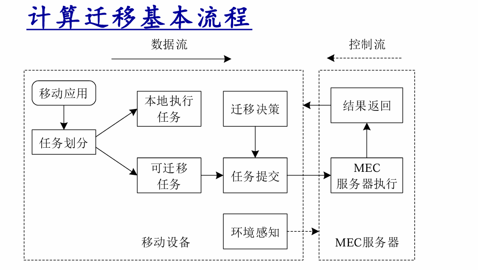

# 计算迁移与智能终端

## 计算迁移（Computation Offloading）

在当前移动互联网生态下，移动终端面临着严峻的“资源约束悖论”：增强现实（AR/VR）、云游戏、深度学习推理等新型应用对算力的需求呈指数级增长，而移动终端受限于物理体积，其电池能量与处理能力存在天然瓶颈。为了化解这一战略冲突，**计算迁移（Computation Offloading，亦称计算卸载）**成为了边缘计算架构的核心范式。

### 核心定义与分配逻辑

**计算迁移**是指将移动终端设备中部分计算量大的任务，根据一定的迁移策略，合理地分配至资源充足的计算平台。其分配路径通常分为两类：

- **近距离迁移：** 分配至本地微云（Cloudlet/Edge Cloud），强调极低时延与高带宽响应。
- **远端迁移：** 分配至远端云计算平台，利用海量弹性算力处理非时延敏感型大规模任务。

计算迁移不仅是简单的任务转移，更是移动网络架构演进的必然选择。其战略目标主要体现在：

1. **能力扩展：** 突破终端硬件的物理限制，使低功耗设备能够运行原本无法承载的高性能应用。
2. **能耗降低：** 通过远程执行高负载任务，显著减少终端电量消耗，延长续航并缓解发热。
3. **应用范围扩大：** 进一步扩大云计算技术在移动网络中的**应用范围**（JLU考点术语），推动移动终端向“瘦客户机”演进。

## 应用驱动：计算迁移类型

不同应用场景对资源的敏感度存在显著差异，这种差异直接指导了迁移决策的权重。

| 任务类型   | 任务特点                   | 关键影响因素                 | 典型应用场景             |
| ---------- | -------------------------- | ---------------------------- | ------------------------ |
| **交互型** | 执行中需与用户高频实时交互 | **网络状态**（带宽、延时）   | 云游戏、AR/VR            |
| **计算型** | 涉及大规模、高强度算力消耗 | **硬件资源**（CPU/GPU能力）  | 计算机视觉、**视频渲染** |
| **数据型** | 需访问并处理海量异地数据   | **缓存命中率**（边缘侧内容） | 地图导航、**大数据分析** |

---

## 垂直支撑体系：迁移方案与服务模式的层级映射

计算迁移的工程实现必须依托于垂直化的支撑架构。

| 层次划分       | 对应即服务模式（EC-XaaS） | 核心组件与功能映射                                          |
| -------------- | ------------------------- | ----------------------------------------------------------- |
| **应用服务层** | **EC-SaaS**软件即服务     | 进程调用、服务支持、特定应用软件、数据信息、应用接口        |
| **平台需求层** | **EC-PaaS**平台即服务     | 操作系统支持、程序运行时环境（Runtime）、数据处理模型       |
| **硬件需求层** | **EC-IaaS**基础设施即服务 | 虚拟化服务、计算节点（CPU）、存储资源、网络设施、DC物理设施 |

在垂直架构中，**QoS管理**与**安全管理**处于战略核心：

- **QoS管理（服务质量管理）：** 核心在于**资源需求预测**与**实时监控**（包括带宽、CPU、内存、能效）。它决定了迁移是否能满足业务的时延门槛。
- **安全管理：** 负责迁移过程中的数据加密、隐私保护及分布式处理中的状态同步，是迁移方案被商业化采纳的前提。

---

##  计算迁移方法实现方法：粒度与时机的多维权衡

计算迁移的设计本质是**迁移成本**（通信+计算开销）与**系统收益**（能效+时延优化）之间的博弈。

### 维度一：划分粒度对比

- 粗粒度（操作、应用、虚拟机）：
  - *特点：* 通信逻辑简单，划分效率高。
  - *局限：* 迁移数据量极大（如整个VM镜像），在快速移动或网络不稳定的场景下，迁移耗时长且易失败。
- 细粒度（方法、类、对象、线程）：
  - *特点：* 灵活性高，可实现代码级精准“减负”，极大降低能耗。
  - *劣势：* 程序静态分析与代码插桩复杂度高，通信频率增加，系统维护开销大。

### 维度二：划分时机权衡

- **静态划分：** 开发阶段**预设策略**，开销极小。但其致命缺陷是无法适应多变的移动网络环境。
- **动态划分：** 运行期**实时决策**。系统需**实时监控资源、分析和预测应用需求**，虽然这引入了**额外的监控与分析开销**，但其环境适应性是现代高能效MEC系统的基石。

## 计算迁移的生命周期：宏观流程与底层工作流

一个完整的迁移周期由以下六个标准步骤构成，其顺序严禁颠倒：

1. **代理发现：** 扫描并识别可用的边缘服务器或云端迁移代理。
2. **任务分割：** 将应用解析为“本地执行”与“可迁移执行”两个部分。
3. **迁移决策：** 结合**环境感知**（带宽、延时、终端剩余电量、云端负载等）判断是否执行迁移。
4. **任务提交：** 将选定的任务及其相关状态数据打包发送。
5. **任务执行：** MEC服务器或云端完成计算逻辑。
6. **结果反馈：** 将执行结果回传至终端，并与本地状态融合。

### 底层原理穿透（操作系统级行为）

当决策引擎触发迁移动作时，底层系统类库将执行以下四个核心动作，以保障程序运行的连续性：

- **暂停保存：** 应用程序向系统类库发送暂停请求，保存当前线程栈、变量、程序计数器等运行状态。
- **通知代理：** 系统类库向本地代理模块发送迁移信号及元数据。
- **读取传输：** 本地代理读取保存的状态信息，并从**缓存中提取相关代码或虚拟机（VM）镜像**，通过网络传输至服务器。
- **云端恢复：** 远端代理创建新实例，复制并恢复运行环境，实现任务的接力执行。

---

## MAUI vs. CloneCloud 架构对比

在工程实现路线上，MAUI与CloneCloud分别代表了细粒度与粗粒度的两种成熟哲学。

### MAUI（细粒度路线：基于RPC）

MAUI采用端云对称的支撑架构，通过**远程过程调用（RPC）**机制实现代码段的迁移。

- **核心组件：** Profiler（性能分析器）、Solver（决策求解器）、Proxy（代理）及MAUI运行时。
- **逻辑：** 实时评估方法运行开销，由Solver计算最优划分，通过RPC在服务器执行高能耗方法。

### CloneCloud（粗粒度路线：基于VM）

CloneCloud侧重于通过**虚拟机（VM）封装**来简化迁移逻辑，减少程序分割的开销。

- **实现思路：** 1. 在云端完全克隆移动终端的运行环境（云端全克隆）；2. 利用近端强算力节点作为代理服务器进行VM级同步。
- **核心差异：** **MAUI强调代码级精细插桩（RPC）**，而**CloneCloud强调应用级整体迁移（VM镜修）**。

