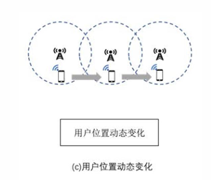
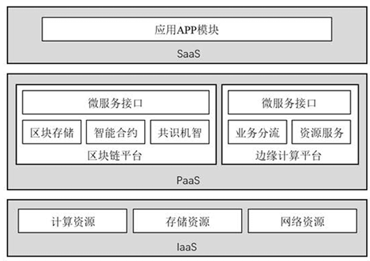

# 第4章：边缘计算安全——从防御框架到前沿技术实践

## 边缘计算安全体系概述

- 随着5G超密集组网（UDN）的物理落地，边缘侧已由单纯的数据中转站演进为实时业务处理的关键底座。
- 在这种高敏捷、高并发的分布式环境下，安全不再是事后修补的“可选附件”，而是决定架构生死存亡的“核心底座”。

**边缘计算安全**是指达到抵抗某种安全威胁或攻击的能力，横跨云计算和边缘计算，需要实施端到端的防护：

- **组织起源与战略共识：** 2016年，由华为牵头成立了边缘计算产业联盟（ECC），标志着边缘计算进入有组织发展的元年。2018年11月，ECC与工业互联网产业联盟（AII）联合发布了**《边缘计算参考架构 3.0》**。该架构明确设立了“安全服务”章节，首次从行业高度界定了边缘安全的设计原则与服务框架。
- **标准细化与落地：** 2019年11月，ECC与AII进一步发布了**《边缘计算安全白皮书》**，确立了跨层协同的动态防御准则，为后续开发者提供了可操作的技术基准。

---

### 五大核心安全挑战

边缘计算安全有五大问题需要解决：体系结构、碎片化、物理安 全性、蔓延、用户错误

1. **体系结构 (Architecture)：** 边缘侧面临**跨层协议异构性（Cross-layer Protocol Heterogeneity）**。设备、边缘、云三层逻辑交织，导致传统单一的安全协议栈难以实现全覆盖。
2. **碎片化 (Fragmentation)：** 异构硬件厂商与私有协议的大量存在，导致安全补丁的分发与合规检测面临巨大的适配鸿沟。
3. **物理安全性 (Physical Security)：** 边缘网关、微云（Cloudlet）等设备常暴露在非受控区域，面临物理损毁、恶意接入或硬件窃听的风险。
4. **蔓延 (Sprawl)：** 随着业务边界随人、车、物动态扩展，管理边界趋于模糊，攻击面呈指数级扩大。
5. **用户错误 (User Error)：** 终端用户缺乏专业安全运维能力，配置不当或默认弱口令是造成大规模隐私泄露的“阿喀琉斯之踵”。

边缘计算安全的基本功能：可信基础设施，可信安全服务，安全设备和可信协议转换，可信网络

### 五位一体的数据安全性评价

针对边缘侧资源受限（Resource-constrained）的特性，我们制定了如下评价指标：这一部分可以结合物联网安全学习

| 评价指标               | 核心定义与要求                             |
| ---------------------- | ------------------------------------------ |
| **机密性**             | 敏感数据在非对称加密与传输中不被非法获取。 |
| **完整性**             | 保证数据在边缘存储、验证过程中未被篡改。   |
| **可用性**             | 节点受损时，系统仍能提供稳定响应。         |
| **身份验证与访问控制** | 对海量异构终端进行精确的身份识别与准入。   |
| **隐私要求**           | 遵循“数据不动模型动”，防止敏感信息外溢。   |

### 边缘计算安全的特殊性

边缘计算与传统云计算在安全防护上有着显著区别，主要体现在以下四个“特殊性”：

- **架构与环境复杂**：具有分布式架构、异构网络、实时性应用、数据多源异构等特点，且受感知/执行节点、终端多样性与资源受限等因素影响。
- **所有权碎片化**：网络设施、服务设施、用户终端由**多个所有者共同拥有**，导致系统的任何部分都可能成为攻击和窃取隐私的突破口。
- **资源受限**：由于边缘设备（如传感器）的计算、存储和电源资源极为有限，**现有的传统数据安全保护方法并不完全适用**于边缘设备。
- **高度动态性**：网络边缘所处的高度动态环境，使得网络更加易受攻击且难以保护。

---

## 边缘计算的安全威胁

边缘计算面临的安全威胁自下而上严格划分为了**节点、网络、数据、应用**四个相互独立的层面。

###  节点安全（最底层的物理/硬件层）

主要负责底层环境的**感知与执行**，以及提供最基础的**基础设施**支撑。

- **典型潜在威胁**：物理层面的攻击、插入伪造节点、耗尽设备电能以及入侵节点系统
- 具体：物理劫持，数据污染，功耗攻击，沦为肉鸡

### 网络安全（传输层）

负责应对**海量联接与网络管理**，保障数据的**实时传输**。

- **典型潜在威胁**：针对通道的 DoS/DDoS 攻击、伪造基站、利用协议漏洞以及直接攻击无线信道。
- 无线传输信道破坏，协议漏洞利用，身份伪装攻击

### 数据安全（信息核心层）

涵盖**数据分析与呈现**，以及深度的**数据计算与存储**

- **典型潜在威胁**：用户隐私泄露、黑客破解数据库、篡改或伪造核心数据，以及数据的非法利用
- 系统级数据混乱，核心数据库破解，深层隐私挖掘

###  应用安全（最上层的业务层）

负责具体的**行业应用**落地与日常的**业务运营**

- 伪造最终用户身份、直接攻击边缘计算节点、应用层 DoS/DDoS 攻击，以及针对云端/边缘端虚拟机（VM）的攻击
- **虚假请求瘫痪（应用层DDoS）**，**虚假应答欺骗**，**资源耗尽瘫痪**

---

## 边缘计算安全关键技术

边缘计算的安全技术分为了四大防御支柱：**数据安全、身份认证、隐私保护、访问控制**

### 数据安全

- **基于身份加密 (IBE)**：最基础的加密方式，包含**加密、身份认证、解密**三个步骤
- **基于属性加密 (ABE)**：通过用户属性来实现控制，主要细分为两类：
  - **KP-ABE（基于密钥策略）**：通常用于**数据查询**。
  - **CP-ABE（基于密文策略）**：通常用于**接入控制**。
  - **代理重加密 (PRE)**：核心在于**“转换”**。它通过使用代理，将一个密钥的密文（消息或签名）直接转换为另一密钥的密文，从而实现数据的安全共享。
- **可搜索加密（🌟）**：能在保证私密性的同时支持密文检索。必须记住它的**四步标准流程**：
  - ① **文件加密**：加密纯文本并生成索引。
  - ② **生成陷门 (Trapdoor)**：把待查询关键字加密成“陷门”发给云端，别人无法从中获取任何信息。
  - ③ **搜索**：服务器以“陷门”为输入执行搜索。
  - ④ **解密**：用户对返回的加密文档解密

### 身份认证（针对不同移动场景）

身份认证必须根据“信任域”和“移动性”来划分：

- **单域认证**：用户位置固定，在**单个信任域**中解决实体身份分配，获取服务前必须先从授权中心验证。
- **跨域认证**：用户位置固定，但涉及互连边缘服务器的**不同信任域**之间的验证机制。
- **切换认证（🌟）**：专门针对边缘设备的**高度移动性**（用户地理位置经常变化）。因为传统集中式验证协议失效，所以必须采用“切换认证”这一传输技术

### 隐私保护

边缘计算不仅要防黑客，还要防用户自己的敏感信息被滥用：

- **数据隐私**：挑战在于用户的私人数据处理后会转移到异构分布式的边缘/云服务器上。
- **身份隐私**：在边缘计算中目前还未引起广泛关注，仅有一些探索性成果。
- **位置隐私（🌟）**：用户向**基于位置的服务提供商 (LBSP)** 提交请求时，若不知道 LBSP 是否受信任，就会面临巨大的位置隐私泄漏挑战。

### 访问控制

控制“谁能看什么数据”

- **基于属性 (ABAC)**：通过基于用户的属性建立解密能力，实现**细粒度**的数据访问控制。
- **基于角色 (RBAC)（🌟）**：
  - **核心机制**：系统的权限**绝对不是直接授予具体的用户**，而是建立一个“角色集合”
  - **运作逻辑**：角色对应权限
  - **优点**：通过“用户→角色”和“角色→对象”的映射机制，提供极其灵活的权限管理。

## 区块链与边缘计算的深度融合

区块链技术通过去中心化的分布式账本，弥补了边缘节点间的信用缺失，是构建分布式可信认证体系的理想工具。

### 融合机制与双向赋能

- **边缘为区块链服务（资源支撑）：** 移动边缘计算利用其物理邻近性，为区块链提供低延时的存储与计算支撑。区块链节点可共享边缘算力进行挖掘计算，显著降低终端设备的功耗压力。同时边缘服务器还有大存储和机密环境
- **区块链为边缘赋能（信任机器）：** 利用哈希链结构及共识算法，区块链为边缘侧提供了永久保存及防篡改的数据底座，支撑起去中心化的文件系统与计算逻辑。

### 区块链六层架构与技术要点

在边缘计算环境下，区块链通过以下全栈架构发挥效能：

1. **数据层：** 封装底层数据区块、加密算法及Merkle树数据验证机制。
2. **网络层：** 采用**P2P组网**及**Gossip协议（流言协议）**，实现边缘节点间快速的数据广播与验证。
3. **共识层：** 集成**PoW、PoS、DPoS**等算法，在资源受限与效率之间取得平衡。
4. **激励层：** 引入经济驱动的发行与分配机制，激励边缘节点积极参与网络维护。
5. **合约层：** 通过智能合约实现脚本代码的自动化执行，保障业务逻辑的可编程安全性。
6. **应用层：** 支撑可编程货币、金融及工业互联网等具体垂直场景。

### 3.3 服务模式与集成路径

在工程落地中，我们重点通过**PaaS（平台即服务）**“集成枢纽”，向上提供微服务接口，向下整合区块链平台（智能合约、共识机制）与边缘平台（业务分流、资源服务），降低了开发者的调用门槛。

。

---

## 联邦学习驱动的隐私保护

联邦学习（Federated Learning）的核心价值在于其“**数据可用不可见**”的特性，从根本上缓解了边缘侧个人数据的隐私焦虑。

联邦学习通过在异构设备间构建共有虚拟机器学习模型，实现了以下特质：

- **数据本地化：** 原始数据不出本地，仅上传梯度或参数。
- **地位对等：** 参与者在联邦内地位平等，协作完成全局模型优化。
- **风险缓解：** 有效应对样本数量不足或数据维度单一的痛点。

### 技术流程

联邦学习遵循 **Selection（选择）**、**Configuration（配置）**、**Reporting（汇报）** 的标准化流程。

- **核心挑战：** 尽管保护了隐私，但该模式仍面临**单方数据污染（投毒攻击）**、对**中央服务器的单点依赖**以及海量梯度传输带来的**带宽限制**。

### 4.3 工业级应用案例

- **Google Gboard：** 通过观测用户互动方式收集数据，实现跨设备的训练负载管理，优化查询建议。
- **FedVision (视觉检测)：** 基于**YOLOv3**框架，整合资源管理器与联邦服务器，实现保护隐私的图像目标识别。
- **FL-QSAR (药物发现)：** 采用水平联邦学习架构研究定量结构-活性关系，保护医药机构的核心研发数据。

**连接性总结：** 从工程通用架构迈向学术前沿，区块链与联邦学习的深度交织已衍生出诸多解决节点自利性与模型可信性的前沿方案。
