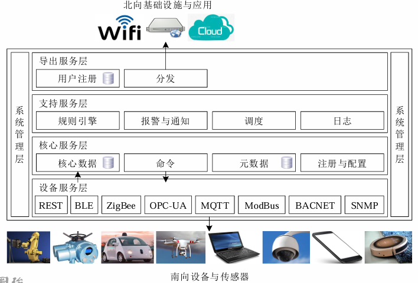
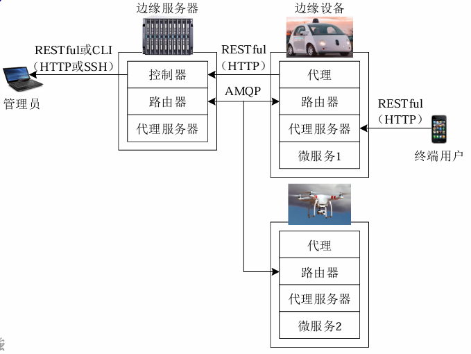
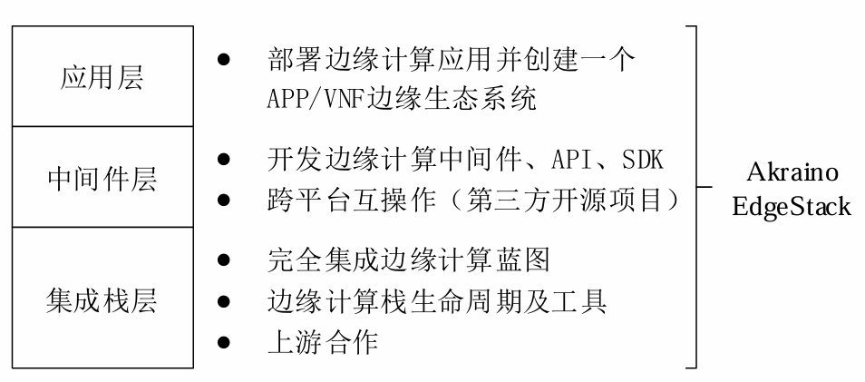
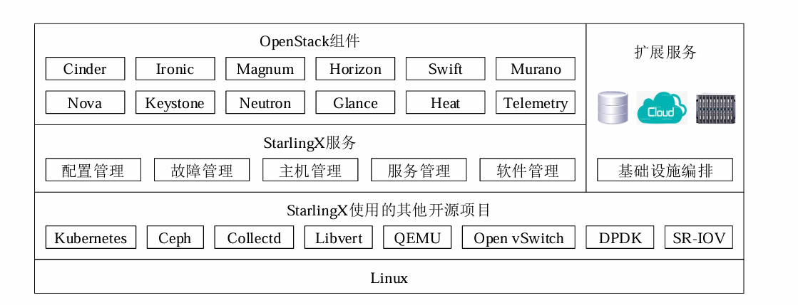
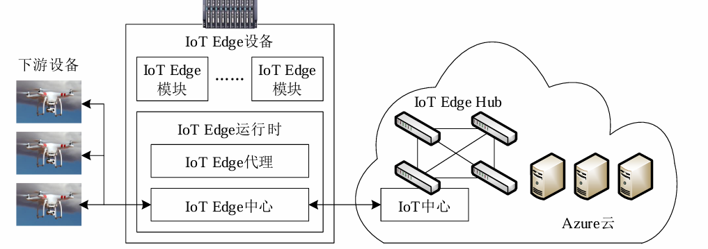

# 边缘计算开源平台

## 边缘计算开源平台

边缘计算系统是一个典型的分布式系统

**背景与战略意义：** 边缘计算系统在本质上是一个复杂的分布式系统，在具体实现中需要整合为一 个计算平台

**边缘计算核心挑战分析：** 根据系统设计需求，**边缘计算平台**必须正面回应以下四大核心挑战

- **资源组织与统一管理：** 边缘资源虽然众多但极度分散，如何将异构、离散的物理资源逻辑化地整合为可调度的资源池是首要难题。
- **异构设备接入：** 边缘应用（如物联网系统）涉及大量硬件与软件差异，设备接入方式的异构性极大增加了开发与部署的复杂度。
- **通信协议多样性：** 传感器等数据源采用的通信协议各异，如何从海量、非标的数据源中方便且准时地采集数据是必须解决的工程问题。
- **高效处理任务：** 在网络边缘计算资源相对受限的条件下，必须通过优化调度策略，确保数据处理的高效性，以满足实时性需求。

**全球开源社区格局：** 边缘计算开源领域已形成多方势力并存的格局：

- **LF Edge 社区：** 2019年，Linux基金会（LF）发布了该社区，旨在建立一个独立于硬件、芯片、云或操作系统的开放、可互操作框架。其旗下拥有5个核心项目：EdgeX Foundry、Akraino EdgeStack、Open Glossary of Edge Computing、Samsung Home Edge 与 Zededa EVE。
- **OpenStack 基金会 (StarlingX)：** 该项目基于 Wind River 的代码，旨在边缘设备上运行云服务。它通过整合 CentOS、Kubernetes 等组件，构建了一个强化的边缘云栈，体现了将成熟云技术向边缘下沉的战略意图。

---

## 面向设备侧的开源平台

设备侧平台主要部署在网关、路由器等靠近传感器的硬件上。

其战略核心在于解决物联网接入问题。通过在边缘节点提供灵活的微服务支持，平台能够屏蔽底层硬件与协议的差异，为上层应用提供统一的接口。

这对于实现工业自动化、智能家居等场景中的异构设备互操作性具有决定性作用。

### EdgeX Foundry

EdgeX Foundry 被定义为物联网边缘计算的“通用开放框架”。其核心特征是可部署在边缘节点，**独立于硬件与操作系统**，支持即插即用的组件集成。

将功能拆分为一系列松耦合的微服务，服务之间采用轻量级通信机制（如RESTful API）交互

**EdgeX Foundry 分层架构对照表：**

| 架构层级       | 作用描述                                                     |
| -------------- | ------------------------------------------------------------ |
| **设备服务层** | 连接南向设备与传感器，负责与底层异构传感器及设备进行协议转换与数据采集，涵盖主流工业协议。 |
| **核心服务层** | 系统的核心枢纽，负责数据的暂存、设备控制命令下发及服务注册。 |
| **支持服务层** | 提供业务逻辑编排、系统监控及自动化响应能力。                 |
| **导出服务层** | 负责将处理后的边缘数据安全地发送至云端或外部北向应用系统。   |

### ioFog

ioFog 其设计理念与 EdgeX 相似，也是独立 于设备硬件、通信协议和操作系统，实现即插即用的物联网组件。但在交互逻辑上具有独特性：

- **代理机制：** ioFog 允许在边缘服务器与设备间部署“代理（Proxy）”和“路由器”。
- **交互逻辑：** 核心是基于微服务架构，微服务之间的交互极具灵活性。允许开发者将某个应用划分为多个独立的服 务，每个服务运行在独立的应用进程中，服务之间采用轻量级的通信机制

---

## 面向边缘云的开源平台

面向边缘云的平台致力于优化或重构网络边缘的基础设施，以构建微型数据中心。

网络运营商是这类边缘计算服务的主要推动者

**Akraino EdgeStack 演进历程：** Akraino EdgeStack 自 2018 年成立以来，迅速演进至 Release 1.0 版本。其核心竞争力在于框架：

- 框架代表了针对特定场景（如运营商边缘、企业边缘）而完全集成的软件栈。这种高度集成化的设计使得边缘云服务能够实现快速、批量的扩展。
- 功能分层：
  - 应用层：部署边缘应用，构建边缘生态。
  - 中间件层：开发 API、SDK，负责跨平台互操作。
  - 集成栈层：负责边缘计算栈的生命周期管理与蓝图集成。

**StarlingX：强化版边缘云栈：** StarlingX 溯源于 Wind River 的 Titanium Cloud 系统。它不仅是一个开发项目，更是一个针对关键基础设施需求，对 OpenStack 等组件进行“扩展与加固（Hardening）”的集成项目。

- **开源组件深度集成：** StarlingX 整合了 Kubernetes、Ceph、**Collectd**、**Libvirt**、**QEMU**、Open vSwitch 以及 **SR-IOV** 等高性能组件。
- **核心管理模块：** 包含配置、故障、主机、服务及软件管理五大模块，确保边缘环境下的高可用性。

---

## “边-云”协同开源平台

 “边-云”协同平台的核心在于“延伸”。基于云-边融合的设计思想，致力于将云计算服务能力扩展至网络边缘

云计算服务提供商是这类边缘计算服务的最主要推动者

**Azure IoT Edge 解决方案：** 这是微软推出的将云服务半径延伸至边缘设备的开源方案。

- 三大基本组件：
  1. **IoT Edge 模块：** 执行特定逻辑（如 AI 推理）的最小计算单位。
  2. **IoT Edge 运行时 (Runtime)：** 核心组件，包含 IoT Edge 代理与 IoT Edge 中心，负责安全与通信管理。
  3. **IoT Edge 云界面：** 位于云端的 IoT 中心，用于远程监控与配置下发。

**KubeEdge：基于 K8S 的容器编排：** KubeEdge 是 CNCF 的正式项目，它利用 Kubernetes 的编排能力实现了云边协同。

KubeEdge架构包含2个部分：**云端与边缘端**

- **云端 (CloudCore)：** 包含 CloudHub、EdgeController 和 DeviceController，负责元数据的同步与应用下发。
- **边缘端 (EdgeCore)：** 包含 6 个核心模块，重点包括 **EdgeHub**（通信枢纽）、**Edged**（容器管理）、**EventBus**（事件总线）和 **ServiceBus**（服务总线），确保应用在弱网或离线状态下仍能可靠运行。

