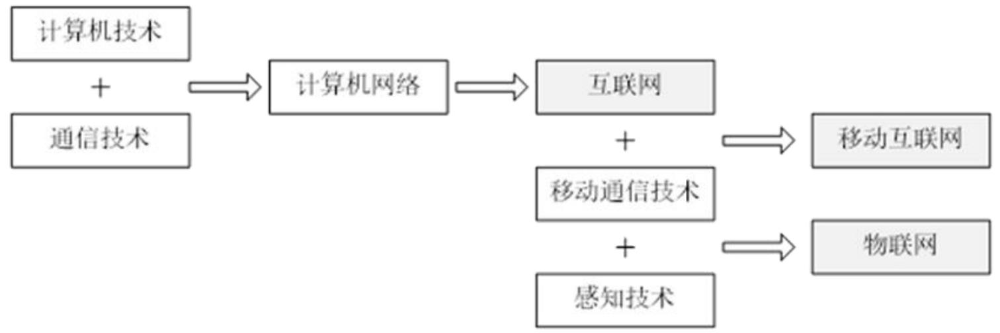
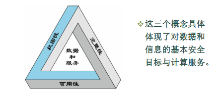

# 网络安全概述

## 物联网

物联网（IoT）是**继计算机、互联网之后，信息产业的第三次发展浪潮**，是未来计算与通信的大方向。

它的发展轨迹为：计算机+通信技术 ➔ 计算机网络 ➔ 互联网+移动通信技术 ➔ **移动互联网+感知技术 ➔ 物联网**。

### 物联网的定义与架构

物联网是通过**RFID、传感器、GPS、激光扫描器**等采集设备，按约定协议，把任何物品与互联网连接起来，进行信息交换和通讯，以实现**智能化识别、定位、跟踪、监控和管理**的一种网络。

其他定义：具有**感知、通信、计算**功能的智能物体互联，实现**泛在感知、可靠传输、智慧处理**的智能服务系统。

物联网系统通常采用**分层架构模型**。

- **三层模型**：
  - **感知层**（负责感知采集，如传感器、RFID标签、摄像头等）
  - **网络层**（负责传输汇聚，包括接入层、汇聚层和核心交换层等专用或公共网络）
  - **应用层**（面向业务，如智能交通、智能医疗、智能电网等）
- **四层模型**：感知层 → 网络层 → **中间件层** → 应用层
  - 在应用层和网络层之间增加了**管理服务层（中间件层）**，用于数据挖掘、大数据存储与处理等。

## 物联网安全的定义与核心属性（★ 重点考点）

### 定义

**物联网安全**是指保护物联网的硬件、软件及其系统中的数据，使其**不因偶然或恶意的原因遭到破坏、更改、泄露**，从而保障物联网系统能够**连续、可靠、正常地运行**，提供不中断的服务。

物联网安全威胁和物联网安全技术是网络安全含义最基本的表现｡

物联网安全 = **所有保护物联网的方法**（技术 + 管理） + **物联网本身存在的安全威胁**。

其中物联网安全主要包括数据的安全、网络的安全和节点的安全。

- **数据安全**：数据不被盗、不改、不丢
- **网络安全**：网络不被攻击、不瘫痪
- **节点安全**：每个物联网设备（传感器、摄像头等）本身安全

### 物联网安全属性

**三大基本属性（CIA三元组）**：

- **机密性 (Confidentiality)**：确保信息只能被授权对象获取或理解，防止**泄露**。
  - **数据机密性**：确保隐私或机密信息**不能被没权限的人使用、不能泄露给没权限的人**。
  - **隐私性**：个人能**控制**自己的信息被谁收集、存在哪、能告诉谁。
- **完整性 (Integrity)**：确保信息和程序只能在指定的和授权的方式下被修改，即使被修改也能被发现，避免遭到非授权**篡改**。
  - **数据完整性**：内容没被篡改、造假
  - **系统完整性**：系统没被搞坏、正常运行
- **可用性 (Availability)**：确保系统能够迅速工作，可靠地为授权用户提供服务，**不拒绝合法访问**。

| 类别         | 机密性（防泄密）             | 完整性（防篡改）                    | 可用性（防失效）              |
| ------------ | ---------------------------- | ----------------------------------- | ----------------------------- |
| **硬件**     | —                            | —                                   | 设备被盗 / 禁用，无法提供服务 |
| **软件**     | 未经授权复制软件             | 程序被修改，运行异常 / 执行恶意行为 | 程序被删除，无法访问使用      |
| **数据**     | 非法读取、分析数据，泄露隐私 | 修改 / 伪造文件，破坏数据真实性     | 文件被删除，无法访问使用      |
| **通信线路** | 窃听消息、观察流量模式       | 消息被改 / 延迟 / 重放 / 伪造       | 消息被破坏 / 删除，网络不可用 |

**三大延伸（扩展）属性**：

1. **可认证性 (Authentication)**：确认通信实体或数据源的真实身份
   1. **对等实体认证**（连接中的实体身份确认）：当两个实体在不同系统中实现相同协议时，就互为对等实体，通常指用户应用实体
   2. **数据源认证**（数据来源确认）：为特定的数据单元（如数据报文）的来源提供确认。这里的数据源点主要指主机的标识
   3. **对等实体认证用在连接的建立阶段或者数据传输阶段**。保证该实体没有进行**假冒**或对前面的连接进行**非授权重放**，而数据源认证应用于**高安全级别的网络通信**
2. **可控性 (Controllability)**：即数据的可靠性，指控制信息在授权范围内的流向和行为。验证身份后，判断其“能干什么”。
   1. 权限控制：系统需要能够控制谁能够访问系统或网络上的数据，以及如何访问，即对数据具有只 读或是修改属性
   2. 日志记录：系统还要将用户的所有网络活动记录在案
3. **不可抵赖性/不可否认性 (Non-repudiation)**也可以是可核查性：通信发生后，相关方**不能否认**自己曾经执行过的行为或发送/接收的信息。

## 物联网安全的产业现状

- **终端高危漏洞多（先天不足）**：设备出厂时密码极简（，通信不加密，固件有漏洞且无法打补丁升级。
- **终端防护措施不足（后天裸奔）**：物联网设备往往成本低、内存小，根本装不上杀毒软件
- **安全环节投资占比低（防范意识差）**：极少提前规划安全防护

## 物联网安全威胁分析

主要原因：**系统的开放性、系统的复杂性、人的因素**

除了传统互联网的开放性、复杂性、系统软件漏洞及用户安全意识弱（如不更新密码）等系统层面原因外

- **规则和软件没写好（协议、系统与应用的漏洞）**：网络协议，操作系统和应用系统的漏洞
- **恶意攻击（含合法用户）**
- **网络物理设备的电磁泄露**

也就是**规则没定好（协议弱点）、代码没敲好（系统/应用漏洞）、架构没搭好（设计缺陷）、人没管好（合法用户攻击），甚至连设备硬件本身都在“漏风”（物理电磁泄露）**

## 常见安全威胁及破坏的属性（★ 核心考点）

网络信息在传输过程中主要面临以下四种威胁手段，

**截获 (Interception)**：窃听通信内容或观察流量模式。➔ **破坏了机密性**。

**中断 (Interruption)**：使通信、线路或服务不可用。➔ **破坏了可用性**。

**篡改 (Modification)**：修改传输中的数据报文。➔ **破坏了完整性**。

**伪造 (Fabrication)**：冒充他人发送虚假信息。➔ **破坏了可认证性**。 

*听到了 ➔ 截获 ➔ 机密性；断掉了 ➔ 中断 ➔ 可用性；改掉了 ➔ 篡改 ➔ 完整性；装成别人 ➔ 伪造 ➔ 可认证性。*

## 物联网的安全体系结构

为了应对上述威胁，物联网需要建立多重的端到端安全防御体系，与其网络架构相对应，物联网的安全架构可以根据物联网的架构分为：感知层 安全、网络层安全、应用层安全。

**感知层安全**：侧重于感知设备物理安全、**RFID安全**（如访问控制、密码算法）、**传感器网络安全**（如密钥管理、入侵检测等）。

**网络层安全**：侧重于无线与有线接入安全（如WLAN加密认证、3G/4G认证机制）、以及核心网传输安全（如 **IPSec/VPN** 数据加密）。

**应用层安全**：侧重于具体的业务数据处理安全、**隐私保护**、云安全（如云存储的访问控制与数据保密性）等。