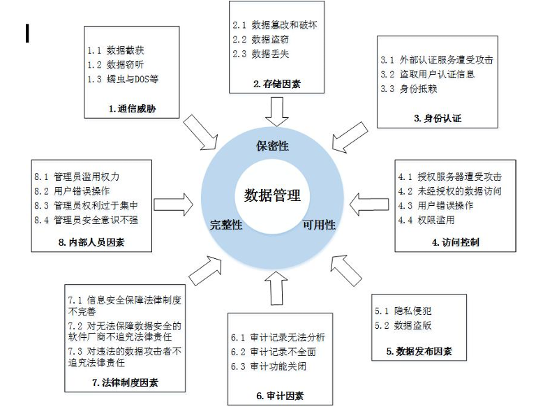
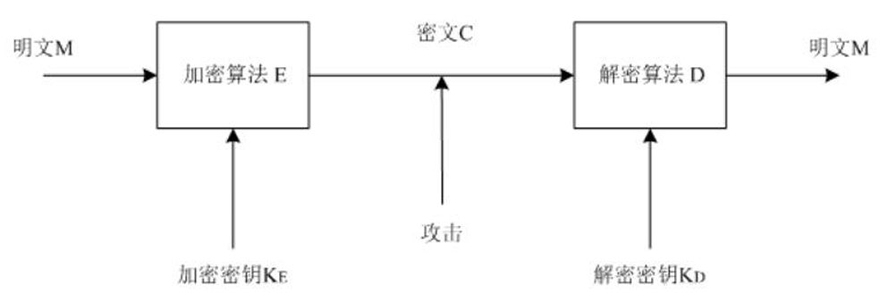
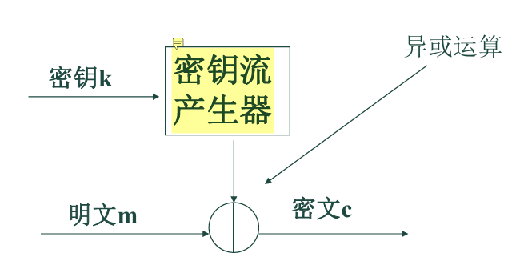
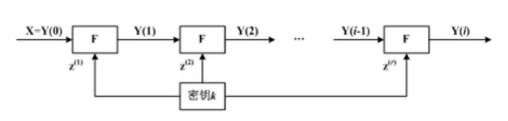
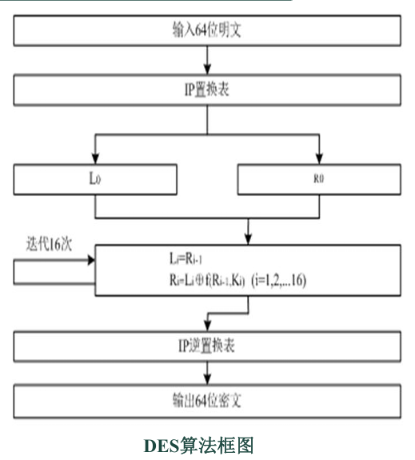
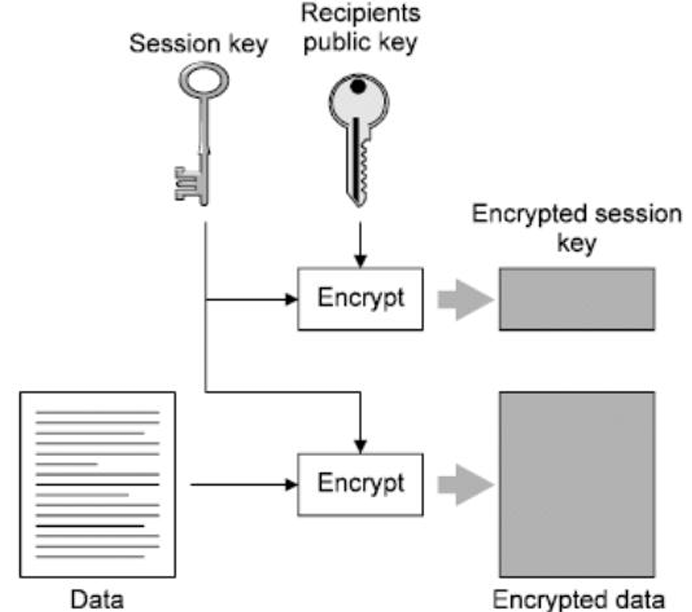
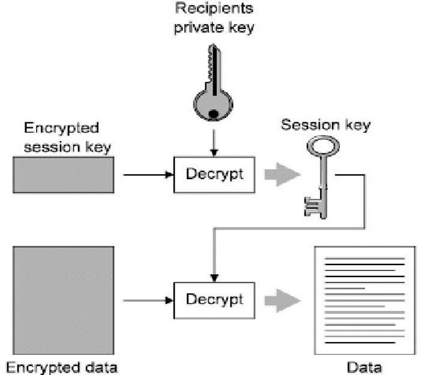
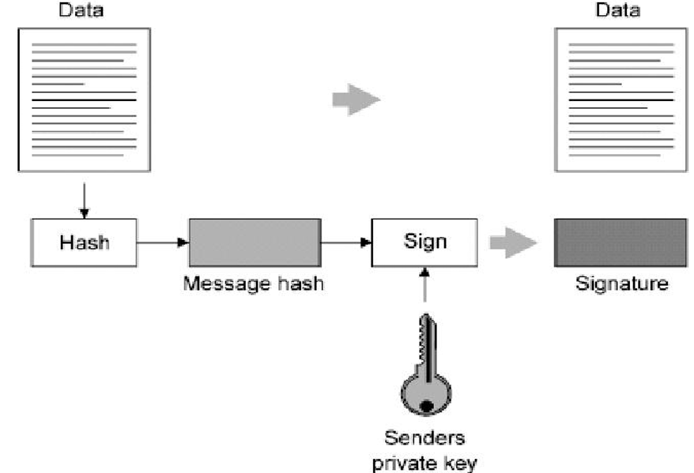
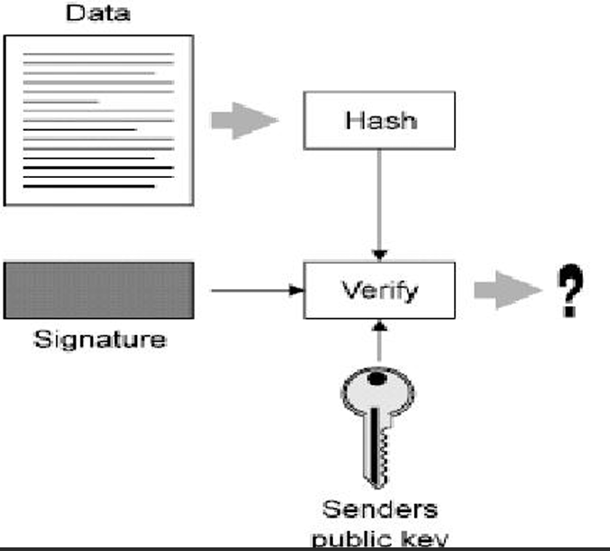

# 密码技术基础

在物联网安全及现代信息架构中，密码技术是保障数据机密性、完整性、可用性及身份真实性的底层基石。

## 密码学概论

### 1.1 密码学的两大分支与辩证统一

密码学（Cryptology）是研究**保护信息安全性**的一门独立学科，由两个既相互对立又高度依存的分支构成：

| 分支名称                       | 研究核心                                                     | 角色定位   | 辩证统一关系                                                 |
| ------------------------------ | ------------------------------------------------------------ | ---------- | ------------------------------------------------------------ |
| **密码编码学** (Cryptography)  | 研究密码方案的设计与信息编码方法，寻找**隐藏信息**的数学规则。 | **防御者** | **共生演化**：编码学需预判分析学的攻击手段，通过分析学的进步来强化算法。为了创建安全的密码，必须具备分析者的视角。 |
| **密码分析学** (Cryptanalysis) | 研究如何从密文推演明文、密钥或算法，**破译隐藏信息**。       | **攻击者** | **同一枚硬币的正反面**：安全的密码体制必须通过严苛的分析验证。分析学推动了编码技术从脆弱走向坚韧。 |

### 密码系统的核心组成要素

加密技术是对信息进行编码（加密）和解码（解密）的技术，

- 编码（加密）是把原来可读信息（又称明文）译成代码形式（又称密文）
- 其逆过程就是解码（解密）

**密码算法**(Cryptography Algorithm)：是用于加密和解密的数学函数。是一组数学规则，规定加密和解密是如何进行的。

| 要素             | 定义与职责                                                   |
| ---------------- | ------------------------------------------------------------ |
| **明文 (M)**     | 原始的可读信息，即加密算法的输入。                           |
| **密文 (C)**     | 加密后的不可读代码形式，是传输或存储的状态。                 |
| **加密算法 (E)** | 对明文进行编码的一组数学规则，描述为 C = E_{K_E}(M)。        |
| **解密算法 (D)** | 将密文还原为明文的逆向逻辑，描述为 M = D_{K_D}(C)。          |
| **密钥 (Key)**   | 控制加解密算法操作的随机值，决定了算法的具体实现。可以分为加密密钥和解密密钥 |
| **密钥空间**     | 产生密钥的所有可能取值范围，其规模直接决定对抗穷举攻击的强度。 |

### 密码学发展的历史飞跃

密码学的发展经历了三次范式转移，其中1976年的跨越尤为关键：

1. **古典密码（1949年前）：** 侧重手工或简单机械操作，安全性依赖于算法的保密。
2. **转折期（1949-1975年）：** 伴随计算机科学诞生，开始利用电子电路实现复杂逻辑。
3. **公开密钥时代（1976年至今）：** 1976年，Diffie与Hellman发表《密码编码学新方向》，提出**公开密钥思想**，实现了密码学的“第二次飞跃”。

### 古典密码技术：置换与代换的演练

- **置换密码 (Transposition)：** 字母本身不变，仅改变其物理排列顺序。如**Skytale（天书）加密法**。
- **代换密码 (Substitution)**：用不同比特或字符代替原始信息，位置保持不变。
  - **凯撒密码 (Caesar Cipher)：** 单表代换的特例，原理是字母位移（n=3）。
   - 仿射密码 (Affine Cipher)：代换密码的数学泛化。

     - **加密公式：****加密动作**：*c*=(*k*1×*m*+*k2)(mod26)。也就是把明文字母的数字 *m* 乘以 *k*1，再加上 *k*2，最后除以26取余数，得到密文字母 *c*。
    - **解密动作**：*m*=*k*1−1×(*c*−*k*2)(mod26)。解密是加密的逆运算：先把加上的 *k*2 减掉，然后再除以 *k*1。但在模运算（取余运算）中，我们不能直接做除法，而是要乘以 *k*1 的**“模乘法逆元（*k*1−1）”**。
    - **核心限制：** k_1 必须与 n=26 **互素**。若不互素，会导致不同明文映射至相同密文，造成解密歧义。

## 对称密码体制：效率与保密的平衡

### Kerckhoff原理

**Kerckhoff原理**指出：**只有密钥是保密的**。即密码分析者知道双方使用的密码系统，包括明文的统计特性、加解密体制等， 唯一不知道的是密钥

### 对称密码定义

**对称密码**：加密和解密使用的是**同一把钥匙**（密钥）

对称密码术通常需要在一个受限组内共享密钥并同时维护其保密性。

所以**速度极快**。但是**密钥共享太难**。

**密钥长度**：我们常听到的 56位（如DES）、128位（如AES），指的就是对称密钥的长度。在算法公开的情况下，**密钥越长，黑客靠暴力猜解的难度就越大，安全性就越高**

### 流密码与分组密码

根据处理数据的方式，对称密码分为流密码与分组密码：

| 特性         | 流密码 (Stream Cipher)，序列密码                       | 分组密码 (Block Cipher)，块加密                              |
| ------------ | ------------------------------------------------------ | ------------------------------------------------------------ |
| **变换逻辑** | 随时间变化的逐位/逐字节加密变换。                      | 文数据**固定切分成一组一组的等长块**，进行固定不变的数学变换。 |
| **典型优势** | 转换速度极快、错误传播低、硬件电路简单。               | **高强度、扩散性好**、对插入攻击敏感。                       |
| **技术缺陷** | **低扩散性**（不够混乱，规律容易被抓）、对修改不敏感。 | 处理速度相对较慢、存在错误传播。                             |
| **典型算法** | RC4, SEAL。                                            | DES, AES, 3DES。                                             |
| **应用领域** | 军事、外交等实时流数据加密。                           | 磁盘存储、标准化网络协议。                                   |

分组密码又可分为三类：置换密码、替换密码和乘积密码

### **DES（数据加密标准）**

**DES (Data Encryption Standard)** 是分组密码的工程典范，其设计细节是高频考点：

1. **分组与密钥结构：** 分组长度为**64位**。密钥标称64位，但**第8, 16, 24, 32, 40, 48, 56, 64位用作奇偶校验位**。因此，**有效密钥强度仅为56位**。密钥可为任意的56位数

2. 执行阶段：
   1. **初始置换（IP）**：先把64位明文的排列顺序按一张固定的规则表彻底打乱

   2. **一分为二**：将打乱后的64位数据从中间劈开，分成左半部分（*L*0）和右半部分（*R*0），各32位

   3. **16轮迭代运算（核心）**：采用著名的 **Feistel 结构**。每一轮中，右半边（*R**i*−1）会进入“轮函数F”加工，然后将结果与左半边（*L**i*−1）进行异或，变成新的右半边；而原来的右半边直接变成新的左半边（即：*L**i*=*R**i*−1，*R**i*=*L**i*−1⊕*F*(*R**i*−1,*K**i*)）

   4. **初始逆置换（IP−1）**：16轮循环结束后，把最后的左右两半合并，再进行一次与第一步完全相反的位置置换，最终输出64位密文。

      

3. 核心部件：**轮函数** **F **与 **S盒  (S-box)：**
   - 在上述的16轮迭代中，每一轮都会用到一个**轮函数** *F*。这部分是DES安全性的核心，它分四步将32位的数据变幻莫测：
     - **E盒扩展（扩充置换）**：输入是32位，为了能和48位的子密钥运算，先通过E盒将它“拉伸”扩展成48位。
     - **异或运算**：将扩展后的48位数据，与这一轮专属的48位子密钥（*Ki*​）进行按位异或运算。
     - **S盒代换（灵魂步骤）**：异或后的48位数据被分成8组，每组6位，分别送入8个不同的S盒（*S*1 到 *S*8）。**S盒是整个DES中唯一的非线性部分，从而实现了明文消息在密文消息空间上的随机非线性分布，是实现混乱、保证安全的核心**。
       - *S盒的查表规则（常考操作）*：输入6位（假设为 *a*1​*a*2​*a*3​*a*4​*a*5​*a*6​），用第1和第6位（*a*1​*a*6​）组成行号，中间的第2到第5位（*a*2​*a*3​*a*4​*a*5​）组成列号。查表找到对应的数字后，输出一个4位的二进制数。
       - 8个S盒各自输出4位，合并起来重新变成 **32位**。
     - **P盒置换**：最后，这32位数据再经过P盒打乱一次位置，输出最终的32位轮函数结果。

4. **子密钥生成**

   1. 原始的56位密钥通过**置换选择1（PC-1）**去掉校验位，选出56位，并分为 *C*0 和 *D*0（各28位）。
   2. 根据规定好的移位表，分别对C和D进行**循环左移**。
   3. 移位后合并，再经过**置换选择2（PC-2）**，从56位中挑选出 **48位** 作为这一轮的子密钥 *Ki*

5. **安全特性：** **密和解密用的是同一套算法硬件和流程**！加密时子密钥的顺序是 *K*1,*K*2,…,*K*16；而解密时，依然是这段密文输入，但子密钥按反顺序 *K*16,*K*15,…,*K*1 喂入机器，最后吐出来的直接就是明文。结构与加密完全相同，只是子密钥顺序相反。

缺点：**密钥长度太短（有效仅56位）**，1990年提出的**差分密码分析法**和后来的**线性密码分析法**也对DES构成了严重威胁

**续命方案（三重DES / 3DES）**：为了解决密钥过短的问题，人们提出了3DES。它使用两个独立的密钥（*K*1 和 *K*2），让数据在DES机器里跑三次，使得有效密钥强度瞬间提升到了112位

### AES（高级加密标准）

AES并没有改变大方向，它和DES一样，依然属于**对称密码体制**中的**分组密码**（即加密解密用同一把钥匙，且把明文切成一块一块地打包处理）

但是不同于DES，AES的明文/密文分组长度，以及它的密钥长度，都不是死板固定的。它们都可以灵活地选择 **128比特、192比特或256比特**

###  IDEA（国际数据加密算法）

和 DES、AES 一样，都属于**对称密码体制**中的**分组密码（数据块加密算法 Block Cipher）**

- **数据块大小：64位**（这一点和 DES 一样，切包大小相同）。
- **密钥长度：128位**（这一点远超 DES 的56位，安全性得到了质的飞跃）

**IDEA 的加工流水线**：

- **8轮迭代 + 1个输出变换**：整个加密过程跑 8 圈（Round）。
- **三种核心运算**：它没有 DES 里那种复杂的 S盒/P盒 查表置换，而是巧妙地结合了三种纯数学运算：**模乘法、模加法和按位异或（XOR）**。
- **密钥扩展**：把初始的 128位 密钥，通过循环左移和截取，扩展成了 **52 Byte** 的子密钥序列（供8圈迭代和最后输出使用）。
- **加解密同体**：和 DES 一样，加密和解密用的是**完全相同的过程**，只是输入的子密钥不同（加密用EK，解密用DK）

⚔️ 对称分组密码“三剑客”核心对比表

| 比较维度           | **DES (数据加密标准)**                           | **AES (高级加密标准)**            | **IDEA (国际数据加密算法)**               |
| ------------------ | ------------------------------------------------ | --------------------------------- | ----------------------------------------- |
| **分组长度**       | 固定 **64位**                                    | **可变**（常为128位）             | 固定 **64位**                             |
| **密钥长度**       | 固定 **56位** (有效)                             | **可变**（128 / 192 / 256位）     | 固定 **128位**                            |
| **安全性**         | **不安全**。已被差分分析等破译，只能靠 3DES 续命 | **极高**。能抵抗所有已知攻击      | **极高**。不受差分分析影响                |
| **软硬件实现**     | 硬件快，软件慢                                   | 各种平台上易于实现，速度极快      | **软硬件实现一样快**                      |
| **典型特点与应用** | 采用16轮Feistel结构，依赖S盒实现非线性混乱       | 设计简单，取代DES成为最新国际标准 | 避开美国法律限制，广泛用于 **PGP 和 SSL** |

---

## 非对称密码体制（公钥密码体制）

加密和解密时所使用的密钥是不同的，即有**两个密钥**

- 一个是可以公开的 ，另一个是私有的，这两个密钥组成一对密钥对。
- 如果使用其中一个密钥对数据进行加密，则只有用另外一个密钥才能解密。同时想由一个密钥推知另一个密钥，在计 算上是不可能的

公钥密码体制是建立在数学函数基础上的 ，而不是建立在位方式的操作上的

### 密钥功能分配逻辑

- **公钥 (Public Key)：** 允许公开，用于**加密数据或验证数字签名**。
- **私钥 (Private Key)：** 绝密保管，用于**解密数据或生成数字签名**。
- **核心逻辑对立：** “公钥加密/私钥解密”确保保密性；“私钥签名/公钥验签”确保身份真实性。
  - **机密性**：通过**“数据加密”**实现。用接收方的公钥加密，确保只有接收方（有私钥）能看懂。
  - **可认证性**：通过**“数字签名”**实现。证明发送方的真实身份。一般用发送方私钥进行签名
  - **数据完整性**：通过**“数字签名”**实现。保证信息没被黑客偷换或篡改。哈希
  - **不可抵赖性**：通过**“数字签名”**实现。发过消息事后绝不能赖账，第三方可以实锤证明就是你发的。

### **单向陷门函数**

 单向陷门函数是一一映射关系

- **正向极易（顺滑梯往下溜）**：给定参数，正向计算函数极容易（用公钥加密十分顺畅）。
- **反向极难（想逆向爬滑梯不可行）**：如果不知道隐藏开关（参数 *k*′），要想逆向反推，计算复杂度高到实际上根本不可能实现。
- **陷门=私钥（按下隐藏开关）**：这个参数 *k*′ 就是“陷门”（也就是你的私钥）。**只要你知道这个陷门参数，逆向反推瞬间变得极其简单**（合法接收方瞬间完成解密）。
- **公钥推不出私钥**：给定公钥等公开信息，绝对无法在计算上反推出这个关键的陷门参数 *k*′

### RSA 公钥密码体制

RSA安全性基于**大整数素因子分解难题**。给你两个巨大的素数 *p* 和 *q*，让你乘起来得到 *n*，但是只把这个几百位的巨大结果 *n* 公布出去，需要反向算出它是由哪两个素数乘出来的

一对公私钥是怎么造出来的：

1. **找素数（选材）**：偷偷挑两个超级大的随机素数，命名为 *p* 和 *q*。
2. **算模数** *n*（打底座）：计算 *n*=*p*×*q*。这个 *n* 就是将来要公开的模数。
3. **算欧拉函数** *ϕ*(*n*)**（核心陷门）**：套用数学公式，计算 *ϕ*(*n*)=(*p*−1)(*q*−1)。**这个值极其重要，绝对不能泄露**。
4. ed ≡1 mod φ(n)，就是公钥e和私钥d的关联
5. **选公钥** *e*：随机挑一个数字 *e*，要求它必须和刚刚算出的 *ϕ*(*n*) 互素（即没有除了1之外的公约数）。
6. **算私钥** *d*：利用扩展欧几里得算法，求出 *e* 的模逆元 *d*。公式要求满足：*e*×*d*≡1(mod*ϕ*(*n*))

加解密过程就只剩下纯粹的“求幂取模”运算了：

- **加密（用公钥）**：密文 *c*=*m**e*(mod*n*)。*(把明文* *m* *自乘* *e* *次，然后除以* *n* *取余数)*。
- **解密（用私钥）**：明文 *m*=*c**d*(mod*n*)。*(把密文* *c* *自乘* *d* *次，除以* *n* *取余数)*

*注意限制*：你每次切块加密的明文整数 *m* 必须小于模数 *n*

在实际选择 RSA 参数时必须遵守以下规则：

**必须足够大**：*p* 和 *q* 最好都在 100 位十进制数以上，模数 *n* 至少要大于 **512 比特**。

*p* **和** *q* **必须离得够远**：∣*p*−*q*∣ 必须很大。

**大素数要求**：*p*−1 和 *q*−1 还要分别含有大素数因子。

### ECC（椭圆曲线密码系统）

ECC的安全性基于**“椭圆曲线上的离散对数问题（ECDLP）”**

- 在一条特殊的数学曲线（有限域上的椭圆曲线）上，选定一个公开的起点 *G*。你随机选一个私钥 *k*，在曲线上经过 *k* 次复杂的跳跃得到一个终点 *P*（公钥）。

有了 RSA 还要搞 ECC？考试最爱考它们的对比：

- **绝对优势 1：密钥极短，安全极高（专为物联网而生）**。为了达到相同的安全级别，RSA 可能需要 2048 位的超长密钥，而 **ECC 只需要 233 位**就足够了！这意味着它占用内存更小、传输更省带宽。
- **绝对优势 2：支持双线性映射**。可以衍生出大量高级应用，比如“基于身份的加密”。
- **缺点**：它的数学理论非常复杂，导致它的加密和解密操作的**实现过程（比如写底层代码）比其他机制花费的时间要长**

### 利用公钥完成会话密钥交换

**“利用公钥完成会话密钥交换”**（在工程上通常被称为**混合加密体制**）是现代密码学中最重要、最实用的应用机制。

它的核心智慧在于：**把对称密码（速度极快）和非对称密码（彻底解决密钥分配）的优点完美结合在了一起**。

**发送方操作阶段（加密与打包）**：

- **生成会话密钥（Session key）**：发送方首先生成一个随机的、仅供本次通信使用的**对称密码钥匙**，这就是“会话密钥”。
- **高速加密海量数据**：发送方使用这个**会话密钥**，对需要发送的庞大明文数据（Data）进行对称加密，得到**加密后的数据（Encrypted data）**。
- **公钥“护送”会话密钥**：发送方获取接收方公开的**接收者公钥（Recipients public key）**，并用它将刚刚那个小小的会话密钥进行非对称加密，得到**加密后的会话密钥（Encrypted session key）**。
- **发送**：将“加密后的数据”和“加密后的会话密钥”一起通过网络发送给对方。

**接收方操作阶段（解密与拆包）**： 

- **私钥提取会话密钥**：接收方收到数据包后，首先使用只有自己死死捂住的**接收者私钥（Recipients private key）**，对“加密后的会话密钥”进行解密（Decrypt）。还原出原始的**会话密钥（Session key）**。 
- 解密实际数据**：接收方拿到真正的会话密钥后，再用它去解密（Decrypt）那份庞大的**加密后的数据（Encrypted data）**，最终阅读到原始明文。

## 散列函数与数据完整性

散列函数（Hash Function）被誉为**“数据指纹”**，是确保物联网数据在传输中未被篡改的核心工具。

单向散列函数，又称为单向Hash函数、杂凑函数

把**任意长的输入消息串**变化成**固定长的输出串**且由输出串难以得到输入串的一种函数

1. **核心定义：** 将任意长度的输入映射为固定长度的摘要（Digest）。这个摘要称为该消息的散列值
2. 三大关键特性：
   - **单向性：** 无法从摘要逆向推导明文。
   - **抗碰撞性：** 极难找到两个不同的输入产生相同的输出。
   - **灵敏性：** 输入数据的微小变动（即使是1比特）都会引起摘要的剧烈变化。
3. **防篡改机制：** 发送方发送“明文+摘要”，接收方重算摘要并对比。若一致，则证明数据在截收过程中保持了完整性。

### MD5（信息摘要算法）

能把任意长度的数据块运算成固定的 **128位** 数据输出

- 速度极快、简单紧凑
- 但是已经被**王小云教授**成功**破译**

### SHA（安全散列算法）

较新的散列算法，以最常考的 SHA-1 为例，它产生的是 **160位** 的报文摘要

- 摘要比 MD5 长 32 位，所以**抵抗暴力攻击的能力远比 MD5 强**，且更不容易受密码分析攻击
- 在相同硬件上**运行速度比 MD5 慢**

### MAC（消息认证码）

普通的 MD5 和 SHA-1 只能证明文件“没被改过”（完整性）；而 MAC 是一种**使用了密钥的单向函数**

- 加入了私密的“密钥”参与计算（典型代表是 **HMAC**），所以它不仅能证明信息完整，还能**在系统或用户之间认证文件或消息的真实来源**（身份认证功能）

### CRC（循环冗余校验码）

*CRC 并不属于密码学散列算法，只是作用大致相同才归入此类*

- 实现简单、占用系统资源非常少，用软硬件都能轻松实现
- 被广泛用于数据传输的**差错检测**

---

## 数字签名、PKI与数字证书

### 数字签名的生成与验证

数字签名，又称为公钥数字签名、电子签章

它是只有信息发送者才能产生的、别人无法伪造的一段数字串，是对发送者发送信息真实性的有效证明

- **消息源认证**：接收者能确信消息确实来自声明的发送者。
- **不可伪造**：签名是独一无二的，别人无法假冒。
- **不可重用**：签名与特定文件绑定，不能被挪用到其他文件上。
- **不可抵赖**：发送方事后绝对不能否认自己签过这份文件（因为只有他的私钥能签出这个名）。

数字签名是实现**不可抵赖性**（Non-repudiation）的唯一技术手段。

数字签名技术是将摘要信息用**发送者的私钥**加密，接受者只有用**发送者的公钥**才能解密被加密的摘要信息

1. **签名过程（发送方）**：

   - 先用 Hash 函数对“原文”提取出一个“消息摘要”。

   - 发送方用自己的**私钥**对这个摘要进行加密，生成“数字签名”。

   - 将原文和数字签名一起打包发给接收方

     

2. **验签过程（接收方）**

   - 接收方收到后，用发送方的**公钥**对数字签名进行解密，还原出原来的“消息摘要（Hash 1）”。

   - 接收方用相同的 Hash 函数，对收到的“原文”重新计算一遍，得到一个新的“消息摘要（Hash 2）”。

   - **对比 Hash 1 和 Hash 2**：如果完全相等，则说明信息在传输中没被篡改（完整性），且确实是拥有该私钥的人发送的（真实性）。

     

数字签名算法主要有三种：RSA签名、DSS（数字签名标准 ）签名和Hash签名

数字签名是通过密码算法对数据进行加密/解密变换实现的。

但是存在一个问题，需要证明公钥的实际拥有者，即公钥必须由接受者信任的人（身份认证机构）来注册。注册后身份认证机构给用户发一个**数字证书**

### RSA数字签名技术

RSA数字签名技术，是“**散列算法**（Hash）”与“**RSA非对称加密**”的完美组合

**Encryption（加密流程）**：这个过程的终极目标是**机密性**，即**公钥加密，私钥解密。（用接收者的钥匙）**

- Alice 获取 **Bob 的公钥（Bob's public key）**。
- Alice 用 Bob 的公钥对明文进行加密（Encryption algorithm），生成密文发送出去。
- Bob 收到密文后，用只有自己持有的 **Bob 的私钥（Bob's private key）** 进行解密（Decryption algorithm），还原出明文。

**Signature（签名流程）**：**不可伪造和不可抵赖**，即**私钥签名，公钥验签。（用发送者的钥匙）**

- Alice 写好欠条后，用只有自己持有的 **Alice 的私钥（Alice's private key）** 对这段信息（通常是信息的 Hash 摘要）进行加密，这个过程就叫**签名（Sign）**。
- Alice 把签好名的欠条发给 Bob。
- Bob 收到后，用全网公开的 **Alice 的公钥（Alice's public key）** 对签名进行解密，这个过程叫**验证（Verify）**。
- 如果解密成功并且信息匹配，Bob 就可以确信：全天下只有 Alice 的私钥能生成这段代码，所以这绝对是 Alice 签的字！

| 维度           | **Encryption (保密加密)**                | **Signature (数字签名)**                             |
| -------------- | ---------------------------------------- | ---------------------------------------------------- |
| **根本目的**   | 保证信息不被别人偷看（机密性）           | 证明我是谁、且我不能赖账（可认证、不可抵赖）         |
| **发送方动作** | 使用 **接收方** 的 **公钥** 进行加密     | 使用 **发送方自己** 的 **私钥** 进行签名（加密摘要） |
| **接收方动作** | 使用 **接收方自己** 的 **私钥** 进行解密 | 使用 **发送方** 的 **公钥** 进行验证（解密摘要）     |

### PKI（公钥基础设施）与数字证书

PKI 就是专门用来创造、管理、分配、使用、存储以及撤销数字证书和密钥的一整套软硬件基础架构

- 把**公钥密码和对称密码结合起来**，通过第三方可信机构（CA），把“用户的公钥”和“用户的真实身份”死死捆绑在一起
- 保证数据的**机密性**（防偷看）、**完整性**（防篡改）、**有效性/不可否认性**（防赖账）

**PKI 的“铁三角”结构**

- **CA（证书认证机构 / 发证方）**：绝对独立、可信的第三方（相当于**公安局**）。负责核实身份，并最终签发带有身份和公钥的数字证书。
- **证书持有者（申请方）**：向 CA 提交身份证明申请证书的人（相当于**办身份证的市民**）。在通信时，需要向别人出示证书证明自己是谁。
- **依赖方（验证方）**：和持有者通信的人（相当于**查验你身份证的银行柜员**）。他们手里有一份“信任 CA 列表”，当收到证书时，会去验证这张证书到底是不是合法 CA 颁发的，且是否还在有效期内

**CA 内部的“流水线分工”**：**RA（注册服务器 / Reception）**，**VA（审核机构 / Validation）**，**CA（认证中心服务器 / Certificate Authority）**

CA 还有一个极其重要的工作——**生成和处理 CRL（Certificate Revocation List，证书废止列表/黑名单）**

#### 数字证书

证书是一个经证书认证中心的数字签名包含公开密钥拥有者信息以及公开密钥的文件

数字证书可分为签名证书和加密证书

- **签名证书**：用来给信息签名，保证发送方**不可否认**（防抵赖）。
- **加密证书**：用来给传送的信息加密，保证信息的**真实性和完整性**（防偷窥篡改）。

数字证书的格式和内容必须遵循 **X.509 标准**

它里面除了包含版本号、有效期、发行者（CA）名称、主体（你）的名称之外，**最最核心的东西只有两样**：**用户（主体）的公钥信息**。**身份验证机构（CA）的数字签名**。