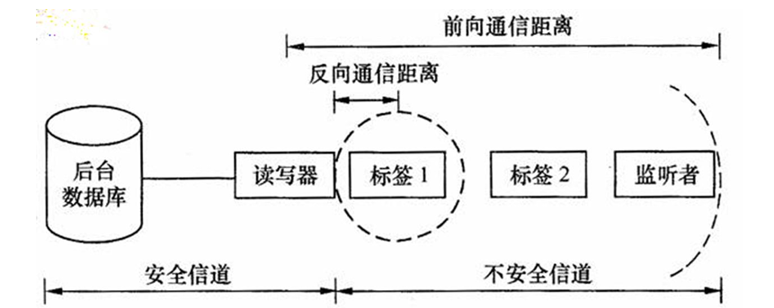
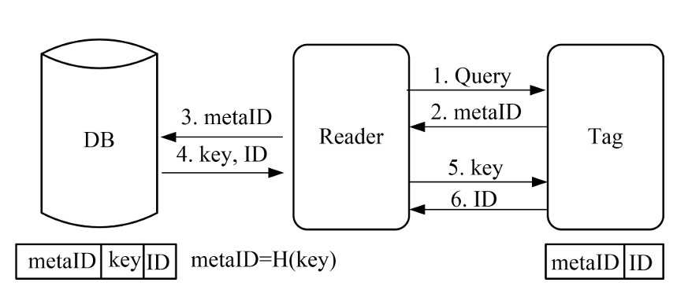
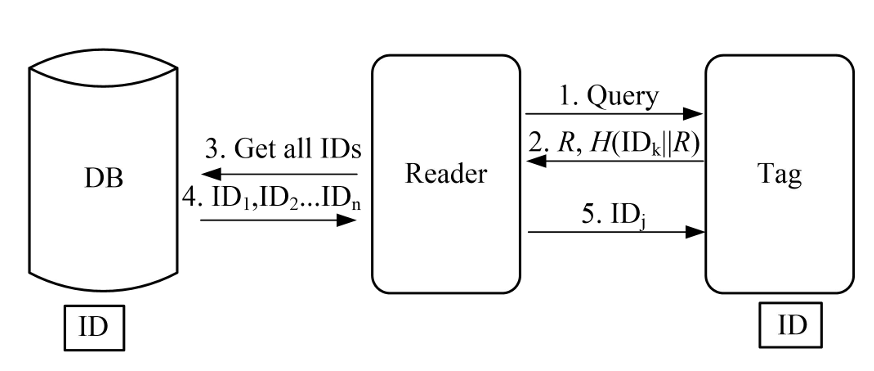
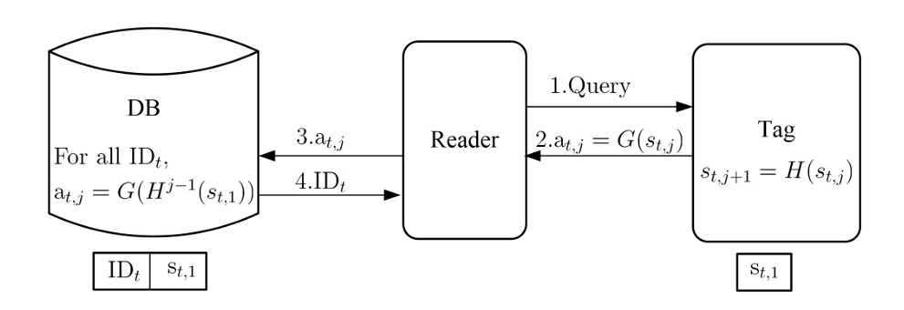
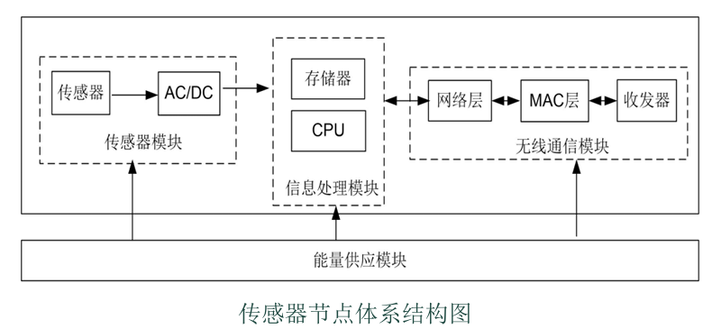

# 感知层安全

在物联网（IoT）的纵向体系结构中，感知层是连接数字世界与物理世界的唯一纽带。

感知层也可以称为**原始信息收集层**，包括信息采集、捕获和物体识别。

感知层设备种类极多（RFID、传感器、GPS等）。更重要的是，所有的感知数据都会通过网络传输到**“云计算处理平台”**进行综合处理和**信息共享**。

物联网体系结构中的三大安全状况，请务必建立这个立体概念：

- **物理安全（硬防线）**：防干扰、防物理屏蔽、防电磁泄漏。
- **运行安全（软防线）**：涉及嵌入式计算模块、密钥管理、密码算法的实现。保证系统完整性，不中断服务
- **通信安全（传输防线）**：保证数据在无线传输过程中不被窃听、篡改和伪造（机密性、完整性、可用性）。

物联网的感知层安全分为三大类，即RFID系统、无线传感器网络和物联网终端系统安全

\--------------------------------------------------------------------------------

## RFID安全：机制、攻击与密码协议

### RFID基本组成架构

RFID（射频识别）技术通过非接触式电磁耦合实现自动识别，是感知层实现“万物互联”的基础

RFID系统一般由3大部分构成：标签、读写器以及后台数据库

- **标签（Tag）**：物体“电子身份证”携带目标识别数据。是RFID 系统真正的数据载体，但是计算能力极弱，通常只包含一个微电子芯片和一根天线

**“信道非对称性”**：

- **前向信道（读写器 ➔ 标签）**：读写器一般插着电源，像个大喇叭一样“大声喊”，通信范围很远。
- **反向信道（标签 ➔ 读写器）**：标签通常没有电池（靠吸收读写器的电磁波供电），只能“小声嘟囔”，通信范围极短

不对称性导致了安全设计的困难

基本假设：标签与读写器之间的通信信道是不安全的，而读写器与后台数据库之间的通信信道则是安全的

### RFID系统安全威胁，安全需求与攻击方法

#### **RFID安全威胁**

- **标签计算能力极弱**：最廉价的标签只有 64~128 位的空间，只能存个 ID。因为成本太低，它根本装不下复杂的杀毒软件或高级加密算法，所以标签本身较难具备足够的安全能力
- **无线网络的脆弱性**：射频信号是在空气中传播的，没有任何物理保护。
- **业务隐私挂钩**：一旦标签信息泄露，往往直接牵扯到背后的使用者，导致严重的隐私危机。

攻击往往分两类，要么**攻击物理实体**（直接砸坏标签或读写器），要么**攻击信道的通信过程**（在空气中拦截信号）

#### **核心安全需求**

1. 机密性（防止标签数据泄露，信息只能被授权访问）
2. 完整性（防止识别信息篡改，包括标签数据和通信数据）：通常使用**MAC（消息认证码 / Hash）**来进行数据完整性的检验
3. 可用性（确保识别服务不中断）
   - *物理层面*：防撕毁、防金属屏蔽
   - *软件层面*：因为标签没电没算力，所以**安全算法绝不能太复杂，要尽量避开公钥运算（如 RSA）**
4. 可审计性 (防假冒、可追踪)：要求电子标签及其数据是真实的
5. 隐私性 (防跟踪)：信息隐私，位置隐私，交易隐私

#### **针对RFID系统的常见攻击方法**

1. **窃听（Eavesdropping）**：攻击者可以在设定通信距离内使用相关设备偷听信息。窃听是一个隐藏的行为，它不会产生任何信号
2. **中间人攻击（MITM）**：“敌意读写器”插在真实的标签和读写器之间去做**会话劫持**，即“拦截数据 ➔ 修改数据 ➔ 重新发送数据”
3. **欺骗、重放与克隆**
   - 欺骗(spoofing)：基于已掌握的标签数据通过阅读器 
   - 重放(replaying)：将标签的回复记录并回放
   - 克隆(cloning)：形成原来标签的一个副本
4. **拒绝服务攻击（DoS）**：通过不完整的交互请求消耗系统资源，使系统不能正常工作
5. **物理破解（Corrupt）**：在物理层面对于标签进行破解
6. **RFID 病毒与篡改**：
   - 篡改信息(modification)：进行非授权的修改或擦除标签数据
   - RFID病毒(virus, malware)：**把电脑病毒写进 RFID 标签里**，从而顺着读写器**直接感染后台的电脑数据库系统**

### RFID安全的物理机制

实现RFID安全性机制所采用的方法主要有三大类：物理机制、密码机制，以及 二者相结合的方法

其中物理机制通常用于一些**低成本的标签**中，因为这些标签难以采用复杂的密码机制来实现与标签读写器之间的安全通信

1. **静电屏蔽（法拉第笼）**：把标签装进金属网罩里，直接物理屏蔽无线电波，安全但是不方便
2. **阻塞标签（Blocker tag）**：在真标签旁边放一个“捣乱标签”，它会不断发射假序列码来掩盖真标签
3. **主动干扰（Active jamming）**：主动发射强烈的无线电信号，把附近的读写器全部“吵聋”，但同时严重干扰周围其他正常的无线通信

还有一些针对信道做出防御

- **改变阅读器频率** &  **改变标签频率**：不使用公共频率，而是跳到一个别人不知道的保留频率去通信。
- 需要标签具备极高的变频硬件能力，会导致**电路极其复杂、成本过高**

或者通过改变标签的工作状态来保护隐私，即**生命周期与状态控制**

1. **Kill 命令机制（“自杀”机制）**：超市结账时，读写器发一条指令，直接从物理上永久烧毁标签，简单但是不可逆
2. **休眠（Sleeping）机制（“装死”机制）**：不摧毁标签，而是让它“睡着”，以后用特定的唤醒口令叫醒它
3. **隐私比特/阻塞机制（“公私分明”开关）**：标签里设置一个状态位。判断是否标签接受无限制的公共扫描

### RFID安全密码协议（重点 &&&）

标签分为了三类：**基本标签、对称密码标签、公钥密码标签**

- 基本标签：不能执行加密操作，但可执行XOR操作和简单的逻辑控制的标签
- 对称密码标签：指能够执行对称密钥加密操作的标签。
- 公钥密码标签：指能够执行公钥加密操作的标签。

目前已经提出了大量RFID安全协议，这里重点介绍几个典型的认证协议

#### Hash 锁协议（Hash-Lock）—— “静态密码箱”

不能明文传输真实的 `ID`，那我就给标签加个“锁”，用一个假名（`metaID`）来代替真名

该协议旨在防止攻击者直接读取标签的真实ID，其认证流程如下：

首先开始时读写器生成一个随机钥匙 `key`，算出 `metaID = H(key)`，把 `metaID` 写进标签，标签落锁。数据库里存好 `(metaID, key, 真实ID)`，然后就是双向认证过程：

1. **初始化：** 读写器后台存储标签的 ID 及其对应的散列值 metaID = H(ID)。
2. **标签响应：** 当读写器查询时，标签向其发送 metaID。
3. **查询与验证：** 读写器通过后台查找对应的 ID。
4. **解锁：** 读写器将`key`发送给标签。标签对收到的 key 进行 Hash 运算，若结果等于其 metaID，则解锁并传输真实的ID。
5. **认证：**读写器比较接收到的ID与后端数据库的ID一致，若一致，则对标签的认证通过；否则认证失败

没有ID动态刷新机制，认证通过后的标签标识 ID 仍以明文的形式在不安全信道传送，因此攻击者还是可以对标签进行有效地追踪。

**静态假名被追踪**后**极易被假冒和重传**

**随机化 Hash 锁协议 —— “动态数学题”**

- 既然静态 `metaID` 会被追踪，那就让标签**每次回答都不一样（引入随机数R）**
- “挑战——应答”机制，即认证方提问，被认证方回答，如果回答正确，则说明被认证方通过了认证方的认证
  - **标签出题**：标签生成一个随机数 *R*，把自己的真实 *IDk* 和 *R* 混在一起算个 Hash 值。然后把 *R* 和 *H*(*IDk*∣∣*R*) 发给读写器
  - **读写器“暴力破解”**：请求数据库所有数据一一比对
  - **标签验证：**IDj与IDk是否相同，如相同，则对读写器的认证通过。

- 认证通过后的标签标识 ID 仍以明文的形式在不安全信道传送
- 每一次标签认证时，后端数据都需要将所有标签的标识发送给读写器，效率低下

#### **Hash链协议（Hash Chain）--**动态更新与Hash链条****

**Hash链协议（Hash Chain）** 为实现前向安全性（Forward Security），即攻击者即便获得当前密钥也无法推算历史通信，Hash 链协议利用了单向函数的动态演进：

- Hash链协议是基于**共享秘密的“挑战——应答”协议**。当不同读写器发起认证请求时，若两个标签中的hash函数不同， 则标签的应答就是不同的，
- 标签每次响应读写器后，其存储的随机标识符 s_i 会自动演进为 s_{i+1} = H(s_i)。

在出厂前，标签和后台数据库先偷偷约定好一个“初始秘密值”（*st*,1）。 当读写器第 *j* 次扫描标签时

1. **读写器查岗**：发出“Query”请求。
2. **标签回答并自我变异（★ 最核心步骤）**
   1. 生成回答：标签用当前的秘密值 *st*,*j* 放进 *G* 函数里算一下，得出这次的回答 *at*,*j*=*G*(*st*,*j*)，发给读写器。
   2. *密码变异*：刚一发完，标签立刻用另一个 *H* 函数，把当前的秘密值变成下一个秘密值 *st*,*j*+1=*H*(*st*,*j*)。旧密码被抛弃！
3. **读写器跑腿**：读写器拿着 *at*,*j* 传给后台数据库
4. **数据库疯狂解方程**：数据库里存着所有标签的初始密码，它必须顺着链条 *Hj*−1(*st*,1) 一步步往下算，看看全库成千上万个标签里，到底谁能算出这个 *at*,*j*。如果算对了，就把真实 *ID* 发给读写器，相认成功！

该协议满**彻底不可追踪（防位置泄露）**：，因为G是单向函数，攻击者观察到的at,j和at,j+1是 不可关联的。

同时具有**前向安全性（Forward Secrecy）**：因为 *H* 算法是**单向不可逆**的，知道今天的秘密值也绝不可能倒推出昨天的秘密值 *st*,*j*−1

**三大缺点**：

- **防不住“重传和假冒攻击”**，截获 *at*,*j* ，抢在读写器收到之前，发过去，照样能通过门禁伪装
- **把数据库“累死”**：数据库为了验证标签，要把所有标签拿出来，每个最多进行 *m* 次 Hash 链条运算
- **标签成本急剧飙升**：以前的协议只要 1 个 Hash 函数，而这个协议竟然需要 *G* 和 *H* 两个不同的 Hash 函数

### Good Reader（好读写器）协议

让**标签去查读写器的岗**！这就是它作为**单向认证协议**（只认证读写器，不认证标签）的核心本质

在出厂时，标签必须提前存好合法读写器的名字（`ReaderID`）

- **读写器询问**：读写器发起“Query”请求，试图唤醒标签
- **标签回应**：标签生成了一个**随机数** *k* 发给读写器，同时用存好的读写器ID默默算出了标准答案：*a*(*k*)=*H*(*ReaderID*∣∣*k*)
- **数据库验证：**读写器拿到随机数 *k* 后，传给后台数据库。数据库用自己真实的 `ReaderID` 和 *k* 组合，也算出一个 Hash 值 *a*(*k*)=*H*(*ReaderID*∣∣*k*)
- 读写器返回：写器把算好的答案 *a*(*k*) 发给标签
- 标签验证：标签把自己悄悄算的 *a*(*k*) 与读写器发来的 *a*(*k*) 进行对比认证

在这个协议里，数据库**只需进行 1 次 Hash 运算**（算出自己的 *a*(*k*) 即可），极大地缩短了运算时间

**防追踪**：标签每次面对问询，吐出的只有随机数 *k*，不会输出固定的 ID

但是**读写器依然不知道标签到底是谁**，根本没有完成双向身份识别，并且**极度违背 RFID 硬件限制（成本太高）**，需要**在标签里存储全网所有合法读写器的** **ReaderID**

### David 数字图书馆协议 —— “完美的双盲特工接头”

** 在认证过程中引入两个随机数（Nonce），实现读写器与标签的双向认证，主要针对隐私敏感场景设计，确保存取记录不可关联。

系统运行前，后台数据库和每一个标签之间，都偷偷预先约定好了一个**绝密的专属密码（秘密值** s）

首先**读写器发起询问**：读写器现场生成了一个**随机数** *RR* 扔给标签

然后就是**标签**

- 标签收到 *RR* 后，，也生成了一个自己的**随机数** *RT*
- 根据秘密值 *s*，结合两个随机数 *RR* 和 *RT*，放进一个强大的伪随机函数 *fs* 里，算出一个极其复杂的“乱码罩子” `fs(0, RR, RT)`
- 标签用这个“乱码罩子”和自己的真实 *IDi* 进行 ⊕**（异或运算）**，得到密文 *σ*
- 标签把 (*RT*,*σ*) 发给读写器。

接着**数据库**进行验证

- 读写器把 (*RT*,*σ*) 传给数据库。
- 数据库利用所有标签的秘密值 *s*，算出对应的 `fs(0, RR, RT)`，然后和收到的密文 *σ* 进行**异或**
- 异或出来的结果刚好等于数据库里存的某个 ID，**标签认证通过**
- 数据库变换了一个参数（把公式里的 0 换成了 1），算出一个新的罩子 `fs(1, RR, RT)`，再和 *IDi* 异或，生成了一个新的密文 *β*，发给读写器

**标签认证读写器**

- 读写器把 *β* 发给标签。
- 标签自己也算一遍 `fs(1, RR, RT)`，然后把它和收到的 *β* 进行**异或**。和ID比对，认证读写器

**没有明显安全漏洞**，**彻底防追踪与防重放**，**无明文泄露**

但是依旧**不适用于低成本 RFID 系统**：标签需要**“随机数生成器”和“安全的伪随机函数”这两大高级硬件模块**

| 协议名称           | 抗攻击能力           | 计算开销             | 隐私保护水平                 |
| ------------------ | -------------------- | -------------------- | ---------------------------- |
| **Hash锁协议**     | 弱（易受重放攻击）   | 极低                 | 中（ID明文回传存在泄露风险） |
| **Hash链协议**     | 强（具备前向安全性） | 低（需多次Hash运算） | 高（动态标识符防追踪）       |
| **数字图书馆协议** | 强（双向认证）       | 中（需随机数发生器） | 极高（抗关联性强）           |

---

## 无线传感器网络（WSN）安全体系与特点

### WSN的战略特性与资源挑战

WSN由大量随机部署在无人区或敌手环境的传感器节点组成。作为架构师，理解其安全逻辑必须从物理结构入手：

- 传感器节点物理结构：
  1. **传感器模块：** 负责数据感知与 AC/DC 转换。
  2. **信息处理模块：** 包含 CPU 与存储器，负责信号处理。
  3. **无线通信模块：** 包含 MAC 层与收发器。
- **资源受限的必然：** 收发器的睡眠模式与 CPU 的计算瓶颈限制了传统非对称加密的使用。这种“资源贫瘠”迫使我们放弃 PKI 体系，转向更高效的对称加密方案。
- **环境恶劣且无基础设施**：地理位置不确定，节点很容易被物理摧毁或没电失效，网络完全靠“自组织”，拓扑结构随时会变

### WSN安全威胁和安全需求

由于传感器节点通常部署在敌对或无人值守的野外，黑客的攻击手段被分为了两类

- 常规无线网络攻击（Ad hoc 网络也有）
  - 窃听，哄骗和模仿，节点捕获（物理破解），注入与重放（Replay），拒绝服务（DoS）

为了应对上面的威胁，WSN 提出了 7 个安全指标

- **机密性：** 必须加密物理通信信号。
- **完整性：** 确保接收的消息与发送的消息严格一致。
- **健壮性：** 少量节点的失效或被捕获不能导致整个网络瘫痪。
- **真实性：** 涵盖点对点消息认证与广播鉴权。
- **新鲜性（Freshness）：** 确保数据包是即时的，而非历史重放。
- **可用性 (Availability)**：对抗信号干扰和 DoS 攻击，保证网络始终能提供服务
- **访问控制 (Access Control)**：过滤非法的访问。

这两种攻击都是针对 WSN 特有的“自组织路由协议”漏洞发起的：

**HELLO 扩散法（一种特殊的 DoS）**：黑客用一台功率极强的大型设备，向全网发送路由协议里的“HELLO”握手包。所有微小的传感器节点都会误以为这个黑客就是“长官（新基站）”，从而导致整个网络听命于黑客、彻底瘫痪。

**陷阱区攻击（Sinkhole）**：黑客伪造自己是一条“捷径”，诱导周围的所有节点都把数据传给他，就像在网络里挖了一个黑洞，把数据全部吸走

### 无线传感器网络的安全机制和安全体系

WSN 受到资源限制，且面临的威胁和传统的 Ad hoc 网络不同有**两条截然不同的防守思路**

1. **安全路由（SAR）**：**SAR（有安全意识的路由）**，寻找尽可能安全的路由以保证网络的安全
2. **专用安全协议（SPINS）**：把重点放在“数据加密和身份认证协议”上，并且**假设“基站”是绝对安全可信**，都是为了保护传感器节点不出问题
   - **SNEP 协议（负责“点对点”的私密汇报）**：提供节点到接收机（基站）之间数据的**加密、鉴权和数据刷新（新鲜性保障）**
   - **μTESLA 协议（负责“一对多”的广播防伪）**：专门对**广播数据进行鉴权**

**保护传感器网络中两个节点间的通信信道的安全是不足够的。**”所以引入WSN的安全体系：**WSN 的“分层安全防御机制”**

- **物理层（最底层的硬件与信号）**
  - **拥塞攻击（Jamming）**、物理破坏，需要**调频（跳频技术）**、隐藏节点
- **链路层（相邻节点点对点传输）**
  - **碰撞攻击（Collision）**、耗尽攻击，需要**纠错码**、设置接收门限
- **网络层（负责找路、路由转发）**
  - **路由攻击、黑洞攻击（Blackhole）、陷阱区**，需要**认证监控机制**、**冗余多路径**
- **传输层（端到端的数据传输）**
  - **泛洪攻击（Flooding DoS/SYN洪泛）**、失步攻击。需要**客户端谜题（Client Puzzles）**

### Blundo 二元多项式方案

对于**传统的密钥分配在WSN行不通**，用**“随机预分配模型”**，即在撒下传感器之前，先在节点部署少量密钥组成“密钥环”，使得任意2个节点之间能以一个较大的概率共享密钥

**Blundo 方案** 就是其中最精妙、极度节省内存的顶级设计

Blundo 方案的精髓，全在一个奇妙的数学特性上：**对称二元多项式** *f*(*x*,*y*)=*f*(*y*,*x*)

- **预部署：** 可信机构（TA）构造 f(x, y)。对节点 U 分发 g_u(x) = f(x, r_u)。
- **本地计算：** 若 U 要与 V 通信，只需将对方身份 r_v 代入本地函数，计算 K_{uv} = g_u(r_v) = f(r_u, r_v)。

因为原始多项式是对称的（即 *f*(*ru*,*rv*)=*f*(*rv*,*ru*)），所以两节点算出的结果完全一样，由数学定理保证的共享密钥 *KUV*=*KVU* 就此诞生

数字实例（源自源码）：

设 p=17，g_u(x)=7+14x，g_v(x)=6+4x。

- U 计算密钥：K_{uv} = g_u(r_v) = 7+14 * 7 mod{17} = 3。
- V 计算密钥：K_{vu} = g_v(r_u) = 6+4 * 12 mod{17} = 3。

---

### SPINS 协议族

 **SPINS 安全框架**，它包含两个各司其职的子协议：负责点对点单聊的 **SNEP**，和负责基站全网群发的 ***μTESLA***

#### SNEP 协议 —— 极致省电的“单聊保镖”

核心：**共享计数器 CTR 模式**，信双方共享一个随分组自增的计数器 C，并以此作为 CTR 模式的初始向量（IV）。这样无需在数据包中传输 IV，显著降低了无线电发射能量。

同时**密文鉴别（MAC-then-Encrypt）：** SNEP 优先验证 MAC。如果 MAC 校验失败，节点将不再进行后续的解密运算，直接丢弃报文，避免了非法报文导致的“能量剥削”攻击。

其中**数据完整性使用MAC**，MAC={C||E}Kmac，其中C是计数器值，E是密文，Kmac是数据完整密钥。

**数据新鲜性采用Nonce机制防重放**，即节点 A 给 B 发消息时，包含Nonce值NA，在B对该消息的响应中也需要包含该值

#### uTESLA广播认证协议

*μTESLA（基于时间的高效的容忍丢包的流认证协议）* 采用单向密钥链解决广播鉴权问题：

节点通过之前的安全协议协商，已经安全地获得了这串密钥的“根（初始密钥）” *K*0

- **核心逻辑：** 延迟释放密钥。基站先发送用密钥 K_i 加密的数据，此时节点无法解密。经过预定的时间间隔后，基站公开 K_i。
- **前提条件：** 节点与基站之间必须具备**松散的时间同步**。同时节点具有数据缓存功能，先记录没有密钥的数据等待密钥
- 同时利用单向密钥链**容忍丢包**，没有密钥了，靠着 *Ki*=*F*(K+1) 也能算回来。

---

## 物联网终端系统安全

广义上，物联网终端被划分为了两类，它们各自对应了不同的安全研究重点：

- **感知识别型终端**（如传感器节点、RFID 读写器）：这类设备的计算能力弱，它们的安全核心代表是**“嵌入式系统安全”**。
- **应用型终端**（如智能手机、平板电脑）：这类设备计算能力强，它们的安全核心代表是**“智能手机安全”**。

### 嵌入式系统安全（以 TinyOS 为例）

嵌入式系统的安全防御对策是一个立体的“四层架构”（从底向上）：**安全电路层、硬件安全架构层、软件安全架构层、安全应用层**。

---

### 智能手机安全（以 Android 与病毒分类为核心）

智能手机系统安全主要涉及操作系统架构和手机病毒防治。

**1. Android 的四层系统架构**：

- **应用层**：浏览器、联系人等直接面向用户的 App。
- **应用框架层**：提供 API 供开发人员使用。
- **支持库层**：这里有一个极其重要的 **Dalvik 虚拟机 (DVM)**，专门为 Android 程序提供 Java 运行环境。
- **Linux 内核层**：提供底层的硬件驱动和进程/内存管理。

**★ 手机病毒的 5 大分类（极易考选择题或名词匹配）**： 按照“工作原理”来划分，手机病毒分为以下 5 种：

- **引导型病毒**：在系统开机引导时就抢先运行，夺取控制权。
- **宏病毒**：隐藏在 Word、PowerPoint 等文档的“宏”代码中，一打开文档就中招。
- **文件型病毒**：专门感染可执行文件（如安卓的 `.apk` 文件）。
- **蠕虫（Worm）病毒**：最大的特点是能**自动地自我大量复制**，并主动通过网络（如蓝牙、短信）传播。
- **木马（Trojan Horse）病毒**：在正常程序中植入恶意代码，**伪装成正常应用**诱骗你点击，暗地里做破坏动作。