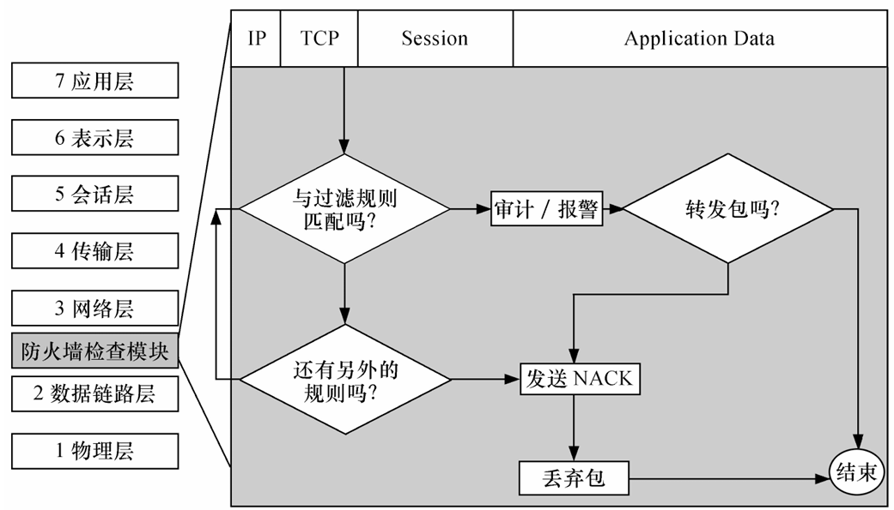
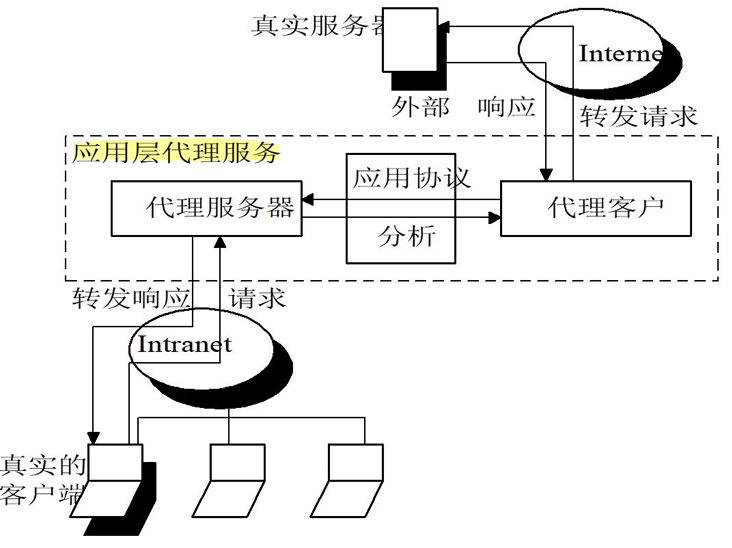
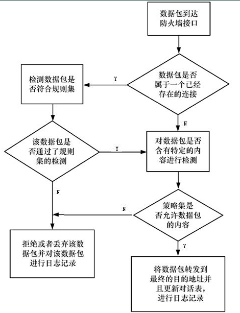

# 防火墙技术

## 防火墙技术概述

**防火墙（Firewall）** 作为不同网络安全域之间的“唯一通道”，根据用户的有关安全策略控制进出不同网络安全域的访问。

它通过强制执行统一的安全策略，控制跨域访问，是实现物联网边界防御的第一道物理与逻辑屏障。

### 核心定义

- Cheswick 与 Beilovin 的经典定义（1994）：

   强调防火墙是放置在两个网络之间的一组组件，必须同时具备三项特性：

  1. **唯一性：** 所有双向通信信息必须通过防火墙。
  2. **安全性：** 仅允许本地安全策略授权的信息通过。
  3. **免疫性：** 防火墙本身应具备极高的安全性，不应成为受攻击的薄弱环节。

- **物联网视角：** 防火墙是位于**不同信任程度网络**（如企业内网与 Internet）之间的软硬件组合，通过“强制实施统一安全策略”对两个网络之间的通信进行控制，从而防止对重要信息资源的非法存取和访问。

### DMZ（隔离区）：解决访问矛盾的“缓冲区”

物联网企业内网（高度信任）与外部公共网络（不信任）之间存在访问矛盾：外部用户需要访问内网提供的特定服务，但直接开放内网会带来毁灭性风险。

**DMZ（隔离区/非军事化区）** 作为缓冲区应运而生。它位于内外网之间的小型网络区域，放置 WWW、Mail、FTP、DNS 等对公服务器。

这种设计确保了即便 DMZ 中的系统受损，核心内网依然被防火墙有效隔离，平衡了“业务可达性”与“核心数据安全性”。

### 部署形式对比

| 特性         | 硬防火墙（硬件防火墙）               | 软防火墙（软件防火墙）                  |
| ------------ | ------------------------------------ | --------------------------------------- |
| **实现方式** | 专用硬件 + 定制安全操作系统          | 安装在通用系统（Windows/Linux）上的软件 |
| **性能表现** | 吞吐量大、时延低、系统稳定性极高     | 受限于宿主机性能，处理高并发能力较弱    |
| **安全性**   | 硬件底层加固，攻击面窄               | 依赖宿主机 OS 安全性，易受底层漏洞影响  |
| **适用场景** | 物联网数据中心、工业网关、企业级出口 | 个人终端、小型实验室、低预算主机防护    |

---

## 防火墙的核心功能、局限性与设计策略

防火墙是**被动的安全策略执行者**。防止外部网络不安全的信息流入内部网络和限制内部网络的重要信息流到外部网络。

- **5 大基本功能：** 过滤进出数据、管理访问行为、封堵禁止业务、记录活动日志、检测并报警网络攻击。
- 5 大扩展功能：
  1. **NAT（地址转换）：** 隐藏内网真实 IP。
  2. **双重 DNS：** 对外解析为公网地址，对内解析为内网地址。
  3. **VPN（虚拟专用网）：** 加密远程访问链路。
  4. **扫毒功能：** 集成查杀引擎。
  5. **负载均衡：** 优化流量分布。

### 局限性透视

1. **路径绕过：** 无法防范不经过防火墙的数据流（如通过后门、拨号或非法接入点）。
2. **内鬼难防：** 无法防止来自网络内部的攻击、破坏或安全误操作。
3. **病毒文件传输：** 防火墙无法彻底识别并拦截所有伪装在合法协议中的病毒文件。
4. **系统与协议缺陷：** 无法防止黑客利用服务器操作系统和网络协议本身存在的固有漏洞进行的攻击。
5. **数据驱动攻击：** 难以防范通过向程序发送特定数据产生非预期结果的攻击（如**缓冲区溢出、输入验证漏洞**等）。
6. **内部主动泄密：** 合法用户主动向外传输敏感信息时，防火墙无能为力。
7. **自身漏洞：** 防火墙软件本身也可能存在安全漏洞，无法绝对保证自身不被攻破。
8. **配置滞后：** 作为一个被动执行者，无法自动应对未定义在策略中的新式攻击。
9. **物理/逻辑旁路：** 当内部员工使用移动硬盘或绕过逻辑接口时，边界防御失效。

### 设计策略：最小特权原则

防火墙配置的核心是**最小特权原则**（明确允许所需，禁止其余一切）。

- **策略一：“除非明确允许，否则禁止”：** 安全性最高，能有效封堵未知风险，是目前物联网主流策略。
- **策略二：“除非明确禁止，否则允许”：** 易用性好，但容易遗漏安全隐患，仅适用于极低风险环境。

防火墙只能识别“已知的非法行为”，无法感知“已潜伏的异常”。

因此，**防火墙必须与入侵检测系统（IDS）联动**：防火墙负责静态设卡，IDS 负责动态实时监控，共同弥补防御死角。

---

## 防火墙分类

体系结构：包过滤防火墙、应用层代理、电路级网关、地址翻译防火墙、状态防火墙

### 包过滤防火墙（网络层/传输层）

- **机制：** 在选择路由的同时对数据包进行过滤，检查每个数据包的 IP 地址（源/目的）、端口（TCP/UDP/ICMP）、协议类型及方向，同时TCP的序列号和确认号等信息也要检查。
- **只检查数据包的“报头（信封）”，绝对不看数据包里的具体内容（信件内容）**
  - **自上而下，匹配即停（优先级至上）**；**默认拒绝（Default Deny）**
- **静态过滤：** 依据固定的规则表进行匹配。同时，一般防火墙的包过滤的过滤规则是在启动时配置好的， 只有系统管理员才可以修改，是静态存在的
- **状态检查（动态过滤）：** 将属于同一连接的包视为整体流，通过“连接状态表”进行动态关联检查。
- **优缺点：**
  - 优点：速度快效率高，用户透明，成本低
  - 缺点：**防不住“IP欺骗”**，无法检查数据内容，且**对 RPC、X-Window 等动态分配端口的协议不适用**。**规则极难维护**

---

### 代理防火墙

代理防火墙分为**应用层网关防火墙和电路层网关防火墙**

- 代理防火墙通过编程来**弄清用户应用层的流量**，并能在用户层和应用协议层提供访问控制
- 代理防火墙记录所有应用程序的访问情况，**记录和控制所有进出流量**的能力是代理防火墙的主要优点之一
- 代理防火墙一般是运行代理服务器的主机

**代理服务器：**代表客户处理与服务器连接的请求的程序，

- 通常运行在两个网络之间，它对于客户来说像是一台服务器，而对于外界的服务器来说，它又是一台客户机
- **内部网络和外部网络之间没有直接的物理连接**，所有的访问都必须由代理服务器代为了解、取回数据，然后再转交

代理服务器的工作过程：
内部客户端先向代理发请求、代理代替客户端向外网发请求、外网服务器把数据发给代理、代理最后把数据转交给客户端

#### 应用层网关/代理防火墙（应用层）

- **机制：** 工作在 OSI 最高层，采用“双向代理”技术。对外表现为服务器，对内表现为客户端，实现内外网的物理隔断。

优点：

- **深度校验：** 它能**校验应用层数据的格式与命令集合**（如只允许 HTTP GET 而禁止 POST）。
- **绝对管理控制权**：代理服务可以严格限制命令集合和内部主机支持的服务，授予了网络管理员对每一个服务的完全控制权
- **提供审计与认证**：支持强用户身份认证，并且能提供比包过滤详细得多的日志信息
- **规则配置更易懂**：应用层网关的过滤规则通常更易于配置和测试

缺点：

- **速度慢、延迟高**；**对用户不透明**，需要用户使用特殊的客户端软件；**缺乏通用性**，服务针对的是**特定**的应用层协议

#### 电路级网关（会话层）

- **机制：** 工作在 OSI 模型的**会话层**，在 TCP 握手阶段创立电子屏障。它监视握手信息是否合乎逻辑。
- **特性：** **特殊的客户程序仅在初次连接时参与安全协商**，一旦连接建立，后续数据传输对用户是透明的，不再进行深度内容过滤。

优点：

- **彻底斩断直连，隐藏内网**：和应用层代理一样，它把跨越防火墙的通信链路**强行砍成两段**
- **速度比应用层网关快**：因为它只在初次连接时进行安全协商，建立连接后就不再进行耗时的“应用层内容过滤”
- **SOCKS 服务器** 就是一种非常强大的电路级网关防火墙，常用于向外连接，这时网络管理员对其内部用户是信任的

### 代理技术的优缺点

**优点**：

- 工作在应用层，能灵活、完全地控制进出流量，甚至能深入高层**过滤文本和扫描病毒**
- 代理代替用户收发数据，能生成极其详细的日志和记录，**流量分析和事后查账**
- 为用户提供透明的加解密机制（在 VPN 中极其重要），并且能方便地与认证、授权等其他安全手段联合使用

**缺点：**

- **速度慢、不透明**：要查应用层内容并转发请求，**速度比包过滤慢得多**；要求用户修改配置或安装专用客户端
- **“一事一办”，缺乏弹性（扩展死板）**：每一种网络协议都需要一个对应的专属代理服务器。
- **防不住底层攻击**：由于代理高高在上（工作在 TCP/IP 之上的应用层），它**不能改善底层通信协议的安全能力**。

### 核心技术多维对比

| 维度           | 包过滤防火墙         | 电路级网关       | 应用层网关            |
| -------------- | -------------------- | ---------------- | --------------------- |
| **OSI 层级**   | 网络层 / 传输层      | 会话层           | 应用层                |
| **处理性能**   | 极高（硬件实现）     | 中等             | 低（软件开销大）      |
| **安全性**     | 较低（仅查包头）     | 中等（握手校验） | 最高（协议/内容校验） |
| **用户透明度** | 完全透明             | 初次协商后透明   | 不透明（需定制软件）  |
| **应用限制**   | 无法支持动态端口协议 | 适用范围有限     | 需为每种协议开发代理  |

\--------------------------------------------------------------------------------

## 4. 防火墙规则配置实战解析

针对内网 `116.111.4.x` 的规则配置，是体现安全逻辑严密性的关键环节。

### 116.111.4.x 规则表深度解读

| 规则  | 方向 | 源 IP       | 目的 IP     | 协议 | 源端口 | 目的端口 | ACK 位 | 行为     |
| ----- | ---- | ----------- | ----------- | ---- | ------ | -------- | ------ | -------- |
| **A** | 入   | 任意        | 116.111.4.0 | TCP  | >1023  | 23       | 否     | 允许     |
| **B** | 入   | 202.108.5.6 | 116.111.4.0 | TCP  | 23     | >1023    | 是     | **拒绝** |
| **E** | 出   | 116.111.4.1 | 任意        | TCP  | >1023  | 25       | 任意   | 允许     |
| **G** | 入   | 任意        | 116.111.4.1 | TCP  | >1023  | 25       | 任意   | 允许     |
| **K** | 入   | 98.120.7.0  | 116.111.4.5 | TCP  | >1023  | 80       | 任意   | 允许     |

- **Telnet 管理逻辑（Rule A-D）：** 允许内部与外部建立特定远程连接，但通过 Rule B 显式拒绝来自特定 IP 的异常响应，防止反弹 Shell 或未经授权的访问。
- **SMTP 邮件服务（Rule E-H）：** 为 IP `116.111.4.1` 的邮件服务器专门开辟通道。**Rule E/F 负责出站**（内部发邮件），**Rule G/H 负责入站**（接收外部邮件）。通过严格限定 IP 与端口（25），防止内网其他主机沦为垃圾邮件中继。
- **WWW 定向访问（Rule K）：** 这是一个典型的“合作伙伴规则”。它仅允许特定的外部网络 `98.120.7.0` 访问内部 WWW 服务器 `116.111.4.5` 的 80 端口，实现了精准的权限控制。

### 防御逻辑补充：反欺骗与 Land 攻击

在配置中必须包含一项隐形逻辑：**坚决过滤“从外部接口进入、但源地址却是内部 IP”的数据包**。这是防御 **Land 攻击**（攻击者伪造源 IP 与目的 IP 相同，使目标系统陷入无限循环）的关键。

**【专家提醒 —— 性能优化】** 规则配置存在“复杂性陷阱”。随着规则条目增加，防火墙的匹配开销会线性上升，导致吞吐率下降。**优化建议：** 将高频规则（如 WWW 流量）置于顶部，定期清理冗余条目。

---

## 状态监测防火墙（Stateful Inspection）

状态监测防火墙采用了一个在**网关**上执行网络安全策略的软件引擎，称之为检测模块。

- **状态表机制**：会抽取各层数据（状态信息）并**动态保存**下来。后续属于同一个连接的数据包再来时，直接查状态表放行
- **防内鬼能力**：带有**分布式探测器**，能有效防范来自网络内部的恶意破坏（统计表明大量攻击来自内部）

优点：支持多种协议扩展；**能监测 RPC 和 UDP 端口**（这是包过滤和代理做不到的）；性能坚固

缺点：配置非常复杂；同样会一定程度上降低网络速度

工作流程：

1. **数据包到达**防火墙接口后，首先检查是否属于**已存在的连接**：
   - **是（已有连接）**：进入**规则集检测**，检测通过后再进行**内容检测**；
   - **否（新连接）**：直接进行**内容检测**，随后由**策略集**判定是否允许该内容。

2. **内容检测/策略判定**：
   - **允许**：将数据包**转发**至目的地址，**更新会话表**，并记录日志；
   - **拒绝**：**丢弃**该数据包，并记录日志。

---

## ZFW（基于区域的策略防火墙）

**把多个接口打包成一个“区域（Zone）”，把“区域”作为执行安全策略的最小单位**

- **同区互信，不设防（默认允许）**
- **跨区禁飞，默认拒（默认丢弃）**
- **跨区通行必须建“区域对”（Zone-Pair）**
- **区域接口隔离**
- `pass`（放行）、`drop`（丢弃）和 `inspect`（检测）

## NAT（网络地址转换技术）

新一代防火墙利用 NAT 技术能**透明地**对所有内部地址作转换

- **隐藏内部网络（安全价值）**：对外出站时，防火墙会把内部的私有 IP 换成合法的公网 IP。
- **解决 IP 地址枯竭（资源价值）**：它允许内部网络完全使用自己定制的、免费的私用 IP 地址（如 192.168.x.x），极大地节约了公网 IP 资源

这个转换过程对于用户来说是**完全透明**的，用户不需要做任何特殊设置，而且它可以是**双向**的

**NAT 的五种翻译模式**

- **静态翻译（Static NAT）：一对一的“专属VIP”**

  **原理**：一个内部私有 IP 永远固定映射到一个外部公网 IP。

  **考点**：通常用于内部需要对外提供服务的服务器（比如 Web 服务器），保证外网用户总能通过同一个公网 IP 找到它。

- **动态翻译（Dynamic NAT）：先到先得的“共享池”**

  **原理**：防火墙手里有一批公网 IP（地址池）。当内网用户要上网时，防火墙就从中**动态随机分配**一个未被使用的公网 IP 给他；用完后再收回。

  **局限**：如果同时上网的内网员工数量，超过了防火墙手里的公网 IP 数量，剩下的人就上不了网了。

- **端口转换（PAT / NAPT）：一拖多的“终极魔法”（★ ￥￥￥级核心考点）**

  **原理**：为了打破动态 NAT 的数量限制，PAT 不仅转换 IP 地址，还**转换传输层的“端口号”**！

  **工作机制（必须看懂考卷上的映射表）**：

  - 员工A（10.0.0.2）和员工B（10.0.0.3）同时上网。
  - 防火墙把他们**全都映射到同一个公网 IP**（比如 202.202.4.3），但是给他们分配**不同的源端口号**。
  - 员工A出去的包变成：`202.202.4.3 : 30001`。
  - 员工B出去的包变成：`202.202.4.3 : 30002`。
  - 当外网数据返回时，防火墙只要看**端口号**是 30001 还是 30002，就能精准地把数据转交给对应的内网员工

- **负载平衡翻译 与 网络冗余翻译**

  **原理**：将外部对一个公网 IP 的访问请求，按照算法分发到内部多台不同的服务器上（负载均衡），或者在某条链路断开时自动切换（冗余），以保证服务的高可用性。

动态NAT 与 PAT 核心考点：

- 看到 **“地址池、先到先得、IP耗尽需排队”** —— 选 **动态NAT**。
- 看到 **“带端口号、多对一、共享同一个公网IP”** —— 选 **PAT**。

| 比较维度       | 动态NAT（动态地址翻译）                                      | PAT（端口地址转换）                                          |
| -------------- | ------------------------------------------------------------ | ------------------------------------------------------------ |
| **转换内容**   | **仅**转换 IP 地址                                           | 同时转换 **IP 地址 + 端口号**                                |
| **映射关系**   | **一对一**（1:1）                                            | **多对一**（N:1）                                            |
| **工作原理**   | 防火墙维护一个公网 IP 的“全局地址池”，内网主机上网时，从池中**动态抽取**一个未使用的公网 IP 临时分配给它。 | 多个内网 IP 映射到**同一个公网 IP**，防火墙通过给每个会话分配**不同的外部端口号**来进行精准区分。 |
| **核心机制**   | “先到先得”的独占机制                                         | 共享机制（依靠端口号进行复路）                               |
| **资源消耗**   | 较高。需要准备多个合法公网 IP 组成地址池。                   | **极低**。成百上千的用户可以共享这1个公网 IP。               |
| **局限与触发** | 当地址池中的公网 IP 被全部分配完后，其他主机**必须排队等待**别人释放 IP 才能上网。 | 完美打破了动态 NAT 的数量限制，通常在动态 NAT 的本地地址池**用尽后会自动启动** PAT。 |
| **实战举例**   | `10.1.1.1` 转换为 `209.165.200.225`                          | `10.1.1.4:1025` 转换为 `209.165.200.228:1055` `10.1.1.5:1025` 转换为 `209.165.200.228:1056` |