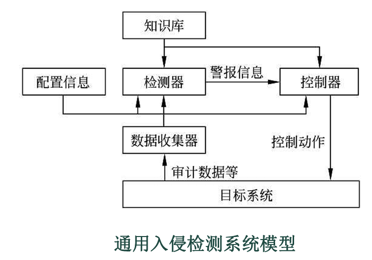

# 入侵检测技术

## 入侵检测技术概述：安全体系的“动态哨兵”

**入侵检测技术（Intrusion Detection, ID）**就是部署在内部、全天候巡逻的“动态哨兵”。

检查违反安全策略的行为：入侵，非法用户的违规行为；误用，用户的违规行为。即破坏完整性、机密性和可用性的行为

同时引入了**P2DR（防护、检测、响应）**动态安全模型。

入侵检测处于该模型的核心位置，它将安全从“静态设防”转变为“实时感知”，实现了安全体系的闭环。

### 核心定义

- **入侵检测（ID）：** 一种主动保护网络和系统免遭非法攻击的安全技术。它通过从计算机网络或系统中的若干关键点收集信息并对其进行分析，从中发现是否存在违反安全策略的行为和遭到袭击的迹象。
- **入侵检测系统（IDS）：** 加载了入侵检测技术的**软件或硬件系统**。它是信息安全审计的核心技术，负责监控任何企图破坏资源**机密性、完整性和可用性**的行为。

### 入侵检测的四大主要目的

- **识别入侵者：** 追踪攻击源头，确定责任主体。
- **识别入侵行为：** 捕捉具体的攻击手法、违规操作或误用行为。
- **监测突破口：** 检测和监视已成功的安全突破点，评估受损范围。
- **提供对抗信息：** 为后续的**响应**措施（记录行为、通知管理员、阻断入侵）提供即时情报。

---

## IDS 系统的功能架构与组成逻辑

一个高效的 IDS 绝非单一的软件，而是由多个功能模块协同工作的有机体。

### 组件功能解剖

1. **数据收集器（探测器）**： IDS的“眼睛”，主要负责收集数据。
2. **检测器（分析引擎）：** IDS 的“大脑”。负责执行分析任务，检测是否存在入侵迹象，并触发警报信号。
3. **知识库：** IDS 的“经验集”。存储已知攻击特征、用户正常行为轮廓等关键参考数据。
4. **控制器：** IDS 的“行动手”。根据检测器的信号，人工或自动地做出反应动作。
5. **用户接口：** 管理员的“操作台”。用于观察状态、输出报告并调整防御策略。

### 三阶段功能分布表

IDS 的价值体现在攻击发生的每一个时序阶段：

检测入侵并且驱除入侵，减少损失，收集入侵信息增强系统，监控分析用户以及系统活动

| 阶段     | 具体作用描述                                                 |
| -------- | ------------------------------------------------------------ |
| **事前** | 检测到入侵企图，利用报警与防护系统联动，预警并驱逐潜在威胁。 |
| **事中** | 实时监测正在进行的攻击，通过即时响应机制减少入侵造成的实际损失。 |
| **事后** | 收集攻击特征，作为新知识添加到**知识库**，提升系统的免疫进化能力。 |

除了报警，专家级的 IDS 还具备**深度审计能力**：它能监控用户和系统活动（实现任务的前提）、审计系统配置中的弱点、评估关键系统和数据文件的完整性，从而侦测并纠正配置错误。

此外可以进行主动防御，并且与防火墙协同防护

### IDS的优缺点

**优点：**

- **监控与追踪专家**：能极大地提高系统的监控能力，从入口到出口全程跟踪用户的活动。
- **完整性“质检员”**：能敏锐识别核心数据文件的变化，侦测并纠正系统的配置错误。
- **精准报警器**：能识别出特殊的攻击类型，及时通知管理员。

**三大致命软肋（不足 - 极其爱考选择题）：**

- **看不懂“天书”（最大盲区）**：**不能分析加密的数据！**
- **不管底层缺陷**：它无法弥补糟糕的身份认证机制，也无法修补网络协议本身的弱点（比如 TCP/IP 的底层漏洞）。
- **怕堵车、费人工**：在网络极度拥堵时，它抓不到包（不能分析堵塞网络）；而且非常依赖管理员去判断警报，**需要过多的人为干预**。

### 入侵检测的关键性能指标：漏报与误报

衡量一个 IDS 是否“称职”，核心在于对**漏报**与**误报**的博弈平衡。

- **漏报率（False Negative）：** 指攻击事件真实发生，但 IDS 却未能检测到。这关乎系统的**安全性**，漏报意味着哨兵玩忽职守。
- **误报率（False Positive）：** 指将正常的用户行为错误地判定为攻击。这关乎系统的**可用性**，高误报会造成不必要的业务中断。

---

## 入侵检测技术的分类体系（核心考点 ★★★）

在物联网复杂的层级架构中，IDS 必须“因地制宜”地进行部署与选型。

### 入侵检测技术的分类

- 信息源分类：基于主机，基于网络，基于应用
- 检测方法分类：滥用，异常
- 工作方式分类：在线，离线（实时，非实时）
- 体系分类：集中，等级，协作

### 部署位置对比：HIDS vs. NIDS

根据数据源的不同，我们主要将其分为基于主机（HIDS）和基于网络（NIDS）。

| 维度         | 基于主机 (HIDS)                             | 基于网络 (NIDS)                                  |
| ------------ | ------------------------------------------- | ------------------------------------------------ |
| **数据源**   | 系统审计记录、应用日志                      | 网络实时流量数据包                               |
| **视野范围** | **视野集中**。能区分已登录用户的非法活动。  | **视野广阔**。监控整个网段的运行状态。           |
| **加密处理** | **强**。可在数据解密后的终端进行检测。      | **弱**。难以处理加密通道（如 HTTPS）内的内容。   |
| **系统依赖** | 严重依赖特定的操作系统平台。                | 与平台无关，独立性强。                           |
| **性能影响** | **主机资源消耗型**。占用宿主机的 CPU/内存。 | **网络流量敏感型**。处理大流量时可能产生丢包。   |
| 缺点         | 依赖OS，影响性能，无法应对大范围网络攻击    | 只查直连网段，特征检测难以发现复杂攻击，最怕加密 |
| 优点         | 检测复杂攻击，内部攻击，不怕加密            | 速度快，不占资源                                 |

**特殊形式：基于网络结点的检测（NID）** 其输入源仅为所在主机的进出流量。

在物联网感知层设备资源受限的情况下，NID 的意义在于**减轻数据处理负担，将计算量分散在各个网络结点之上**，避免中心系统过载。

还有**网络节点入侵检测(NNIDS/Stack-Based IDS)**：安装在网络节点的主机，结合HIDS和NIDS，适合于高速交换环境和加密数据

### 检测逻辑深度对比：异常检测 vs. 误用检测

这是本章的灵魂，请务必掌握其**前提条件**与**逻辑过程**。

用户轮廓：通常定义为各种行为参数及其 阀值的集合，用于描述正常行为范围

攻击特征库: 当监测的用户或系统行为与库中 的记录相匹配时，系统就认为这种行为是入侵

#### 1. 异常检测 (Anomaly Detection)

- **前提条件：入侵是异常活动的子集。**
- **核心逻辑：** 建立“用户轮廓 (Profile)”。通过观察当前活动与系统历史正常模式（阈值集合）的偏离程度来判定。
- **执行步骤：** **监控 ➔ 量化 ➔ 比较 ➔ 判定 ➔ 修正（反馈回路）**。
- **评价：** 能发现**未知攻击**自适应和学习；代价是由于用户行为的突变性，**误报率较高**。计算大效率低

#### 2. 误用检测 (Misuse Detection)

- **前提条件：所有的入侵行为都有可被检测到的特征。**
- **核心逻辑：** 建立“攻击特征库 (Signature)”。将当前行为与库中的已知“签名”进行模式匹配。
- **执行步骤：** **监控 ➔ 特征提取 ➔ 匹配 ➔ 判定**。
- **评价：** **准确度极高**（错报率低）；劣势是**无法检测未知攻击**，且特征库需持续维护。开销小，算法简单，效率高

| 对比维度           | 异常检测 (Anomaly)           | 误用/特征检测 (Misuse)               |
| ------------------ | ---------------------------- | ------------------------------------ |
| **核心思想**       | 偏离“正常行为轮廓”即为入侵   | 匹配预设的“攻击特征库”即为入侵       |
| **主要前提**       | 入侵行为是异常活动的子集     | 所有入侵都有可被检测到的特征         |
| **对未知攻击防御** | **能检测未知的新型攻击**     | **不能检测未知攻击**（只能防已知）   |
| **系统开销与速度** | 计算量巨大，效率低           | **开销小，算法简单，效率高**         |
| **误报与漏报情况** | **误报率高**（好人易被冤枉） | **漏报率高**（新攻击抓不到），错报低 |

## 入侵检测的实施步骤与特征分析

#### 入侵检测的实施步骤

IDS 的运行是一个从海量原始数据中过滤安全信号的程序化过程：信息收集、数据分析和响应。

1. **信息收集：** 利用主机日志或网络数据包，用户活动作为数据源，这是实现任务的前提。

2. **数据分析：入侵检测系统的核心**

   根据数据分析的不同方式可将入侵检测系统分为异常入侵检测与误用入侵检测两类。

   - **特征分析：** 误用检测需要对入侵的**特征、环境、次序**以及事件间的因果关系进行精密描述。
   - **协议分析：** 针对物联网复杂协议，此技术尤为关键，它能有效检测出那些**需要大量计算与分析时间的复杂攻击**。

3. **响应过程：** 当发现匹配或偏离后，立即触发报警、记录行为或阻断入侵。记录分析结果生成报告，触发警报，修改入侵检测系统或目标系统

### 特征分析 vs 协议分析

对于网络入侵检测而言，存在着两种基本的技术类型，分别称为 **“特征（signature）分析**”和**“协议（protocol）分析”**技术

特征分析：基本工作原理是建立在**字符串匹配**的简单概念之上

协议分析：**寻找违反协议规范的数据**（查违规）

| 对比维度         | 特征分析（Signature）                          | 协议分析（Protocol）                       |
| ---------------- | ---------------------------------------------- | ------------------------------------------ |
| **核心机制**     | **字符串匹配**（查通缉令）                     | **寻找违反协议规范的数据**（查违规）       |
| **未知攻击防御** | **仅能检测已知攻击**                           | **能够发现最新的未知安全漏洞**             |
| **规则编写难度** | 易于编写、便于理解定制                         | **极其复杂**，难以编写和理解               |
| **速度与性能**   | 小规则库极快，**规则扩大后迅速下降**           | 初始较慢，但在**大规则库下扩展性良好**     |
| **告警特点**     | 解释能力强（明确知道攻击类型），但**易产虚警** | 缺乏明确解释，但**极少产虚警（误报率低）** |

## IPS：入侵防御系统的进化

随着攻击频率的指数级增长，单纯的“感知”已不足够，**入侵防御系统（IPS）** 应运而生。

IPS技术在IDS监测的功能上又增加了主动响应的功能，一旦发现有攻击行为，立即响应，主动切断连接

其设计主旨在于预先对入侵获得和攻击性网络流 量进行拦截，避免造成损失。

- **技术进化：** 传统的 IDS 采用“旁路监听”模式（如同路边的监控器）；而 IPS 采用**在线（In-line）部署**模式，流量必须“穿过”IPS 才能进入内网。
- **本质差异：** IDS 是“发现并报警”，IPS 是“发现并实时阻断”。
- 优缺点评析：
  - **优势：** 
    - **实时阻断（Real-time Interdiction）**：在攻击流量到达目标前，预先拦截。
    - **先进的检测技术（并行+重组）**：**并行处理**海量规则（速度快），还能把数据包进行**协议重组分析**
    - **特殊规则植入（执行企业纪律）**：它不仅抓黑客，还能辅助执行企业的“可接收应用策略(AUP)”，比如**直接阻断员工使用 P2P 共享软件或极度消耗带宽的免费网络电话**。
    - **自学习与自适应**：能够根据当前的网络环境，自动提取新攻击特征更新特征库，具有极强的智能进化能力。
  - **风险：** IPS 是一把双刃剑。一旦发生误判，它会直接阻断合法的业务流量，造成服务中断。

