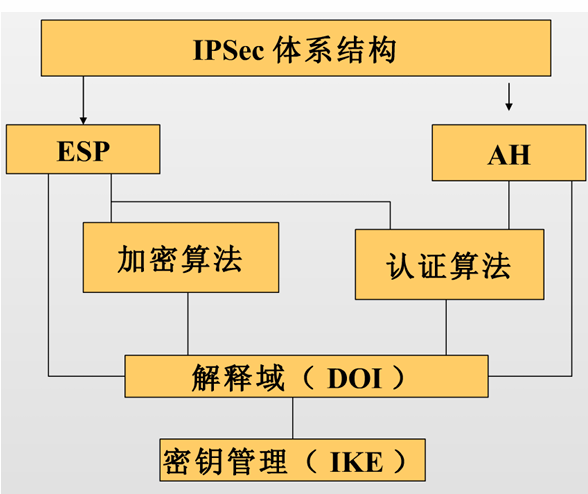
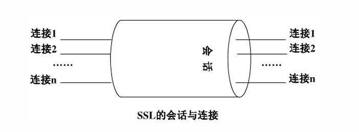

# IPSec、SSL与VPN

### IPSec 协议体系：构建网络层的信任根基

- IPSec（IP Security）的核心价值在于其作为IPv6的必备组件（IPv4中为可选），将安全机制直接植入网络层（Layer 3），为上层协议（TCP/UDP）提供透明的加固，是构建物联网传输防线、解决通信安全（机密性、完整性、可用性）的信任根基。

- IPSec 架构逻辑：

   IPSec并非单一协议，而是一个基于开放标准的框架（Algorithm Independent），由四大支柱协同运行：

  1. **体系结构（Architecture）：** 定义IPSec的一般性概念、安全需求及整体运行机制。
  2. **解释域（DOI, Domain of Interpretation）：** 定义加密/认证算法的标识及操作参数（如密钥生存期），确保异构设备间的互操作性。
  3. **密钥管理（IKE, Internet Key Exchange）：** 负责动态协商安全关联（SA）及密钥分配。
  4. **核心协议（AH/ESP）：** 执行实际的安全封装与转换。

- **核心协议对比分析：** 架构师需通过下表权衡 **AH（鉴别头）** 与 **ESP（封装安全载荷）** 的应用选择：

| 安全服务           | AH (鉴别头) | ESP (仅加密) | ESP (加密并认证) |
| ------------------ | ----------- | ------------ | ---------------- |
| 访问控制           | √           | √            | √                |
| 无连接数据的完整性 | √           | -            | √                |
| 数据源发认证       | √           | -            | √                |
| 抗重放攻击检测     | √           | √            | √                |
| 机密性（加密）     | -           | √            | √                |
| 有限的通信流保密   | -           | √            | √                |

### SA，SPI，SAD，SPD

SA **是两个通信实体之间经过协商建立起来的一种协定**，它规定了双方将使用什么认证算法、加密算法以及什么参数和密钥来进行通信。这些参数协商完毕后，会被统一存放在双方的**安全关联数据库（SAD）**中

SA 永远是**单向的**。因此双向通信时，**必须至少建立两个 SA**

**唯一标识 SA 的“三元组”**：**SPI（安全参数索引）**，**目的 IP 地址**，**安全协议**

**SPI 本质上就是这份安保合同的“流水编号”**，它是一个被生成并包含在 AH 头和 ESP 头中的 32 位整数

- 关键数据结构（SAD 与 SPD）：
  - SPD（安全策略数据库）： 决定“是否处理包”。其条目基于选择符（五元组：源/目的IP、协议、源/目的端口）。
    - **地址类型：** 支持主机地址、单播、组播、任播及广播地址。
    - **策略操作：** 丢弃（Discard）、绕过（Bypass）、加载IPSec（Protect）。
    - SA指针：指向SA集合，应用IPsec协议，算法
  - SAD（安全关联数据库）：包含现行的SA条目，源/目的IP，协议
    - 其中每个SA由三元组索引。决定“如何处理包”。关键条目包括：
    - **32位SPI（安全参数索引）：** 唯一标识SA。1–255由IANA保留，0保留，有效范围为 **256至2^32-1**。
    - **序列号计数器与溢出标志：** 32位计数器，溢出标志用于决定溢出后SA是否失效。
    - **抗重放窗口：** 基于位图（Bitmap）和计数器。
    - **算法与密钥：** 涵盖AH/ESP的加密与认证算法。
    - **IV（初始向量）与模式：** 包含IV及IV模式（ECB, CBC, CFB, OFB）。
    - **其他：** IPSec操作模式、**路径最大传输单元（PMTU）**及SA生存期。

---

### IPSec 报文处理机制：滑动窗口与进出站逻辑

IPSec通过严格的**序列号验证与滑动窗口机制**，在不增加过多计算负载的前提下，从底层排除了过期或重复报文的干扰。

- AH/ESP 进出站处理流程：
  - 外发处理（Outbound）：
    1. 检索SPD：匹配五元组确定策略。若需保护，则获取SAD指针。
    2. 检索SAD：提取密钥、算法及SPI。
    3. 封装：增加序列号，计算ICV（完整性校验值），根据SA模式进行加密。
  - 接收处理（Inbound）：
    1. 标识SA：基于报文头部的SPI及目的IP查找SAD。
    2. 抗重放检查：利用滑动窗口验证序列号。
    3. 完整性与解密：验证ICV，解密载荷。校验失败则丢弃，避免“能量剥削”攻击。
- 滑动窗口抗重放原理：接收端利用 位图（Bitmap）维护一个32位（或更高）的滑动窗口：
  - **过期包：** 若序列号小于窗口左边界（太旧），直接丢弃。
  - **重复包：** 若序列号在窗口内，但在位图中对应位已标记为“已收到”，则视为重放。
  - **有效包：** 只有落在窗口内且位图未标记，或超过右边界且验证通过的包才被接受。接收后需更新位图及窗口位置。

---

### IKE（互联网密钥交换协议）

IKE是IPSec的控制平面。

IKE能在不安全的公网上**安全地协商出高强度的密钥**，并自动填充SAD。

- 两阶段协商机制：
  - 第一阶段（ISAKMP SA）：建立安全管理通道。先建立一个**安全的、经过身份验证的信道（IKE SA 或 ISAKMP SA）**，用来保护后续的协商通信不被偷听。
    - **主模式（Main Mode）：** 经过6次报文交换。其精妙之处在于**身份保护**，ID交换发生在加密信道建立之后，安全性最高。
    - **野蛮模式（Aggressive Mode）：** 仅需3次交换。虽然速度快，但身份信息明文传输，且容易暴露节点隐私，通常仅用于IP地址不固定的移动感知终端。
  - **第二阶段（Quick Mode）：** **复用ISAKMP SA**。在第一阶段建立的加密保护下，快速协商具体的AH/ESP SA（即IPSec SA）参数。
    - 快速模式：用于协商阶段2的SA，协商受到阶段1协商好的IKE SA的保护。这 种交换模式下交换的载荷都是加密的
- **IKE 与 IPSec 的关系：**IKE将协商好的SPI、加密算法、认证密钥等信息填充进SAD，供IPSec在数据转发层面直接调用。
- **转场过渡：** 当IPSec与IKE的这种动态防护能力被应用到跨物理边界的通信时，便形成了VPN。

| 对比维度           | 主模式 (Main Mode)                               | 野蛮模式 (Aggressive Mode)                             |
| ------------------ | ------------------------------------------------ | ------------------------------------------------------ |
| **交互消息数量**   | **6 条** 消息（分三步走：协商、换密钥、认证）    | **3 条** 消息（所有载荷打包在一起发）                  |
| **身份保护功能**   | **有保护**（最后两条包含身份的信息是加密传输的） | **无保护**（信息集成度高，明文发送，无身份保护）       |
| **对等体标识方式** | 只能采用 **IP 地址** 方式标识对等体              | 可以采用 **IP 地址** 或者 **Name (主机名)** 标识对等体 |
| **安全性与速度**   | 安全性高，耗时较长                               | 速度快（往返次数少），但安全性较弱                     |

*(注：阶段 2 建立 IPSec SA 时使用的是***快速模式 (Quick Mode)***，共有 3 条消息，且全程在阶段 1 的加密保护下进行。)*

#### D-H(迪菲-赫尔曼密钥交换) 

D-H(迪菲-赫尔曼密钥交换) 不是一种加密算法，而是一种密钥交换算法

- 通信前，Alice 和 Bob 约定两个大整数 *n* 和 *g* （要求 1<*g*<*n*）。**这两个数字是全网公开的**，黑客也能看到
- Alice 在心里随机想一个大整数 *a*（绝对保密）。Bob 在心里随机想一个大整数 *b*（绝对保密）。
- **计算半成品并发送**：
  - Alice 利用公式计算出 *Ka*=*g^a* mod *n*，并把 *Ka* 明文发给 Bob。
  - Bob 利用公式计算出 *Kb*=*g^b*  mod  *n*，并把 *Kb* 明文发给 Alice。
- Alice 收到 *Kb* 后，结合自己心里的 *a*，计算 *K*=*Kb^a* mod *n*。Bob 收到 *Ka* 后，结合自己心里的 *b*，计算 *K*=*Ka^b*  mod  *n*。

---

### VPN（虚拟专用网）

VPN通过逻辑手段在公网上构建“专用网络”

- 概念与核心特性：
  - **虚拟（Virtual）：** 建立在逻辑连接之上，无需像专线一样进行物理铺设。通过隧道技术在公共数据网络上仿真一条点到点的专线技术
  - **私有（Private）：** 核心在于**机密性**（加密）与**身份认证**，确保只有授权节点能接入隧道。
- 分类体系：
  - **协议层次：** 二层（L2TP/PPTP）、三层（IPSec）、七层（SSL）。
  - **应用模式：** 远程接入（Access VPN）、内部扩展（Intranet）、外部合作伙伴接入（Extranet）。
- 优缺点综合评估：
  - **优势：** 相比物理专线大幅度节约成本；支持灵活扩展；安全性极高。可靠，保证QoS，安全
  - **挑战：** 加密导致延迟增加；对底层 **PMTU**（路径最大传输单元）敏感，配置不当可能导致分片丢失及计算开销剧增。

- **隧道技术（Tunneling）**：这是 VPN 的**核心**！负责在公网上开辟通道。
- **加解密技术（Encryption & Decryption）**：把明文变成密文，防止中途被截获偷看（比如之前学的 DES/AES）。
- **密钥管理技术（Key Management）**：解决如何在公网上安全传递密钥的问题（★ 这里完美串联了我们上一节刚学的 **Diffie-Hellman 算法和 IKE/ISAKMP 协议**！）。
- **身份认证技术（Authentication）**：确认“你是你”，防伪造冒充（比如用户名/密码、数字证书）

#### 隧道（Tunnel）

隧道实质上就是一种**“套娃式封装”**。把一种协议（协议X）打包塞进另一种协议（协议Y）的肚子里传输

隧道协议内包括以下三种协议： 

- 乘客协议（Passenger Protocol）：真正要传输的原始数据报文
- 封装协议（Encapsulating Protocol）：中间起保护和伪装作用的协议
- 承载协议（Carrier Protocol）：在公网上运送包裹的底层网络协议（如公网的 IP 协议）

---

### SSL 协议与传输层安全

SSL 是建立在可靠的 TCP 协议之上的安全协议，专门在两台机器（通常是客户端和服务器）之间建立一条**加密的、可信任的安全通道**

**透明性与独立性**。SSL 就像一个“隐形防弹衣”，它**独立于应用层协议之上**

- **身份认证（防冒充）**：使用 **PKI 和 X.509v3 数字证书**。双向认证
- **传输机密性（防偷窥）**：使用 **对称加密算法**
- **传输完整性（防篡改）**：使用 **MAC（消息认证码）**

SSL 协议栈架构：

- **握手协议（Handshake）：** 核心。负责算法协商、服务器身份验证（证书）及预主密钥交换。
- **记录协议（Record）：** 负责数据的分段、压缩及对称加密封装。
- **警报协议（Alert）：** 传递加密异常或证书错误等信号。
- **密码规格变更协议（Change Cipher Spec）：** 告知对端后续报文将转入加密状态。

SSL协议定义了两个通信主体：客户（Client）和服务器（Server）。其中，客户是协议的发起者

#### 连接 (Connection) vs 会话 (Session)

- SSL会话（session）：一个SSL会话是客户与服务器之间的一个关联。会话由握手协议创建。会话定义了一组 可供多个连接共享的密码安全参数。
- SSL连接（connection）：一个连接是一个提供一种合适类型服务的传输。连接是暂时的，每一个连接和一个会话关联。

#### SSL 握手过程

1. **Client/Server Hello：** 协商最高支持的协议版本及密码套件。
   - 客户端首先向服务器发起请求，发送自己支持的最高 **SSL/TLS 版本号**、自己生成的**客户端随机数（Client Random）**、支持的**密码套件列表（Cipher Suites）**以及压缩方法
   - 服务器收到后进行回应，确认双方要使用的**安全协议版本**、从列表中**选定一种密码套件**，并发送**服务器生成的随机数（Server Random）**
2. **服务器认证与密钥交换**：服务器需要向客户端证明自己的合法身份，并提供加密用的公钥。
   - 服务器发送自己的 X.509v3 数字证书链，里面包含了服务器的**公钥**和 CA 的签名
   - **Server Key Exchange（服务器密钥交换，可选）**：如果证书里的公钥只能用于签名而不能用于加密交换（例如只支持签名的 RSA 或 DSS 证书），服务器会额外发送此消息来补充密钥交换参数
3. **客户端认证与密钥交换（“生成会话主密钥”）**
   - 客户端首先利用内置的 CA 根证书验证服务器证书的真伪。
   - 客户端生成一个名为 **预备主密码（Pre-Master Secret）** 的核心随机数。客户端使用刚刚从证书中拿到的**服务器公钥对它进行加密**，然后安全地发送给服务器
   - 服务器收到密文后，用自己的**私钥解密**得到预备主密码。此时，双方手中都掌握了三个参数：**客户端随机数、服务器随机数、预备主密码**。双方在本地利用单向散列函数将这三者混合，独立计算出完全相同的**“主密钥（Master Secret）”**，并由此派生出后续通信用的对称加密密钥、MAC（消息认证码）密钥和初始化向量（IV）等。
4. **握手完成与确认（“启用加密通道”）**
   - **Change Cipher Spec（更改密码规格）**：客户端发送此消息，通知服务器：“从现在开始，我发的所有数据都将使用刚才协商好的对称密钥进行保护”
   - **Finished（结束消息）**：紧接着，客户端发送第一条**已经被协商密钥加密保护**的消息。
   - **服务器确认**：服务器验证成功后，同样回复一条 `Change Cipher Spec` 消息和一条加密的 `Finished` 消息

- **加密范围与层次：** SSL实现“端到端”保护。与IPSec协议无关性不同，SSL**严格绑定TCP**。它不保护IP头部，但保护TCP负载中的所有应用层数据，是应用层安全的“金钟罩”。
- **转场过渡：** 这种“即插即用”的灵活性，使得SSL VPN在物联网移动办公及运维领域迅速崛起。

---

### SSL VPN 的崛起

SSL VPN直接利用了 Web 浏览器内置的 SSL/HTTPS 协议，不需要像 IPSec 那样安装专门的拨号软件

- **无视 NAT 和防火墙**：因为它走的是标准的 HTTPS 流量（443端口）
- **精准的“最小权限”**：它能精确控制用户只能访问某几个特定的 URL 或应用，完全隐藏了公司内网的真实拓扑结构
- **无客户端（Clientless）：** 只要有标准浏览器即可访问，解决了感知层管理终端碎片化的问题。

保证**接入**安全（谁能进）、保证**传输**安全（防窃听）、保证内部**资源访问**安全（进去能看啥）。

**SSL VPN 的三大工作模式**

- **Web 浏览器模式（最核心、最常见）**：**“零客户端”**，打开网页就能用，管理成本极低。但缺点是**只能保护 Web 网页通信**（适合校园网查成绩、电子政务办公）。
- **客户端模式**：针对非 Web 应用（如要用内网的 ERP 客户端）。需要在电脑上装个小插件/软件，优点是能保护所有的 TCP/UDP 流量。
- **LAN-to-LAN 模式（网对网）**：用 SSL 协议把两个局域网连起来。但注意，**在这个场景下它的性能和效率远不如 IPSec**，通常只作为补充。

| 比维度           | IPSec VPN (跨海大桥)                                    | SSL VPN (任意门)                                            |
| ---------------- | ------------------------------------------------------- | ----------------------------------------------------------- |
| **工作层次**     | **网络层**（为底层基础设施提供保护）                    | **应用层/传输层之上**（基于浏览器）                         |
| **客户端要求**   | **必须安装**专用的 VPN 客户端软件                       | **零客户端**（Web模式下只需浏览器）                         |
| **权限与控制**   | 给的是整个网络的接入权（一旦连上等于进入内网）          | **极其精细**，只给特定 URL 或应用的访问权（隐藏网络结构）   |
| **NAT与防火墙**  | 穿越 NAT 和防火墙**非常困难**（容易被拦）               | 使用标准 HTTPS，**轻松穿越防火墙，无 NAT 问题**             |
| **最佳应用场景** | **站对站（Site-to-Site / LAN-to-LAN）**，总公司连分公司 | **远程移动办公（Remote Access）**，出差员工访问邮件/Web系统 |

