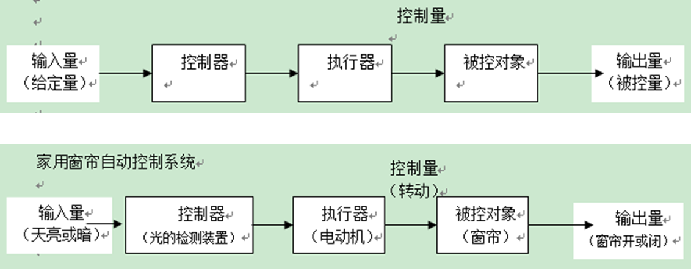
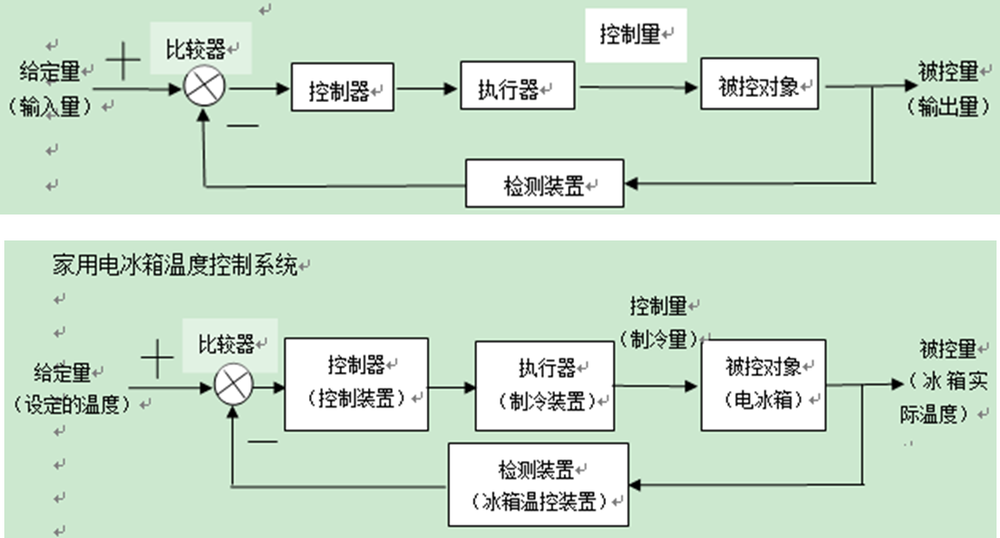
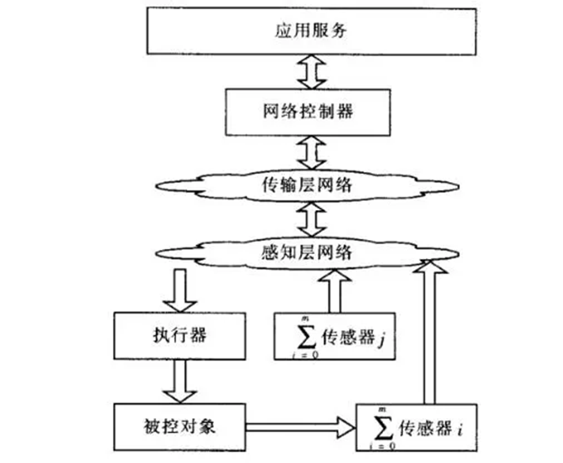
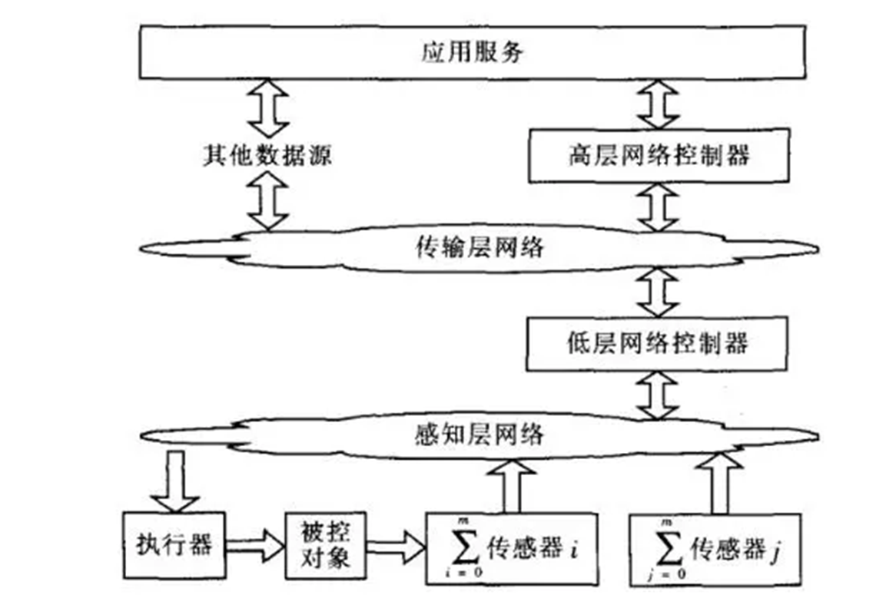

# 物联网控制系统

## 软硬件结合控制输出

1. 输出：

   > - **输出**包括物质输出、能量输出、信息输出,即表现为系统的功能。
   > - 输出是系统存在的必要条件。

2. 系统

   > 系统由联系产生机制，而系统的机制就是各个子系统的输入和输出的相互谐调和配合

## 控制系统

### 定义

> [!note]
>
> 控制系统是指由**控制主体、控制客体和控制媒体**组成的具有自身目标和功能的管理系统。

1. 开环控制系统

   > 

2. 闭环控制系统

   > - 基于预期输出目标
   > - 基于网络运行环境
   > - 形成闭环，及时反馈和持续改进
   >
   > 

- 控制系统的意义

  > 控制系统意味着通过它可以按照预期保持和改变机器、机构或其他设备内任何可变的量。
  >
  > 控制系统同时使被控制对象达到预期而实施的。控制系统使被控制对象趋于某种需要的**稳定状态**。

---

### 控制系统分类

1. 按照控制原理：开环，闭环（反馈）
2. 按给定信号：恒值（控制到固定值），程序（周期性程序性变化），随动（无明确目标）

> [!note]
>
> 物联网控制是物联网应用的一种形式；即通过传感器和控制器等设备来**采集、感知**数据信息，进而对物体进行**识别和控制**
>

## 物联网控制系统

> [!important]
>
> 物联网控制系统( Internet of Things ControlSystem， IOT CS)是指以**物联网**为**通信媒介**，将**控制系统元件**进行互联，使控制相关信息进行安全交互和共享，达到**预期控制目标**的系统。

- 对比物联网控制系统和传统的网络控制系统
  - 本质上来说它都是对物理系统的状态信息进行采集，通过通信网络对信息进行实时可靠的传输，在对数据进行分析处理后通过网络发送控制指令来对物理系统进行监控管理
  - 通俗来说就是，采集信息，传输信息，处理数据形成控制信号控制物理系统
  - 不同点：物联网控制系统更强调**网络**的多样性和开放性、**感知节点**的地域分布广泛性、**感知信息**的异构性和海量性、**被控对象**种类的多样性、**控制的智能化**

- 架构

> 1. 单层
>
>    控制回路允许开环和闭环。**当被控对象关联的传感器个数为零时，系统就按照开环来处理**；
>
>    
>
> 2. 双层
>
>    低层网络控制器可以以**控制网关**的形式存在，也可以是PLC控制器；高层控制器以支撑平台的形式存在，也是普遍意义上的**云端**
>
>    

- 智能控制：重要分支为专家控制、模糊控制、神经网络控制和学习控制
