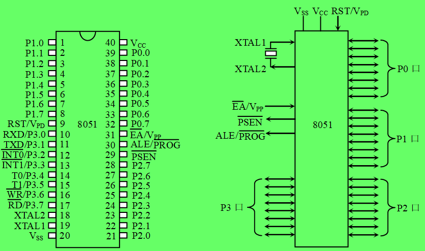
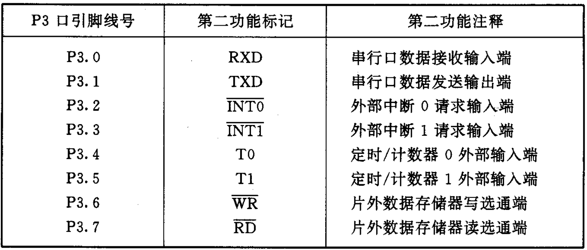
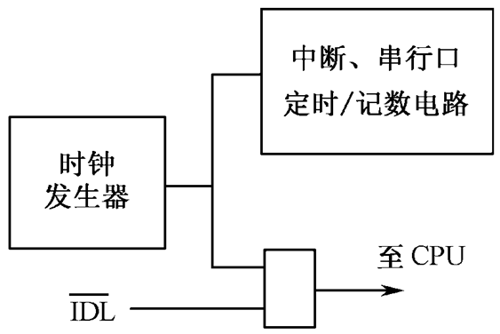
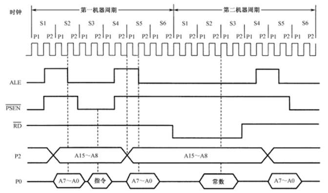
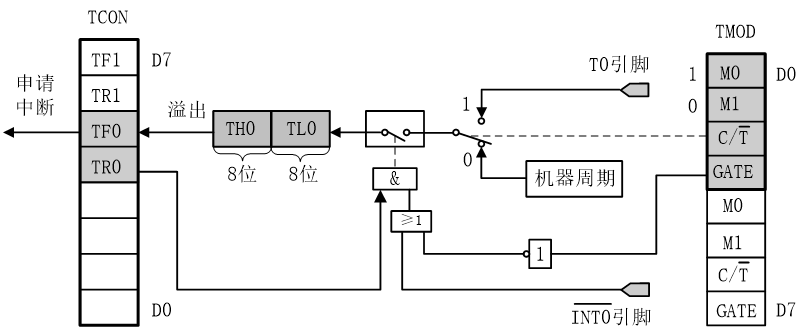
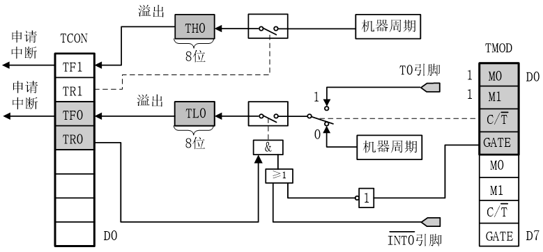
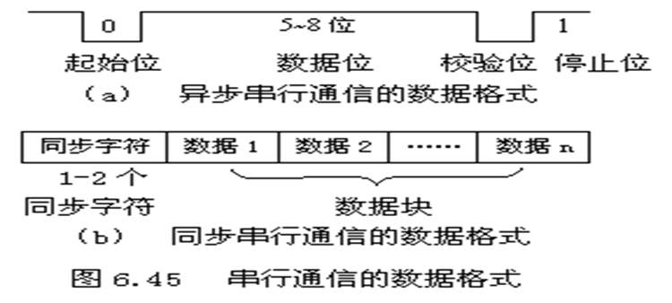
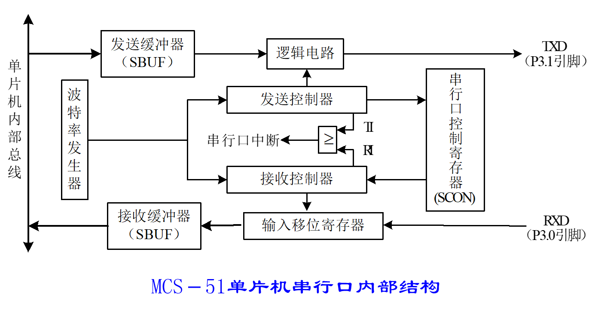
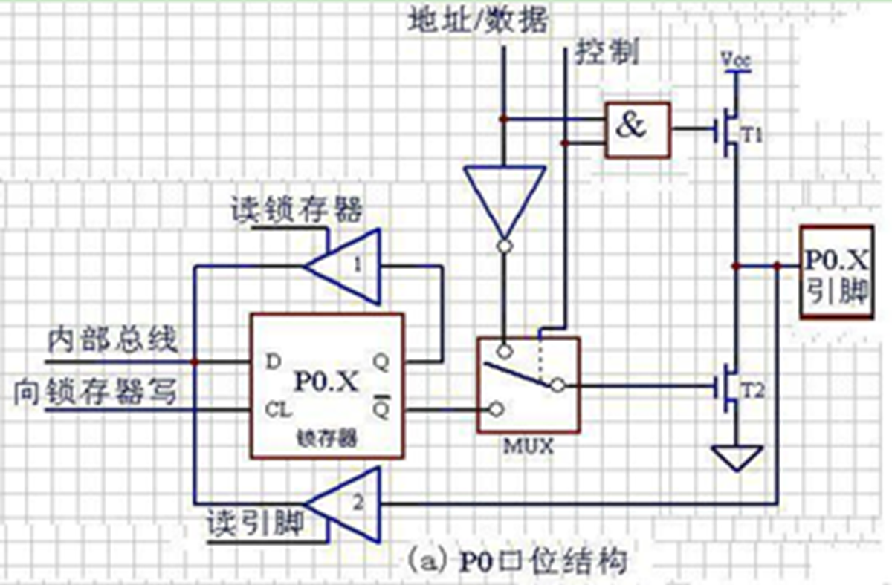
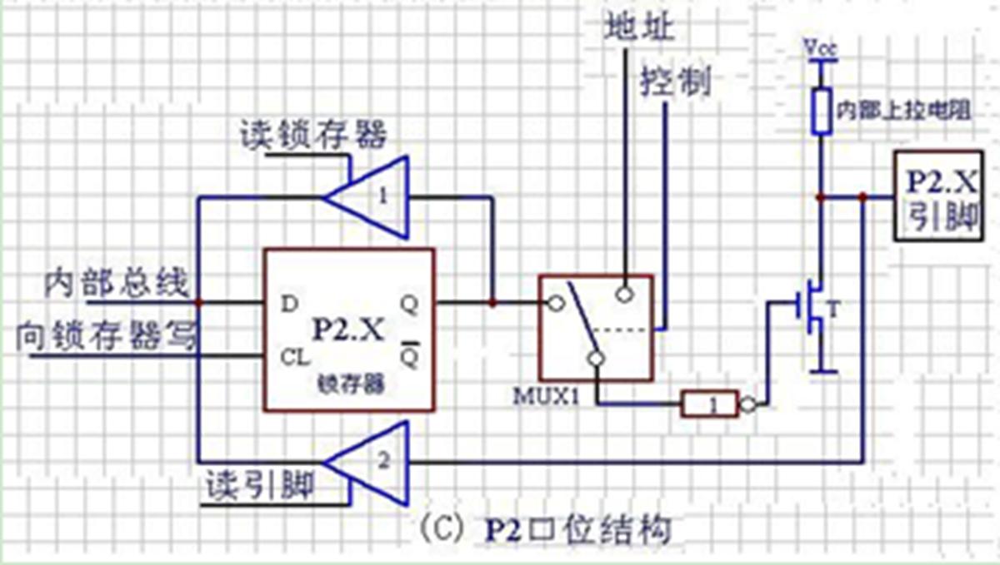

# 单片机

## 单片机定义

> [!note]
>
> **单片机**：将计算机的**基本部件集成在一块芯片**上
>
> 
>
> 

- 单片机是电子计算机的一种

- 将组成微型计算的各个功能部件：中央处理器（CPU）、存储器（RAM、ROM、EPROM）、定时/计数器、串行口、I/O接口电路等集成在一块集成电路芯片中从而构成完整的**微型计算机**，故称为单晶片微型计算机，简称单片机，也称为微控制器

- 单片机真正能让开发者做到**一位一位（bit）的编程**。

  

## 单片机控制应用

- 单片机通过**接口**对外部设备进行控制

- **单片机是物联网控制系统中的“节点机”**

> [!note]
>
> 单片机和嵌入式系统：
>
> - 单片机和嵌入式系统都属于计算机，硬件和软件都可以相对裁剪的计算机系统
> - 但是单片机一般用于小任务，功能相对单一，开发简单
> - 嵌入式系统可裁剪，做大任务，“嵌入”到其他设备中，用于实现特定功能

## 单片机分类

- 按用途

  > **通用型**：将可开发的资源（ROM、RAM、I/O、EPROM）等全部提供给用户。
  >
  > **专用型**：其硬件及指令是按照某种特定用途而设计，例如电机控制器。

- 按基本操作处理的**数据位数**：1位、4位、8位、16位、32位

> [!note]
>
> 为什么以8位的MCU为主? 需要稳定性，功耗低，成本低（一块钱成本）

# MCU的体系结构-以MCS-51单片机为例

## MCS-51单片机硬件结构及引脚

### MCS-51单片机的内部结构

- 组成：CPU(运算和控制)，RAM（数据存储器），ROM（程序存储器），I/O(串口并口)，内部总线，中断系统

- 振荡器提供周期信息

#### 中央处理器（CPU）

由运算器和控制器组成

1. 运算器：8位算术逻辑运算单元**ALU**（Arithmetic Logic Unit）、8位累加器**A**（Accumulator）、8位寄存器B、程序状态字寄存器**PSW**（Program Status Word）、8位暂存**寄存器TMP1和TMP2**等，完成算术运算和逻辑运算
2. 控制器：程序计数器**PC**（Program Counter）、指令寄存器**IR**（Instruction Register）、指令译码器**ID**（Instruction Decoder）、**堆栈指针SP**、**数据指针DPTR**、定时控制逻辑和**振荡器**OSC等电路，根据PC取码存放在IR后，由ID译码，产生执行信号

#### 存储器

1. 把程序存储器和数据存储器分开，有各自的寻址系统、控制信号和功能

2. 8051的存储器在结构上分为片内数据存储器、片内程序存储器、片外数据存储器和片外程序存储器**4个存储空间**。但从用户使用的角度看，片内程序存储区和片外程序存储区是统一编址的，所以在逻辑上8051的存储器分为3个逻辑空间

   

   > **三个逻辑空间：**
   >
   > 1. 片内外统一寻址的**64KB程序存储器**空间，地址范围为0000H～FFFFH。
   >
   > 2. 64KB的片外数据存储器空间，地址范围也为0000H～FFFFH。
   >
   > 3. 256B的片内数据存储器空间，地址范围为00H～FFH。

##### 程序存储器

- 一般将**只读存储器（ROM）**用做程序存储器。可寻址空间为64KB，用于存放用户程序、数据和表格等信息

MCS-51单片机按程序存储器可分为内部无ROM型（如8031）和内部有ROM型（如8051）两种，连接时EA引脚有区别。

- 具有特殊含义的存储单元

  > 0000H：单片机复位后的程序入口地址。 
  >
  > 中断向量：3+8*n(0<=n<=4)
  >
  > 0003H：外部中断0的中断服务程序入口地址。 
  >
  > 000BH：定时器0的中断服务程序入口地址。 
  >
  > 0013H：外部中断1的中断服务程序入口地址。 
  >
  > 001BH：定时器1的中断服务程序入口地址。 
  >
  > 0023H：串行口的中断服务程序入口地址

##### 数据存储器

- 一般将随机存储器（RAM）用做数据存储器。可寻址空间为64KB

- 片外RAM：

  ​     最大范围：0000H～FFFFH，64KB；用指令**MOVX访问**

- 片内RAM：

  ​     最大范围：00H～FFH，256B；用指令**MOV访问**。

#### 特殊功能寄存器（SFR）

1. MCS-51有21个特殊功能寄存器（也称为专用寄存器），包括算术运算寄存器、指针寄存器、I/O口锁存器、定时器/计数器、串行口、中断、状态、控制寄存器等
2. SFR反映了MCS-51单片机的运行状态。

1. 程序计数器PC

   > - 程序计数器PC在物理上是独立的，它不属于SFR存储器块
   > - PC是一个16位的计数器，专门用于存放CPU将要执行的**指令地址**（即下一条指令的地址）
   > - 可以通过转移、调用、返回等**指令改变其内容**，以控制程序执行的顺序

2. 累加器A

   > 累加器A是8位寄存器，又记做ACC
   >
   > 在算术/逻辑运算中用于**存放操作数或结果**

3. 寄存器B

   > 专门为**乘除法指令**设计的，也作通用寄存器用

4. 工作寄存器

   > 内部RAM的工作寄存器区00H～1FH共32个字节被均匀地分成四个组（区），每个组（区）有8个寄存器
   >
   > 分别用R0～R7表示，称为**工作寄存器或通用寄存器**，其中，R0、R1还经常用于间接寻址的地址指针
   >
   > 通过程序状态字寄存器（PSW）第3、4位设置工作寄存器区。

5. 程序状态字PSW 

   > 用于存放程序运行的**状态信息**，PSW中各位状态通常是在指令执行的过程中自动形成的，但也可以由用户根据需要采用传送指令加以改变
   >
   > 例如：Cy(进借位)，AC(辅助进借位)，F0(用户)，RS1.RS0(工作寄存器组（区）选择)，OV(溢出标志)，P(奇偶标志位)

6. 数据指针DPTR

   > DPTR主要用作16位**间址寄存器**，访问程序存储器和片外数据寄存器
   >
   > 也可作为两个独立的8位寄存器DPH（高8位）、DPL （低8位）使用

7. 堆栈指针SP

   > 堆栈指针SP是一个8位寄存器，用于指示堆栈的栈顶，它决定了堆栈在内部RAM中的物理位置
   >
   > 设立堆栈的目的是用于**数据的暂存，中断、子程序调用时断点和现场的保护与恢复**

8. I/O口专用寄存器（P0, P1, P2, P3）

   > 8051片内有4个8位并行I/O接口P0, P1, P2和P3

9. 定时器/计数器（TL0, TH0, TL1和TH1）

   > 2个16位定时器/计数器是**完全独立**的。可以单独对这4个寄存器进行寻址，但不能把T0和T1当做16位寄存器来使用。

10. 串行数据缓冲器（SBUF）

    > 存放需要发送和接收的数据
    >
    > 发送缓冲器和接收缓冲器组成
    >
    > 发送和接收的操作其实都是对串行数据缓冲器SBUF进行的

11. 其他控制寄存器

    > 还有IP, IE, TCON, SCON和PCON等几个寄存器，主要用于中断、定时和串行口的控制

#### I/O接口

I/O接口是MCS-51单片机对外部实现控制和信息交换的通道，用于信息传送过程中的速度匹配和增加它的负载能力。

8051内部有4个8位并行接口P0, P1, P2, P3，有1个全双工的**可编程串行**I/O接口。

#### 定时器与计数器

8051内部有两个16位可编程序的定时器/计数器，均为**二进制加1计数器**，

T0和T1均有定时器和计数器两种工作模式

1. 定时器模式下，T0和T1的计数脉冲可以由**单片机时钟脉冲经12分频后提供**
2. 计数器模式下，T0和T1的计数脉冲可以从**P3.4和P3.5引脚**上输入
3. 控制由定时器方式选择寄存器TMOD和定时器控制寄存器TCON完成

#### 中断系统

- **中断：**指CPU**暂停原程序执行**，转而为外部设备服务（执行中断服务程序），并在服务完后返回到原程序执行的过程。
- **中断系统：**指能够处理上述中断过程所需要的**硬件电路**
- **中断源：**指能**产生中断请求信号**的源泉。

8051的中断系统主要由中断允许控制器IE和中断优先级控制器IP等电路组成

---

### MCS-51单片机外部引脚

- 8051单片机有40个引脚，分为端口线、电源线和控制线三类。

#### 电源线

 GND（ground）：接地引脚。

 VCC：正电源引脚。接＋5V电源

#### 端口线

P0～P3口：**4×8=32条**。

1. P0(P0.0~P0.7)

   > 8位双向三态I/O口，为外部扩展时的数据总线/低8位地址总线的**分时复用口**。
   >
   > 又可作为**通用I/O口**，每个引脚可驱动8个TTL负载。
   >
   >  对EPROM型芯片（如8751）进行编程和校验时，P0口用于**输入/输出数据**

2. P1

   > 8位准双向I/O口，内部具有**上拉电阻**，可作为通用I/O口。每个引脚可驱动4个TTL负载

3. P2

   > 同P1，但是可以作为外部扩展时的高8位地址总线

4. P3

   >  8位准双向I/O口，内部具有上拉电阻。它是双功能复用口
   >
   > 作为通用I/O口时，功能与P1口相同，
   >
   > 常用第二功能。每个引脚可驱动4个TTL负载。作为第二功能使用时，各位的作用如下页表所示
   >
   > 

#### 控制线

1. RST/VPD

   > RST/VPD引脚是**复位信号**/**备用电源**线引脚
   >
   > 当8051通电时，在RST引脚上出现24个时钟周期以上的高电平，系统即**初始复位。**

2. ALE/PROG_

   > 地址锁存允许/编程引脚。
   >
   > 访问外部程序存储器时，ALE的输出用于**锁存地址的低位字节**，以便P0口实现地址/数据复用
   >
   > 不访问外部程序存储器时，ALE端将输出一个1/6时钟频率的**正脉冲信号**
   >
   > 第二功能：对EPROM型芯片（如8751）进行编程和校验时，此引脚传送52ms宽的负脉冲选通信号

3. EA_/V_pp

   > 允许访问片外程序存储器/编程电源引脚(低电平有效)
   >
   > 第二功能是片内EPROM编程/校验时的电源线，在**编程时**，VPP脚需加上21V的编程电压

4. XTAL1和XTAL2

   > XTAL1脚为片内振荡电路的**输入端**，XTAL2脚为片内振荡电路的**输出端**
   >
   > 
   >
   > 片内时钟振荡方式，但需在XTAL1和XTAL2脚外接石英晶体（频率为1.2～12MHz）和振荡电容
   >
   > 外部时钟方式，即将XTAL1接地，**外部时钟信号从XTAL2脚输入**

---

## MCS-51单片机的工作方式

MCS-51系列单片机的工作方式可分为：复位方式、程序执行方式、单片执行方式、掉电保护方式、节电工作方式和EPROM编程/校验方式

### 复位

- 系统**开始运行和重新启动**靠复位电路来实现，这种工作方式为复位方式
- 单片机在开机时都需要复位，以便CPU及其他功能部件都处于一种**确定的初始状态**，并从这个状态开始工作
- MCS-51单片机在RST引脚产生两个机器周期（即24个时钟周期）以上的**高电平**即可实现复位

> [!tip]
>
> - 复位是单片机的初始化操作
> - 复位功能是把**PC初始化**为0000H，使CPU从0000H单元开始执行程序
> - 内部RAM的数据是不变的
> - 程序运行出错或操作错误使系统处于**死锁状态**时，需要按复位键重新启动

- 复位操作有上电自动复位和按键手动复位两种方式

  > 上电自动复位是通过**外部复位电路的电容充电**来实现的。
  >
  > 按键手动复位是通过**复位端经电阻与电源VCC接通**而实现的，它兼备上电复位功能

### 程序执行

程序执行方式是单片机基本工作方式，可分为**连续执行**工作方式和**单步执行**工作方式

1. 连续执行：单片机复位后立即转到**0000H处执行程序**。自动连续地执行下去
2. 单步执行：用户调试程序的一种工作方式，按一次，单片机就执行一条指令（仅仅执行一条）,**利用单片机外部中断功能实现**

### 节电方式

节电工作方式是低功耗的工作方式，可分为**空闲（等待）方式**和**掉电（停机）方式**。

1. HMOS单片机的掉电保护：当VCC突然掉电时，单片机通过中断将必须**保护的数据送入内部RAM**，备用电源**VPD可以维持**内部RAM中的数据不丢失
2. CHMOS单片机的节电方式：CHMOS型单片机特别适用于**低功耗**应用场合，它的空闲方式和掉电方式都是由**电源控制寄存器PCON**中相应的位来控制

> [!note]
>
> 电源控制寄存器**PCON**
>
> 

#### 空闲工作方式

将**IDL**位置为1（用指令MOV PCON, #01H）

CPU为空闲待机状态，**中断系统、串行口、定时器/计数器**，仍有时钟信号，仍继续工作

中断退出，硬件复位退出空闲状态

#### 掉电工作方式

将PD置为1（用指令MOV PCON, #02H），片内的RAM和SFR中的数据保持不变，而包括中断系统在内的**全部电路都将处于停止工作状态**

硬件**复位**退出掉电工作方式

### 编程和校验

- 编程是将原始**程序、数据**写入内部EPROM中
- 校验是在向片内程序存储器EPROM写入信息时或写入信息后，可将片内EPROM的内容**读出进行校验**

### 时序

> [!note]
>
> - CPU在执行指令时所需控制信号的**时间顺序**称为时序。
> - 时序是用**定时单位**来描述的，MCS-51的时序单位有四个，分别是时钟周期（节拍）、状态、机器周期和指令周期

时序单位：

1. 时钟周期：振荡周期、节拍（用P表示)

   > 为单片机提供时钟信号的**振荡源（OSC）的周期**。它是时序中的最小单位。

2. 状态（S）：

   > - 振荡脉冲经过**二分频**后即得到整个单片机工作系统的状态
   > - 一个状态有两个节拍，前半周期对应的节拍定义为P1，后半周期对应的节拍定义为P2

3. 机器周期：通常将完成一个基本操作所需的时间称为机器周期

4. 指令周期：执行一条指令所需要的时间称为指令周期。它是时序中的最大单位。

> [!tip]
>
> 单片机时序定时单位从小到大依次为：时钟周期、状态周期、机器周期和指令周期

####  MCS-51指令的取指/执行时序

- 指令的集合称为程序，执行程序的过程就是执行指令的过程
- 单片机执行任何一条指令时都可以分为取指阶段和执行阶段。
  - 在取指阶段，CPU从程序存储器中取出指令操作码，送指令寄存器，
  - 经指令译码器译码，产生一系列控制信号，完成本指令规定的操作
- 在取指阶段，CPU从程序存储器中取出指令操作码，送指令寄存器，再经指令译码器译码，产生一系列控制信号，完成本指令规定的操作
- ALE信号是用于**锁存低8位地址的选通信号**，每出现一次该信号，单片机即进行一次读指令操作。
- 当指令为多字节或多周期指令时，只有第一个ALE信号进行读指令操作，**其余的ALE信号为无效操作**（或读操作数操作）

#### 访问片外ROM/RAM指令的时序

1. 外部**程序**存储器读时序

   从外部程序存储器读取指令，必须有两个信号进行控制：ALE信号和_PSEN信号（外部ROM读选通脉冲）

   

   - MCS-51单片机有外部总线，16位的地址线，8位的数据线，但是**地址的低8位跟数据线是重合的**，因此访问的时候需要**ALE信号区分开**低8位（P0口，高8位是P2口）地址和数据

2. 外部**数据**存储器读时序

   

   P2 是高八位地址总线，而P0是**分时复用地址**、数据总线（控制低八位），需要ALE来锁存P0在担任地址角色时输出的地址信号。

### 中断系统

#### CPU与外部设备的通信方式

1. 无条件传送方式：CPU总是认为外设在**任何时刻都处于“准备好”**的状态
2. 查询传送方式：输入时，需要查询外设的输入**数据是否准备好**。输出时，需要查询外设是否把上一次输出的数据**处理完毕**
3. 中断传送方式：**CPU**暂时中止当前的工作，转去处理所发生的事件。中断服务处理完该事件后，再返回到原来被中止的地方继续原来的工作，这样的过程称为中断**

#### 中断传送方式

1. **CPU**暂时**中止**当前的工作，转去处理所发生的事件。中断服务处理完该事件后，再返回到原来被中止的地方继续原来的工作，这样的过程称为中断

##### 中断源与控制寄存器

1. ¨标准MCS51有如下5个中断源：外2(INT0、INT1）、内2（T0、T1）、串1，外2可扩展

2. 串行口  完成一帧发送(TI)或接收(RI)中断请求 

   > 串口只要发送或接收完一帧，都会**置位串口中断标志位**（发送就置位TI，接收则置位RI），两个标志位只要有一个为1（即是两种情况有一种发生）且此时系统允许串口中断，则会转向中断服务程序，
   >
   > 在中断服务程序里判断中断是TI/RI哪个为1触发的，相应的做出处理，如可以把缓冲区的数据读出来等。
   >
   > 如果没有开中断，则通过**检测TI/RI是否为1来检测发送或者接收结束否**，这两个标志位无论是中断法还是查询法都只能使用软件清零（接收完了人工置0）。

- 外部中断0  > 定时/计数器0 > 外部中断1  > 定时/计数器1 > 串行口            

---

## MCS51的片上接口及应用

### 定时器/计数器及应用

比较方便的办法是利用单片机内部的定时/计数器。也可以采用下面三种方法：

1. 软件定时
2. 采用时基电路定时：555电路，外接必要的元器件（电阻和电容）
3. 采用可编程芯片定时：

##### 定时器/计数器概述

- 可编程定时器/计时器
  - 确定其工作方式是**定时还是计数**；
  - 预置定时或计数**初值**；
  - 当定时时间到或计数**终止**时，要不要发中断请求；
  - **何时启动**定时器或计数器工作

#### 工作原理

- 定时器：计数输入信号来自内部振荡信号，在每个机器周期内定时器的计数器做一次“+1”运算。因此定时器亦可视为**计算机机器周期的计数器**
- 计数器：计数输入信号来自外部引脚T0（P3.4）、T1（P3.5）上的**计数脉冲**，外部每输入一个脉冲，计数器做一次“+1”运算

都可以设置初值以及溢出时都可以产生中断

当加到计数器为全1时，再输入一个脉冲就使计数器回零，且计数器的溢出使TCON中TF0或TF1置1

由**溢出时计数器的值减去计数初值**才是加1计数器的计数值

#### 定时器/计数器的主要特性

1. 每1个定时器/计数器都可以分为**两个独立的8位**定时器/计数器
2. 有4种工作方式：其中T0有方式0、1、2、3，T1有方式0、1、2
3. 需写入计数初值，且规定其工作方式，每种工作方式的初值计算有不同方法

#### 内部结构

- 定时/计数器的实质是加1计数器（16位），由高8位和低8位两个寄存器组成。
- TMOD是定时/计数器的**工作方式寄存器**，确定工作方式和功能；
- TCON是**控制寄存器**，控制T0、T1的启动和停止及设置溢出标志。

#### 定时器/计数器的控制

##### **方式控制**寄存器TMOD 用于设置定时/计数器的工作方式

- GATE：门控位。选择内部中断（GATE=0),外部中断（GATE=1)
- C/_T：定时/计数模式选择位
- M1和M0：工作方式选择位

| **M1M0** | **工作方式** | **功能**                              |
| -------- | ------------ | ------------------------------------- |
| 00       | 方式0        | 13位计数器                            |
| 01       | 方式1        | 16位计数器                            |
| 10       | 方式2        | 可自动重新装载的8位计数器             |
| 11       | 方式3        | T0分为两个独立的8位计数器，T1停止计数 |

##### 定时器/计数器控制寄存器TCON

- TF1（TCON.7）， T1溢出中断请求标志位。
- TR1（TCON.6）：T1运行控制位。

#### 定时器/计数器的工作方式

##### 方式0

方式0为**13位计数**，由TL0的低5位（高3位未用）和TH0的8位组成。

TL0的低5位溢出时向TH0进位，TH0溢出时，置位TCON中的TF0标志，向CPU发出中断请求。

计数个数与计数初值的关系为： **X=2^13 - N**

##### 方式1

方式1的计数位数是**16位**，由TL0作为低8位、TH0作为高8位，组成了16位加1计数器 。

计数个数与计数初值的关系为： **X=2^16 - N**

##### 方式2

- 方式2为自动重装初值的8位计数方式。
- TL1（或TL0）被定义为计数器，TH1（或TH0）被定义为赋值寄存器

计数个数与计数初值的关系为：  **X=2^8 - N**

适合于用作较精确的脉冲信号发生器

##### 方式3

方式3**只适用于定时/计数器T0**，定时器T1处于方式3时相当于TR1=0，停止计数

工作方式3将T0分成为两个独立的8位计数器TL0和TH0

模式3通常适用于要求增加一个额外的8位定时器的情况

#### 计数初值的计算

置入计数初值X可计算如下：

 计数方式时：

>    X＝M－计数值（X即为计数值的补码）
>
>    例如：要计100个数，则计数初值X=M－100

② 定时方式时：

> （M－X）×T＝定时值
>
>    故，X＝M－定时值/T
>
> 其中T为计数周期，是单片机时钟的12分频，即**单片机机器周期**。
>
> 当晶振为6MHz时，T＝2μs，当晶振为12MHz时，T＝1μs。 

#### 总结

定时和计数**实质都是对脉冲的计数**，只是被计脉冲的来源不同，定时方式的被计脉冲来源于时钟，计数方式的被计脉冲来源于外部

定时方式的计数初值和被计脉冲周期有关，计数方式的和被计脉冲的个数有关。

无论定时还是计数，当计满规定的脉冲个数**产生溢出**（计数初值寄存器回零），置位TFx , 可以通过程序查询，如果允许中断，会产生中断。

### 中断应用

#### 中断处理过程

##### 中断响应

- 中断响应的前提
  - EA=1(开中断)
  - 对应的中断允许标志=1
  - 无同级或更高级中断正在处理
- 如果当前执行RETI或者访问IE或者IP的指令，需要再执行一条指令，才能响应中断

- 具体过程：

  > 1. **置相应的优先级触发器状态为1**
  > 2. 执行一个硬件生成子程序调用指令
  > 3. 保护断点。**注意不保存PSW**
  > 4. 转入相应的中断服务程序入口，执行中断服务程序 

- 中断响应时间

  > 1. 第一个周期：采样外部中断请求输入引脚电平
  > 2. 第二个周期：查询IE0和IE1
  > 3. 第三个周期：维持请求中断信号
  >
  > 从外部中断请求有效到开始执行中断服务程序的第一条指令，中间**至少需要3个完整的机器周期**。如果中断被阻止，则中断响应时间将延长

- 中断入口地址：通常在这些入口放置一个**无条件转移指令**，转移到其他地址执行

- 中断处理：保护现场，切换寄存器工作区，中断撤销

#### 汇编语言中断编程

- 中断入口地址设定
- 中断允许、优先级设定
- 中断服务程序：保护现场，切换工作寄存器区，执行中断工作，RETI

#### C语言中断编程

- 主程序：允许中断、中断优先级

- 中断函数：

  > - 使用`interrupt m`进行修饰。其中m的取值为0~31对应不同中断方式
  > - 中断函数**不能进行参数传递**
  > - 中断函数**没有返回值**
  > - 在任何情况下都**不能直接调用中断函数**
  > - **被调用函数所使用的寄存器必须与中断函数相同**
  > - C51编译器从绝对地址`8m+3`处产生一个中断向量
  > - 中断函数最好写在**文件的尾部**，并不能使用extern存储类型说明。

- `using n`修饰符

  > 修饰符`using n`用于指定本函数内部使用的**工作寄存器组**，其中n的取值为0~3，表示寄存器组号
  >
  > using n修饰符不能用于有返回值的函数，C51函数的返回值是放在寄存器中的

## 串行接口及应用

### 串行通信的基本概念

- 串行通信就是二进制信息位按时间顺序**一位一位**地传送的通信方式
- 串行通信有两种基本通信方式：异步方式和同步方式

### 异步串行通信

- 异步通信，是指数据传送以**字符**为单位，字符与字符间的传送是完全异步的，位与位之间的传送基本上是同步的。
- 异步串行通信的特点为：
  - 以字符为单位传送信息。
  - 相邻两字符间的间隔是**任意长**。
  - 接收时钟和发送时钟只要相近就可以，不需要精确同步。
- 简单说就是：**字符间异步，字符内部各位同步**。

- 异步串行通信的数据格式：每个字符（每帧信息）由4个部分组成
  - 1位**起始位**，规定为低电平0；
  - 5～8位**数据位**，即要传送的有效信息；
  - 1位奇偶**校验位**；
  - 1～2位**停止位**，规定为高电平1。

### 同步串行通信

- 同步通信，是指数据传送是以**数据块（一组字符）**为单位，字符与字符之间、字符内部的位与位之间都同步。
- 同步串行通信的特点为：
  - 以数据块为单位传送信息。
  - 在一个数据块（信息帧）内，字符与字符间无间隔。
  - 接收时钟与发送进钟严格同步，通常要有同步时钟。
  - 字符数据间不允许有间隙，当线路空闲或没有字符可发送时，发送同步字符。

- 同步串行通信的数据格式：每个数据块（信息帧）由3个部分组成：
  - 2个**同步字符**作为一个数据块(信息帧)的起始标志；
  - n个连续传送的**数据**
  - 2个字节**循环冗余校验码**(CRC)

## MCS51串行接口的结构与控制

- MCS-51系列单片机有一个**全双工的串行接口**，可进行异步串行接收和串行发送，可编程选择四种工作方式，波特率可由用户设置

- 通过**引脚RXD（P3.0串行数据接收端）**和**引脚TXD（P3.1串行数据发送端）**与外界进行通信。

  可以作为**UART**（Universal Asynchronous Receiver/Transmitter）用，也可用作**同步移位寄存器**。  

- 串行控制寄存器SCON

  > **用以存放串行口的控制和状态信息。**
  >
  > 

- 波特率发生器:

  > 定时器T1作波特率发生器，改变计数初值就可以改变串行通信的速率，称为**可变波特率**
  >
  > 以内部时钟的分频器作波特率发生器，因内部时钟频率一定，称为**固定波特率**

### 串行通信的传送过程

- 接收，串行**数据**通过RXD（P3.0）进入单片机。当接收控制器检测到接收端RXD的负跳变时，启动接收过程，则串行口按照程序设定的格式、以一定的频率（波特率）**接收一帧数据**，接收完毕，数据**存入接收缓冲器SBUF**中，并**置RI为1**。
- 发送方，通过CPU执行 **MOV SBUF**， A指令启动发送过程，数据由TXD（P3.1）一位一位的发出，发送完最后一位，将**TI置1**。

> [!tip]
>
> 1. 甲、乙方的移位时钟频率应相同，即应具有**相同的波特率**，否则会造成数据丢失。
> 2. 发送方是先发数据再查标志，接收方是先查标志再收数据。
> 3. CPU通过指令和SBUF并行交换数据，查询**标志位**来确定数据的移位是否完成

### 波特率

1. 方式0为移位寄存器方式，波特率是固定的：波特率=`Fosc/12`；
2. 方式1和方式3的波特率可变，由定时器T1溢出速率控制。方式1和方式3波特率=**（2^SMOD/32）×（T1溢出率）**
3. 方式2为**9位UART**，方式2波特率=（2^SMOD/64）×Fosc。波特率仅与**PCON中SMOD的值有关**，当SMOD=0时，波特率为Fosc/64；当SMON=1时，波特率为Fosc/32。

- 使用定时器作为波特率发生器

  

  > 

## 并行口及其应用

### 不同的并行口结构

1. P0口

> - P0口是8位双向三态输入/输出接口
> - P0口既可作地址/数据总线使用，又可作通用I/O口用。
> - 连接外部存储器时，P0口一方面作为8位数据输入/输出口，另一方面用来输出外部存储器的低8位地址。 
>
> 

2. P1口

> - P1口是8位准双向口，作通用输入/输出口使用
> - 在输出驱动器部分，P1口有别于P0口，它接有内部上拉电阻。
> - CPU既可以对P1口进行字节操作，又可以进行位操作。
>
> 

3. P3口

> - P2口是8位准双向输入/输出接口
> - P2口可作通用I/O口使用，与P1口相同。
> - 当外接程序存储器时，P2口给出地址的高8位，此时不能用作通用I/O。
>
> 

4. P3口

> P3口也是一个8位的准双向输入/输出接口
>
> 

> [!important]
>
> 各个接口对比
>
> | **接口** | **电气特性** | **专用功能**       | **用途** |
> | -------- | ------------ | ------------------ | -------- |
> | P0       | 三态输入输出 | 地址低8位/数据总线 |          |
> | P1       | 上拉电阻     |                    | 外部接口 |
> | P2       | 上拉电阻     | 地址高8位          |          |
> | P3       | 上拉电阻     | 专用功能           |          |
