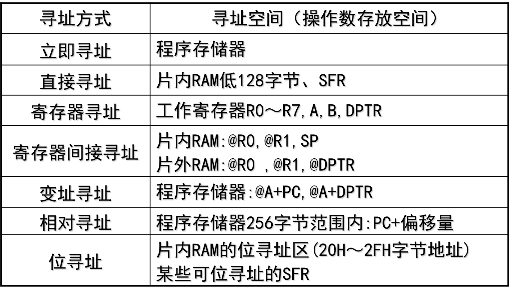
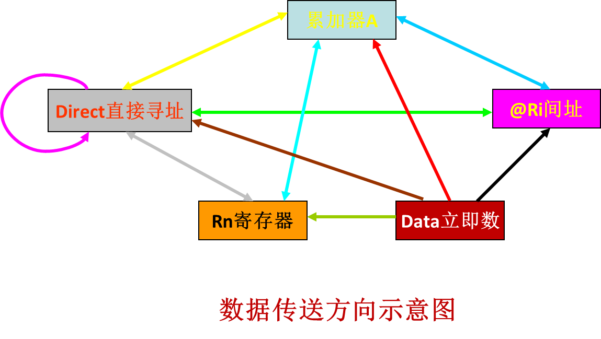
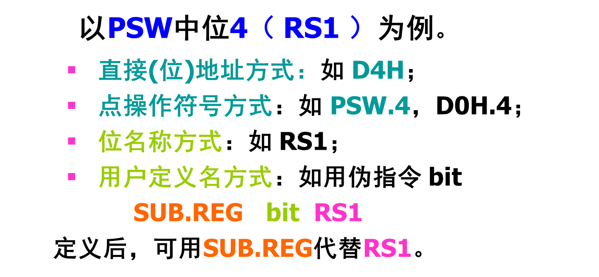

# 51汇编语言

## 汇编语言

> [!tip]
>
> 有时需采用汇编语言：
>
> 1. 对某些特殊I/O接口地址的处理；
> 2. 中断向量地址的安排；
> 3. 提高程序代码的执行速度等
>
> C51语言程序与汇编语言程序的相互调用也可视为函数的调用，只不过此时是采用不同语言编写的而已。
> 可利用8051单片机的工作寄存器（固定的存储区域）来传递参数。
> 利用公共符号“PUBLIC”来确定参数传递段的首地址

- 宏指令与子程序：

- 宏指令：在汇编语言的源程序中，若有一段程序要多次使用，为了使在源程序中不重复书写这样的一段程序，可用一条宏指令来代替，由汇编程序在汇编时产生所需要的代码。可简化源程序。  

  与子程序不同：宏指令**并没有简化目标程序**，而子程序可以。

对于8051单片机，现有4种语言支持，即汇编、PL/M、C、BASIC。

- 源文件命名常规：

  > **典型源文件：.ASM、.A51、.P51、 .C、.C51**
  >
  > 汇编语言源文件： .ASM、.A51
  >
  > PL/M语言源文件： .P51
  >
  > C语言源文件： .C、.C51
  >
  > 包含汇编/编译的程序和错误的列表文件：.LST
  >
  > 可重定位的目标文件：.HEX
  >
  > 库文件：.LIB
  >
  > 链接/定位后的映像文件：.M51、MAP
  >
  > 链接器/定位器使用的文件：.LNK
  >
  > 编译时加入到源文件中的头文件：.H

- 程序的组成：在汇编语言源程序中，可重复使用的部分由子程序完成。

## MCS51汇编语言

### MCS-51单片机指令系统

#### 指令 

7种寻址方式，111条指令


#### 常用符号

- Rn：工作寄存器中的寄存器R0、R1…R7之一，
- Ri：工作寄存器中的寄存器R0或R1
- \#data：8位立即数
- \#data16：16位立即数
- direct：片内RAM或SFR的地址（8位）
- @：间接寻址寄存器
- Bit：片内RAM或SFR的位地址
- addr11：11位目的地址
- addr16：16位目的地址
- rel：补码形式的8位地址偏移量。偏移范围为-128～127
- /：位操作指令中，该位求反后参与操作，不影响该位
- X：片内RAM的直接地址或寄存器
- (X)：相应地址单元中的内容
- →：箭头左边的内容送入箭头右边的单元内

### 指令格式


例如：MOV A  #40H; //A=40H

- 操作数类型：

- 工作寄存器（R0-R7）

  SFR（包括ACC，PSW）

  标号名字

  常数（#）

  $符号

  表达式

### 寻址方式

1. 立即寻址

   >   操作数就包含在**指令代码**中，在操作码之后，称为立即数，用“＃”表示。
   >
   > ```assembly
   > MOV A, #30H  #汇编成机器码74H 30H
   > MOV R7,#0F5H
   > MOV DPTR,#1245H
   > ```
   >
   > 立即寻址：其中取指周期需要一个机器周期，执行周期需要一个机器周期

2. 寄存器寻址

   > 对选定的**工作寄存器**R0～R7、累加器A、通用寄存器B、地址寄存器DPTR中的数进行操作。 
   >
   > ```assembly
   > MOV A，R0；#将R0工作寄存器中的数据送到累加器A中去
   > ```
   >
   > 寄存器寻址：执行周期一般只需一个机器周期。 

3. 直接寻址

   > 直接使用数所在单元的**地址**找到了操作数，所以称这种方法为直接寻址。
   >
   > 操作数在SFR、内部RAM、位地址空间。
   >
   > ```assembly
   > MOV A，00H
   > MOV C，60H
   > MOV A，0F0H
   > ```

4. 寄存器间接寻址

   > 把**地址放在另外一个寄存器**中，根据这个寄存器中的数值决定该到哪个单元中取数据。
   >
   > ```assembly
   > MOV  A，@R0  #操作数在片内RAM中
   > MOVX  A，@R0  #操作数在片外RAM中,高8位由P2给出
   > MOVX  A，@DPTR  #操作数在片外RAM中，DPTR给出16位地址
   > ```

5. 变址寻址(基址变址寻址)

   > 以DPTR或PC为基址寄存器，累加器A为变址寄存器。把两者内容相加，结果作为操作数的地址。
   >
   > 常用于查表操作
   >
   > ```assembly
   > MOVC  A， @A+DPTR；#(A+DPTR) →A 
   > MOVC  A， @A+PC； #PC+1 →PC，(A+PC)→A
   > ```
   
6. 相对寻址（跳转指令）

   > 将PC中的当前内容与指令第二字节给出的数相加，结果作为跳转指令的转移地址（转移目的地址）。 
   >
   > PC中的当前内容称为基地址（本指令后的字节地址），指令第二字节给出的数据称为偏移量，**1字节带符号数**
   >
   > 常用于跳转指令。
   >
   > ```assembly
   > JC   23H; #C=1，跳转
   > ```

7. 位寻址

   > 对片内RAM的位寻址区和某些可位寻址的特殊功能寄存器进行位操作时的寻址方式
   >
   > ```assembly
   > MOV C, 30H
   > ```



## 指令分类

### 数据传送指令

1. 内部数据传送指令 MOV
2. 外部数据存储器读写指令 MOVX
3. 程序存储器读指令 MOVC
4. 堆栈操作 PUSH，POP
5. 数据交换指令
6. 十六位数的传递指令

-   MCS-51 助记符：

     MOV、MOVX、MOVC         

     XCH、XCHD、SWAP         

     PUSH、POP            

- 源操作数寻址方式（5种）：

  立即寻址、直接寻址、寄存器寻址、

  寄存器间接寻址、变址寻址。

- 目的操作数寻址方式（3种）：

  直接寻址、寄存器寻址、寄存器间接寻址

  除了**目的操作数为ACC的指令影响奇偶标志P**外，一般不影响标志位。

#### 内部数据传送



#### 外部数据存储器读写指令

```assembly
MOVX   A，@DPTR
MOVX   @DPTR，A
MOVX   A, @Ri
MOVX   @Ri， A
```

- 在51中，与外部存储器RAM打交道的只可以是A累加器。外部和内部的数据通道是A累加器

```assembly
#将外部RAM中100H单元中的内容送入外部RAM中200H单元中。
MOV   DPTR，#0100H
MOVX  A，@DPTR
MOV   DPTR，#0200H
MOVX  @DPTR，A
```

#### 程序存储器读指令

```assembly
MOVC A，@A+DPTR
MOVC A，@A+PC
```

- 将ROM中的数送入A中。本组指令也被称为查表指令，常用此指令来查一个已做好在ROM中的表格

#### 堆栈操作

```assembly
PUSH direct 
SP:=SP+1，(SP):=(direct)
POP direct
(direct):=(SP), SP:=SP-1
```

- 第一条为压入指令，就是将**direct中的内容送入堆栈**中，
- 第二条为弹出指令，就是将**堆栈中的内容送回到direct**中

- 例子

```assembly
MOV  SP，#5FH
MOV  A，#100
MOV  B，#20
PUSH  A
PUSH  B
```

#### 数据交换指令

```assembly
MOV  DPTR，#data16
#等同于
MOV DPH，#35H
MOV DPL，#12H
```

- 将一个16位的立即数送入DPTR中去。其中高8位送入DPH，低8位送入DPL。

### 算术运算指令

#### 加法指令

```assembly
#不带进位的加法指令
ADD A，#data； 	#A := A+data
ADD A，direct； 	#A := A+(direct )
ADD A，Rn； 	#A := A+Rn
ADD A，@Ri； 	#A := A+(Ri)
```

- 将A中的值与源操作数所指内容相加，最终结果存在A中

```assembly
#带进位的加法指令
ADDC A，#data； 	#A := A+data + C
ADDC A，direct； 	#A := A+(direct ) + C
ADDC A，Rn； 	#A := A+Rn + C
ADDC A，@Ri； 	#A := A+(Ri) + C
```

- 将A中的值和其后面的值以及进位位C中的值相加，最终结果存在A，常用于**多字节数运算**中。

#### 减法指令

```assembly
#带借位减法指令
SUBB A，Rn； #A=A - Rn-CY
SUBB A，direct； #A=A - (direct ) - CY
SUBB A，@Ri； #A=A - (Ri) - CY
SUBB A，#data； #A=A – data – CY
```

- 将A中的值减去源操作数所指内容以及进位位C中的值，最终结果存在A中。

> [!tip]
>
> - 有不带借位的减法指令，如果需要做不带借位的减法指令（在做第一次相减时），只要**将CY清零**即可。
> - 对带符号数，要注意OV标志。OV=1，出错。

#### 十进制调整指令

```assembly
DA  A
```

进行BCD码加法运算，`A=0001 0101BCD`（代表十进制数15）

#### 加一减一指令

- 不影响任何标志位

```assembly
#加一指令
INC   A                        
INC   Rn                      
INC   direct
INC   @Ri
INC   DPTR

#减一指令
DEC   A                        
DEC   Rn                      
DEC   direct
DEC   @Ri
```

#### 乘除法指令

```assembly
MUL AB
```

- A\*B的低8位存入A，高8位存入B
- CY清零
- 如结果大于0FFH，OV置1

```assembly
DIV AB
```

- A/B的商放入A，余数放入B
- CY和OV清零
- 如B原值为0，指令执行完成之后AB内容不定，OV=1

### 逻辑运算和移位指令

```assembly
与操作 ANL
或操作 ORL
异或操作 XRL
移位指令 R(L/R)(C)
累加器清零取反指令
清零：CLR  A	 ；0→A
取反：CPL  A ；/A→A
```

- 主要用于对2个操作数按位进行逻辑操作，结果送到A或直接寻址单元。
- 操作：与、或、异或、移位、取反、清零等
- 除了目的操作数为ACC的指令影响奇偶标志P外，一般不影响标志位

#### 累加器移位指令（循环移位指令）


- 后两条指令，影响P标志和CY。

#### 清零与取反指令

```assembly
取反：
CPL  A ；/A→A
清0：
CLR  A	 ；0→A
```

### 控制转移指令

- 共有控制程序转移类指令(不包括位操作类的转移指令)。此类指令一般不影响PSW。
- 包括以下类型：
  - 无条件转移和条件转移
  - 相对转移和绝对转移
  - 长转移和短转移
  - 调用与返回指令

#### 无条件转移指令

```assembly
短转移类指令：
AJMP  addr11 #2kb
长转移类指令：
LJMP  addr16 #64kb
相对转移指令：
SJMP  rel #-128~+127
```

- AJMP、LJMP后跟的是绝对地址，而SJMP后跟的是相对地址。
- PC值改变，即跳转到一个标号处。

```assembly
间接转移指令：
JMP @A+DPTR
```

- 转移地址由A+DPTR形成，并直接送入PC。
- 本指令可代替众多的判别跳转指令，又称为散转指令，多用于多分支程序结构中

#### 条件转移指令

1. 判A内容是否为0转移指令（2条）

   ```assembly
    JZ   rel    ；如果A=0，则转移，否则顺序执行。
    JNZ  rel    ；如果A≠0，就转移。
    #新的PC值=当前PC+偏移量rel
    
    JZ   标号	 ；即转移到标号处。
   ```

2. 比较不等转移指令（4条）

   ```assembly
   CJNE A，#data，rel 
   CJNE A，direct，rel
   CJNE Rn，#data，rel
   CJNE @Ri，#data，rel
   ```

   - 如果两者相等，就顺序执行，如果不相等，就转移。
   - 同样可以将rel理解为标号
   - 这些指令，可以判断两数是否相等。前面的数大，则CY=0，否则CY=1

3. 减1不为0转移指令（2条）

   ```assembly
   DJNZ Rn，rel
   DJNZ direct，rel
   ```

   如果不等于0，就转移到第二个参数所指定的地方去


#### 调用与返回指令

1. 调用指令

   ```assembly
   LCALL  addr16    ；长调用指令(3字节)
   ACALL  addr11    ；短调用指令(2字节)
   ```

   当前PC压栈，子程序首地址送 PC，实现转移。

2. 返回指令

   ```assembly
   RET		；子程序返回指令
   ```

   堆栈栈顶内容（2字节，调用时保存的当前PC值）弹出给PC，实现返回。

3. **中断返回指令**

   ```assembly
   RETI		；中断子程序返回指令
   ```

   - 中断处理子程序不能用RET返回
   - **对中断优先级状态触发器清零**

#### 空操作指令

```assembly
NOP
```

**一般用作短时间的延时，以及精确的时间控制。**

### 伪指令

```assembly
ORG  #指定存储单元地址
END   #程序结束
DB      #定义字节
DW     #定义16位字（通常是地址）
EQU    #常量定义
DATA   #给片内RAM单元一个名字
XDATA   #给片外RAM单元一个名字
BIT     #给位寻址单元一个名字
```


### 位操作指令

- 有一个位处理器（又称布尔处理器），它有一套位变量处理的指令集，包括位变量传送、逻辑运算、控制程序转移
- 共有256个可位寻址地址
  - **位操作区**：内部RAM的20H-2FH这16个字节单元，即128个位单元(位地址空间位00～7FH)
  - 可以位寻址的**特殊功能寄存器**(字节地址均可被8整除
- 位处理时， CY用作“位累加器

#### 位地址表达方式



