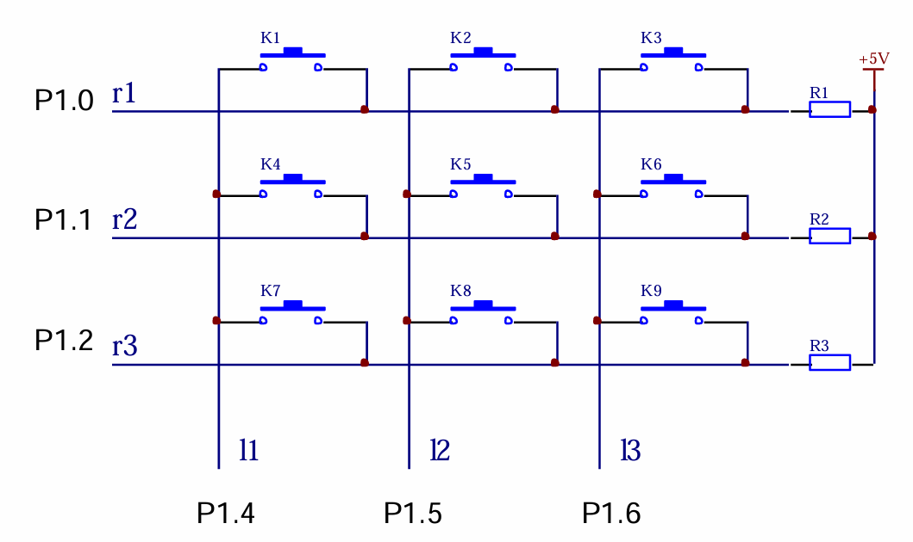
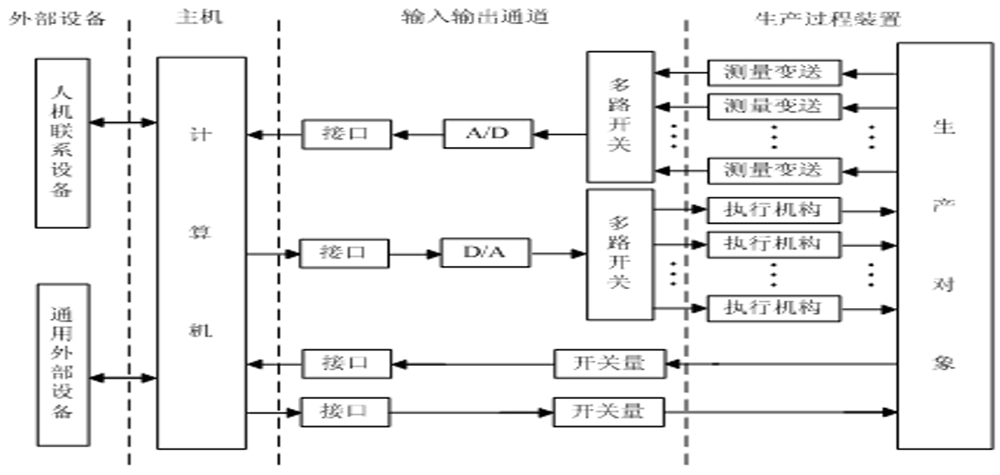
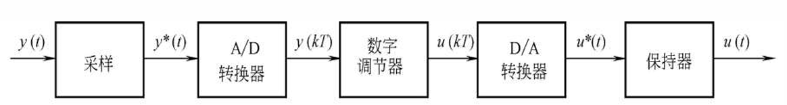
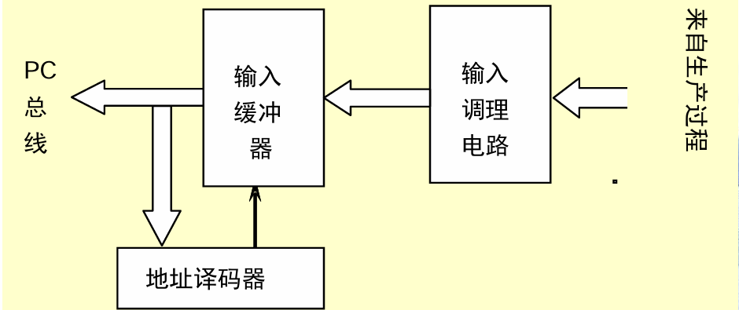
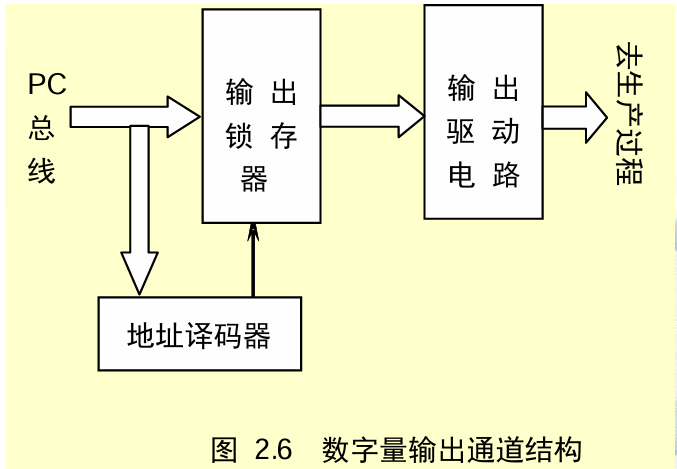

# 软硬件结合

## MCU主系统与外部设备

### 片外接口

- 从硬件上讲：外部设备连接到主系统的口（引脚），所以电信号必须为“数字”信号即TTL电平
- 从软件方面讲：放在存储空间里，所以外部设备是CPU能访问的“存储器”

### 总线

- 总线就是数据传输的公共通道

  > 1. 数据总线——传送内容 
  > 2. 地址总线——传送地点 
  > 3. 控制总线——如何传送

- 对应MCS-51的总线

  > - 数据总线——P0
  > - 地址总线——P2,P0
  > - 控制总线——WR,RD,PSEN,ALE
  >
  > 其中P0口分时复用为数据或者地址总线


### 键盘

> [!note]
>
> - 按下按键：Vp=0V  =>  逻辑“0”
> -  释放按键：Vp=5V  =>  逻辑“1” 
>
> 由此，就将按动“按键开关”的 机械动作转换为**数字信号**

#### 电路图


#### 去抖

- 抖动时间：1ms ~ 20 ms

- 软件去抖

  ```assembly
  MOV DPTR, #0100H
  MOVX A, @DPTR
  ANL A, #01H ;按位与
  MOV B, A
  LCALL DT ;延时20ms
  MOVX A, @DPTR
  ANL A, #01H
  CJNE A, B, LOOP0 ;不相等，则跳转
  RET
  LOOP0: CLR A
  RET
  ```

  

#### 多个按键

- 当存在多个按键时，给键盘上的每一个按键分配一个数字，代 表这个按键，这个数字就称为键值

- 矩阵键盘



#### 键盘扫描程序

```c
#include <reg51.h> // 包含 51 单片机寄存器定义

//定义端口
sbit key_r1 = P1^0;
sbit key_r2 = P1^1;
sbit key_r3 = P1^2;
sbit key_l1 = P1^4;
sbit key_l2 = P1^5;
sbit key_l3 = P1^6;

unsigned char key_scan(void)
{
    unsigned char temp;
    unsigned char col;
    temp = 0xFF; // 初始化返回值为 0xFF，表示无按键按下

    for (col = 0; col < 3; col++) // 遍历三列
    {
        P1 = 0xFF; // 将 P1 口全部置为高电平
        if (col == 0) key_l1 = 0; // 第一列接地
        else if (col == 1) key_l2 = 0; // 第二列接地
        else if (col == 2) key_l3 = 0; // 第三列接地

        if (!key_r1) // 检测第一行
        {
            if (!key_r1) // 再次检测，消抖
            {
                temp = col * 3 + 1; // 计算按键值
                break; // 退出循环
            }
        }
        if (!key_r2) // 检测第二行
        {
            if (!key_r2) // 再次检测，消抖
            {
                temp = col * 3 + 2; // 计算按键值
                break; // 退出循环
            }
        }
        if (!key_r3) // 检测第三行
        {
            if (!key_r3) // 再次检测，消抖
            {
                temp = col * 3 + 3; // 计算按键值
                break; // 退出循环
            }
        }
    }

    return temp; // 返回按键值
}
```

- 加上去抖和拍发

```c
//**********************************************
// 键盘驱动程序
// 返回按键键值。当无键按下时返回值为0。
//**********************************************
unsigned char key(void) 
{
    extern unsigned char key_scan(void); // 声明外部的按键扫描函数
    #define firsttime  200 // 首次检测到按键时的延时计数
    #define countime   30  // 按键持续有效时的延时计数
    static unsigned char newk = 0, last = 0, dt = 0; // 静态变量
    unsigned char temp = 0; // 临时变量

    temp = key_scan(); // 调用按键扫描函数，获取当前按键值

    if (temp == newk) // 如果当前按键值与上一次扫描的按键值相同
    {
        if (newk != last) // 如果当前按键值与上一次有效的按键值不同
        {
            dt = firsttime; // 开始首次消抖计时
        }
        else // 如果当前按键值与上一次有效的按键值相同
        {
            if (--dt == 0) // 如果计时结束
            {
                dt = countime; // 重新开始计时
            }
            else
            {
                temp = 0; // 如果计时未结束，忽略当前扫描结果
            }
        }
    }
    else // 如果当前按键值与上一次扫描的按键值不同
    {
        newk = temp; // 更新上一次扫描的按键值
        temp = 0; // 清空临时变量
    }

    if (dt == 0) // 如果计时结束，说明按键有效
    {
        last = newk; // 更新上一次有效的按键值
    }

    return temp; // 返回当前按键值，如果没有按键按下，返回 0
}
```

---

### 数码管显示

- 数码管是数字形式的显示屏，通过对其不同的管脚输入相对的电流，会使其发亮
- 七段式和八段式LED数码管 ，八段比七段多了一个小数点
- 数码管又分为共阴极和共阳极两种类
  - 共阴极就是将八个LED的阴极连在一起，让其接地，这样给任何一个LED**高电平**，它便能点亮
  - 共阳极就是将八个 LED的阳极连在一起，**低电平亮**

- 数码管的显示方式：静态法和动态法

##### 静态显示

- 静态显示方式
  - 所有LED的**位选**均共同连接到+VCC或GND，每个 LED的8根段选线**分别连接**一个8位并行I/O口，从该 I/O口送出相应的字型码显示字型 
  - 原理简单；显示亮度强，无闪烁；占用I/O资源较多

##### 共阳极数码管显示数字的段码表


- 静态显示是指显示驱动电路具有**输出锁存**功能，待显示的字符编码被CPU送出后， 数码管会一直显示该字符不变


##### 动态显示

- 所有LED的段选线共同连接在一起**共用一个 8位I/O口**，而每个LED的位选分别由一根相应的I/O口线控制
- **动态扫描**显示方式，每一个时刻只选通其中一个LED
- 轮流向各位数码管送出字形码和相应的位选，使人的感觉各位数码管同时都在显示
- 各个位的**延时时间长短**是非常重要

> [!note]
>
> - 采用**查表**在程序设计中可以设计一个变量，每隔一定时间在“0～9”之间变化，然后按照这个数据去查找段码表，把查到的数据送到 P4口

---

### LED点阵显示

- 8X8 LED点阵是最基本的 点阵显示模块

  > - 8X8点阵共需要64个发光二极管组成，且每个发光二极管是放置在行线和列线的交叉点上
  > - 当对应的某一列置1电平，某一行置0电平，则相应的二极管就亮

- 记录字模的列代码，例如

  > 
  >
  > 形成的列代码为 00H，00H，3EH，41H，41H，3EH ，00H，00H；只要把这些代码分别送到相应的列线上面，即可 实现“0”的数字显示

#### LED点阵的动态显示控制原理

- 如果要实现左移或 者其它的显示效果则将显示缓存中的**每个位进行移位或者其它处理**,然后再调用扫描显示 函数就可以实现所规定的效果
- 显示使能端是比较重要的，主要是因为送完一行后需要一个**消隐**的动作，如果不做该动作，则在显示的过程中会有**拖影**的现象

### 液晶显示

- 液晶显示模块是以LCD液晶屏为核心，配 合一定的控制电路，以达到方便使用显示 组件的目的
- 原理和LED点阵显示字是一个道理，只不过**每一行都有对应的位存储对应的值**，每个位都是真正的同时显示，而不像LED点阵需要通过不断刷新使得人眼下近似成为同时显示。

---


## 输入输出接口与过程通道

### 计算机控制系统组成

- 硬件+软件



#### 计算机控制系统的硬件组成

- 计算机系统硬件+生产过程各部分的装置
- 计算机系统硬件
  - 主机：计算机控制系统的核心。主机通过接口向系统的各个部分发出各种命**令，对被控对象进行检测和控制**
  - 输入输出通道：计算机和生产对象之间进行信息交换的通道
    - 过程输入通道：被控参数转换成数字信号
    - 过程输出通道：控制命令和数据，转换成可以对生产对象进行控制的信号
    - 其中过程输入输出通道包括**模拟量**输入输出通道和**数字量**输入输出通道
  - 外部设备：外设
- 生产过程装置
  - 测量变送单元：测量各种参数而采用的相应的**检测元件及变送器**
  - 执行机构：根据计算机输出的控制信号，产生相应的**控制动作**，使被控对象按要求运行

#### 计算机控制系统的软件组成

- 系统软件+应用软件+数据库
- 系统软件：来使用和管理计算机的程序
- 应用软件：由用户根据要解决的实际问题 而编写的各种程序
- 数据库：资料管理、 存档和检索

#### 计算机控制系统的特点

- 计算机控制系统中信号的具体变换与传输



### 接口

- 接口是计算机与外部设备（部件与部件之间）交换信息的桥梁，它包括**输入接口和输出接口**
- 则接口技术则是计算机与外部设备之间**如何交换信息**的技术。

### 过程通道

过程通道是在计算机和生产过程之间设置的**信息传送和转换的连接通道**，包括模拟量输入通道、模拟量输出通道、数字量(开关量)输入通道、数字量(开关量)输出通道。


- 模拟量输入通道：生产过程的参数(如温度、压力、流量、速度、位 移、电流、电压等)一般是**随时间连续变化的模拟量**，通过检测元件或变送器将其转换为对应的**模拟电压或电流，并转化为数字信号**的过程
- 模拟量输出通道： 把微机输出的**数字控制信号转换为模拟信号**（电压 或电流）并传输给被控对象的过程
- 数字量(开关量)输入通道： 拾起或检测反映生产过程或设备工况的**开关信号** （如继电器接点、行程开关、按纽等）、**脉冲信号** （如速度、位移、流量脉冲等）并传输给微机的过程
- 数字量(开关量)输出通道：  将数字信号从微机传输给那些接受**数字信号**的执行机构和显示、指示装置的过程

#### 过程输入输出通道与CPU交换的信息类型

- 数据：反映生产现场的**参数及状态**的信息，它包括数字量、开关量和模拟量
- 状态：协议信息，如应答信息、握手信息，**反映过程通道的状态**，如准备就绪信号
- 控制：控制过程通道的启动和停止等信息

## 模拟量输入通道

- 把从系统中检测到的模拟信号， 变成**二进制数字信号**，经接口送往计算机
- 传感器：将生产过程工艺参数转换为电参数的装置
- 变送器：将温度、压力、流量的电信号变成0～10mA或 4～20mA的**统一信号**

##### 模拟量输入通道的组成

- 模拟量输入通道一般由**I/V变换**，**多路转换器**、**采样保持器**、A/D**转换器**、**接口及控制逻辑**等组成。

  

  

##### I/V变换

变送器输出的信号为0～10mA或4～20mA的统一 信号，需要经过I/V变换**变成电压信号**后才能处理

- 无源I/V变换：电压采样电阻
- 有源I/V变换：与无源变换的区别在于信号的隔离上

##### 多路转换器

- 多路转换器又称多路开关，多路开关是用来切换模拟 电压信号的关键元件
- 利用多路开关可将各个输入信号依次地或随机地连接到**公用放大器或A/D转换器**上

## 采样、量化及采样保持器

### 信号的采样

- 采样过程：按一定的**时间间隔T**，把**模拟信号**，转变成**脉冲输出信号**的过程


- T为采样宽度，即K闭合的时间
- 采样信号 `y*(t)` ： 幅值连续但是时间上离散的模拟信号。

> [!note]
>
> 香农采样定理： 如果模拟信号 ( 包括噪声干扰在内）频谱的最高频率为 fmax ，只要按照采样频率 `f ≥ 2fmax`  采样 ，  采样信号y*(t) 就能唯一地复现 y(t) 。

### 量化

- 量化，采用一组数码(如二进制码)来逼近离散模拟信号的幅值，将其转换为**数字信号**
- 量化过程：将**采样信号转换为数字信号**的过程称为量化过程
- 量化装置：执行量化动作的装置是**A/D转换器**。
- 量化单位：字长为n的A/D转换器把`ymin~ymax`范围内变化的采样信号变换为数字`0~2^(n-1)`，其最低有效位(LSB)所对应的模拟量q 称为量化单位。
- 量化误差：`(±1/2)q`

> [!note]
>
> - 将模拟信号电平分成N=2^n等分
> - 每一等分用一个n位定点数表示
> - 例如：被采样的电压值范围-5V ~ +5V ，用8位二进制数表示
> - 则将`-5V ~ +5V`的电压等分为2^8个等级，即：` 00000000 – 11111111，10/256 = 0.039V`为一个等级

### 采样保持器（S/H）

- 工作方式：  采样和保持
  - 采样：采/保电路的输出跟踪（track）**模拟输 入电压**
  - 保持：采/保电路将**保持采样命令撤销时刻的采样值**，直到保持命令撤销并且再次接收到采样命令为止
- 孔径时间(aperture time) 和孔径误差 (aperture error)
  - 在采/保电路中，完成一次**A/D转换**所需的时间称为孔径时间。
  - 采样时刻的**最大转换误差**称为 孔径误差
  - 孔径误差的消除——采用 采样保持器

## 模拟量输出通道

### 模拟量输出通道的结构形式

- 模拟量输出通道一般由**接口电路**、**D/A转换器**、**多路转换开关**，**采样保持器**、**V/I变换**等组成
  - 一个通路设置一个D/A转换器的形式——数字保持
  - 多个通路共用一个数/模转换器的形式——模拟保持

### D/A转换器

通常采用D/A转换器外加运算放大器的方法， 把D/A转换器的电流输出转换为电压输出

分别有单极性与双极性电压输出电路

- VOUT1为单极性输出，VOUT1和 D 成正比关系
- VOUT2为双极性输出，当输入数字量D小于 80 H即128时，输出模拟电压为负，大于则为正

### V/I 变换和自动/手动切换

#### 集成V/I转换器ZF2B20

- 通过V/I变换的方式产生一个与输入电压成比例的输出电流
- 输入电压范围是0～10V，输出电流是 4～20mA，单正电源供电，电源电压范围 为10～32V
- 特点是低漂移（Low excursion）

#### 集成V/I转换器AD694

- 输出范围：4～20mA,0～20mA。 输入范围：0～2V或0～10V。
- 与电流输出型D/A转换器直接配合使用，实现程控电流输出
- 开路或超限报警

#### 带有自动/手动切换的V/I变换

- 在计算机出现故障时，可以手动操作
- 实现  V/I 变换：(Vi=0~5V➔IL=0~10mA)
- 能够实现 A/H 切换

---

## 数字量输入输出通道

- 数字量(开关量)信号；以二进制的逻辑 “1”和“0”出现的

### 数字量输入输出接口技术

#### 数字量输入接口

- 对生产过程进行控制，收集生产过程的状态信息，根据状态信息，再给出控制量
- 用三态门缓冲器74LS244取得状态信息。

```assembly
#设片选端口地址为 port
MOV DX, port;
IN AL , DX;
```

#### 数字量输出接口

- 当对生产过程进行控制时，一般控制状态需进行保持，直到下次给出新的值为止，这时**输出就要锁存**
- 用 74LS273 作 8 位输出锁存口，对状态输出信号进行锁存。

```assembly
MOV AL, DATA
MOV DX, port
OUT DX, AL
```

### 数字量输入通道

- 数字量输入通道主要由 输入**缓冲器**、输入调理电路、输入地址译码电路等组成



#### 输入调理电路

- 数字量(开关量)输入通道的基本功能就是接收外部 装置或生产过程的状态信号

- 将现场 输入的状态信号经**转换、保护、滤波、隔离**等措施转换 成计算机能够接收的逻辑信号，这些功能称为信号调理 

- 小功率输入调理电路

  - 开关、继电器等接点接通和断开动作，被转换成 TTL 电平 信号与计算机相连

  - 加入有较长时间常数的 积分电路 来消除这种振荡

    

- 大功率输入调理电路

  - 高压与低压之间 ， 用 光电耦合器 进行隔离

    

### 数字量输出通道

- 数字量输出通道主要由输出锁存器、输出驱动电路、输 出口地址译码电路等组成



#### 输出驱动电路

- 在数字量输出通道中，关键是驱动，因为从锁存器中出来的是TTL 电平，驱动能力有限，所以要加上**驱动电路**
- 小功率直流驱动电路：功率晶体管输出驱动继电器电路
- 大功率交流驱动电路中，固态继电器 SSR作交流开关使用

## 典型的应用实例

