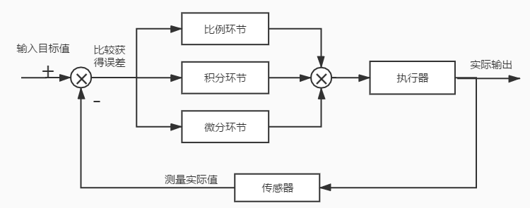
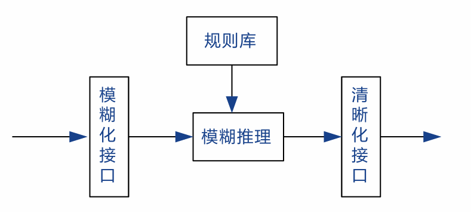

# 物联网控制算法

## PID算法

### 概念及其意义

- 需要将某一个物理量“**保持稳定**”的场合（例如维持平衡、稳定温度、转速等）
- PID 控制算法，即**比例-积分-微分**（Proportional-Integral-Derivative）控制算法，是**一种广泛应用于各种自动控制系统中的反馈控制算法**。
- PID 控制器通过计算控制误差的三种成分 —— 比例（P）、积分（I）和微分（D）来调节系统输出，使得系统的输出达到目标值。


> [!important]
>
> - 比例控制（P部分）：kp
>
>   这个环节产生的分力是：`kp * e(t)`即偏差一旦产生，就立即产生控制的作用来减小产生的误差，并且例控制器的输出与输入成正比关系，能够迅速的反应偏差，偏差改变的速度与比例系数Kp成正比。
>
> - 积分控制（I 部分）：ki
>
>   `ki * ∫e(t)dt`，在比例控制环节产生了静态误差，在积分环节中，主要用于就是消除静态误差提高系统的无差度。
>
> - 微分控制（D 部分）：kd
>
>   微分环节也会计算出一个分力：`kd * de(t)/dt`，反应系统偏差的一个变化趋势，**阻止震荡**。偏差变化越快，则产生的阻止作用越大

- PID算法的离散化：PID控制其实就是对偏差的控制过程



- 如果偏差为0,则比例环节kp不起作用，只有存在偏差时，比例环节才起作用

- 积分环节主要是用来消除静差，所谓静差，就是**系统稳定后输出值和设定值之间的差值**，积分环节实际上就是偏差累计的过程， 把累计的误差加到原有系统上以抵消系统造成的静差

- 微分信号则反应了偏差信号的变化规律，也可以说是变化趋势，根据偏差信号的变化趋势来进行超前调节， 从而增加了系统的预知性

- 位置式PID

  

- 增量式PID:由△u=u(k)-u(k-1)得：其中u(k),u(k-1)代入上式

  

> [!note]
>
> **对比区别**:
>
> 1. **增量式算法** 不需要对积分项累加，控制量增量只与近几次的误差有关，计算误差对控制量计算的影响较小。 而 **位置式算法** 要对近几次的偏差的进行积分累加，**容易产生较大的累加误差**；
> 2. **增量式算法** 得出的是控制量的增量，例如在阀门控制中，只输出阀门开度的变化部分，误动作影响小，必要时还可通过逻辑判断限制或禁止本次输出， 不会严重影响系统的工作； 而位置式的输出直接对应对象的输出，因此对系统影响较大；
> 3. **增量式算法** 控制输出的是控制量增量，并无积分作用，因此该方法适用于执行机构带积分部件的对象，如步进电机等， 而 **位置式算法** 适用于执行机构不带积分部件的对象，如电液伺服阀；
> 4. 在进行PID控制时，**位置式PID** 需要有积分限幅和输出限幅，而 **增量式PID** 只需输出限幅。即控制从手动切换到自动时，位置式 PID算法必须先将计算机的输出值置为原始 阀门开时，才能保证无冲击切换

### C语言实现

#### 位置式PID的C语言实现

- *pid结构体*

  ```c
  typedef struct /*pid*/
   {
       float target_val;               //目标值
       float actual_val;               //实际值
       float err;                      //定义偏差值
       float err_last;                 //定义上一个偏差值
       float Kp,Ki,Kd;                 //定义比例、积分、微分系数
       float integral;                 //定义积分值
   } _pid;
  ```

- *PID算法实现*

  ```c
  float PID_realize(float temp_val)
  {
       /*目标值只在这里参与计算，计算目标值与实际值的误差*/
      pid.err=pid.target_val-temp_val;
       /*误差累积*/
      pid.integral+=pid.err;
       /*PID算法实现*/
      pid.actual_val=pid.Kp*pid.err+pid.Ki*pid.integral+pid.Kd*(pid.err-pid.err_last);
       /*误差传递*/
      pid.err_last=pid.err;
       /*返回的值是经过pid运算以后的值*/
      return pid.actual_val;
  }
  ```

#### 增量式PID的C语言实现

- *pid结构体*

  ```c
  typedef struct  /*pid*/
   {
       float target_val;     //目标值
       float actual_val;     //实际值
       float err;            //定义当前偏差值
       float err_next;       //定义上一个偏差值
       float err_last;       //定义上上一个偏差值
       float Kp, Ki, Kd;     //定义比例、积分、微分系数
   }_pid;
  ```

- *PID算法实现*

  ```c
  float PID_realize(float temp_val)
   {
       /*目标值只在这里参与计算，计算目标值与实际值的误差*/
       pid.err=pid.target_val-temp_val;
       /*PID算法实现*/
       float increment_val = pid.Kp*(pid.err - pid.err_next) + pid.Ki*pid.err + pid.Kd*(pid.err - 2 * pid.err_next + pid.err_last);
       /*累加*/
       pid.actual_val += increment_val;
       /*传递误差*/
       pid.err_last = pid.err_next;
       pid.err_next = pid.err;
      /*返回的值是经过pid运算以后的值*/
       return pid.actual_val;
   }
  ```

  

- 几个概念：

  > [!note]
  >
  > - 程序控制：使被控量按照预先规定的时间 函数变化所作的控制，被控量是时间的函数
  > - 顺序控制：是指控制系统根据预先规定的控制要求，按照各个输入信号的条件，使 过程的各个执行机构自动地按预先规定的 顺序动作。
  > - PID控制：调节器的输出是输入的比例、积 分、微分的函数
  > - 直接数字控制：根据采样定理，先把被控对象的数学模型离散化，然后由计算机根 据数学模型进行控制。
  > - 最优控制：是一种使控制过程处在某种最优状态的控制。
  > - 模糊控制：由于被控对象的**不确定性**，可采用模糊控制。

### 增量式数字PID控制算法

- 增量式算法的控制器结构举例：

  

- 采样周期的选择

- 香农“采样定理”

  - 原始信号是周期的
  - 根据在无限时域上的采样信号来**恢复**原始信号

- 要求在每个采样时刻，以有限个采样数据近似恢复原始信号，所以不能照搬采样定理的结论，采样周期`T`考虑以下因素

  - 被控过程的动态特性：`T<=[对象时间常数]/10`
  - 扰动特性：`T<=[主要扰动周期]/10`
  - 信噪比小，采样周期大

### PID参数的确定

### 采样周期的确定

1. 根据香农采样定理，系统采样频率的下限为` fs =2fmax `，
2. 执行机构需要输出信号保持一定的宽度。采样周期必须大于这一时间
3. 控制系统的随动和抗干扰的性能来看，要 求采样周期短些
4. 微机的工作量和每个调节回路的计算来看， 一般要求采样周期大些
5. 从计算机的精度看，过短的采样周期是不合适的。


### 凑试法确定PID调节参数

- 对参数进行先比例，后积分， 再微分的整定步骤。
  - 确定比例部分
  - 调节比例调节器参数，系统的静差还达不到设计要求时，则需加入积分环节
  - 使用比例积分器，能**消除静差**，但 态过程经反复调整后仍达不到要求，这 时可加入微分环节


### 优选法

- 把其他参数固定，然后用0.618法对其中某一 个参数进行优选，待选出最佳参数后，再换另一个参数进行优选，直到把所有的参数优选完毕为止
- 最后根据T、KP 、TI 、 TD 诸参数优选的结果取一组最佳值即可

---


## PWM（脉宽调制）控制技术

- PWM控制技术就是对**脉冲的宽度进行调制**的技术，即通过对一系列脉冲的宽度进行调制，来等效的获得所需要的波形（含形状 和幅值）

### 什么是PWM

- 冲量相等而形状不同的窄脉冲加在具有惯性的环节上时，其效果基本相同
- 对半导体开关器件的**导通和关断进行控制**, 使输出端得到**一系列幅值相等而宽度不相等的脉冲**，用这些脉冲来**代替正弦波**或其他所需要的波形(香农采样定理)
- 按一定的规则对各脉冲的宽度进行调制，既可改变逆变电路输出电压的大小，也可改变输出频率

### PWM控制的基本原理

- PWM是一种对模拟信号电平进行**数字编码**的方法
- 通过高分辨率计数器的使用，方波的**占空比**被调制用来对一个**具体模拟信号**的电平进行编码
- PWM信号仍然是数字的，因为在给定的任何时刻，电压或电流源是以一种**通(ON)或断(OFF) 的重复脉冲序列**被加到模拟负载上去的。

> [!note]
>
> - 高低电平脉冲宽度各不相同，这就是 PWM 的本质
> - 占空比是指**高电平的时间占整个周期的比例**，即一个脉冲循环内，通电时间相对于 总时间所占的比例
>   - 在一段连续工作时间内脉冲占用的时间与总时间的比值
>   - 在周期型的现象中，某种现象发生后持续的时间与总时间的比
>   - 通俗的说，电路被**接通的时间**占整个电路工作周期的百分比

- 决定占空比的几个要素：电路工作频率；工作电压；平均工作电压；脉冲宽度

### 物联网控制算法 直流电机调速应用

#### 反馈控制

- 基本原理：根据实际结果与预期结果之间的差值，来调节控制变量的值
- 涉及到三个变量：预期转速，实际 转速和控制变量（占空比）。

> [!note]
>
> 脉宽调速和电压调速的比较
>
> - 脉宽调制：通过**开关量输出**达到模拟量输出效果的方法。脉宽调速就是利用脉宽调制，以数字方式调节电机转速
> - 电压调速：**直接调节电压**这个模拟量来调 节电机转速

#### 为什么选择数字控制

1. 精密模拟电路可能非常庞大、笨重和昂贵
2. 模拟电路还有可能严重发热并且对噪声敏感
3. 数字控制大幅度降低 系统的成本和功耗
4. PWM的一个优点是从处理器到被控系统信号都 是数字形式的，**无需进行数模转换**。


#### PWM电机调速的原理

- PWM就是脉冲宽度调制，对于方波而言， 一个完整的周期是由高电平脉冲和低电平脉冲所构成的，高电平所占周期的比例就是占空比。
- 占空比越大的话，那么波形的平均电压越大

##### 累加进位法

- 设置一个累加变量x，每次加N，
- 若结果**大于等于** M，则输出1，并减去M
- 否则输出0。
- **设计为输出0使电机工作，上面所说的0和1要翻转过来用**


### 模糊控制


- 将测量得到的被控对象的状态经过模糊化接口转换为用人类自然 语言描述的模糊量
- 而后根据人类的语言控制规则，经过模糊推理得到输出控制量的模糊取值
- 控制量的模糊取值再经过清晰化接口转换为执行机构能够接收的精确量。

模糊控制器的基本结构通常由四个部分组成：

❑ 模糊化接口 ❑ 规则库 ❑ 模糊推理 ❑ 清晰化接口




