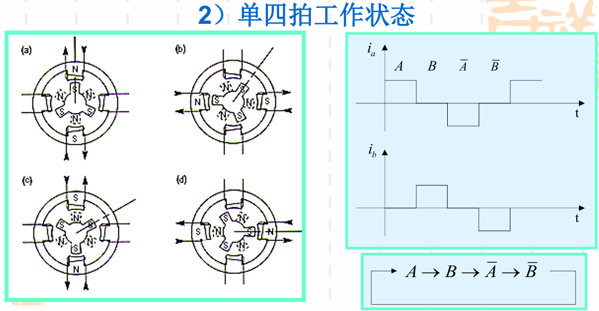

# 物联网控制系统

## 伺服系统——步进电机及其驱动技术

### 伺服系统

- 伺服系统是一种以**机械位置或角度作为控制对象**的自动控制系统
- 组成：检测装置，驱动电机

> [!note]
>
> 伺服系统按控制方式的分类：
>
> 开环系统：步进电机，无位置反馈，投资低，精度小
>
> 闭环系统：直接测量实际位移进行**反馈**，精度高
>
> 半闭环系统：间接测量位移进行反馈，精度低于闭环

#### 开环伺服系统

- 采用**步进电机**作为驱动元件
- 没有反馈回路
- 设备投资低，调试维修方便，但精度差，高速扭矩小
- 中、低档控制系统

#### 闭环伺服系统

- 位置检测装置安装在工作台上
- 检测装置构成闭环位置控制
- 大量用在精度要求较高的设备上

#### 半闭环伺服系统

- 位置检测元件安装在电动机轴上或丝杠上，用以精确控 制电机的角度，为**间接测量**
- 坐标运动的传动链有一部分在位置闭环以外，其传动误差没有得到系统的补偿
- 精度低于闭环系统。 适用于精度要求适中的设备

### 步进电机

- 步进电机在开环状态就能实现精确的位置控制
- 结构简单；没有控制参数设计及其调试的问题；不存在稳定性问题；接线简单

- 步进电机的类型：永磁式；变磁阻式（反应式）；混合式
- 其中定子绕组相数：两相（应用广泛）、三相、四相、五相

#### 两相混合式步进电机结构

大体上由定子和转子组成：

- 定子上有八个绕有线圈的铁心磁极；八个线圈串接成A,B两组绕组
- 每个定子磁极边缘有多个小齿，一般多为五或六齿
- 转子由两段有齿环形转子铁心、装在转子铁心内部的环形 磁钢及轴承、轴组成
- 两段转子铁心的一端呈N极性， 另一端呈S极性，分别称之为**N段转子和S段转子**
- 转子铁心的边缘加工有小齿，一般为50个，齿距为**7.2°**。两段转子的小齿相互错开1/2齿距

#### 两相混合式步进电机工作原理

- 定子上有四个绕有线圈的磁极（齿），相对磁极的线圈串联  组成两相绕组
- 同一相绕组两个线圈绕线的方向相反，通过同一电流时所产生的磁场方向也相反
- 电流从相反方向流过同一相绕组产生的磁场方向也相反
- 每段永磁体有3个齿，齿距为120度，N极齿和S极齿彼此错开1/2齿距（60度）

#### 工作状态

##### 不通电

- 由于磁通总是沿磁阻最小的路径通过，   磁通从N极性转子经定子极回到S极性转子
- 有一个反向力矩阻止外力力图使轴转动，称为自锁（detent)力矩

##### 单四拍工作状态

- 初始状态，A相通电产生保持力矩
- 4步一个循环后共转过一个齿距**120度**，12步后转子旋转一周
- 每一次仅一相绕组通电，四拍一个循环，称之为单四拍工作状态

##### 双四拍工作状态

- 初始状态， A相、B相同时通电，由于两个定子齿的吸引，转子 移动1/8齿距15度，停在一个中间的位置
- 4步一个循环后共转过一个齿距120度，  12步后转子旋转一周
- 每一次两相绕组通电，四拍一个循环，称之为双四拍工作状态
- 因为两个线圈同时通电，产生的力矩比单四拍要大

##### 单双八拍工作状态

- 在单四拍工作方式基础上，在每两个单拍之间插入一个 双拍工作状态，就成为单、双八拍工作方式
- 交替使一个线圈和两个线圈通电，**每一步转子旋转1/8齿距即15度**，经过这8拍以后，转子转过一个齿距120度
- 旋转一周**需24步**

##### 微步距工作方式

- 在双四拍工作方式中，当两相绕组通以相等的电流时，电机 转子停在一个中间的位置。
- 如果两相绕组电流不等，转子位 置将朝电流大的定子极方向偏移。

