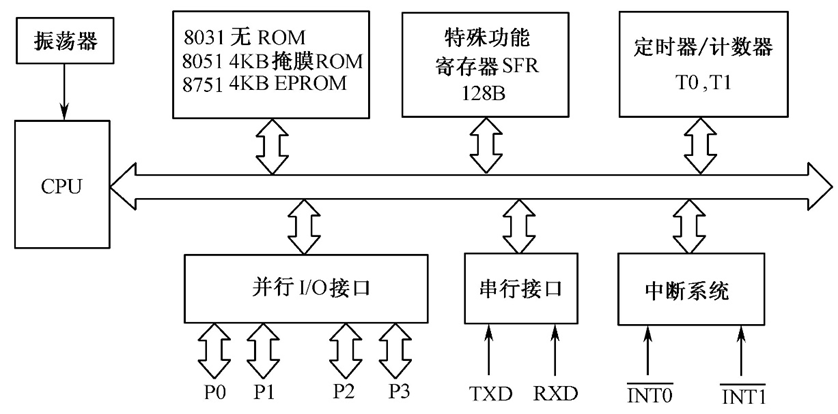
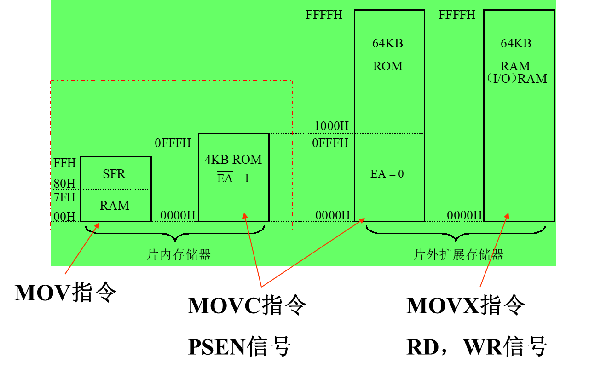
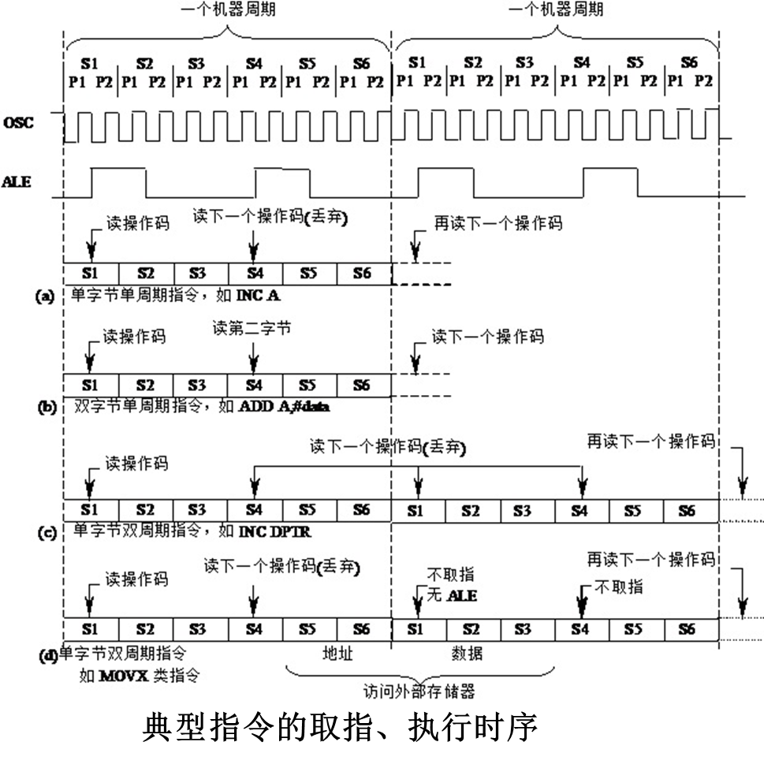
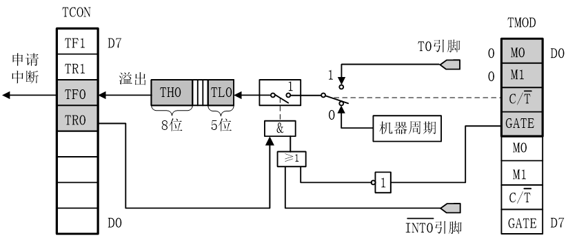
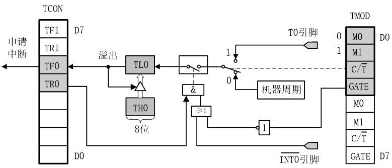
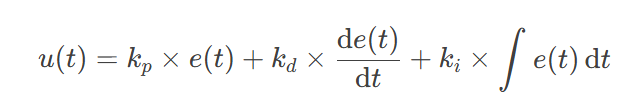

[TOC]

# 物联网控制技术复习

## MCU主系统

- **重要概念**

  > [!note]
  >
  > 1. 单片机 
  > 2. 51单片机的体系结构与片上接口 
  > 3. 单片机控制
  > 4. 控制系统，控制系统的含义及分类 
  > 5. 物联网控制编程 
  > 6. PID控制算法（模型、应用）
  > 7. PWM控制 
  > 8. 物联网控制系统

---


## 51单片机

### 51单片机的体系结构

#### 51单片机与微机系统的区别与联系

51单片机：将计算机的基本部件（CPU，存储器，IO)**集成在一块芯片**上构成微型计算机， 是一种**微控制器**。用于**嵌入式控制**。

**微机系统：** 通常指**通用微型计算机系统**。由**多个分立芯片和模块或者硬件结构**构成一个完整的系统

联系：两者本质上都是**存储程序式计算机**，都遵循冯·诺依曼架构。核心原理相同：取指令、译码、执行。同时都包含**CPU**，**存储器**，**输入/输出**接口，**总线**等核心部件

#### 51单片机的内部结构，CPU的组成

- 51单片机的**内部结构**：CPU(运算和控制)，RAM（数据存储器），ROM（程序存储器），I/O(串口并口)，内部总线，中断系统，定时器/计数器，振荡器等



- 中央处理器（**CPU**）：由**运算器和控制器**组成；其中运算器由ALU，累加器A，寄存器B，PSW以及暂存寄存器TMP1和TMP2等组成；控制器则由PC，IR，ID，SP，DPTR，定时控制逻辑电路，振荡器组成


#### 存储器的组成及访问，存储空间的分布

1. 程序存储器和数据存储器分开
2. 分为片内数据存储器、片内程序存储器、片外数据存储器和片外程序存储器**4个存储空间**。**片内程序存储区和片外程序存储区是统一编址**的，所以在逻辑上8051的存储器分为3个逻辑空间
3. **三个逻辑空间：**
   1. 片内外统一寻址的**64KB程序存储器**空间，地址范围为0000H～FFFFH。

   2. 64KB的片外数据存储器空间，地址范围也为0000H～FFFFH。

   3. 256B的片内数据存储器空间，地址范围为00H～FFH。



- 程序存储器中

  > 分为内部无ROM型 （如8031,\_EA=0 ）和内部有ROM型 （如8051,\_EA=1）
  >
  > 以下6个单元具有特殊含义:
  >
  > 0000H：单片机复位后的程序入口地址。
  >
  > - 一般在0000H～0002H单元，存放一条无条件转移指令（类似goto），从而程序可从转移后的地址开始存放。这样，CPU复位后，PC可以从0000H起始地址跳转到用户程序去执行。
  >
  > 0003H：外部中断0的中断服务程序入口地址。
  >
  > 000BH：定时器0的中断服务程序入口地址。
  >
  > 0013H：外部中断1的中断服务程序入口地址。
  >
  > 001BH：定时器1的中断服务程序入口地址。
  >
  > 0023H：串行口的中断服务程序入口地址
  
- 对于数据存储器：

  > - 一般将随机存储器（RAM）用做数据存储器。可寻址空间为64KB
  >
  > - 片外RAM：
  >
  >   ​     最大范围：0000H～FFFFH，64KB；用指令**MOVX访问**
  >
  > - 片内RAM：
  >
  >   ​     最大范围：00H～FFH，256B；用指令**MOV访问**。
  >
  > 

#### 51单片机的特殊功能寄存器(SFR)

> [!tip]
>
> 理解程序计数器PC、 累加器A、工作寄存器、程序状态字PSW、数据指针 DPTR、堆栈指针SP、I/O口专用寄存器P0~P3

1. MCS-51有21个特殊功能寄存器（也称为专用寄存器），包括算术运算寄存器、指针寄存器、I/O口锁存器、定时器/计数器、串行口、中断、状态、控制寄存器等

2. SFR反映了MCS-51单片机的**运行状态**。

3. 程序计数器PC

   > - 程序计数器PC在物理上是独立的，它不属于SFR存储器块
   > - PC是一个16位的计数器，专门用于存放CPU将要执行的**指令地址**（即下一条指令的地址）
   > - 可以通过转移、调用、返回等**指令改变其内容**，以控制程序执行的顺序

4. 累加器A

   > 累加器A是**8位**寄存器，又记做ACC
   >
   > 在算术/逻辑运算中用于**存放操作数或结果**

5. 工作寄存器

   > **内部RAM的工作寄存器区00H～1FH**共32个字节被均匀地分成四个组（区），每个组（区）有8个寄存器
   >
   > 分别用R0～R7表示，称为**工作寄存器或通用寄存器**，其中，R0、R1还经常用于间接寻址的地址指针
   >
   > 通过程序状态字寄存器（PSW）第3、4位设置工作寄存器区。

6. 程序状态字PSW 

   > 用于存放程序运行的**状态信息**，PSW中各位状态通常是在指令执行的过程中自动形成的，但也可以由用户根据需要采用传送指令加以改变
   >
   > 例如：Cy(进借位)，AC(半进位标志)，F0(用户标志)，RS1.RS0(工作寄存器组（区）选择)，OV(溢出标志)，P(奇偶标志位)

7. 数据指针DPTR

   > DPTR主要用作16位**间址寄存器**，即**在访问外部数据存储器时作为地址指针使用**，访问程序存储器和片外数据寄存器
   >
   > 也可作为两个独立的8位寄存器DPH（高8位）、DPL （低8位）使用

8. 堆栈指针SP

   > 堆栈指针SP是一个8位寄存器，用于**指示堆栈的栈顶**，它决定了堆栈在内部RAM中的物理位置
   >
   > 设立堆栈的目的是用于**数据的暂存，中断、子程序调用时断点和现场的保护与恢复**

9. I/O口专用寄存器（P0, P1, P2, P3）

   > 8051片内有4个8位并行I/O接口P0, P1, P2和P3

#### 端口线P0~P3口的特点

> [!tip]
>
> 控制线ALE、EA

1. P0口：作为外部扩展的**数据总线**，**低8位地址总线的分时复用口**。又为**通用I/O口**
2. P1口：**通用I/O 口**。
3. P2口：可作为外部扩展时的**高8位地址总线**。又为**通用I/O口**
4. P3口：**双功能**复用口，作为**通用I/O口**时，功能与P1口相同，常用**第二功能**，如下


控制线：

- ALE/_PROG：地址锁存允许/编程引脚。访问外部程序存储器时，ALE的输出用于**锁存地址的低位字节**，以便P0口实现地址/数据复用51单片机的时序，不访问外部程序存储器时，ALE端将输出一个1/6时钟频率的**正脉冲信号**；其第二功能是对EPROM型芯片（如8751） 进行编程和校验时，此引脚传送52ms宽的**负脉冲选通信号**，程序计数器PC的16位地址数据将出现在P0和P2口上，外部程序存储器则把指令码放到P0口上，由CPU读入并执行
- \_EA/Vpp：允许访问片外程序存储器/编程电源引脚。片内无程序存储器的 MCS-51单片机（如8031），\_EA必须接地即为低电平。片内有程序存储器的MCS 51单片机（如8051），\_EA必须接高电平；其第二功能是片内EPROM编程/校验时的**电源线**，在编程时，VPP 脚需加上21V的编程电压。

#### 51单片机的时序

> [!tip]
>
> MCS-51的时序单位，指令的取指 /执行时序，访问片外ROM/RAM指令的时序

- CPU在执行指令时所需控制信号的**时间顺序**称为时序。

- 时序是用**定时单位**来描述的，MCS-51的时序单位有四个，分别是时钟周期（节拍）、状态、机器周期和指令周期

  - 时钟周期：振荡周期、节拍（用P表示)，**振荡源（OSC）的周期**。它是时序中的**最小**单位
  - 状态（S）：振荡脉冲经过**二分频**，一个状态有两个节拍（P1,P2)
  - 机器周期：通常将**完成一个基本操作**所需的时间称为机器周期
  - 指令周期：**执行一条指令**所需要的时间称为指令周期。它是时序中的**最大**单位

- MCS-51指令的取指/执行时序

  - 执行程序的过程就是执行指令的过程，分为取指阶段和执行阶段
    - 取指阶段，CPU从程序存储器中**取出指令操作码**，送指令寄存器，
    - 经指令译码器**译码**，产生一系列**控制信号**，完成本指令规定的操作
  - ALE信号是用于**锁存低8位地址的选通信号**，每出现一次该信号，单片机即进行一次读指令操作，多字节或多周期指令时，只有第一个ALE信号进行读指令操作，其余的ALE信号为无效操作（或读操作数操作）

  

- 访问片外ROM/RAM指令的时序

  - 外部**程序**存储器读时序：ALE信号和_PSEN信号（外部ROM读选通脉冲）

    

  - 外部**数据**存储器读时序：P0是**分时复用地址**；ALE来锁存P0在担任地址角色时输出的地址信号。

    

### 51单片机的中断系统（所有）


### MCS-51单片机的片上接口及其应用

- **CPU与外部设备的通信方式**
  - 无条件传送方式：CPU总是认为外设在**任何时刻都处于“准备好”**的状态
  - 查询传送方式：输入时，需要查询外设的输入**数据是否准备好**。输出时，需要查询外设是否把上一次输出的数据**处理完毕**
  - 中断传送方式：**CPU**暂时中止当前的工作，转去处理所发生的事件。中断服务处理完该事件后，再返回到原来被中止的地方继续原来的工作，这样的过程称为**中断**

#### 定时器/计数器

> [!tip]
>
> 定时/计数器的工作原理、控制方式、初始化编程、 不同工作方式下计数初值/定时器初值的计算

- 工作原理

  > - 定时器：计数输入信号来自内部振荡信号，在每个机器周期内定时器的计数器做一次“+1”运算。因此定时器亦可视为**计算机机器周期的计数器**
  > - 计数器：计数输入信号来自外部引脚T0（P3.4）、T1（P3.5）上的**计数脉冲**，外部每输入一个脉冲，计数器做一次“+1”运算
  >
  > 可以设置初值以及计数器的溢出使TCON中TF0或TF1置1，产生中断请求
  >
  > 由**溢出时计数器的值减去计数初值**才是加1计数器的计数值

- 定时/计数器的实质是**加1计数器**（16位），由高8位和低8位两个寄存器组成。

- ##### **方式控制**寄存器TMOD 用于设置定时/计数器的工作方式

  

  - GATE：门控位。选择内部中断（GATE=0),外部中断（GATE=1)
  - C/_T：定时/计数模式选择位
  - M1和M0：工作方式选择位

  | **M1M0** | **工作方式** | **功能**                              |
  | -------- | ------------ | ------------------------------------- |
  | 00       | 方式0        | 13位计数器                            |
  | 01       | 方式1        | 16位计数器                            |
  | 10       | 方式2        | 可自动重新装载的8位计数器             |
  | 11       | 方式3        | T0分为两个独立的8位计数器，T1停止计数 |

- 定时器/计数器控制寄存器TCON

  

  - TF1（TCON.7）， T1溢出中断请求标志位。
  - TR1（TCON.6）：T1运行控制位。

- 定时器/计数器的**工作方式**

  - 方式0：**13位计数**，由TL0的低5位（高3位未用）和TH0的8位组成。

  TL0的低5位溢出时向TH0进位，TH0溢出时，置位TCON中的TF0标志，向CPU发出中断请求。

  

  计数个数与计数初值的关系为： **X=2^13 - N**

  - 方式1：计数位数是**16位**，由TL0作为低8位、TH0作为高8位，组成了16位加1计数器 。

  

  计数个数与计数初值的关系为： **X=2^16 - N**

  - 方式2：自动重装初值的8位计数方式。TL1（或TL0）被定义为计数器，TH1（或TH0）被定义为赋值寄存器

  

  计数个数与计数初值的关系为：  **X=2^8 - N**

  适合于用作较精确的脉冲信号发生器

  - 方式3：**只适用于定时/计数器T0**，定时器T1处于方式3时相当于TR1=0，停止计数

  

  工作方式3将T0分成为两个独立的8位计数器TL0和TH0

  模式3通常适用于要**求增加一个额外的8位定时器**的情况

> [!important]
>
> - 计数初值的计算
>
> 置入计数初值X可计算如下：
>
>  计数方式时：
>
> >    X＝M－计数值（X即为计数值的补码）
> >
> >    例如：要计100个数，则计数初值X=M－100
>
> ② 定时方式时：
>
> > （M－X）×T＝定时值
> >
> > 故，X＝M－定时值/T
> >
> > 其中T为计数周期，是单片机时钟的12分频，即**单片机机器周期**。
> >
> > 当晶振为6MHz时，T＝2μs，当晶振为**12MHz时，T＝1μs**。 

#### 中断

> [!tip]
>
> 中断的应用，中断涉及的控制寄存器，中断处理过程，汇编和C51的中断编程

- 中断源与控制寄存器

  - 外2(INT0、INT1）、内2（T0、T1）、串1，外2可扩展；其中串行口完成一帧发送(TI)或接收(RI)中断请求 
  - 优先级：外部中断0  > 定时/计数器0 > 外部中断1  > 定时/计数器1 > 串行口

- **中断请求标志寄存器**

  > - TF1—定时器/计数器T1的溢出中断请求标志位。
  >   - 当启动T1计数后，T1从初值开始加1计数，当最高位产生溢出时，硬件 置TF1为“1”，向CPU申请中断，响应TF1中断时，TF1标志硬件自动清“0”，TF1也可由软件清“0”。
  > - TF0—定时器/计数器T0溢出中断请求标志位，与TF1类似。
  > - IE1—外部中断请求1中断请求标志位。
  > - IE0—外部中断请求0中断请求标志位，与IE1类似。
  > - IT1—选择外中断请求1为跳沿触发还是电平触发方式。
  >   - 0--电平触发方式，加到INT1脚上的外中断请求输入信号为低电平有效，并把IE1置“1”。转向中断服务程序时，则由硬件自动把IE1清“0”。*
  >   - 1--跳沿触发方式，加到INT1*脚上的外中断请求输入信号**从高到低的负跳变**有效，并把IE1置“1”。转向中断服务程序时，则由硬件自动把IE1清“0”。
  > - IT0—选择外中断请求0为跳沿触发方式还是电平触发方式，与IT1类似。

- **中断允许寄存器IE**

  > EA—中断允许总开关控制位。
  >
  > ES—串行口中断允许位。
  >
  > ET1—定时器/计数器T1溢出中断允许位。
  >
  > EX1—外部中断1中断允许位。
  >
  > ET0—定时器/计数器T0的溢出中断允许位。
  >
  > ET0—定时器/计数器T0的溢出中断允许位。

- **响应中断请求的条件**

  > 总中断允许开关接通，即IE寄存器中的中断总允许位EA=1。
  >
  > 该中断源发出中断请求，即该中断源对应的中断请求标志为“1”。
  >
  > 该中断源的中断允许位=1，即该中断被允许。
  >
  > 无同级或更高级中断正在被服务。
  >
  > 同时如果当前执行的是RETI或者访问IE或者IP的 指令，需要再执行一条指令，才能响应中

- 中断处理过程：中断响应  中断处理  中断返回

  - 具体过程：

    > - **置相应的优先级触发器状态为1**
    > - 执行一个硬件生成子程序调用指令
    > - 保护断点。**注意不保存PSW**
    > - 转入相应的中断服务程序入口，执行中断服务程序 

  - 中断响应时间

    > 1. 第一个周期：采样外部中断请求输入引脚电平
    > 2. 第二个周期：查询IE0和IE1
    > 3. 第三个周期：维持请求中断信号
    >
    > 从外部中断请求有效到开始执行中断服务程序的第一条指令，中间**至少需要3个完整的机器周期**。如果中断被阻止，则中断响应时间将延长

  - 中断入口地址：通常在这些入口放置一个**无条件转移指令**，转移到其他地址执行

  - 中断处理：保护现场，切换寄存器工作区，中断撤销

- 汇编语言中断编程

  - 中断入口地址设定

  - 中断允许、优先级设定

  - 中断服务程序：保护现场，切换工作寄存器区，执行中断工作，RETI

    ```assembly
    ORG 0000H                
    LJMP START
    ORG 0003H #中断入口地址设定
    LJMP INT0IN
     
    ORG 0040H
    START:
    	SETB EA   #开中断（中断允许）
    	SETB EX0  #EX0允许INT0中断
    	...
     ORG 0100H
     INT0IN:                                          
     	PUSH PSW #保护现场
     	SETB RS0 #切换工作寄存器区
     	SETB RS1
     	...
     	POP PSW #恢复现场
     	RETI    #保存中断返回地址
     
    ```

- C语言中断编程

  - 中断函数

    > - 使用`interrupt m`进行修饰。其中m的取值为0~31对应不同中断方式
    >
    >   ```cpp
    >   interrupt 0 - EX0
    >   interrupt 1 - ET0
    >   interrupt 0 - EX1
    >   interrupt 0 - ET1
    >   ```
    >
    > - 中断函数**不能进行参数传递**
    >
    > - 中断函数**没有返回值**
    >
    > - 在任何情况下都**不能直接调用中断函数**
    >
    > - **被调用函数所使用的寄存器必须与中断函数相同**
    >
    > - C51编译器从绝对地址`8m+3`处产生一个中断向量
    >
    > - 中断函数最好写在**文件的尾部**，并不能使用extern存储类型说明。
    >
    > - 修饰符 using  n用于指定本函数内部使用的工作寄存器组
    >
    > - 可以利用`RETI`返回断点处

#### 实例

> [!caution]
>
> 掌握课上所讲实例

---


## 51MCU

### 51单片机的编程语言

#### 寻址方式

> [!tip]
>
> 七种寻址方式，结合51单片机的体系结 构来理解不同的寻址方式

1. 立即寻址：程序存储器
2. 直接寻址：片内 RAM 低 128 字节、 SFR（唯一访问特殊功能寄存器的寻址方式）
3. 寄存器寻址：工作寄存器 片内 R0 ～R7,A,B,DPTR
4. 寄存器间接寻址：片内RAM:@R0,@R1,SP；片外RAM:@R0 ,@R1,@DPTR（本寻址方式不能用来访问特殊功能寄存器）
5. 变址寻址：程序存储器 :@A+PC,@A+DPTR
6. 相对寻址：程序存储器256字节范围内：PC+偏移量

#### 汇编语言

> [!tip]
>
> 51单片机的汇编语言，与七种寻址方式对应着理解不同类型的指令

1. 立即寻址

   >   操作数就包含在**指令代码**中，在操作码之后，称为立即数，**用“＃”表示**。
   >
   >   ```assembly
   >   MOV A, #30H  #汇编成机器码74H 30H
   >   MOV R7,#0F5H
   >   MOV DPTR,#1245H
   >   ```
   >
   >   立即寻址：其中取指周期需要一个机器周期，执行周期需要一个机器周期

2. 寄存器寻址

   > 对选定的**工作寄存器**R0～R7、累加器A、通用寄存器B、地址寄存器DPTR中的数进行操作。 
   >
   > ```assembly
   > MOV A，R0；#将R0工作寄存器中的数据送到累加器A中去
   > ```
   >
   > 寄存器寻址：执行周期一般只需一个机器周期。 

3. 直接寻址

   > 直接使用数所在单元的**地址**找到了操作数，所以称这种方法为直接寻址。
   >
   > 操作数在SFR、内部RAM、位地址空间。
   >
   > ```assembly
   > MOV A，00H
   > MOV C，60H
   > MOV A，0F0H
   > ```

4. 寄存器间接寻址

   > 把**地址放在另外一个寄存器**中，根据这个寄存器中的数值决定该到哪个单元中取数据。
   >
   > ```assembly
   > MOV  A，@R0  #操作数在片内RAM中
   > MOVX  A，@R0  #操作数在片外RAM中,高8位由P2给出
   > MOVX  A，@DPTR  #操作数在片外RAM中，DPTR给出16位地址
   > ```

5. 变址寻址(基址变址寻址)

   > 以DPTR或PC为基址寄存器，累加器A为变址寄存器。把两者内容相加，结果作为操作数的地址。
   >
   > 常用于查表操作
   >
   > ```assembly
   > MOVC  A， @A+DPTR；#(A+DPTR) →A 
   > MOVC  A， @A+PC； #PC+1 →PC，(A+PC)→A
   > ```

6. 相对寻址（跳转指令）

   > 将PC中的当前内容与指令第二字节给出的数相加，结果作为跳转指令的转移地址（转移目的地址）。 
   >
   > PC中的当前内容称为基地址（本指令后的字节地址），指令第二字节给出的数据称为偏移量，**1字节带符号数**
   >
   > 常用于跳转指令。
   >
   > ```assembly
   > JC   23H; #C=1，跳转
   > ```

7. 位寻址

   > 对片内RAM的位寻址区和某些可位寻址的特殊功能寄存器进行位操作时的寻址方式
   >
   > ```assembly
   > MOV C, 30H
   > ```

### C51语言

- C51扩展的数据类型

  > 1. 位变量`bit`:（0/1）
  > 2. 特殊功能寄存器`sft`:访 问AT89S51内部的所有特殊功能寄存器（80H~FFH)；例如`sft P1 = 0x90`
  > 3. 特殊功能寄存器`sfr16`：用于操作占两个字 节的特殊功能寄存器（DPTR)
  > 4. 特殊功能位`sbit`：指AT89S51片内**特殊功能寄存器的可寻址位**；例如：`sbit PWS^2 = 0xd2`其中符号“^”前面是特殊功能寄存器的名字，“^”的后面数字定义特殊功能寄存器可寻址位在寄存器中的位置， 取值必须是0~7

> [!caution]
>
> bit用来定义普通的位变量，值只能是**二进制的0或1**。
>
> sbit定义的是**特殊功能寄存器的可寻址位**，其值是可进行位寻址的特殊功能寄存器的**位绝对地址**

- 位变量不能用来定义指针和数组

> [!tip]
>
> 使用C51语言写**中断**

- 增加一个扩展关键字`interrupt`，将一个 函数定义成中断服务函数。

- 中断服务函数的一般形式：`函数类型 函数名（形式参数表）[interrupt n] [using n]`

- 其中关键字interrupt后面的 n是中断号；

- 所以外中断1（_INT1）的中断服务函数:` void int1( ) interrupt 2 using 0`

  

- 关键字using， 专门用来选择AT89S51的4个不同的工作寄存器区

> [!important]
>
> 1. 中断函数没有返回值
> 2. 中断函数不能进行参数传递
> 3. 在任何情况下都不能直接调用中断函数
> 4. 如果在中断函数中再调用其他函数，则被调用的函数所使用的寄存器区必须与中断函数使用的寄存器区不同

- 中断程序的编写：中断初始化程序和中断服务程序
- 中断初始化程序的位置位于主程序中，主要包括选择外 部中断的触发方式、开中断、设置中断优先级


#### 实例和作业

> [!tip]
>
> 结合课上所讲**实例和作业**


---


## 输出部件

### 显示装置的原理

#### 数码管显示原理

- 数码管是数字形式的显示屏，通过对其不同的管脚输入相对的电流，会使其发亮
- 七段式和八段式LED数码管 ，八段比七段多了一个小数点
- 数码管又分为共阴极和共阳极两种类
  - 共阴极就是将八个LED的阴极连在一起，让其接地，这样给任何一个LED**高电平**，它便能点亮
  - 共阳极就是将八个 LED的阳极连在一起，**低电平亮**

- 数码管的显示方式：静态法和动态法

##### 静态显示

- 静态显示方式
  - 所有LED的**位选**均共同连接到+VCC或GND，每个 LED的8根段选线**分别连接**一个8位并行I/O口，从该 I/O口送出相应的字型码显示字型 
  - 原理简单；显示亮度强，无闪烁；占用I/O资源较多

##### 共阳极数码管显示数字的段码表


- 静态显示是指显示驱动电路具有**输出锁存**功能，待显示的字符编码被CPU送出后， 数码管会一直显示该字符不变


##### 动态显示

- 所有LED的段选线共同连接在一起**共用一个 8位I/O口**，而每个LED的位选分别由一根相应的I/O口线控制
- **动态扫描**显示方式，每一个时刻只选通其中一个LED
- 轮流向各位数码管送出字形码和相应的位选，使人的感觉各位数码管同时都在显示
- 各个位的**延时时间长短**是非常重要

> [!note]
>
> - 采用**查表**在程序设计中可以设计一个变量，每隔一定时间在“0～9”之间变化，然后按照这个数据去查找段码表，把查到的数据送到 P4口

---


### 控制电机的原理

#### 单拍和双拍的步进原理 

##### 单四拍工作状态


- 初始状态，A相通电产生保持力矩
- 4步一个循环后共转过一个齿距**120度**，12步后转子旋转一周
- 每一次仅一相绕组通电，四拍一个循环，称之为单四拍工作状态

##### 双四拍工作状态


- 初始状态， **A相、B相同时通电**，由于两个定子齿的吸引，转子 移动1/8齿距15度，停在一个中间的位置
- 4步一个循环后共转过一个齿距120度，  12步后转子旋转一周
- 每一次两相绕组通电，四拍一个循环，称之为双四拍工作状态
- 因为两个线圈同时通电，产生的力矩比单四拍要大


#### PID和PWM的控制应用

```cpp
// PID控制参数
float Kp = 0.5;          // 比例系数
float Ki = 0.2;          // 积分系数
float Kd = 0.1;          // 微分系数
int prev_err = 0;      // 上一次误差
int last_err = 0; 	   //上上次误差


void pid_control() {
    int error = obj_speed - display_speed;  // 当前误差
    
    
    // PID计算
    float adjustment = Kp * (err - prev_err) + Ki * err + Kd * (err - 2*prev_err+last_err);
   	last_err=prev_err;
    prev_err=err;
    // 更新PWM占空比
    pwm_duty += (int)adjustment;
    
    // 限制占空比范围
    if(pwm_duty > 100) pwm_duty = 100;
    if(pwm_duty < 0) pwm_duty = 0;
}

// 定时器1中断（PWM生成）
void timer1() interrupt 3 {
    TH1 = 0xFF;  // 重装100us初值
    TL1 = 0xA4;
    
    if(++pwm_counter >= 100) {  // PWM周期=100*100us=10ms
        pwm_counter = 0;
        PWM_OUT = 0;           // 周期开始，输出高电平
    }
    
    if(pwm_counter == pwm_duty) {
        PWM_OUT = 1;          // 达到占空比，输出低电平
    }

	ET1=1;
	TR1=1;
}
```


---


## 物联网控制的相关理论和方法

### 分析计算机控制与物联网控制的区别和联系

计算机控制是指利用**计算机系统**对设备或过程进行监控和控制，而物联网控制则是通过**传感器和控制器**等设备来**采集、感知**数据信息，进而对物体进行**识别和控制**

**联系**：物联网控制可以看作是计算机控制的延伸，利用计算机技术实现对物理世界的智能感知和控制

### 采样控制在单片机控制中的作用

- 采样控制是单片机实现数字控制的核心技术，在单片机系统中承担着**桥梁作用**，它将连续时间信号转换为离散时间信号进行处理

  

### 采样过程、采样定理、香农采样定理

采样过程：按一定的**时间间隔T**，把连续的**模拟信号**，转变成**脉冲输出信号**的过程

香农采样定理： 如果模拟信号 ( 包括噪声干扰在内）频谱的最高频率为 fmax ，只要按照采样频率 `f ≥ 2fmax`  采样 ，  采样信号y*(t) 就能唯一地复现 y(t) 。

### 信号的采样、量化及采样保持的含义

**采样**：按一定的**时间间隔T**，把连续的**模拟信号**，转变成**脉冲输出信号**的过程

**量化**，采用一组数码(如二进制码)来逼近离散模拟信号的幅值，将其转换为**数字信号**

**采样保持**：采/保电路将**保持采样命令撤销时刻的采样值**，直到保持命令撤销并且再次接收到采样命令为止

### 输入输出接口与过程通道

#### 输入输出接口

- 接口是计算机与外部设备（部件与部件之间）交换信息的桥梁，它包括**输入接口和输出接口**
- 则接口技术则是计算机与外部设备之间**如何交换信息**的技术

#### 过程通道

> [!tip]
>
> 过程通道的概念、组成与功能

概念：过程通道是在计算机和生产过程之间设置的**信息传送和转换的连接通道**

组成：模拟量输入通道、模拟量输出通道、数字量(开关量)输入通道、数字量(开关量)输出通道

功能：一是计算机和工业生产过程相互交换信息的桥梁；二是模拟信号和数字信号的转换

### PID控制方法

> [!tip]
>
> 什么是PID控制，PID控制的含义

PID控制其实就是**对偏差的控制**过程，并且调节器的输出是输入的比例、积 分、微分的函数

含义：PID 控制器通过计算控制误差的三种成分 —— 比例（P）、积分（I）和微分（D）来调节系统输出以使得某一个物理量“**保持稳定**”的场合

---


## 物联网控制算法-PID


### P、I、D的意义和作用

- 计算控制误差的三种成分 —— 比例（P）、积分（I）和微分（D）

- 

  > [!important]
  >
  > - 比例控制（P部分）：kp
  >
  >   这个环节产生的分力是：`kp * e(t)`即偏差一旦产生，就立即产生控制的作用来减小产生的误差，并且例控制器的输出与输入成正比关系，能够迅速的反应偏差，偏差改变的速度与比例系数Kp成正比。
  >
  > - 积分控制（I 部分）：ki
  >
  >   `ki * ∫e(t)dt`，在比例控制环节产生了静态误差，在积分环节中，主要用于就是消除静态误差提高系统的无差度。
  >
  > - 微分控制（D 部分）：kd
  >
  >   微分环节也会计算出一个分力：`kd * de(t)/dt`，反应系统偏差的一个变化趋势，**阻止震荡**。偏差变化越快，则产生的阻止作用越大

### 数字化公式和程序实现

### 参数的确定

- 凑试法：对参数进行先比例，后积分， 再微分的整定步骤。
  - 确定比例部分
  - 调节比例调节器参数，系统的静差还达不到设计要求时，则需加入积分环节
  - 使用比例积分器，能**消除静差**，但 态过程经反复调整后仍达不到要求，这 时可加入微分环节
- 优选法：把其他参数固定，然后用0.618法对其中某一 个参数进行优选，待选出最佳参数后，再换另一个参数进行优选，直到把所有的参数优选完毕为止

### PID控制算法的应用

- *pid结构体*

  ```c
  typedef struct /*pid*/
   {
       float target_val;               //目标值
       float actual_val;               //实际值
       float err;                      //定义偏差值
       float err_last;                 //定义上一个偏差值
       float Kp,Ki,Kd;                 //定义比例、积分、微分系数
       float integral;                 //定义积分值
   } _pid;
  ```

- *PID算法实现*

  ```c
  float PID_realize(float temp_val)
  {
       /*目标值只在这里参与计算，计算目标值与实际值的误差*/
      pid.err=pid.target_val-temp_val;
       /*误差累积*/
      pid.integral+=pid.err;
       /*PID算法实现*/
      pid.actual_val=pid.Kp*pid.err+pid.Ki*pid.integral+pid.Kd*(pid.err-pid.err_last);
       /*误差传递*/
      pid.err_last=pid.err;
       /*返回的值是经过pid运算以后的值*/
      return pid.actual_val;
  }
  ```

#### 增量式PID的C语言实现

- *pid结构体*

  ```c
  typedef struct  /*pid*/
   {
       float target_val;     //目标值
       float actual_val;     //实际值
       float err;            //定义当前偏差值
       float err_next;       //定义上一个偏差值
       float err_last;       //定义上上一个偏差值
       float Kp, Ki, Kd;     //定义比例、积分、微分系数
   }_pid;
  ```

- *PID算法实现*

  ```c
  float PID_realize(float temp_val)
   {
       /*目标值只在这里参与计算，计算目标值与实际值的误差*/
       pid.err=pid.target_val-temp_val;
       /*PID算法实现*/
       float increment_val = pid.Kp*(pid.err - pid.err_next) + pid.Ki*pid.err + pid.Kd*(pid.err - 2 * pid.err_next + pid.err_last);
       /*累加*/
       pid.actual_val += increment_val;
       /*传递误差*/
       pid.err_last = pid.err_next;
       pid.err_next = pid.err;
      /*返回的值是经过pid运算以后的值*/
       return pid.actual_val;
   }
  ```


#### 标准PID算法的改进

1. 微分项改进：
   1. 不完全微分型PID控制算法：用实际PID环节来代替理想PID 环节,使微分作用对于偏差的变化不会有太大的反应
   2. 微分先行和输入滤波：微分先行是把对偏差的微分改为对被控量的微分，输入滤波就是在计算微分项时，用过去和当前**四个采样时刻的误差的平均值**， 再通过加权求和形式近似构成微分项 
2. 积分项的改进 ：
   1. 抗积分饱和：积分限幅法，当积分项输 出达到输出限幅值 时，即停止积分项 的计算，这时积分 项的输出取上一时 刻的积分值；积分分离法，屏蔽积分分量的作 用，直至被调量接近给定值时才使积分分 量产生作用

### PID控制

> [!tip]
>
> 如何把PID算法以软件编程的方式实现，并通过单片机来实现PID控制。**结合作业**

---


## 物联网控制技术-PWM

### PWM控制技术

#### 脉宽调制

> [!tip]
>
> 什么是脉宽调制，结合采样定理理解其含义

PWM控制技术就是对**脉冲的宽度进行调制**的技术，即通过对一系列脉冲的宽度进行调制，来等效的获得所需要的波形（含形状 和幅值）

- 通过香农采样定理可知采样频率足够高时可以复现目标值

#### PWM控制的基本原理

- PWM是一种对模拟信号电平进行**数字编码**的方法
- 通过高分辨率计数器的使用，方波的**占空比**被调制用来对一个具体模拟信号的电平进行编码
- PWM信号仍然是数字的，因为在给定的任何时刻，电压或电流源是以一种**通(ON)或断(OFF) 的重复脉冲序列**被加到模拟负载上去的。

#### 理解占空比

- 高低电平脉冲宽度各不相同，这就是 PWM 的本质
- 占空比是指**高电平的时间占整个周期的比例**，即一个脉冲循环内，通电时间相对于 总时间所占的比例
  - 在一段连续工作时间内脉冲占用的时间与总时间的比值
  - 在周期型的现象中，某种现象发生后持续的时间与总时间的比
  - 通俗的说，电路被**接通的时间**占整个电路工作周期的百分比

### 智能控制

> [!tip]
>
> 从闭环反馈的角度，理解智能控制及其应用

智能控制是自动控制与人工智能的结合，它可以自动测量被控对象的被控制量，并求出与期望值的偏差，同时采集输入环境信息，进而根据采集的输入信息和已有的知识进行“推理思考” ，得到对被控对象的输出控制量，使偏差尽可能减小或消除。

---


## 综合应用设计

### 硬件系统

#### MCU主系统 

#### 输入输出接口与过程通道

#### 输入传感器 

#### 输出部件

### 软件系统

#### 主程序

#### 中断服务程序

#### 接口


